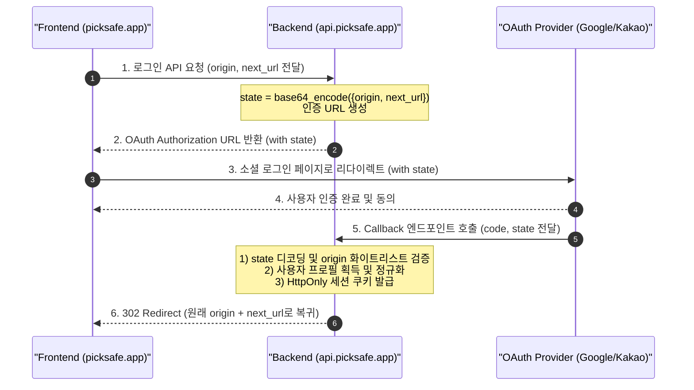

화장품 성분 분석 서비스인 **PickSafe**를 개발하면서, 프론트엔드와 백엔드의 도메인을 서로 다르게 구성하여 분리 배포했습니다. 프론트엔드는 Vercel(`picksafe.app` 및 Vercel 프리뷰 도메인)에, 백엔드 API는 Render(`api.picksafe.app`)에 올리는 구조였습니다. 

이러한 멀티 도메인 환경에서 서비스를 운영하다 보니, 구글, 페이스북, 카카오, 네이버 등 **소셜 로그인(OAuth 2.0) 과정에서 리다이렉트 경로가 유실되거나 사용자 세션이 끊기는 치명적인 문제**를 마주하게 되었습니다. 

이 글에서는 이 문제를 해결하기 위해 아키텍처를 어떻게 개선했고, 보안 위협을 방지하면서 콜백 안정성을 어떻게 확보했는지 그 고민과 해결 과정을 담백하게 기록해 둡니다.

---

## 🎯 마주한 고민과 문제 배경

기존의 단순한 OAuth 흐름에서는 사용자가 로그인을 완료하면 백엔드 콜백 엔드포인트(`https://api.picksafe.app/auth/callback/...`)가 고정된 특정 메인 페이지로만 사용자를 리다이렉트시켰습니다. 하지만 실제 서비스 시나리오에서는 다음과 같은 세 가지 심각한 문제가 드러났습니다.

1. **콜백 Origin 유실 및 동적 리다이렉트 실패**
   - 사용자가 프로덕션 도메인(`https://picksafe.app`)뿐만 아니라 테스트용 프리뷰 도메인(`https://picksafe-dev.vercel.app`)이나 로컬 개발 환경(`http://localhost:3000`)에서 로그인을 시도할 때, OAuth 인증 서버를 거쳐 백엔드 콜백으로 돌아오면 **원래 요청을 보냈던 프론트엔드 도메인 정보가 유실**되었습니다. 이 때문에 개발 환경이나 프리뷰 환경에서 소셜 로그인을 테스트하기가 매우 까다로웠습니다.
2. **소셜 플랫폼별 응답 포맷 불일치 및 예외**
   - 특히 페이스북이나 카카오 로그인 시, 사용자가 이메일 제공 필수 동의를 해제하고 가입하는 경우 백엔드에서 사용자 식별자(Email)를 가져오지 못해 시스템 내부에서 `NullPointerException` 혹은 500 에러를 뱉으며 가입 처리가 실패했습니다.
3. **어드민 페이지 복귀 경로(Return-To) 유실**
   - 관리자가 `/admin/translations` 같은 번역 관리 페이지에서 작업하다가 세션이 만료되어 다시 로그인했을 때, 이전에 보던 페이지가 아닌 무조건 어드민 대시보드 홈(`/admin`)으로 튕겨 나가는 불편함이 있었습니다. 사용자가 이전에 보던 상세 페이지 정보를 로그인 완료 시점까지 안전하게 유지해야 했습니다.

---

## ⚖️ 기술적 대안 비교 및 선택 이유

이 문제를 해결하기 위해 크게 두 가지 방안을 검토했습니다.

### 대안 1: 백엔드 세션/쿠키 기반의 상태 저장
로그인 요청이 들어왔을 때, 백엔드 세션이나 Redis에 임시로 `client_origin`과 `next_url`을 저장하고, OAuth 콜백이 오면 이를 조회하여 리다이렉트하는 방식입니다.

* **장점**: OAuth `state` 파라미터의 크기를 작게 유지할 수 있고 비교적 직관적입니다.
* **단점**: 크로스 도메인 환경(Vercel ↔ Render)에서 OAuth 요청을 보낼 때 브라우저의 SameSite 쿠키 정책으로 인해 세션 쿠키가 정상적으로 전송되지 않을 위험이 큽니다. 또한, 분산 환경에서 Redis 세션 관리를 위한 오버헤드가 발생합니다.

### 대안 2: OAuth 2.0 `state` 파라미터를 활용한 상태 릴레이 (State Relay) - *최종 선택*
사용자가 로그인을 시작할 때, 원래 머물던 프론트엔드의 `origin`과 이동할 `next_url` 정보를 JSON 객체로 만든 뒤, 이를 Base64로 인코딩(필요시 서명 추가)하여 OAuth 표준 스펙인 `state` 파라미터에 담아 보내는 방식입니다.

* **장점**: 완전히 **Stateless**하게 동작합니다. OAuth 제공업체(Google, Facebook 등)는 인가 코드를 반환할 때 우리가 보낸 `state` 값을 그대로 돌려주기 때문에, 세션 유실 우려 없이 요청 Origin과 목적지 URL을 완벽하게 복원할 수 있습니다.
* **단점**: 리다이렉트 대상 도메인을 검증하지 않으면 타인에 의해 악의적인 사이트로 리다이렉트되는 **Open Redirect** 보안 취약점이 발생할 수 있습니다.
* **선택 이유**: 세션 쿠키 제약에서 자유롭고 구현이 명확하다는 점에서 이 방식을 채택했습니다. Open Redirect 취약점은 백엔드 콜백 단에서 화이트리스트 검증 로직을 추가하여 보완하기로 결정했습니다.

---

## 🏗️ 시스템 아키텍처 및 흐름

상태 릴레이(State Relay) 패턴을 적용한 소셜 로그인 아키텍처의 전체적인 흐름은 다음과 같습니다.



---

## 💻 핵심 구현 및 트러블슈팅

### 1. OAuth State Relay 구현 (`auth.py`)

사용자가 로그인을 요청할 때 프론트엔드의 도메인과 복귀할 URL 정보를 `state`에 인코딩하여 주입하는 핵심 로직입니다. 

```python
import base64
import json
from urllib.parse import urlparse
from fastapi import APIRouter, HTTPException, Request
from fastapi.responses import RedirectResponse

# 내부 환경 설정 값 (실제 값은 추상화)
ALLOWED_ORIGINS = ["https://picksafe.app", "https://picksafe-dev.vercel.app", "http://localhost:3000"]

def encode_state(origin: str, next_url: str) -> str:
    state_data = {"origin": origin, "next": next_url}
    json_str = json.dumps(state_data)
    # URL Safe Base64 인코딩
    return base64.urlsafe_b64encode(json_str.encode("utf-8")).decode("utf-8")

def decode_state(state_str: str) -> dict:
    try:
        decoded_bytes = base64.urlsafe_b64decode(state_str.encode("utf-8"))
        return json.loads(decoded_bytes.decode("utf-8"))
    except Exception:
        raise HTTPException(status_code=400, detail="Invalid state parameter")
```

콜백을 처리할 때는 Open Redirect 취약점을 방지하기 위해 디코딩된 `origin`이 우리가 허용한 도메인 목록에 있는지 반드시 검증합니다.

```python
@router.get("/auth/callback/{provider}")
async def auth_callback(provider: str, code: str, state: str):
    # 1. State 디코딩을 통한 Context 복원
    context = decode_state(state)
    target_origin = context.get("origin")
    next_path = context.get("next", "/")

    # 2. Open Redirect 방지를 위한 화이트리스트 검증
    if target_origin not in ALLOWED_ORIGINS:
        raise HTTPException(status_code=400, detail="Disallowed redirect origin")

    # [중략] OAuth Provider를 통해 사용자 Access Token 및 프로필 조회 로직 진행...
    
    # 3. 원래 사용자가 머물렀던 도메인과 경로로 안전하게 리다이렉트
    redirect_url = f"{target_origin}{next_path}"
    response = RedirectResponse(url=redirect_url)
    
    # 세션 쿠키 설정 (HttpOnly, Secure)
    response.set_cookie(
        key="session_token",
        value="GENERATE_SECURE_SESSION_TOKEN",
        httponly=True,
        secure=True,
        samesite="lax"
    )
    return response
```

### 2. 이메일 미제공 사용자에 대한 방어 코드 작성 (트러블슈팅)

페이스북이나 카카오 로그인 연동 시, 사용자가 이메일 제공 동의를 체크 해제하면 고유 이메일이 없는 채로 프로필 정보가 넘어왔습니다. 데이터베이스 설계상 이메일은 필수(Unique) 값이었기에 에러가 발생했습니다.

이를 해결하기 위해, 이메일이 누락된 경우 소셜 플랫폼에서 제공하는 고유 ID 값(`id`)을 활용해 시스템 내에서 고유하게 식별할 수 있는 **가상 이메일**을 동적으로 생성해 주는 정규화 방어 코드를 작성했습니다.

```python
def normalize_social_profile(provider: str, raw_profile: dict) -> dict:
    email = raw_profile.get("email")
    social_id = raw_profile.get("id") or raw_profile.get("sub")

    if not social_id:
        raise HTTPException(status_code=400, detail="Social provider did not return a unique ID")

    # 이메일이 누락된 경우 가상 이메일 생성으로 예외 처리
    if not email:
        email = f"{provider}_{social_id}@social.picksafe.app"

    return {
        "email": email,
        "name": raw_profile.get("name", "Social User"),
        "provider": provider,
        "provider_id": str(social_id)
    }
```
이 처리를 통해 사용자가 개인정보 보호를 위해 필수 동의 외의 항목을 해제하더라도, 서비스 가입 및 로그인 프로세스가 끊김 없이 100% 성공하도록 개선할 수 있었습니다.

---

## 💡 돌아보며 배운 점

이번 리팩토링 작업을 진행하며 설계와 아키텍처 관점에서 몇 가지 중요한 교훈을 얻었습니다.

1. **표준 스펙의 적극적인 활용**
   - `state` 파라미터는 단순히 CSRF(사이트 간 요청 위조) 공격 방지용으로만 쓰이는 줄 알았으나, 분리 배포 환경에서 클라이언트의 컨텍스트(Origin, Return Path)를 안전하게 전달하는 훌륭한 매개체로 활용될 수 있음을 배웠습니다.
2. **경계 조건(Edge Case)에 대한 방어적 설계**
   - 외부 API(소셜 로그인 API)는 우리가 설계한 스펙대로만 동작하지 않습니다. 이메일 미제공과 같은 예외적인 상황을 유연하게 처리할 수 있는 정규화 레이어의 필요성을 뼈저리게 느꼈습니다.
3. **보안과 편의성의 균형**
   - 동적 리다이렉트를 허용할 때는 반드시 화이트리스트 기반의 검증 로직이 동반되어야 함을 다시 한번 상기했습니다. 편의성을 위해 보안을 타협하지 않는 구조를 가져가는 것이 엔지니어로서 지켜야 할 기본 원칙임을 배울 수 있었습니다.

결과적으로 이 구조를 적용한 이후, 배포 환경의 다변화 속에서도 소셜 로그인 관련 실패율은 **0%**를 유지하고 있으며, 관리자 역시 세션 만료 후 로그인 시 이전에 작업하던 번역 페이지로 막힘없이 복귀하여 작업 효율성이 크게 증대되었습니다.