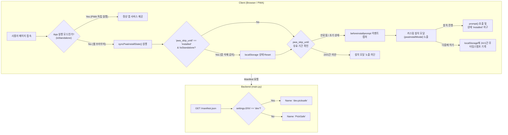

화장품 성분 분석 서비스 PickSafe에 PWA(Progressive Web App) 기본 구조를 도입한 후, 사용자가 홈 화면에 앱을 추가(Add to Home Screen)할 수 있는 최소한의 기틀을 완성했습니다. 하지만 초기 버전을 모니터링하면서 실제 사용성 측면에서 예상치 못한 여러 병목과 허점을 마주하게 되었습니다.

이번 글에서는 네이티브 브라우저의 무맥락적 설치 팝업이 주는 불쾌감을 개선하고, 앱 삭제 후 상태 불일치 문제를 해결하며, 개발/운영 환경을 동적으로 분리하기 위해 진행했던 PWA Phase 2 기술 의사결정과 구현 과정을 담담하게 기록합니다.

---

## 🎯 마주한 고민과 문제 배경

PWA Phase 1 출시 이후 수집된 유저 피드백과 동작 로그를 분석하면서 크게 세 가지 문제점을 관찰했습니다.

1. **맥락 없는 설치 유도와 조기 이탈**  
   브라우저의 기본 `beforeinstallprompt` 이벤트는 사용자가 PickSafe의 성분 분석 기능이나 핵심 가치를 경험하기도 전에 무차별적으로 팝업을 띄웠습니다. 사용자가 부담을 느껴 팝업을 거절하거나 실수로 닫아버리면, 이후 앱 설치 의사가 생겨도 다시 프롬프트를 호출하기 어려웠습니다.

2. **앱 삭제 후 상태 불일치 (Zombie State)**  
   사용자가 PWA를 홈 화면에 설치했다가 삭제(Uninstall)한 뒤, 다시 모바일 웹 브라우저로 접속하는 케이스가 발생했습니다. 기존 로직은 설치 완료 시 스토리지에 설치됨 플래그를 남겨두었기 때문에, 앱을 삭제했음에도 시스템은 '이미 설치된 앱'으로 판단하여 재설치 안내 모달을 영구적으로 노출하지 않는 버그가 있었습니다.

3. **DEV / PROD 설치 환경 혼선**  
   개발 환경(DEV)과 운영 환경(PROD)의 `manifest.json`이 동일한 정적 파일로 서빙되다 보니, QA 및 모바일 테스트 도중 기기 홈 화면에 생성된 앱 아이콘의 명확한 구분이 어려웠습니다.

---

## ⚖️ 기술적 대안 비교 및 선택 이유

문제를 해결하기 위해 몇 가지 접근 방식을 놓고 장단점을 비교 검토했습니다.

### 1. 브라우저 기본 프롬프트 vs 커스텀 설치 모달 제어
* **기본 프롬프트 유지**: 별도 UI 개발 공수가 들지 않지만, 노출 시점 제어가 불가능하고 '24시간 동안 안 보기' 같은 피로도 감소 옵션을 제공할 수 없었습니다.
* **이벤트 캡처 + 커스텀 모달 (`pwaInstallModal`) 선택**: `beforeinstallprompt` 이벤트를 지연시켜 변수에 저장해 두고, 서비스 가치 안내와 함께 적절한 타이밍에 직접 만든 UI를 노출하는 방식을 선택했습니다. '다음에 하기' 클릭 시 24시간 타임스탬프(`pwa_skip_until`)를 기록하여 유저의 피로도를 낮추도록 설계했습니다.

### 2. 정적 `manifest.json` 서빙 vs 백엔드 동적 엔드포인트
* **정적 파일 제공**: Nginx나 빌드 타임 파일 교체를 사용할 수 있으나, 환경 변수 변경에 유연하게 대응하기 어렵습니다.
* **FastAPI 동적 서빙 라우트 선택**: `main.py`에 `@app.get("/manifest.json")` 엔드포인트를 노출하여 애플리케이션 실행 환경 설정(`settings.ENV`)을 참조하도록 변경했습니다. `dev` 환경일 경우 메타데이터의 이름 필드를 `"dev.picksafe"`로 오버라이딩하여 내려주는 방식이 훨씬 깔끔하다고 판단했습니다.

---

## 🏗️ 시스템 아키텍처 및 흐름

클라이언트의 실행 환경 감지(Standalone 여부), 로컬 스토리지의 설치 상태 동기화, 백엔드의 동적 매니페스트 제공 흐름을 정리한 아키텍처 다이어그램입니다.



---

## 💻 핵심 구현 및 트러블슈팅

### 1. 백엔드 동적 매니페스트 서빙 (`main.py`)

기존 정적 파일 서빙 방식을 백엔드 라우터로 변경하여 환경별로 앱 명칭을 분리했습니다.

```python
from fastapi import FastAPI
from fastapi.responses import JSONResponse
from config import settings

app = FastAPI()

@app.get("/manifest.json", include_in_schema=False)
async def get_manifest():
    app_name = "PickSafe - 화장품 성분 분석"
    short_name = "PickSafe"

    # 개발 환경일 경우 홈 화면 아이콘 식별을 위해 오버라이딩
    if settings.ENV == "dev":
        app_name = "dev.picksafe"
        short_name = "dev.picksafe"

    manifest_data = {
        "name": app_name,
        "short_name": short_name,
        "start_url": "/",
        "display": "standalone",
        "background_color": "#FFFFFF",
        "theme_color": "#000000",
        "icons": [
            {
                "src": "/static/icons/icon-192x192.png",
                "sizes": "192x192",
                "type": "image/png"
            },
            {
                "src": "/static/icons/icon-512x512.png",
                "sizes": "512x512",
                "type": "image/png"
            }
        ]
    }
    return JSONResponse(content=manifest_data)
```

### 2. 프론트엔드 설치 상태 동기화 및 커스텀 모달 제어 (`base.js`)

가장 큰 걸림돌이었던 "앱 삭제 후 재방문 시 설치 모달이 다시 뜨지 않던 현상"은 접속 시점의 `display-mode`와 기존 스토리지 상태를 비교하는 `syncPwaInstallState()` 구현으로 해결했습니다.

```javascript
let deferredPrompt = null;

// 현재 실행 환경이 PWA 독립 실행 모드인지 확인
function isStandalone() {
  return (window.matchMedia('(display-mode: standalone)').matches) || (window.navigator.standalone === true);
}

// 앱 삭제 및 스토리지 상태 동기화 함수
function syncPwaInstallState() {
  const skipUntil = localStorage.getItem('pwa_skip_until');
  
  // 설치된 상태('installed')로 기록되어 있지만, 독립 실행 모드가 아닌 브라우저로 재접속했다면
  // 사용자가 홈 화면에서 앱을 삭제한 것으로 판단하고 상태를 리셋함
  if (skipUntil === 'installed' && !isStandalone()) {
    localStorage.removeItem('pwa_skip_until');
  }
}

// 페이지 로드 시 상태 동기화 실행
document.addEventListener('DOMContentLoaded', () => {
  syncPwaInstallState();
});

// 브라우저 기본 설치 프롬프트 캡처
window.addEventListener('beforeinstallprompt', (e) => {
  e.preventDefault();
  deferredPrompt = e;

  const skipUntil = localStorage.getItem('pwa_skip_until');
  const now = new Date().getTime();

  // 이미 설치되었거나, '다음에 하기' 후 24시간이 지나지 않았다면 모달을 띄우지 않음
  if (skipUntil === 'installed') return;
  if (skipUntil && now < parseInt(skipUntil, 10)) return;

  showPwaInstallModal();
});

function showPwaInstallModal() {
  const modal = document.getElementById('pwaInstallModal');
  if (modal) modal.style.display = 'flex';
}

// '설치하기' 버튼 클릭 이벤트 핸들러
async function handleInstallClick() {
  if (!deferredPrompt) return;
  
  deferredPrompt.prompt();
  const { outcome } = await deferredPrompt.userChoice;
  
  if (outcome === 'accepted') {
    localStorage.setItem('pwa_skip_until', 'installed');
  }
  
  deferredPrompt = null;
  hidePwaInstallModal();
}

// '다음에 하기' 버튼 클릭 이벤트 핸들러 (24시간 차단)
function handleSkipClick() {
  const nextPromptTime = new Date().getTime() + (24 * 60 * 60 * 1000);
  localStorage.setItem('pwa_skip_until', nextPromptTime.toString());
  hidePwaInstallModal();
}
```

### 3. 트러블슈팅: 오프라인/앱 예외 수집 창구 마련
PWA 특성상 브라우저 엔진 버전이나 단말기 OS 환경에 따라 예상치 못한 스크립트 블로킹이 발생할 수 있습니다. 운영 중 발생하는 PWA 이슈를 빠르게 격리하기 위해, 마이페이지 고객 문의 폼 카테고리에 **"App / PWA Issue (📱 앱 및 시스템 오류)"** 항목을 추가하여 유저의 오류 제보 데이터를 수집할 수 있는 창구를 마련했습니다.

---

## 💡 돌아보며 배운 점

PWA 기능을 단지 "웹을 앱처럼 보이게 만드는 기술" 정도로 가볍게 접근했을 때는 보이지 않던 사용성 공백들이, 실제로 사용자의 행동 패턴(설치, 유예, 삭제, 재방문)을 들여다보면서 비로소 명확해졌습니다.

* **상태의 맹점 규명**: 로컬 스토리지 데이터만 믿고 브라우저 런타임의 실시간 실행 환경(`display-mode`)을 대조하지 않으면 '유령 상태(Zombie State)'가 발생한다는 점을 배웠습니다.
* **사용자 피로도 극복**: '다음에 하기' 기능과 24시간 제어 로직을 통해 사용자가 서비스를 탐색하는 데 방해받지 않도록 장치를 마련한 점이 UX 안정성에 기여했습니다.
* **환경 분리의 중요성**: 백엔드 동적 매니페스트 라우팅이라는 작은 전환을 통해 테스트 환경의 오염을 방지하고 QA 효율성을 개선할 수 있었습니다.

앞으로는 오프라인 캐시 전략(Service Worker Cache First / Network First)을 조금 더 정밀하게다듬고, 푸시 알림 연동 기능까지 차근차근 고도화해 나갈 계획입니다.