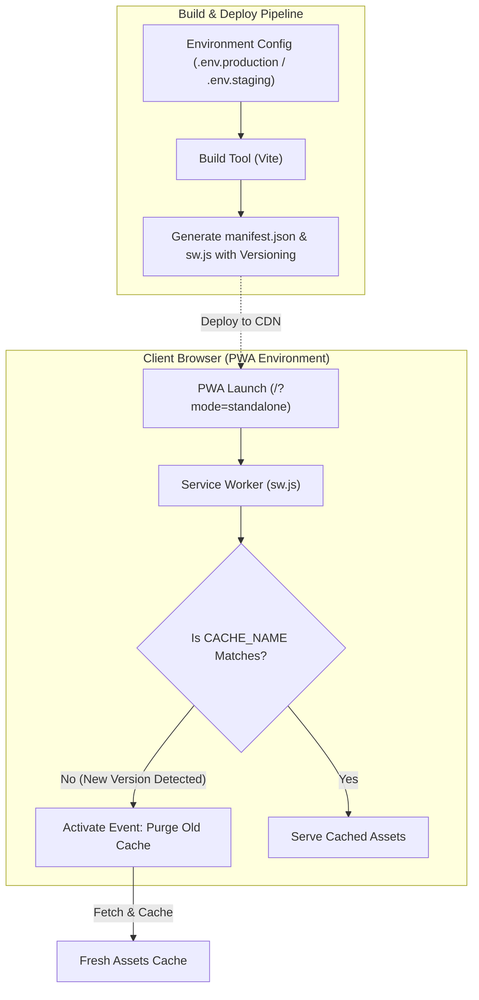

화장품 성분 분석 서비스인 **PickSafe**를 개발하고 운영하면서, 최근 모바일 사용자 경험과 운영 효율성을 동시에 개선해야 하는 두 가지 큰 기술적 부딪힘이 있었습니다. 

하나는 로컬, 스테이징, 운영 환경이 뒤섞여 발생하는 **PWA(Progressive Web App)의 식별 및 캐시 오염 문제**였고, 다른 하나는 외부에서 급한 장애나 문의가 발생했을 때 스마트폰으로 대응하기 불가능에 가까웠던 **모바일 어드민의 사용성 문제**였습니다.

이 두 가지 문제를 해결하기 위해 시스템 아키텍처 관점에서 접근한 과정과 구체적인 해결책, 그리고 그 과정에서 얻은 엔지니어링적 교훈을 담백하게 기록합니다.

---

## 🎯 마주한 고민과 문제 배경

### 1. PWA 환경 식별자 혼선 및 캐시 갱신 지연
PickSafe는 모바일 앱과 유사한 사용자 경험을 제공하기 위해 PWA 기술을 적극 활용하고 있습니다. 하지만 개발(Dev), 스테이징(Staging), 운영(Prod) 환경 전체가 동일한 `manifest.json`과 서비스 워커 파일명을 공유하다 보니 다음과 같은 문제가 발생했습니다.

* **기기 내 환경 혼선**: 모바일 기기의 홈 화면에 앱을 추가할 때, 어떤 아이콘이 개발 서버용이고 어떤 아이콘이 실제 운영 서버용인지 구분하기 어려웠습니다. 앱 이름(`name`, `short_name`)이 모두 동일했기 때문입니다.
* **지독한 캐시 오염**: 서비스 워커의 캐시 갱신 주기가 명확하지 않아, 새로운 버전의 자산(Assets)이 배포되어도 모바일 브라우저가 구버전 아이콘과 스크립트를 계속 캐싱하고 있어 화면이 깨지거나 최신 기능이 반영되지 않는 현상이 잦았습니다.

### 2. 모바일 어드민 조작성 한계
식약처의 성분 수집 현황을 모니터링하고, 서버 상태를 점검하며, 사용자의 1:1 문의에 즉각 대응해야 하는 어드민 페이지는 주로 데스크톱 환경 기준으로 설계되어 있었습니다. 

* **터치 타깃 미달**: 스마트폰으로 어드민에 접속하면 버튼 크기가 너무 작아(대부분 32px 이하) 오클릭이 빈번했습니다.
* **레이아웃 붕괴**: 데스크톱용 2열/3열 카드가 모바일 화면에서 무리하게 찌그러져 텍스트가 겹치거나 가로 스크롤이 길게 발생하는 등 조작성이 극도로 떨어졌습니다. 외부 활동 중에 긴급한 고객 문의가 들어와도 즉각적인 조치가 불가능했습니다.

---

## ⚖️ 기술적 대안 비교 및 선택 이유

문제를 해결하기 위해 몇 가지 아키텍처적 대안을 두고 현실적인 Trade-off를 고민했습니다.

### 고민 1: PWA 매니페스트 환경 격리 방식

| 대안 | 장점 | 단점 | 선택 여부 |
| :--- | :--- | :--- | :--- |
| **A. API를 통한 동적 매니페스트 제공** | 환경별 분기를 백엔드 코드 한 곳에서 유연하게 처리 가능 | 매니페스트 요청 시마다 서버 부하 발생, 캐싱 설정이 복잡해짐 | 미선택 |
| **B. 빌드 타임 환경 변수 주입 (Vite/Webpack)** | 런타임 오버헤드가 전혀 없으며, 빌드 결과물이 정적 파일로 생성되어 CDN 캐싱에 유리 | 환경별 빌드 파이프라인을 정밀하게 구성해야 함 | **선택 (Alternative B)** |

**선택 이유:** PickSafe는 정적 자산의 빠른 서빙을 위해 Cloudflare CDN을 사용하고 있습니다. 런타임에 불필요한 백엔드 연산을 추가하기보다, 빌드 타임에 환경 변수(`import.meta.env`)를 활용하여 각 환경에 맞는 `manifest.json`을 정적 파일로 생성해 배포하는 것이 아키텍처적으로 훨씬 간결하고 성능상 이점이 크다고 판단했습니다.

### 고민 2: 서비스 워커 캐시 갱신 전략

| 대안 | 장점 | 단점 | 선택 여부 |
| :--- | :--- | :--- | :--- |
| **A. Stale-While-Revalidate 기본 적용** | 네트워크 상태가 나빠도 즉각적인 화면 로딩 가능 | 백그라운드에서만 업데이트가 일어나 사용자가 완전히 앱을 껐다 켜기 전까지는 구버전 노출 | 미선택 |
| **B. 명시적 캐시 버저닝 및 즉각적인 Purge** | 배포 즉시 활성화(Activate) 단계에서 구버전 캐시를 완전히 삭제하여 일관된 상태 보장 | 캐시 버전(`CACHE_NAME`)을 배포 시마다 동적으로 관리해야 함 | **선택 (Alternative B)** |

**선택 이유:** 화장품 성분 데이터의 정합성과 UI 일관성이 깨지는 것보다, 배포 시점에 명확하게 구버전 캐시를 지워주는 것이 운영 안정성 측면에서 훨씬 안전하다고 판단했습니다.

---

## 🏗️ 시스템 아키텍처 및 흐름

PWA 환경 격리 및 서비스 워커의 캐시 생명주기, 그리고 사용자의 진입 흐름을 도식화하면 다음과 같습니다.



---

## 💻 핵심 구현 및 트러블슈팅

### 1. PWA 매니페스트 환경별 분기 및 서비스 워커 버저닝

환경별로 고유한 앱 식별자를 부여하기 위해 빌드 타임에 매니페스트를 동적으로 구성하고, 서비스 워커의 활성화(Activate) 시점에 구버전 캐시를 즉시 제거하는 코드를 구현했습니다.

#### `sw.js` (서비스 워커 캐시 관리)
```javascript
// 배포 시점에 고유한 타임스탬프 기반 버전이 주입됩니다.
const CACHE_NAME = 'picksafe-cache-v20260814';
const ASSETS_TO_CACHE = [
  '/',
  '/index.html',
  '/css/app.css',
  '/js/app.js',
  '/assets/icon-192.png',
  '/assets/icon-512.png'
];

// Install Event: 자산 캐싱
self.addEventListener('install', (event) => {
  event.waitUntil(
    caches.open(CACHE_NAME).then((cache) => {
      return cache.addAll(ASSETS_TO_CACHE);
    }).then(() => {
      // 대기 상태를 건너뛰고 즉시 활성화
      return self.skipWaiting();
    })
  );
});

// Activate Event: 구버전 캐시 즉시 정리 (Purge)
self.addEventListener('activate', (event) => {
  event.waitUntil(
    caches.keys().then((cacheNames) => {
      return Promise.all(
        cacheNames.map((cache) => {
          if (cache !== CACHE_NAME) {
            console.log(`[Service Worker] Deleting obsolete cache: ${cache}`);
            return caches.delete(cache);
          }
        })
      );
    }).then(() => {
      // 제어 중인 모든 클라이언트를 즉시 클레임
      return self.clients.claim();
    })
  );
});
```

### 2. 모바일 어드민 반응형 대시보드 리팩토링 (CSS)

손가락 터치 실수를 줄이기 위해 최소 터치 영역을 `48px`로 확보하고, 2열 구조의 레이아웃을 모바일 디바이스에서 1열 스택 구조로 유연하게 전환되도록 개선했습니다.

#### `admin-dashboard.css` (Tailwind CSS 기반 설계 구조)
```html
<!-- 개선된 어드민 카드 레이아웃 스니펫 -->
<div class="grid grid-cols-1 md:grid-cols-2 lg:grid-cols-3 gap-6 p-4">
  <!-- 수집 현황 카드 -->
  <div class="bg-white rounded-xl shadow-sm border border-slate-100 p-5 flex flex-col justify-between min-h-[160px]">
    <div>
      <h3 class="text-sm font-semibold text-slate-500">식약처 성분 수집 현황</h3>
      <p class="text-2xl font-bold text-slate-800 mt-2">142,904 건</p>
    </div>
    <!-- 모바일 터치 영역 48px 확보 및 하단 배치 -->
    <button class="w-full mt-4 h-12 md:h-10 bg-indigo-600 hover:bg-indigo-700 text-white rounded-lg font-medium transition-colors focus:ring-2 focus:ring-offset-2 focus:ring-indigo-500">
      수집 로그 확인
    </button>
  </div>

  <!-- 1:1 고객 문의 카드 -->
  <div class="bg-white rounded-xl shadow-sm border border-slate-100 p-5 flex flex-col justify-between min-h-[160px]">
    <div>
      <h3 class="text-sm font-semibold text-slate-500">미답변 문의</h3>
      <p class="text-2xl font-bold text-rose-500 mt-2">3 건</p>
    </div>
    <button class="w-full mt-4 h-12 md:h-10 bg-slate-800 hover:bg-slate-900 text-white rounded-lg font-medium transition-colors focus:ring-2 focus:ring-offset-2 focus:ring-slate-500">
      답변하러 가기
    </button>
  </div>
</div>
```

---

### 🛠️ 트러블슈팅: iOS Safari의 가혹한 매니페스트 캐싱 해결

개발 과정에서 Android Chrome은 정상적으로 매니페스트 변경 사항을 반영했으나, **iOS Safari** 환경에서는 홈 화면에 추가할 때 구버전 이름과 아이콘이 계속 유지되는 현상이 발생했습니다. iOS가 `manifest.json` 파일을 매우 공격적으로 내부 캐싱하기 때문이었습니다.

이를 해결하기 위해 `index.html`에서 매니페스트를 불러오는 경로 뒤에 **빌드 타임 스탬프 쿼리 스트링**을 강제로 추가하도록 설정했습니다.

```html
<!-- index.html -->
<link rel="manifest" href="/manifest.json?v=2026081409" />
```

또한, Nginx 서버 설정(`nginx.conf`)에서 매니페스트 파일과 서비스 워커 파일의 캐시 제어 헤더를 명시적으로 비활성화하여 브라우저가 항상 최신 메타데이터를 조회하도록 강제했습니다.

```nginx
# Nginx 캐시 제어 설정
location /manifest.json {
    add_header Cache-Control "no-store, no-cache, must-revalidate, proxy-revalidate, max-age=0";
}

location /sw.js {
    add_header Cache-Control "no-store, no-cache, must-revalidate, proxy-revalidate, max-age=0";
}
```
이 조치 이후 iOS와 Android 모두 배포 즉시 새로운 PWA 이름(예: 개발 환경에서는 `PickSafe (Dev)`, 운영 환경에서는 `PickSafe`)과 변경된 아이콘이 정상적으로 갱신되는 것을 확인했습니다.

---

## 💡 돌아보며 배운 점 (회고)

이번 작업을 진행하며 기술적으로, 그리고 서비스 운영 관점에서 값진 경험을 얻었습니다.

1. **PWA 생명주기 관리의 중요성**: PWA는 단순히 웹 앱을 앱처럼 보여주는 껍데기가 아닙니다. 서비스 워커의 `install`과 `activate` 생명주기를 정밀하게 다루지 않으면, 사용자 기기에 '깨진 상태의 구버전 앱'이 영원히 갇혀버릴 수 있다는 사실을 깨달았습니다. 명확한 버저닝과 즉각적인 캐시 삭제 정책은 필수적입니다.
2. **모바일 우선(Mobile-First)은 어드민에도 필요하다**: 흔히 어드민 서비스는 PC로만 본다고 가정하기 쉽습니다. 그러나 실제 운영 환경에서 긴급한 이슈는 언제나 퇴근 길이나 외부 활동 중에 발생합니다. 어드민 페이지의 터치 타깃을 `48px` 이상으로 확보하고 반응형 레이아웃을 꼼꼼히 챙기는 것만으로도, 장애 대응 속도와 운영 편의성이 비약적으로 향상된다는 점을 깊이 체득했습니다.

시스템을 설계할 때 '개발하기 편한 구조'보다 '운영 및 유지보수하기 안전한 구조'를 먼저 고민하는 것이 장기적으로 훨씬 더 비용이 적게 든다는 본질을 다시 한번 되새기게 되었습니다. 앞으로도 PickSafe의 안정적인 서비스를 위해 지속적으로 아키텍처를 다듬어 나가겠습니다.