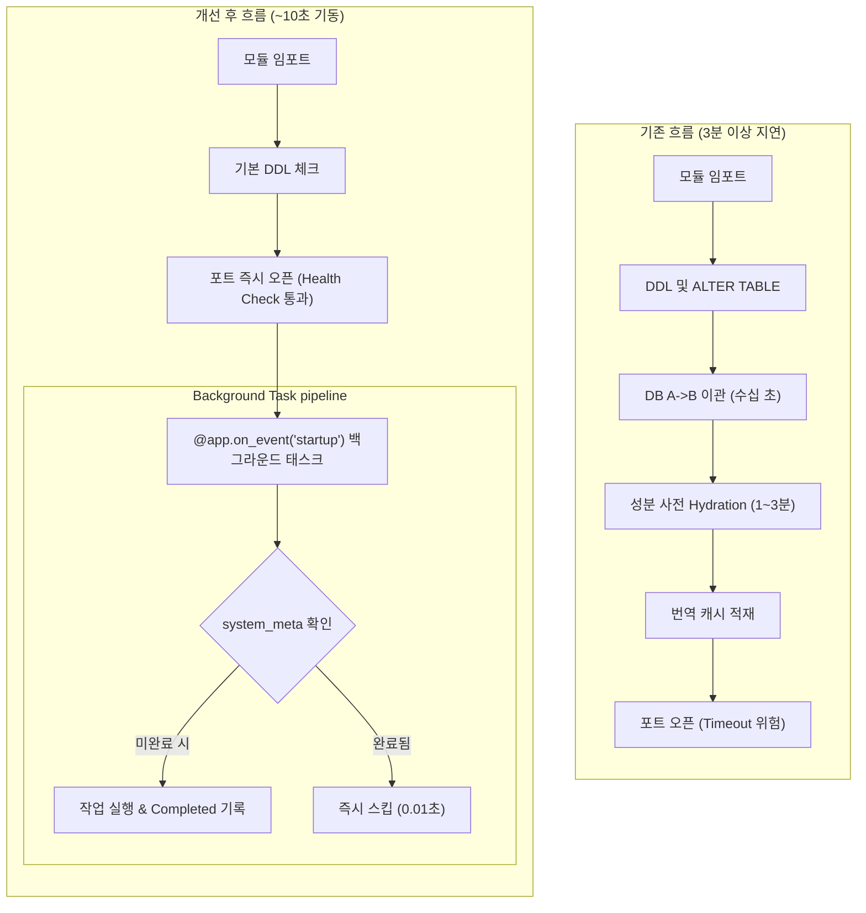

화장품 성분 분석 서비스 **PickSafe**를 개발하고 운영하는 과정에서 배포 시마다 심각한 서비스 기동 지연을 마주했습니다. Render 클라우드 환경에서 새로 빌드된 컨테이너가 뜰 때마다 `No open ports detected` 메시지가 2~3분 넘게 반복되었고, 핫픽스 배포나 기능 업데이트 때마다 불필요한 다운타임 리스크를 감수해야 했습니다. 

이 글에서는 서비스 기동 블로킹 원인을 분석하고, 비동기 백그라운드 태스크 및 완료 플래그 기반의 제어 아키텍처를 도입하여 스타트업 시간을 **3분 이상에서 10초 이내로 단축**시킨 과정과 회고를 담담하게 기록합니다.

---

## 🎯 마주한 고민과 문제 배경

기존 시스템의 `main.py`는 FastAPI 애플리케이션 포트를 열기 전, 모듈 로딩 시점 및 동기화 블록에서 데이터베이스 관련 중작업을 일괄 실행하고 있었습니다. 

클라우드 호스팅 플랫폼은 컨테이너가 시작되면 지정된 포트(Port)로 헬스체크 신호가 오길 기다립니다. 하지만 기존 구조에서는 포트 바인딩이 이루어지기 전에 무거운 작업들이 순차적으로 실행되며 메인 쓰레드를 잡아두고 있었습니다.

### 주요 기동 병목 작업 분석

| 작업 항목 | 수행 위치 | 추정 소요 시간 | 구조적 문제점 |
|---|---|---|---|
| `ingredients_master` Hydration | `main.py` | 1~3분 | 배포 시마다 전체 성분 사전을 재복제/동기화 |
| DB A→B 데이터 이관 | `main.py` | 수십 초 | 이미 이관되었는지 여부와 상관없이 매번 실행 |
| `ALTER TABLE` 컬럼 체크 | `main.py` | 수 초 × 10회 | 존재 여부를 매 기동마다 DB에 DDL 조회 |
| 번역 캐시 적재 | `main.py` | 수 초 | 인메모리 적재 작업을 동기 블로킹으로 처리 |
| 타임존 설정 | `main.py` | 수 초 | 중복 실행되는 초기화 코드 |

가장 큰 문제는 **"이미 완료된 작업임에도 배포 때마다 매번 똑같이 재실행된다"**는 점과 **"웹 서버가 포트를 열기도 전에 이 작업들이 블로킹 방식으로 동작한다"**는 점이었습니다.

---

## ⚖️ 기술적 대안 비교 및 선택 이유

이 문제를 해결하기 위해 크게 세 가지 방향을 검토했습니다.

### 1. 빌드 타임 스크립트 분리 (`build.sh`에서 실행)
* **장점:** 웹 서버 실행 전 미리 DB 상태를 맞춰둘 수 있음.
* **단점:** 빌드 환경에서 실운영 DB 접근권한을 관리해야 하며, DW Failover나 서버 인스턴스 재시작 시 런타임 동기화 유연성이 떨어짐.

### 2. 별도 백그라운드 워커 노드(Celery/Redis) 도입
* **장점:** 메인 웹 프로세스와 작업 프로세스의 완벽한 격리.
* **단점:** 당장 도입하기엔 인프라 복잡도와 추가 서버 비용이 발생함. 현 시점의 서비스 규모 대비 과도한 오버엔지니어링으로 판단.

### 3. 완료 플래그(`system_meta`) + 비동기 스타트업 태스크 구조 (최종 선택)
* **장점:** 
  1. 외부 인프라 추가 없이 애플리케이션 내부에서 처리 가능.
  2. `system_meta` 테이블을 통해 이미 수행된 작업은 즉시 스킵(Skip) 처리.
  3. 포트를 수 초 내에 즉시 개방한 뒤, 필요한 후속 작업만 비동기 백그라운드로 안전하게 이관.
* **트레이드오프:** 서버가 뜬 직후 몇 초간 백그라운드 태스크가 돌아가는 동안 일부 데이터가 최신화되는 과정에 있을 수 있음. 그러나 이관 및 성분 사전은 서비스 기동 직후 즉시 변하는 데이터가 아니므로 실효적인 영향은 없다고 판단함.

---

## 🏗️ 시스템 아키텍처 및 흐름

기존의 선형적 블로킹 구조를 **포트 즉시 오픈 및 비동기 파이프라인** 구조로 개편했습니다.



---

## 💻 핵심 구현 및 트러블슈팅

### 1. `system_meta` 메타데이터 플래그 기반 동기화 제어

Main DB와 DW DB 양쪽에 `system_meta` Key-Value 테이블을 정의하고, 한 번 완료된 작업은 DB 차원에서 다시 실행되지 않도록 가드를 세웠습니다.

```python
# infrastructure/meta.py (일부)
from sqlalchemy import select
from core.database import SessionLocal
from models.system import SystemMeta

def is_task_completed(key: str) -> bool:
    with SessionLocal() as db:
        meta = db.scalars(
            select(SystemMeta).where(SystemMeta.key == key)
        ).first()
        return meta is not None and meta.value == "completed"

def mark_task_completed(key: str):
    with SessionLocal() as db:
        meta = db.scalars(
            select(SystemMeta).where(SystemMeta.key == key)
        ).first()
        if not meta:
            meta = SystemMeta(key=key, value="completed")
            db.add(meta)
        else:
            meta.value = "completed"
        db.commit()
    
# 백그라운드 백업 실행부
def run_dw_migration_if_needed():
    if is_task_completed("dw_migration_v1"):
        logger.info("[Startup] DB A->B Migration already completed. Skipping.")
        return

    logger.info("[Startup] Executing DB Migration...")
    # 이관 로직 수행
    # ...
    mark_task_completed("dw_migration_v1")
```

### 2. FastAPI 스타트업 이벤트 비동기 분리

서버 포트가 바인딩된 직후 백그라운드에서 동작하도록 이벤트 핸들러를 구성했습니다.

```python
# main.py
import asyncio
from fastapi import FastAPI
from core.config import SETTINGS

app = FastAPI()

async def _background_init():
    """서버 포트가 열린 후 백그라운드에서 순차 실행되는 초기화 태스크"""
    loop = asyncio.get_event_loop()
    
    # 1. 번역 캐시 적재 (비동기 처리)
    await loop.run_in_executor(None, load_translation_cache)
    
    # 2. 메타데이터 체크 후 필요 시에만 수행
    await loop.run_in_executor(None, run_dw_migration_if_needed)
    await loop.run_in_executor(None, hydrate_ingredients_master_if_needed)

@app.on_event("startup")
async def startup_event():
    # 서버 기동을 방해하지 않도록 백그라운드 태스크로 연동
    asyncio.create_task(_background_init())
```

### 3. 트러블슈팅: 백그라운드 세션 라이프사이클 이슈

초기 전환 시 백그라운드 태스크 내부에서 메인 쓰레드의 DB 세션을 공유하다가 `PendingRollbackError` 또는 DB 커넥션 풀 고갈 현상이 관찰되었습니다. 

 이를 해결하기 위해 백그라운드 실행 함수 내에서는 **반드시 스코프가 완전히 격리된 독립 세션(`with SessionLocal() as db:`)**을 생성하도록 수정하여 비동기 실행 간의 세션 충돌을 방지했습니다.

### 4. 어드민 인프라 수동 제어 UI 및 매칭

자동화 스킵 로직을 도입하면서, 필요한 경우 운영자가 수동으로 동기화를 강제 실행할 수 있는 백오피스 관리 기능(`/admin/infra`)도 신설했습니다.

* **Smart Polling**: 성분 사전 재동기화 실행 시 `in_progress` 상태를 백엔드에서 감지하여 프론트엔드 버튼 및 프로그레스 상태 표시.
* **캐시 리로드**: 서버 재시작 없이 약 2,400여 개의 번역 캐시 항목을 메모리에 즉시 다시 적재하는 API 연동.
* **스마트 메모리 모니터링**: 로컬 환경(전체 PC RAM)과 클라우드 환경(Render 컨테이너 512MB 제한)을 구별하여 컨테이너 내 실사용 프로세스 메모리 점유량(RSS)을 정확히 추적할 수 있도록 분기 처리했습니다.

```python
# infrastructure/monitoring.py (일부)
import psutil
import os

def get_memory_usage():
    process = psutil.Process(os.getpid())
    rss_mb = process.memory_info().rss / (1024 * 1024)
    
    is_render = os.getenv("RENDER", "false").lower() == "true"
    if is_render:
        # Render 512MB 컨테이너 기준 측정
        limit_mb = 512.0
        percent = (rss_mb / limit_mb) * 100
        return {
            "main_text": f"{percent:.1f}% ({rss_mb:.1f} MB / {int(limit_mb)} MB)",
            "sub_text": f"FastAPI Process: {rss_mb:.1f} MB (Container Limit: 512MB)"
        }
    else:
        # 로컬 환경
        sys_mem = psutil.virtual_memory()
        return {
            "main_text": f"{sys_mem.percent}% ({sys_mem.used / (1024**3):.2f} GB / {sys_mem.total / (1024**3):.2f} GB)",
            "sub_text": f"FastAPI Process: {rss_mb:.1f} MB"
        }
```

---

## 💡 돌아보며 배운 점 (회고)

이번 최적화 작업의 각 페이즈별 구현 현황과 결과는 다음과 같습니다.

| 페이즈 | 작업 내역 | 상태 | 비고 |
|---|---|:---:|---|
| **Phase 1** | `system_meta` 생성, 이관/동기화 플래그 체킹, 백그라운드 태스크 이관 | 완료 | 스타트업 **3분+ → 10초** 단축 |
| **Phase 2** | 번역 캐시 비동기 적재 및 타임존 설정 최적화 | 완료 | 포트 바인딩 타임아웃 완전 해결 |
| **Phase 3** | 어드민 인프라 DB 유지보수 UI 및 스마트 메모리 모니터링 구축 | 완료 | 수동 복구 파이프라인 확보 |
| **Phase 4** | Alembic 도입 및 main.py 내 잔재 DDL/`ALTER TABLE` 완전히 제거 | 예정 | 스키마 버전 관리 표준화 작업 |

### 엔지니어링 레슨

1. **"배포 타임아웃"의 원인은 코드 효율성보다 구조에 있다.**
   단순히 성분 사전 동기화 SQL 쿼리를 최적화하려고 시도했을 때는 몇 초 줄이는 데 그쳤습니다. 그러나 "이 작업이 과연 웹 포트가 열리기 전에 이루어져야 하는가?"라는 질문을 던지고 백그라운드 구조로 전환하자 수십 배의 성능 개선을 얻을 수 있었습니다.

2. **상태 관리 테이블(`system_meta`)의 유용성**
   스태틱한 데이터베이스 동기화 작업이나 1회성 마이그레이션 작업을 런타임 코드에 안전하게 녹여내기 위해서는 레코드 형태의 상태 기록 장치가 필수적이라는 점을 재확인했습니다.

3. **관찰 가능성(Observability)의 중요성**
   백그라운드로 작업을 넘긴 이후에는 어드민 UI에서 동기화 상태와 메모리 사용량을 눈으로 확인할 수 있게 구성해 두었기 때문에, 백그라운드 태스크 동작에 대한 불확실성을 해소할 수 있었습니다.

다음 단계로는 레거시 DDL 구문들을 Alembic 마이그레이션 체계로 완전히 통합하여 기동 시점의 DB 스키마 검증 부담까지 완벽히 덜어낼 계획입니다. 비록 작은 서비스 아키텍처 개선이었지만, 클라우드 배포 환경의 특성과 비동기 라이프사이클의 본질을 다시금 정리할 수 있었던 의미 있는 트러블슈팅 경험이었습니다.