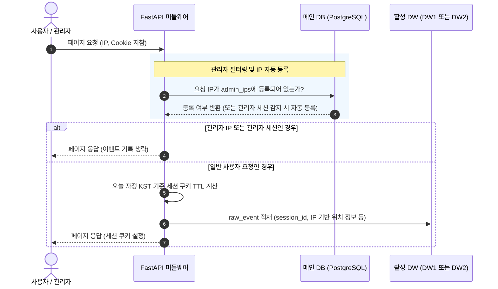

화장품 성분 분석 서비스 **PickSafe**를 개발하고 실제 운영 환경에 배포하면서, 사용자들의 행동 패턴을 파악하기 위한 자체 방문자 분석 시스템을 구축했습니다. 거창한 외부 분석 도구 대신 가볍고 독립적인 내부 로그 수집기를 지향하며 출발했으나, 실제 운영 데이터를 마주하자 예상치 못한 엣지 케이스들과 아키텍처상의 한계들이 드러나기 시작했습니다.

이번 글에서는 운영 중 발견된 치명적인 병목과 버그들을 해결하는 과정, 그리고 제한된 인프라 리소스 환경에서 데이터 연속성을 100% 보장하기 위해 설계한 하이브리드 집계 및 이중 데이터웨어하우스(DW) 동기화 아키텍처에 대해 담담히 기록해 보고자 합니다.

---

## 🎯 마주한 고민과 문제 배경

기존에 구현했던 분석 시스템은 매일 자정에 전날의 데이터를 요약 테이블(`daily_analytics_summary`)로 마감하는 배치 처리 방식이었습니다. 하지만 실제 지표를 모니터링하면서 다음과 같은 네 가지 핵심적인 문제들을 발견했습니다.

### 발견된 주요 문제점

| 번호 | 심각도 | 현상 | 원인 분석 |
| :--- | :--- | :--- | :--- |
| **1** | 🔴 치명 | 오늘 방문 데이터가 차트에 전혀 보이지 않음 | 어드민 페이지가 마감된 요약 테이블만 조회하여, 오늘 발생한 실시간 이벤트는 자정 배치 전까지 화면에 반영되지 않음 |
| **2** | 🔴 치명 | 네트워크 환경(Wi-Fi ↔ LTE)을 변경해도 새로운 방문으로 집계되지 않음 | 세션 쿠키의 `max_age`가 1년으로 설정되어 있어, 기기당 최초 1회 발급 이후에는 항상 기존 세션(`is_new_session = False`)으로 분류됨 |
| **3** | 🟡 중요 | 접속 국가 및 도시 정보에 `null`이 빈번하게 기록됨 | 프록시(Proxy) 및 CDN 환경에서 원본 클라이언트 IP를 추출하는 우선순위 처리가 누락됨 |
| **4** | 🟡 중요 | 관리자 자신의 테스트 방문이 실서비스 통계에 포함되어 지표가 왜곡됨 | `/admin/*` 경로 진입만 제외했을 뿐, 관리자가 일반 사용자 화면(`/`, `/scan` 등)을 모니터링하거나 테스트할 때의 이벤트가 필터링 없이 수집됨 |

이 문제들은 단순한 버그 수정을 넘어, **데이터 수집 파이프라인의 수명 주기(TTL)**와 **어드민 예외 처리 정책**, 그리고 **실시간성과 쿼리 성능 간의 트레이드오프**를 전면 재검토해야 함을 의미했습니다.

---

## ⚖️ 기술적 대안 비교 및 선택 이유

문제를 해결하기 위해 몇 가지 핵심 아키텍처 결정을 내려야 했습니다.

### 1. 실시간 데이터 조회를 위한 집계 방식
* **대안 A: 실시간 조회 요청 시마다 전체 Raw 이벤트 테이블 직접 조회**
  * *장점:* 가장 단순하며 별도의 코드가 필요 없음.
  * *단점:* 서비스 규모가 커지고 로그가 수백만 건 쌓이면, 어드민 대시보드를 열 때마다 과도한 `GROUP BY` 연산으로 인해 DB 부하가 급증함.
* **대안 B: 실시간 하이브리드 집계 (선택)**
  * *장점:* 어제 이전의 과거 데이터는 이미 계산이 끝난 `daily_analytics_summary` 테이블을 조회(0.01초 소요)하고, **오늘 날짜에 대해서만** Raw 이벤트 테이블(`analytics_events`)을 실시간으로 쿼리하여 메모리 상에서 합산합니다. 성능과 실시간성을 모두 잡을 수 있는 현실적인 타협안이었습니다.

### 2. 관리자 IP 및 기기 관리 저장소 선택
* **대안 A: Redis 등 인메모리 저장소에 IP 목록 관리**
  * *장점:* 빠른 조회 성능.
  * *단점:* 컨테이너 재시작이나 메모리 방출 시 예외 IP 목록이 유실될 수 있으며, 관리자가 수동으로 기기명을 수정하거나 영구 제외하는 설정의 지속성이 떨어짐.
* **대안 B: Main DB(`PostgreSQL`) 영구 보관 (선택)**
  * *장점:* 관리자 IP 목록(`admin_ips`)은 데이터 크기가 매우 작고 빈번하게 수정되지 않는 메타데이터입니다. 따라서 서비스의 영속성을 책임지는 Main DB에 보관하고 단일 원천(Single Source of Truth)으로 관리하는 것이 아키텍처 일관성 측면에서 안전하다고 판단했습니다.

### 3. DW1 ↔ DW2 전환 시 데이터 연속성 보장
무료 티어 인프라 한도로 인해, 월말에 데이터웨어하우스 1호기(DW1)의 컴퓨팅 한도가 초과되면 2호기(DW2)로 Failover하고, 다음 달 초에 다시 DW1로 복귀하는 주기적인 스위칭이 발생합니다. 이 과정에서 **서로 독립적인 두 DW 간의 데이터 단절을 어떻게 막을 것인가**가 가장 큰 과제였습니다.

* **선택한 해결책: Main DB 중앙 허브(Bridge) 앵커링 패턴**
  * 매일 자정 배치 집계 시, 활성 DW에 적재된 당일 1줄짜리 요약 데이터(약 1KB)를 **Main DB의 요약 테이블에도 동시 UPSERT**합니다.
  * 새로운 DW가 활성화되거나 서버가 기동될 때, Main DB에 저장된 과거 전체 요약 데이터를 읽어와 신규 DW로 즉시 복제(Pull Sync)합니다.
  * 이 방식은 Main DB에 가하는 부하를 최소화하면서도, DW가 스위칭되는 순간에도 어드민 대시보드의 30일 시계열 차트가 단 1일의 단절도 없이 완벽하게 유지되도록 보장합니다.

---

## 🏗️ 시스템 아키텍처 및 흐름

개선된 분석 시스템의 전체적인 데이터 흐름과 DW 전환 시의 동기화 구조는 다음과 같습니다.



다음은 월말/월초 인프라 한도 초과 등으로 인해 DW1에서 DW2로 전환(Failover)될 때, 데이터 연속성을 보존하는 **Bridge Sync 메커니즘**입니다.

```mermaid
graph TD
    subgraph MainSystem ["Main Application 영역"]
        MainDB[("메인 DB<br/>(admin_ips, daily_summary 앵커)")]
    end

    subgraph DW1_Env ["DW 1호기 (기본)"]
        DW1_Raw[("analytics_events")]
        DW1_Sum[("daily_analytics_summary")]
    end

    subgraph DW2_Env ["DW 2호기 (대기/Failover)"]
        DW2_Raw[("analytics_events")]
        DW2_Sum[("daily_analytics_summary")]
    end

    %% 자정 배치 동기화
    DW1_Sum -->|1. 매일 자정 배치 요약본 동시 적재| MainDB
    
    %% DW 스위칭 시 복원 흐름
    MainDB -->|2. DW2 활성화 시 과거 요약 일괄 복제<br/>(Pull Sync - 0.1초 소요)| DW2_Sum
    MainDB -.->|3. 성분 마스터 데이터 복제| DW2_Env

    style MainDB fill:#f9f,stroke:#333,stroke-width:2px
    style DW1_Env fill:#e1f5fe,stroke:#0288d1,stroke-width:1px
    style DW2_Env fill:#fff3e0,stroke:#f57c00,stroke-width:1px
```

---

## 💻 핵심 구현 및 트러블슈팅

### 1. 세션 쿠키 만료 정책 및 IP 추출 미들웨어 개선
하루 단위의 고유 방문자(DAU) 지표가 신뢰성을 가지려면, 세션 쿠키가 당일 자정(KST)에 정확히 만료되어야 합니다. 또한, Cloudflare나 Reverse Proxy 환경 뒤에 있는 실제 클라이언트 IP를 정확히 추출해야 했습니다.

```python
# web/backend/app/middleware/analytics.py
import datetime
from pytz import timezone

KST = timezone("Asia/Seoul")

def get_client_ip(headers, client_host: str) -> str:
    """프록시 및 CDN 환경을 고려한 실제 클라이언트 IP 추출"""
    if cf_ip := headers.get("cf-connecting-ip"):
        return cf_ip
    if x_real := headers.get("x-real-ip"):
        return x_real
    if x_forwarded := headers.get("x-forwarded-for"):
        # x-forwarded-for: client, proxy1, proxy2... 구조이므로 첫 번째 IP 선택
        return x_forwarded.split(",")[0].strip()
    return client_host

def calculate_seconds_until_midnight() -> int:
    """KST 기준 당일 자정까지 남은 초(Seconds) 계산"""
    now = datetime.datetime.now(KST)
    midnight = now.replace(hour=23, minute=59, second=59, microsecond=999999)
    delta = midnight - now
    return max(int(delta.total_seconds()), 1)
```

### 2. 오늘 실시간 데이터를 포함하는 하이브리드 집계 쿼리
과거 요약 테이블과 오늘 발생한 실시간 이벤트를 병합하여 반환하는 백엔드 서비스 레이어 구현입니다.

```python
# web/backend/app/services/analytics_service.py
from sqlalchemy.orm import Session
from sqlalchemy import func
import datetime

def get_hybrid_analytics(db: Session, dw_db: Session, start_date: datetime.date, end_date: datetime.date):
    """과거 요약 데이터와 오늘 실시간 raw 데이터를 결합하여 반환"""
    today = datetime.date.today()
    results = []

    # 1. 과거 날짜 범위 조회 (요약 테이블 활용으로 매우 빠름)
    if start_date < today:
        query_end = min(end_date, today - datetime.timedelta(days=1))
        historical_data = db.query(DailyAnalyticsSummary).filter(
            DailyAnalyticsSummary.date >= start_date,
            DailyAnalyticsSummary.date <= query_end
        ).order_by(DailyAnalyticsSummary.date.asc()).all()
        
        for record in historical_data:
            results.append({
                "date": record.date.isoformat(),
                "visitor_count": record.visitor_count,
                "page_view": record.page_view,
                "today_live": False
            })

    # 2. 오늘 날짜가 조회 범위에 포함되는 경우, 실시간 집계 수행
    if end_date >= today:
        today_start = datetime.datetime.combine(today, datetime.time.min)
        today_end = datetime.datetime.combine(today, datetime.time.max)
        
        # 오늘 하루 동안의 유니크 세션 수 및 총 페이지뷰 계산
        stats = dw_db.query(
            func.count(func.distinct(AnalyticsEvent.session_id)).label("visitors"),
            func.count(AnalyticsEvent.id).label("pvs")
        ).filter(
            AnalyticsEvent.created_at >= today_start,
            AnalyticsEvent.created_at <= today_end
        ).first()

        results.append({
            "date": today.isoformat(),
            "visitor_count": stats.visitors or 0,
            "page_view": stats.pvs or 0,
            "today_live": True
        })

    return results
```

### 3. DW 전환 시 Main DB 기반 복구 (Bridge Sync)
새로운 DW 인스턴스가 활성화될 때 데이터 연속성이 깨지지 않도록, Main DB에 백업해 둔 일별 요약본을 신규 DW로 동기화하는 기동 스크립트입니다.

```python
# web/backend/app/lifecycle.py
import logging
from sqlalchemy.orm import Session
from app.models import DailyAnalyticsSummary as MainSummary
from app.dw_models import DailyAnalyticsSummarySchema as DWSummary

logger = logging.getLogger(__name__)

def sync_daily_summaries_from_main_to_dw(main_db: Session, dw_db: Session):
    """
    DW 교체 시, Main DB에 영구 보존된 과거 30일 이상의 
    일별 요약 데이터를 신규 DW에 복제하여 차트 연속성을 복원합니다.
    """
    logger.info("DW 동기화 시작: Main DB -> Active DW")
    
    # 1. Main DB의 모든 요약 데이터 조회
    main_summaries = main_db.query(MainSummary).all()
    if not main_summaries:
        logger.info("Main DB에 동기화할 요약 데이터가 없습니다.")
        return

    # 2. DW DB에 이미 존재하는 날짜 확인하여 중복 방지
    existing_dates = {row[0] for row in dw_db.query(DWSummary.date).all()}

    synced_count = 0
    for src in main_summaries:
        if src.date not in existing_dates:
            # 신규 DW에 누락된 과거 요약 데이터 삽입
            dw_record = DWSummary(
                date=src.date,
                visitor_count=src.visitor_count,
                page_view=src.page_view,
                top_pages=src.top_pages,
                geo_distribution=src.geo_distribution
            )
            dw_db.add(dw_record)
            synced_count += 1

    if synced_count > 0:
        dw_db.commit()
        logger.info(f"DW 동기화 완료: {synced_count}개의 일별 요약 데이터 복구 완료.")
    else:
        logger.info("DW가 이미 최신 상태입니다. 동기화가 필요하지 않습니다.")
```

---

## 💡 돌아보며 배운 점 (회고)

이번 개선 작업을 진행하며 느낀 가장 큰 교훈은 **"완벽한 인프라가 갖춰지지 않았더라도, 애플리케이션 아키텍처 설계를 통해 시스템 제약을 극복할 수 있다"**는 점이었습니다.

1. **하이브리드 쿼리의 강력함:** 모든 데이터를 무조건 실시간으로 쿼리하거나, 혹은 모든 데이터를 배치로만 처리해야 한다는 이분법적 사고에서 벗어났습니다. "과거는 캐시(요약 테이블), 오늘은 실시간"이라는 하이브리드 접근법은 데이터베이스에 가해지는 부하를 거의 제로에 가깝게 유지하면서도 사용자에게 즉각적인 피드백을 줄 수 있는 가장 효율적인 해결책이었습니다.
2. **Main DB를 활용한 앵커링 전략:** 무료 티어 제한으로 인해 발생하는 DW 스위칭 문제를 해결하기 위해, 메인 DB를 일종의 '동기화 브릿지'로 활용한 것은 매우 탁월한 선택이었습니다. 하루 단 1KB 미만의 메타데이터를 메인 DB에 흘려보내는 것만으로, 수백 메가바이트의 로그 유실 위험 속에서도 비즈니스 지표의 연속성을 완벽하게 방어해낼 수 있었습니다.
3. **엣지 케이스와 꼼꼼한 예외 처리:** 관리자 IP 자동 등록 기능과 기기명 미입력 시의 기본값 처리(`"관리자 기기"`) 등, 실제 운영 중에 발생할 수 있는 사소한 예외들을 꼼꼼하게 처리하는 것이 시스템 신뢰도를 높이는 데 얼마나 중요한지 다시 한번 깨달았습니다.

앞으로 서비스 규모가 더 커져 오늘 하루 동안 쌓이는 Raw 로그의 양이 수백만 건을 넘어서게 된다면, 오늘 실시간 집계 영역에 Redis 캐싱 레이어를 추가로 도입하는 방향을 고민해 볼 예정입니다. 현재로서는 최소한의 리소스로 가장 단단하고 연속성 있는 분석 엔진을 완성했다는 점에서 깊은 보람을 느낍니다.