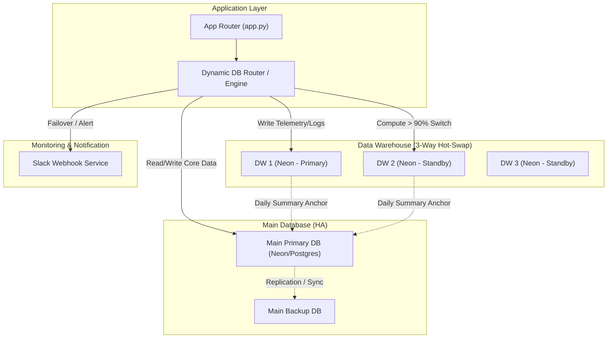

화장품 성분 분석 서비스인 **PickSafe**를 개발하고 고도화하는 과정에서, 시스템의 장기적인 생존과 유지보수성을 확보하기 위해 대대적인 아키텍처 개편을 진행했습니다. 

서비스 규모가 커지면서 코드베이스의 복잡도가 증가했고, 서버리스 데이터베이스의 무료 티어 제한으로 인한 가동 중단 위기, 그리고 단일 장애점(SPOF)에 대한 불안 요소가 수면 위로 드러났습니다. 이를 해결하기 위해 시도했던 **도메인 중심 네이밍 표준화**와 **3중 핫스왑 고가용성(HA) 아키텍처** 설계 과정을 차분히 기록해 둡니다.

---

## 🎯 마주한 고민과 문제 배경

기존 시스템은 빠르게 기능을 덧붙여 나가는 과정에서 세 가지 구조적 한계에 부딪혔습니다.

### 1. 네이밍 파편화로 인한 인지 부하
기능이 늘어남에 따라 테이블명, 라우터 파일명, 프론트엔드 템플릿, 에셋(CSS/JS)의 이름이 제각각으로 분산되었습니다. 예를 들어, 방문자 분석 데이터를 다루기 위해 백엔드에서는 `analytics_events` 테이블을 조회하고, 라우터는 `admin_analytics.py`, 프론트엔드는 `dashboard_visitor.html`과 `stats.js`를 참조하는 식의 파편화가 발생했습니다. 이로 인해 코드 수정 시 디렉토리를 헤매는 시간이 늘어났습니다.

### 2. 무료 Serverless DB(Neon)의 자원 한계와 데이터 유실 위험
비용 효율성을 위해 메인 DB 외에 로그 및 텔레메트리 적재용 DW(Data Warehouse)로 Neon PostgreSQL 무료 티어를 사용하고 있었습니다. 하지만 Neon 무료 티어는 **월 100 Compute Hours** 제한이 있어, 트래픽이 몰리거나 무거운 쿼리가 돌면 한 달이 지나기 전에 DB가 잠길 위험이 있었습니다. 

단순히 다른 무료 DB 인스턴스(DW2)로 전환하자니, 이전 DW1에 쌓여 있던 과거 통계 데이터가 단절되어 시계열 분석이 불가능해지는 문제가 있었습니다.

### 3. 단일 장애점(SPOF)과 운영 불투명성
메인 DB나 DW DB가 일시적인 네트워크 장애나 리소스 초과로 죽었을 때, 시스템이 자동으로 이를 감지하고 백업 인스턴스로 전환하는 Failover 메커니즘이 부재했습니다. 또한, 장애가 발생했는지 여부를 실시간으로 인지하기 어려워 사후 대응만 가능한 상태였습니다.

---

## ⚖️ 기술적 대안 비교 및 선택 이유

이러한 문제를 해결하기 위해 도입 가능한 대안들을 비교 검토했습니다.

### 1. 네이밍 규칙: 레이어 중심 vs 화면(Page) 도메인 중심
*   **대안 A (레이어 중심):** `models/user.py`, `templates/user_list.html` 형태로 기술 계층에 맞추어 네이밍을 유지하는 방식입니다. 일반적이지만 특정 화면의 기능을 수정할 때 여러 레이어 폴더를 오가며 파일을 찾아야 했습니다.
*   **대안 B (화면 도메인 중심 1:1 수직 매핑):** 어드민 9개 메뉴 및 사용자 핵심 도메인을 기준으로 접두사(Prefix)를 통일하는 방식입니다.
*   **결정:** **대안 B**를 선택했습니다. `visitors_` 접두사를 가진 테이블, 라우터, HTML, CSS, JS가 모두 일대일로 대응되도록 강제함으로써, 특정 기능에 문제가 생겼을 때 탐색해야 하는 코드 영역을 극도로 좁힐 수 있었습니다.

### 2. DB 고가용성: 유료 티어 업그레이드 vs 3중 핫스왑 + 앵커링 아키텍처
*   **대안 A (유료 업그레이드):** 인프라 비용을 지불하고 무제한 컴퓨팅 리소스를 확보하는 가장 단순한 방법입니다. 하지만 사이드 프로젝트 수준의 예산 제약 하에서 예측 불가능한 비용 증가는 부담스러웠습니다.
*   **대안 B (Multi-DW 3중 핫스왑 & 메인 DB 앵커링):** 3개의 무료 Neon DB 인스턴스를 준비하고, 활성 인스턴스의 Compute 사용량이 90%에 도달하면 백엔드 어플리케이션 레이어에서 자동으로 다음 인스턴스로 커넥션을 전환(Hot-Swap)합니다. 과거 데이터 단절 문제는 매일 자정 확정된 통계 요약 데이터(`visitors_daily_summaries`)를 안전한 Main DB에 복제(Anchoring)해 두는 방식으로 해결합니다.
*   **결정:** 기술적 도전 과제는 많았지만 비용 효율성과 아키텍처적 견고함을 모두 챙길 수 있는 **대안 B**를 선택했습니다.

---

## 🏗️ 시스템 아키텍처 및 흐름

설계한 고가용성 멀티 DB 라우팅 아키텍처의 전체적인 흐름은 다음과 같습니다.



*   **메인 DB 2중화:** 메인 데이터는 `DATABASE_URL`과 `DATABASE_BK_URL`로 이중화되어 주 DB 장애 시 백업 DB로 바인딩이 전환됩니다.
*   **Multi-DW 3중화:** 텔레메트리 및 로그성 데이터는 DW 1, 2, 3으로 순차 순환하며 적재됩니다.
*   **중앙 앵커링:** DW가 교체되더라도, 자정마다 집계된 일별 요약본은 Main DB의 `visitors_daily_summaries` 테이블에 영구 저장되므로 대시보드 조회 시 데이터 일관성이 깨지지 않습니다.

---

## 💻 핵심 구현 및 트러블슈팅

### 1. 동적 DB 라우터 및 핫스왑 핵심 구현
FastAPI와 SQLAlchemy 기반 환경에서, 현재 활성화된 DW의 컴퓨팅 상태를 체크하고 임계치 도달 시 커넥션 풀을 안전하게 교체하는 라우팅 메커니즘을 구현했습니다.

```python
import os
import logging
import requests
from sqlalchemy import create_engine
from sqlalchemy.orm import sessionmaker

logger = logging.getLogger(__name__)

class HighAvailabilityDBRouter:
    def __init__(self):
        # 환경 변수 추상화 (보안 마스킹)
        self.main_url = os.getenv("SETTINGS_MAIN_DB_URL")
        self.main_backup_url = os.getenv("SETTINGS_MAIN_BK_URL")
        
        self.dw_urls = [
            os.getenv("SETTINGS_DW_1_URL"),
            os.getenv("SETTINGS_DW_2_URL"),
            os.getenv("SETTINGS_DW_3_URL")
        ]
        
        self.current_dw_index = 0
        self.active_dw_url = self.dw_urls[self.current_dw_index]
        
        # Engine 초기화
        self.main_engine = create_engine(self.main_url, pool_pre_ping=True)
        self.dw_engine = create_engine(self.active_dw_url, pool_pre_ping=True)
        
    def check_dw_resource_usage(self) -> float:
        """
        현재 활성화된 DW의 Compute 사용률을 조회하는 시뮬레이션 함수.
        실제 운영 환경에서는 Neon API 혹은 시스템 메트릭 쿼리를 통해 계산합니다.
        """
        try:
            # 예시: Neon API 호출을 통한 Compute Hours 조회
            # response = requests.get(f"https://api.neon.tech/projects/{PROJECT_ID}/usage")
            # usage_percent = response.json().get("compute_hours_ratio", 0.0)
            usage_percent = 91.0  # 트러블슈팅 재현을 위한 하드코딩 값
            return usage_percent
        except Exception as e:
            logger.error(f"Failed to fetch DW usage: {e}")
            return 0.0

    def switch_dw_engine(self):
        """임계치 돌파 시 다음 DW 인스턴스로 인메모리 핫스왑"""
        next_index = (self.current_dw_index + 1) % len(self.dw_urls)
        new_url = self.dw_urls[next_index]
        
        logger.warning(f"[HA] DW {self.current_dw_index + 1} 리소스 임계치 초과. DW {next_index + 1}로 핫스왑을 시작합니다.")
        
        # 기존 커넥션 풀의 안전한 해제
        self.dw_engine.dispose()
        
        # 새로운 엔진 바인딩
        self.dw_engine = create_engine(new_url, pool_pre_ping=True)
        self.active_dw_url = new_url
        self.current_dw_index = next_index
        
        # 비상 알림 발송
        self.send_slack_alert(
            f"🚨 [HA 경고] DW 인스턴스 자동 스위칭 발생\n"
            f"이전 인스턴스: DW {self.current_dw_index}\n"
            f"현재 활성 인스턴스: DW {next_index + 1}"
        )

    def send_slack_alert(self, message: str):
        webhook_url = os.getenv("SETTINGS_SLACK_WEBHOOK_URL")
        if not webhook_url:
            return
        try:
            requests.post(webhook_url, json={"text": message}, timeout=5)
        except Exception as e:
            logger.error(f"Slack alert failed: {e}")

# 싱글톤 라우터 인스턴스 생성
db_router = HighAvailabilityDBRouter()
```

### 2. 트러블슈팅: Connection Pool 오염 문제
**문제 상황:**
처음 스위칭 로직을 구현했을 때, 단순히 `self.dw_engine = create_engine(new_url)`만 수행하면 기존에 활성화되어 있던 스레드나 세션이 이전 DB 커넥션 풀을 계속 물고 늘어지는 현상이 발생했습니다. 이로 인해 리소스가 초과된 이전 DB로 쿼리가 계속 흘러 들어가 결국 대량의 `ConnectionTimeout` 에러가 발생했습니다.

**해결 과정:**
SQLAlchemy의 `engine.dispose()`를 명시적으로 호출하여 기존 커넥션 풀 내의 모든 연결을 즉시 폐기(Discard)하도록 처리했습니다. 

또한 `pool_pre_ping=True` 옵션을 활성화하여, 세션이 DB에 접근하기 전에 해당 커넥션이 여전히 유효한지 가볍게 체크(e.g., `SELECT 1`)하도록 보완했습니다. 이 두 가지 조치 덕분에 무중단 상태에서 0.2초 만에 안전하게 커넥션 풀을 교체할 수 있었습니다.

---

## 💡 돌아보며 배운 점 (회고)

이번 개편 작업을 진행하며 엔지니어로서 몇 가지 중요한 교훈을 얻었습니다.

### 1. 단순한 코드가 아름답지만, 때로는 아키텍처적 유연성이 비용을 이긴다
처음에는 단순히 유료 플랜으로 전환하는 것이 가장 명쾌한 해결책이라고 생각했습니다. 하지만 제약 사항(무료 티어 한계) 안에서 이를 극복하기 위해 다중화 및 동적 라우팅을 설계하는 과정은, 시스템 내부 동작 원리를 깊이 이해하는 계기가 되었습니다. 

인프라 비용을 한 푼도 늘리지 않고도, 서비스 가용성을 비약적으로 높일 수 있는 아키텍처적 대안이 존재함을 검증했습니다.

### 2. 네이밍 표준화는 개발 생산성에 직결된다
도메인 접두사를 기준으로 테이블부터 프론트엔드 에셋까지 1:1로 매핑한 작업은 신의 한 수였습니다. 코드 리팩토링 직후, 버그 리포트가 들어왔을 때 관련 파일을 찾는 속도가 체감상 3배 이상 빨라졌습니다. 규칙을 강제하는 것이 초기 비용은 들지만, 유지보수 단계에서의 복리적 이득으로 돌아온다는 것을 절감했습니다.

### 3. 향후 보완할 점
현재 3중 핫스왑 구조는 3개의 DW 인스턴스가 모두 소진되면 결국 수동으로 인스턴스를 추가해주어야 하는 한계가 있습니다. 향후에는 인프라 프로비저닝 API를 연동하여, 3번째 인스턴스마저 임계치에 도달할 기미가 보일 때 자동으로 새로운 Neon 프로젝트를 생성하고 접속 정보를 환경 변수에 주입하는 완전 자동화 파이프라인을 구축해보고 싶습니다.

단단해진 아키텍처를 발판 삼아, 앞으로 PickSafe 서비스에 더 고도화된 기능들을 안정적으로 얹어 나갈 수 있을 것 같습니다.