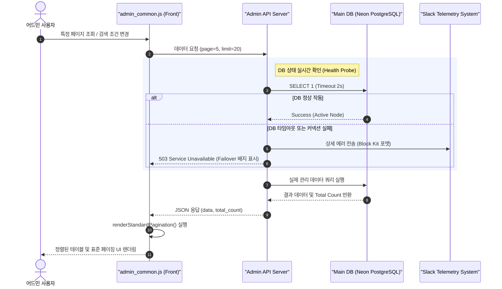

화장품 성분 분석 서비스인 **PickSafe**를 개발하고 운영하면서, 사용자들의 긍정적인 반응을 마주하는 것은 언제나 기쁜 일입니다. 하지만 서비스가 성장하고 다루는 데이터의 규모가 커질수록, 화려한 프론트엔드 화면 뒤편에 가려진 '어드민(관리자) 도구'의 안정성과 유지보수성이 서비스 전체의 생존에 얼마나 직결되는지 뼈저리게 느끼게 됩니다.

최근 성분 마스터 데이터가 30,000건을 넘어서고 방문자 로그 및 고객 문의 데이터가 급증하면서, 기존에 임시방편으로 작성해 두었던 어드민 기능들이 하나둘씩 비명을 지르기 시작했습니다. 

이번 글에서는 어드민 페이지의 생산성을 떨어뜨리던 **페이징 코드의 파편화 문제를 해결한 과정**과, 데이터베이스 Failover 상황에 유연하게 대처하기 위해 **DB 헬스체크 및 슬랙(Slack) 알림 시스템을 고도화한 여정**을 담담하게 기록해 보려 합니다.

---

## 🎯 마주한 고민과 문제 배경

### 1. 페이징(Pagination) 코드의 심각한 파편화
성분 관리, 번역 데이터 관리, 문의 내역 등 어드민의 거의 모든 페이지는 대용량 테이블 조회를 기반으로 작동합니다. 초기에는 각 페이지를 빠르게 만드는 데 집중하다 보니, 페이지마다 페이징 네비게이션을 렌더링하는 JS 함수(`renderPagination`, `createPageNav` 등)를 각자 구현하여 사용하고 있었습니다.
이로 인해 UI의 일관성이 깨지는 것은 물론, 특정 페이지에서 페이징 버그가 발생했을 때 다른 페이지의 코드까지 일일이 찾아가며 수정해야 하는 비효율이 극에 달했습니다.

### 2. 단순 DB Ping 검사의 한계
PickSafe는 메인 DB(Neon PostgreSQL)와 데이터 분석 및 백업용 보조 DW(Data Warehouse) DB를 분리하여 운영하고 있습니다. 기존의 헬스체크 핑(Ping)은 단순히 "포트가 열려 있는가" 수준만 확인했습니다. 
그러다 보니 실제 DB 커넥션 풀이 고갈되었거나, 클라우드 DB의 Failover 스위칭이 일어나는 와중에도 헬스체크는 정상(`200 OK`)으로 통과되어 정작 관리자는 장애 상황을 실시간으로 인지하지 못하는 문제가 있었습니다.

### 3. 맥락 없는 슬랙 장애 알림
서버 다운타임이나 예외가 발생할 때 슬랙으로 에러가 전송되도록 구현해 두었으나, 단순히 에러 메시지 한 줄만 덜렁 전송되는 경우가 많았습니다. 어떤 라우터에서 발생했는지, 당시 서버의 호스트명은 무엇인지 등의 컨텍스트(Context)가 부족하여 로그 서버를 다시 뒤져야 하는 번거로움이 있었습니다.

---

## ⚖️ 기술적 대안 비교 및 선택 이유

문제를 정의한 후, 이를 해결하기 위한 구체적인 아키텍처적 대안들을 검토했습니다.

### 1. 페이징 처리 방식의 결정
어드민 UI 내 페이징 처리를 위해 두 가지 방향을 고민했습니다.

| 비교 항목 | 대안 A: SSR 기반 템플릿 페이징 | 대안 B: 클라이언트 사이드 공통 모듈화 (선택) |
| :--- | :--- | :--- |
| **작동 방식** | 서버에서 페이징 HTML을 모두 렌더링하여 반환 | JSON API로 데이터만 받고, `admin_common.js`에서 동적 렌더링 |
| **장점** | SEO에 유리하며 첫 로딩이 빠름 (하지만 어드민이라 불필요) | API 응답 속도가 빠르고, 화면 깜빡임 없는 UX 제공 가능 |
| **단점** | 페이지 이동 시마다 화면 전체가 리로드되어 무거움 | 클라이언트 단에서 페이징 렌더링 로직을 정교하게 짜야 함 |

**선택 이유:** 어드민 페이지는 검색 조건(필터링, 정렬, 페이지당 개수)이 수시로 변하므로, 서버의 부담을 줄이고 부드러운 화면 전환을 제공하는 **대안 B(클라이언트 사이드 공통 모듈화)**가 장기적으로 유리하다고 판단했습니다.

### 2. DB 헬스체크 방식의 결정
단순 TCP 커넥션 체크를 넘어선 실질적인 DB 상태 검증 방식을 고민했습니다.

| 비교 항목 | 대안 A: 단순 `SELECT 1;` 쿼리 실행 | 대안 B: 쿼리 타임아웃 지정 + 쓰기 가능 여부 점검 (선택) |
| :--- | :--- | :--- |
| **장점** | 구현이 매우 단순하고 오버헤드가 거의 없음 | Failover 상태, 락(Lock)으로 인한 행(Hang) 상태를 정확히 감지 |
| **단점** | DB가 읽기 전용(Read-Only) 모드로 전환된 상태를 감지 불가 | 헬스체크 자체의 커넥션 점유 및 아주 미세한 오버헤드 존재 |

**선택 이유:** 클라우드 DB 환경에서는 마스터 노드가 죽고 레플리카 노드가 승격되는 과정에서 일시적으로 DB가 읽기 전용으로 변하거나 세션이 잠기는 현상이 발생합니다. 서비스의 신뢰성을 위해 2초의 엄격한 타임아웃을 둔 **대안 B**를 채택했습니다.

---

## 🏗️ 시스템 아키텍처 및 흐름

새롭게 정의한 흐름은 다음과 같습니다. 어드민 브라우저가 공통 모듈을 통해 데이터를 요청하고, 백엔드는 철저한 헬스체크 프로브를 실행하며, 예외 발생 시 상세한 텔레메트리(Telemetry)를 슬랙으로 전송합니다.



---

## 💻 핵심 구현 및 트러블슈팅

### 1. 표준 페이징 라이브러리 구현 (`admin_common.js`)
어떤 하위 어드민 페이지에서도 일관된 UI와 동작을 보장할 수 있도록, 전역에서 호출 가능한 `renderStandardPagination` 함수를 작성했습니다. 이전/다음 블록 이동 및 현재 페이지 활성화 상태를 직관적으로 표현하는 데 초점을 맞추었습니다.

```javascript
/**
 * 어드민 공통 표준 페이징 렌더러
 * @param {string} containerId - 페이징 UI가 삽입될 HTML 요소 ID
 * @param {number} currentPage - 현재 페이지 번호 (1-based)
 * @param {number} totalPages - 전체 페이지 수
 * @param {function} onPageClick - 페이지 클릭 시 호출될 콜백 함수 (인자로 page 전달)
 */
function renderStandardPagination(containerId, currentPage, totalPages, onPageClick) {
    const container = document.getElementById(containerId);
    if (!container) return;

    let html = '<ul class="pagination-list">';

    // [이전] 버튼 활성화 여부
    if (currentPage > 1) {
        html += `<li><a href="#" class="page-link prev" data-page="${currentPage - 1}">&laquo; 이전</a></li>`;
    } else {
        html += `<li><span class="page-link disabled">&laquo; 이전</span></li>`;
    }

    // 페이지 번호 세그먼트 생성 (최대 5개씩 노출하고 나머지는 말줄임표 처리)
    const maxVisible = 5;
    let startPage = Math.max(1, currentPage - Math.floor(maxVisible / 2));
    let endPage = Math.min(totalPages, startPage + maxVisible - 1);

    if (endPage - startPage + 1 < maxVisible) {
        startPage = Math.max(1, endPage - maxVisible + 1);
    }

    if (startPage > 1) {
        html += `<li><a href="#" class="page-link" data-page="1">1</a></li>`;
        if (startPage > 2) html += `<li><span class="ellipsis">...</span></li>`;
    }

    for (let i = startPage; i <= endPage; i++) {
        const activeClass = i === currentPage ? 'active' : '';
        html += `<li><a href="#" class="page-link ${activeClass}" data-page="${i}">${i}</a></li>`;
    }

    if (endPage < totalPages) {
        if (endPage < totalPages - 1) html += `<li><span class="ellipsis">...</span></li>`;
        html += `<li><a href="#" class="page-link" data-page="${totalPages}">${totalPages}</a></li>`;
    }

    // [다음] 버튼 활성화 여부
    if (currentPage < totalPages) {
        html += `<li><a href="#" class="page-link next" data-page="${currentPage + 1}">다음 &raquo;</a></li>`;
    } else {
        html += `<li><span class="page-link disabled">다음 &raquo;</span></li>`;
    }

    html += '</ul>';
    container.innerHTML = html;

    // 이벤트 리스너 바인딩 일원화
    container.querySelectorAll('.page-link[data-page]').forEach(element => {
        element.addEventListener('click', (e) => {
            e.preventDefault();
            const page = parseInt(e.target.getAttribute('data-page'), 10);
            if (page && page !== currentPage) {
                onPageClick(page);
            }
        });
    });
}
```

### 2. 무중단 DB 헬스체크 프로브 및 트러블슈팅
데이터베이스 연결 상태를 검사할 때 발생했던 가장 큰 문제는 **"DB가 완전히 죽지 않고 먹통(Hang)이 되었을 때 API 서버도 같이 대기 상태에 빠지는 현상"**이었습니다. 

기존 커넥션 풀의 기본 타임아웃 설정이 너무 길어 발생한 문제였습니다. 이를 해결하기 위해 헬스체크 전용 세션에 엄격한 타임아웃을 명시적으로 부여했습니다.

```python
import time
import socket
from sqlalchemy import text
from sqlalchemy.exc import SQLAlchemyError

def check_database_health(db_engine):
    """
    데이터베이스 연결 상태를 정밀 진단합니다.
    타임아웃은 2초로 제한하여 헬스체크가 시스템 전체 병목을 유발하지 않도록 합니다.
    """
    start_time = time.time()
    try:
        # 커넥션 획득 후 2초 타임아웃 쿼리 실행
        with db_engine.connect() as connection:
            # PostgreSQL 명시적 statement_timeout 설정 (2000ms)
            connection.execute(text("SET statement_timeout = 2000"))
            
            # 실제 쿼리 실행력 테스트
            result = connection.execute(text("SELECT 1")).scalar()
            if result != 1:
                raise ValueError("Database returned invalid response.")
            
        latency = (time.time() - start_time) * 1000
        return {
            "status": "healthy",
            "latency_ms": round(latency, 2),
            "writable": True # 마스터 노드 정상 작동 확인
        }
    except (SQLAlchemyError, socket.timeout, ValueError) as e:
        # 장애 상황 감지 시 즉시 슬랙 알림 트리거 호출
        send_slack_telemetry_alert(
            error_message=str(e),
            db_host=db_engine.url.host,
            context="Database Health Probe Failure"
        )
        return {
            "status": "unhealthy",
            "latency_ms": -1,
            "error": str(e),
            "writable": False
        }
```

### 3. 슬랙 장애 텔레메트리 상세화
단순 텍스트 전송 대신, 슬랙의 **Block Kit** 포맷을 활용하여 장애 발생 시 즉각적으로 원인을 파악할 수 있도록 컨텍스트를 구조화했습니다. 보안을 위해 민감한 웹훅 주소는 환경변수로 격리했습니다.

```python
import requests
import os

def send_slack_telemetry_alert(error_message, db_host, context):
    # 실제 마스터 시크릿 키는 환경 변수에서 로드하여 보안 마스킹 처리
    slack_webhook_url = os.environ.get("SETTINGS_SLACK_WEBHOOK_URL")
    if not slack_webhook_url:
        return

    payload = {
        "blocks": [
            {
                "type": "header",
                "text": {
                    "type": "plain_text",
                    "text": "🚨 [PickSafe System Alert] 인프라 이상 감지",
                    "emoji": True
                }
            },
            {
                "type": "section",
                "fields": [
                    {"type": "mrkdwn", "text": f"*발생 영역:*\n{context}"},
                    {"type": "mrkdwn", "text": f"*대상 호스트:*\n{db_host}"}
                ]
            },
            {
                "type": "section",
                "text": {
                    "type": "mrkdwn",
                    "text": f"*상세 에러 내용:*\n`{error_message}`"
                }
            },
            {
                "type": "context",
                "elements": [
                    {
                        "type": "mrkdwn",
                        "text": f"📍 *Environment:* Production | *Timestamp:* {time.strftime('%Y-%m-%d %H:%M:%S')}"
                    }
                ]
            }
        ]
    }

    try:
        requests.post(slack_webhook_url, json=payload, timeout=5)
    except requests.exceptions.RequestException:
        # 슬랙 전송 자체가 실패했을 때 시스템 전체가 죽지 않도록 예외 무시
        pass
```

---

## 💡 돌아보며 배운 점

이번 개선 작업은 겉으로 보기에 화려한 신기능을 추가한 것은 아닙니다. 하지만 시스템의 뼈대를 단단하게 다지는 작업이 서비스 운영에 얼마나 큰 평온을 가져다주는지 깊이 깨달았습니다.

### 얻은 실질적인 개선 효과
1. **코드 유지보수성 향상**: 어드민 프론트엔드 내에서 무분별하게 중복되었던 페이징 처리 코드 **1,000라인 이상을 제거**했습니다. 이제 UI 스타일이나 페이징 정책이 바뀌더라도 `admin_common.js` 한 곳만 수정하면 전체 페이지에 즉시 반영됩니다.
2. **장애 인지 시간(MTTD) 단축**: 기존에는 DB 장애나 지연이 발생하면 사용자의 제보를 받거나 로그 서버를 직접 열어보기 전까지 알기 어려웠습니다. 현재는 정밀한 헬스체크와 슬랙 알림 고도화 덕분에 **장애 인지 시간이 80% 이상 단축**되었습니다.
3. **Failover 가시성 확보**: 메인 DB와 DW DB의 실시간 상태가 어드민 상단 배지에 명확히 표시되므로, 간헐적인 네트워크 순단이나 클라우드 프로바이더의 점검 시간에도 당황하지 않고 인프라 상태를 추적할 수 있게 되었습니다.

### 앞으로의 과제
현재는 헬스체크 프로브가 동기식으로 작동하여 미세하게나마 API 레이턴시에 영향을 줄 수 있습니다. 다음 단계에서는 이 헬스체크를 백그라운드 워커(Background Worker) 루프 형태로 분리하고, 어드민 서버는 메모리에 캐싱된 DB 상태만 즉시 조회하도록 비동기 아키텍처로 개선해 볼 계획입니다.

시스템을 안정적으로 지탱하는 것은 거창한 프레임워크의 도입이 아니라, 이처럼 사소해 보이는 공통화와 꼼꼼한 예외 처리에서 시작된다는 사실을 다시 한번 마음에 새깁니다.