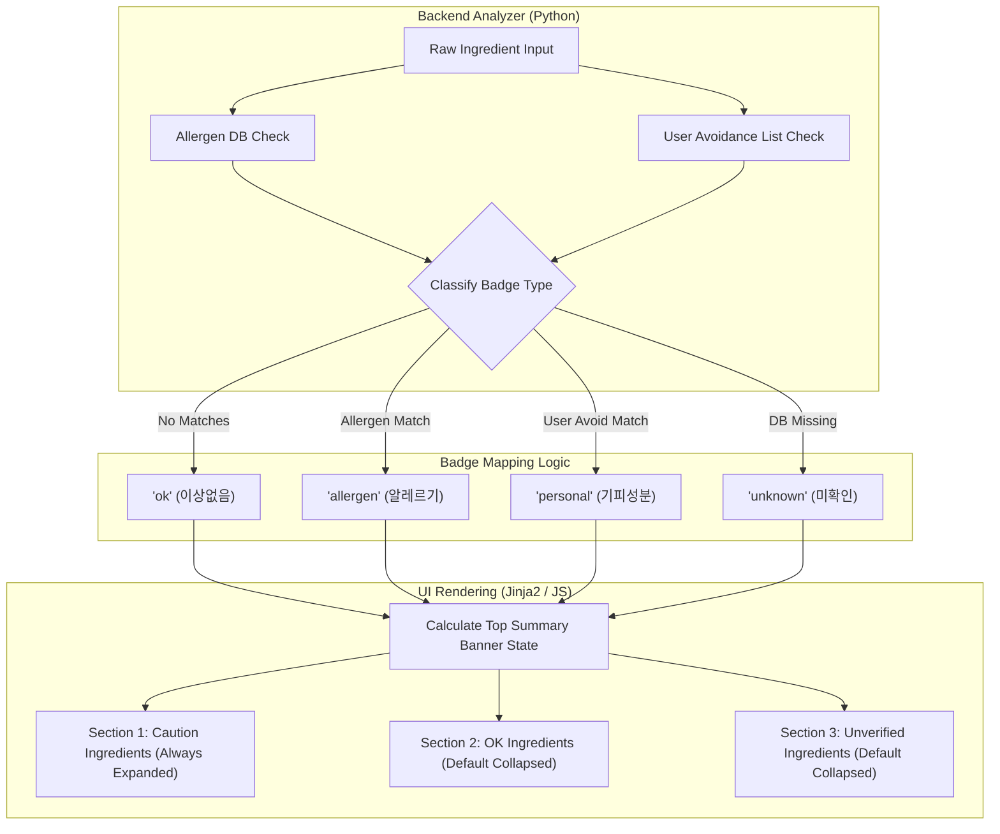

화장품 성분 분석 서비스인 **PickSafe**를 개발하고 운영하면서, 기술적인 고도화만큼이나 중요한 것이 '데이터를 사용자에게 어떻게 전달할 것인가'라는 점을 깨달았습니다. 

기존의 성분 분석 결과 화면은 철저히 백엔드 데이터베이스의 조회 상태를 그대로 투영하고 있었습니다. 시스템이 데이터를 처리하기는 편했지만, 정작 서비스를 이용하는 사용자는 화면의 정보를 직관적으로 이해하기 어려웠습니다. 

이 문제를 해결하기 위해 시스템 중심의 언어를 사용자 중심의 언어로 전환하고, 정보의 우선순위에 따라 결과 화면의 구조를 전면 재편한 과정을 기록으로 남깁니다.

---

## 🎯 마주한 고민과 문제 배경

기존 결과 화면에서는 화장품 성분 데이터베이스와 매칭된 결과를 단순 나열식 리스트로 보여주었습니다. 각 성분 우측에는 시스템의 매칭 상태를 나타내는 배지가 붙어 있었는데, 이 배지들의 명칭이 지극히 개발자 관점이었습니다.

| 기존 배지 | 마주한 문제점 |
| :--- | :--- |
| `일치함` | "무엇과 일치했는가?"에 대한 맥락이 없습니다. 사용자는 이것이 성분 사전과 일치했다는 뜻인지, 안전하다는 뜻인지 직관적으로 이해할 수 없었습니다. |
| `⚠️ 알레르기` | 의미는 비교적 명확하나, 공인된 기준인지 사용자가 설정한 개인 기준인지 모호했습니다. |
| `? 미확인 성분` | 텍스트가 다소 길어 UI를 해치고, 데이터가 없는 것뿐인데 마치 위험한 성분인 것처럼 오인할 여지가 있었습니다. |

여기에 더해, 화장품 하나에 들어가는 수십 개의 성분이 단 하나의 리스트로 길게 나열되다 보니, 사용자는 자신에게 치명적일 수 있는 알레르기 유발 성분을 찾기 위해 화면을 끝없이 스크롤해야만 했습니다. 

정보의 인지 부하(Cognitive Load)가 너무 높았고, 이는 서비스의 핵심 가치인 '빠르고 안전한 성분 확인'을 저해하는 심각한 병목이었습니다.

---

## ⚖️ 기술적 대안 비교 및 선택 이유

가장 먼저 배지의 명칭을 직관적이면서도 안전한 단어로 변경해야 했습니다. 이 과정에서 여러 대안을 검토했습니다.

### 1. 배지 명칭에 대한 대안 비교

* **대안 A: `안전함` 또는 `좋음` 사용**
  * *장점:* 사용자가 직관적으로 가장 안심할 수 있는 단어입니다.
  * *단점:* 법적 리스크가 매우 큽니다. PickSafe는 의료적 진단을 대체하는 서비스가 아닙니다. 공인 알레르기 유발 성분이 아니고 개인 기피 성분이 아니라고 해서, 모든 피부 타입에 100% 안전하다고 단정할 수 없습니다. 따라서 이 대안은 기각했습니다.
* **대안 B: `확인됨` 사용**
  * *장점:* 중립적인 표현입니다.
  * *단점:* 여전히 "무엇이 확인되었는가"에 대한 맥락이 빠져 있어 기존의 `일치함`과 크게 다르지 않았습니다.
* **선택안: `✅ 이상없음` 사용**
  * *이유:* "안전함"이라는 단정적인 표현을 피해 법적 리스크를 최소화하면서도, 우려되는 성분이 검출되지 않았다는 중립적이고 직관적인 의미를 명확히 전달할 수 있다고 판단했습니다.

### 2. 배지 분류 기준의 세분화

공인 기준과 사용자 개인 설정을 명확히 분리하기 위해 배지 타입을 4가지로 표준화했습니다.

* `✅ 이상없음`: 공인 알레르기 목록 및 개인 기피 성분에 해당하지 않는 청정 성분
* `⚠️ 알레르기`: EU 82종 및 한국 식약처 25종 공인 알레르기 유발 성분
* `⚠️ 기피성분`: 사용자가 온보딩 과정에서 직접 등록한 개인 기피 성분과 일치하는 성분
* `❓ 미확인`: 내부 DB에 등재되지 않아 성분 대조가 불가능한 성분

---

## 🏗️ 시스템 아키텍처 및 흐름

이러한 분류 체계와 화면 재편을 지원하기 위해, 백엔드 분석 엔진에서 처리된 로직이 프론트엔드로 전달되어 3섹션 아코디언(Accordion) 구조로 렌더링되는 파이프라인을 설계했습니다.



사용자가 가장 주목해야 할 **주의 성분(알레르기 및 기피성분)**을 최상단 섹션 1에 배치하여 항상 펼쳐진 상태로 제공하고, 상대적으로 중요도가 낮은 섹션 2와 3은 기본적으로 접어두어 시각적 피로도를 대폭 줄였습니다.

---

## 💻 핵심 구현 및 트러블슈팅

### 1. 백엔드 성분 분류 및 우선순위 판정 로직

성분을 분류할 때 발생할 수 있는 주요 예외 상황(Edge Case) 중 하나는 **"어떤 성분이 공인 알레르기 성분이면서 동시에 사용자의 개인 기피 성분일 때 어떤 배지를 부여할 것인가"**였습니다. 

정보의 객관성과 경고의 강도를 고려하여 `allergen` (공인 알레르기)을 `personal` (개인 기피)보다 높은 우선순위로 처리하도록 판정 로직을 작성했습니다.

```python
# backend/analyzer.py

class BadgeType:
    OK = "ok"
    ALLERGEN = "allergen"
    PERSONAL = "personal"
    UNKNOWN = "unknown"

def determine_badge_type(ingredient_id, ingredient_name, allergen_set, personal_avoid_set, db_exists) -> str:
    """
    성분의 상태에 따른 배지 타입을 결정합니다.
    우선순위: Allergen > Personal Avoid > OK > Unknown
    """
    if not db_exists:
        return BadgeType.UNKNOWN
    
    # 1. 공인 알레르기 성분 여부 우선 확인
    if ingredient_name in allergen_set:
        return BadgeType.ALLERGEN
        
    # 2. 개인 기피 성분 여부 확인
    if ingredient_name in personal_avoid_set:
        return BadgeType.PERSONAL
        
    # 3. 아무것도 해당하지 않는 경우 이상없음
    return BadgeType.OK
```

### 2. 프론트엔드 3섹션 아코디언 및 요약 배너 구현

백엔드에서 가공하여 내려준 `badge_type`을 기반으로 화면을 세 개의 섹션으로 분할하여 렌더링합니다. 아래는 Jinja2 템플릿과 Tailwind CSS를 활용해 구현한 구조의 일부입니다.

```html
<!-- templates/result.html -->

<!-- 상단 즉시 판정 배너 -->
<div class="mb-6 p-4 rounded-lg text-white font-bold bg-red-500bg-green-500">
    
        ⚠️ 주의가 필요한 성분이 {{ caution_count }}개 검출되었습니다.
    
        ✅ 안심하세요! 우려 성분이 검출되지 않았습니다.
    
</div>

<!-- 섹션 1: 주의 성분 (항상 노출) -->
<div class="mb-4">
    <h3 class="text-lg font-semibold text-red-600 mb-2">⚠️ 주의 성분 ({{ caution_ingredients|length }})</h3>
    <div class="border border-red-200 rounded-lg p-4 bg-red-50">
        
            
                <div class="flex justify-between py-2 border-b border-red-100 last:border-0">
                    <span>{{ ing.name }}</span>
                    <span class="px-2 py-1 text-xs rounded font-bold bg-yellow-400 text-blackbg-orange-500 text-white">
                        {{ "⚠️ 알레르기" if ing.badge_type == 'allergen' else "⚠️ 기피성분" }}
                    </span>
                </div>
            
        
            <p class="text-gray-500 text-sm">검출된 주의 성분이 없습니다.</p>
        
    </div>
</div>

<!-- 섹션 2: 이상없는 성분 (기본 닫힘 아코디언) -->
<details class="mb-4 border border-gray-200 rounded-lg" open>
    <summary class="p-4 font-semibold cursor-pointer bg-gray-50 flex justify-between items-center">
        <span>✅ 이상없는 성분 ({{ ok_ingredients|length }})</span>
    </summary>
    <div class="p-4 border-t border-gray-200">
        
            <div class="flex justify-between py-2 border-b last:border-0">
                <span class="text-gray-700">{{ ing.name }}</span>
                <span class="px-2 py-1 text-xs rounded bg-green-100 text-green-800 font-bold">✅ 이상없음</span>
            </div>
        
    </div>
</details>
```

### 3. 트러블슈팅: 아코디언 기본 열림 상태 제어

처음에는 모든 아코디언(`details` 태그)을 일관되게 닫아두었습니다. 하지만 테스트 과정에서 **주의 성분이 단 하나도 없는 안전한 제품의 경우, 화면에 아무 정보도 보이지 않아 사용자가 당황하는 현상**을 발견했습니다.

이를 해결하기 위해, 주의 성분의 개수(`caution_ingredients|length`)가 `0`일 때는 이상없는 성분 섹션이 자동으로 열리도록(`open` 속성 활성화) 템플릿 로직을 유연하게 처리했습니다. 사소한 디테일이지만 사용자 경험 측면에서는 큰 차이를 만들었습니다.

---

## 💡 돌아보며 배운 점

이번 개편 과정은 시스템의 설계가 기술적 편의성뿐 아니라, 서비스를 이용하는 사용자의 심리적 안정성과 법적 안전장치까지 아울러야 함을 깊이 깨닫게 해준 경험이었습니다.

1. **개발자 관점의 '데이터 매칭'과 사용자 관점의 '정보 습득'은 다릅니다.** 백엔드 데이터 모델의 필드명을 그대로 UI 배지에 노출하는 안일함을 탈피하고, 사용자가 이 정보를 보고 어떤 행동을 취할지 고민하는 과정이 아키텍처 설계의 시작이어야 함을 배웠습니다.
2. **법적 리스크와 인지 편향의 조율:** "안전함"이라는 매력적인 단어 대신 "이상없음"이라는 다소 보수적인 표현을 선택한 것은, 기술 서비스가 가질 수 있는 법적 리스크를 예방하는 동시에 사용자에게 정확한 정보를 제공하기 위한 필수적인 트레이드오프였습니다.
3. **점진적 개선의 가치:** 한 번에 모든 시스템을 갈아엎기보다, 배지 명칭 교체(1단계) -> 요약 배너 신설(2단계) -> 아코디언 구조 재편(3단계) 순으로 단계를 나누어 릴리스함으로써, 리팩토링 과정에서 발생할 수 있는 사이드 이펙트를 최소화하고 안정적으로 기능을 배포할 수 있었습니다.

앞으로는 다국어 번역 테이블(`translations`)을 연동하여 글로벌 사용자를 대응하는 한편, 성분 데이터가 늘어남에 따라 아코디언 렌더링 시 발생할 수 있는 DOM 노드 증가 문제를 가상 스크롤(Virtual Scroll) 등으로 보완해 나갈 계획입니다.