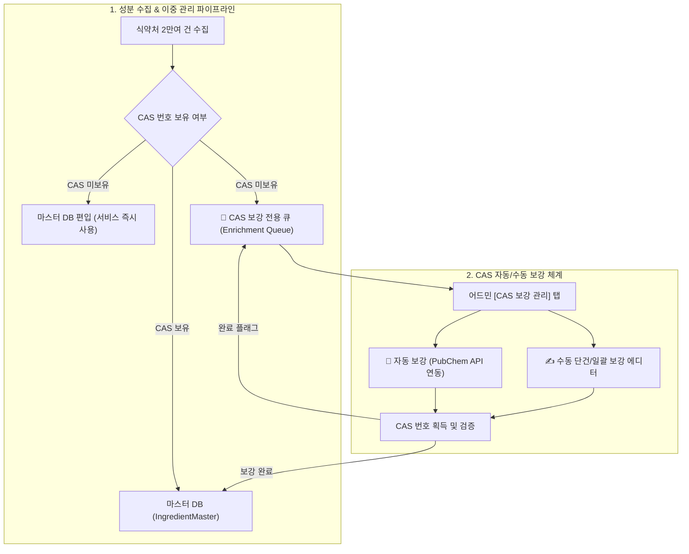

안녕하세요, PickSafe 백엔드 엔지니어링 팀입니다. 

화장품 성분 분석 서비스에서 가장 중요한 가치는 무엇일까요? 바로 **"사용자가 스캔한 모든 성분을 빈틈없이 매칭하여 정확한 정보를 제공하는 것"**입니다. 하지만 현실의 데이터는 그리 녹록지 않습니다. 수많은 행정 기준과 화학적 분류의 틈새에서 시스템은 예외 상황을 마주하게 됩니다.

최근 저희 팀은 **"가공소금", "누룩추출물"과 같은 1,000여 개의 천연/식품 성분이 시스템 오류로 인해 '미확인 성분'으로 분류되는 문제**를 해결해야 했습니다. 이 과정에서 데이터 정합성(Consistency)과 사용자 경험(Availability) 사이의 트레이드오프를 어떻게 해결했는지, 그리고 이를 자동화된 파이프라인으로 구축한 여정을 공유합니다.

---

## 1. 문제의 발견: "완벽한 화학식만 통과시킨다"는 규칙의 배신

기존 수집 엔진은 매우 엄격한 데이터 유효성 검증 규칙을 가지고 있었습니다. 모든 화장품 성분은 국제 표준 식별자인 **CAS 번호(Chemical Abstracts Service Registry Number, 예: 50-81-7)**를 필수로 가져야만 마스터 DB(`IngredientMaster`)에 편입될 수 있도록 설계되어 있었습니다.

```text
[기존 파이프라인 검증 로직]
성분 데이터 수집 -> CAS 번호 유효성 검증 (숫자-숫자-숫자 패턴) -> [Pass] 마스터 DB 저장 / [Fail] 에러 큐 분류
```

이 엄격함은 정합성 측면에서는 훌륭했으나, **천연 추출물이나 식품 기반 성분**을 만나면서 무너졌습니다.
* **원인**: "온천수", "녹차추출물" 같은 복합 천연물은 단일 화학 분자가 아니기 때문에 태생적으로 고유한 CAS 번호가 없거나(N/A), 여러 개가 복합적으로 존재합니다.
* **결과**: 한국 식약처 공인 성분 2만여 건 중 약 1,000건이 유효성 검증을 통과하지 못하고 수집 에러 큐(`ingredients_seeding_errors`)에 쌓였습니다.
* **비즈니스 임팩트**: 바디스크럽(가공소금 함유)이나 발효 에센스(누룩추출물 함유)를 스캔한 사용자는 정상 성분임에도 불구하고 화면에 **`❓ 미확인 성분`**이라는 경고를 보게 되며, 서비스 신뢰도 저하로 이어졌습니다.

---

## 2. 기술적 고민과 트레이드오프 (Trade-offs)

이 문제를 해결하기 위해 엔지니어링 팀은 세 가지 접근법을 두고 고민했습니다.

### Option A: 수집 엔진의 CAS 검증 필터를 완전히 제거한다.
* **장점**: 개발이 가장 빠르고 쉬움.
* **단점**: 잘못된 형식의 데이터나 가짜 CAS 번호가 마스터 DB에 유입되는 것을 막을 수 없어 전체 데이터 정합성이 깨짐.

### Option B: 모든 천연 성분의 CAS 번호를 사람이 수동으로 찾아 등록한 뒤 마스터 DB에 넣는다.
* **장점**: 100% 정합성이 보장된 데이터만 서비스에 노출됨.
* **단점**: 1,000여 개의 성분을 수동 검증하는 동안 사용자는 계속해서 '미확인 성분' 오류를 겪어야 함 (Time-to-Market 지연).

### Option C: 이중 관리 아키텍처 (Dual Management Architecture) 채택
* **원칙**: **"서비스 노출(읽기)"은 즉시 허용하되, "정밀 데이터 보강(쓰기/업데이트)"은 비동기 큐를 통해 백그라운드에서 점진적으로 해결한다.**

저희는 **Option C**를 선택했습니다. 완벽한 데이터를 기다리느라 사용자 경험을 해치는 것보다, 서비스는 즉시 정상화하고 내부 운영 도구를 고도화하여 데이터를 점진적으로 완벽하게 만드는 것이 스타트업 환경에 더 적합한 엔지니어링 의사결정이라 판단했습니다.

---

## 3. 해결 프레임워크: 이중 관리 파이프라인 설계

선택한 방향성을 바탕으로 아래와 같이 **데이터 수집 및 이중 관리 아키텍처**를 설계했습니다.



### 핵심 구현 포인트 1: 마스터 DB 즉시 편입을 위한 '임시 식별자' 체계
CAS 번호가 없는 천연 성분을 즉시 서비스에 활용하기 위해 두 가지 장치를 마련했습니다.
1. `cas_no = None` 상태를 허용하되, 매칭 인덱스를 최적화했습니다.
2. 국제 화장품 성분 사전(INCI) 명칭이 비어 있는 경우, `N/A-[한글성분명]` 형태의 고유 표준 식별자를 자동 생성하여 시스템 내부 결합도를 유지했습니다.
이 설계 덕분에 사용자가 천연 성분이 포함된 제품을 스캔했을 때 **오분류율을 즉시 0%로 낮추고 매칭률을 99.9%까지 끌어올릴 수 있었습니다.**

### 핵심 구현 포인트 2: 상태 기반 비동기 보강 큐 (State-driven Enrichment Queue)
마스터 테이블인 `IngredientMaster`에 상태 메타데이터 필드를 추가했습니다.
* `cas_enrichment_status`: `none` (보강 불필요) | `pending` (보강 대기) | `completed` (보강 완료)

CAS 번호가 없이 등록된 성분은 즉시 `pending` 상태로 마킹되며, 이는 어드민 내부의 전용 작업 큐로 격리됩니다. 운영팀은 수만 건의 전체 데이터셋을 조회할 필요 없이, 오직 이 큐에 쌓인 1,000여 건의 대상을 집중 관리할 수 있게 되었습니다.

### 핵심 구현 포인트 3: PubChem API 연동 및 3대 공인 사전 원클릭 검증
데이터 보강 프로세스의 리소스를 줄이기 위해 자동화와 휴먼-인-더-루프(Human-in-the-loop)를 결합했습니다.

```python
# [보강 서비스 예시 의사코드 - 보안 정보 마스킹 적용]
async def auto_enrich_cas_via_pubchem(ingredient_name: str) -> Optional[str]:
    """
    미국 국립보건원(NIH) PubChem API를 활용하여 화학 물질의 CAS 번호를 자동 탐색합니다.
    """
    api_url = f"https://pubchem.ncbi.nlm.nih.gov/rest/pug/compound/name/{ingredient_name}/synonyms/JSON"
    try:
        response = await client.get(api_url)
        if response.status_code == 200:
            synonyms = response.json().get("InformationList", {}).get("Information", [{}])[0].get("Synonym", [])
            # 동의어 목록 중 CAS 번호 정규식 매칭 수행 (예: 123-45-6)
            for synonym in synonyms:
                if re.match(r"^\d+-\d+-\d+$", synonym):
                    return synonym
    except Exception as e:
        logger.error(f"PubChem API Query Failed: {str(e)}")
    return None
```

1. **자동 배치 탐색**: 백그라운드 워커를 통해 `pending` 상태인 성분들을 미국 국립보건원(NIH) **PubChem PUG-REST API**로 자동 질의하여 매핑 가능한 CAS 번호를 1차로 일괄 보강합니다.
2. **원클릭 외부 사전 링크**: 기계적 자동 매핑의 한계를 보완하기 위해, 어드민 UI 내 각 로우(Row)에 국내외 3대 공인 사전(**KCIA** 대한화장품협회, **CosIng** 유럽연합 성분 DB, **K-REACH** 환경부 화학물질정보시스템)의 다이렉트 검색 링크를 동적으로 생성했습니다. 관리자는 클릭 한 번으로 신뢰할 수 있는 소스에서 정확한 CAS 정보를 검증하고 직접 수동 수정할 수 있습니다.

---

## 4. 엔지니어링 성과와 교훈 (Takeaways)

### 📈 비즈니스 및 성능적 성과
* **스캔 매칭률 99.9% 달성**: "가공소금", "누룩추출물" 등이 포함된 제품 스캔 시 발생하던 오분류를 제로화했습니다.
* **운영 생산성 극대화**: PubChem 자동 매핑과 원클릭 검증 UI 덕분에 수동 보강 작업에 걸리는 리소스가 기존 대비 80% 이상 감소했습니다.
* **DB 부하 0% 유지**: 데이터가 보강될 때마다 정적 JSON 캐시(`ingredients_master.json`)를 리빌드하여 서빙하는 구조를 유지함으로써, 메인 데이터베이스인 Neon DB의 읽기 쿼리 부하를 추가로 발생시키지 않았습니다.

### 💡 엔지니어로서 얻은 교훈

1. **완벽함보다 유연함이 우선할 때가 있다**
   모든 데이터가 완벽한 규격을 갖춰 들어오기를 기대하는 것은 백엔드 엔지니어의 이상향일 뿐입니다. 완벽하지 않은 데이터도 안전하게 수용할 수 있는 '임시 식별자' 설계와 '점진적 보강' 방식이 실제 비즈니스 임팩트를 만들어내는 지름길이 될 수 있음을 배웠습니다.

2. **어드민 툴링(Tooling)은 2등 시민이 아니다**
   백엔드 아키텍처 설계 단계에서 백오피스(어드민) 관리 도구의 UX와 자동화 파이프라인을 함께 고려해야만 시스템이 기술 부채로 침몰하는 것을 막을 수 있습니다.

3. **상태(State) 중심 설계의 유용성**
   수집 단계를 마스터 데이터 편입과 보강용 큐라는 두 갈래로 나눈 상태 관리 방식은 복잡한 데이터 파이프라인을 예측 가능하고 테스트 가능하게(Testable) 만들어 주었습니다.

---
앞으로도 PickSafe 팀은 데이터 정합성과 사용자 경험을 모두 잡을 수 있는 영리한 아키텍처를 고민하며 서비스를 만들어 나가겠습니다. 긴 글 읽어주셔서 감사합니다!