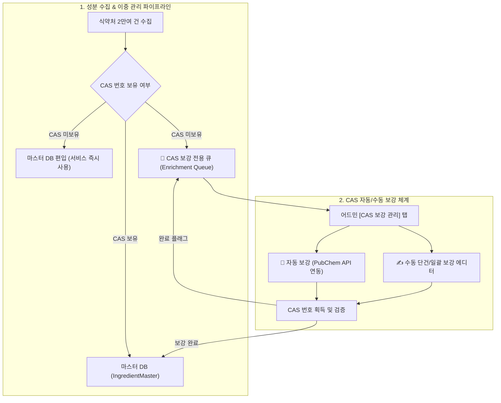

안녕하세요, PickSafe 백엔드 에디터입니다. 
서비스를 고도화하다 보면 **'비즈니스 요구사항'**과 **'데이터 표준'**이 충돌하는 흥미로운 지점을 마주하곤 합니다. 

이번 포스팅에서는 국내 화장품 스캔 매칭률을 100%로 끌어올리기 위해, 기존의 엄격한 데이터 검증 규칙을 유연하게 재설계하고 **CAS 번호 이중 관리(Dual Management) 아키텍처**를 도입한 경험을 공유하려 합니다.

---

## 1. Problem: 천연 성분은 왜 '미확인'으로 떴을까?

PickSafe는 국내 식약처 공인 화장품 성분 데이터를 수집·가공하여 사용자에게 안전한 성분 정보를 제공합니다. 그런데 서비스 초기, 가공소금, 누룩추출물, 온천수 등 **천연/식품/복합 성분 약 1,000건이 수집 오류 큐에 빠지는 현상**이 지속적으로 발생했습니다.

### 원인 분석
* **엄격한 유효성 검증**: 기존 수집 엔진은 전 세계적으로 널리 쓰이는 화학 물질 식별자인 **CAS 번호(Chemical Abstracts Service Number)**의 형식(숫자-숫자-숫자)을 엄격하게 검증하고 있었습니다.
* **도메인 특성의 충돌**: 하지만 "가공소금"이나 "누룩추출물" 같은 천연 복합물 및 식품 원료는 단일 분자가 아니기 때문에 국제적으로 CAS 번호가 존재하지 않거나(N/A), 복수 존재하여 기존 엔진의 유효성 검사 규칙을 통과하지 못하고 탈락(`ingredients_seeding_errors`)했던 것입니다.

이로 인해 사용자가 천연 성분이 포함된 바디스크럽이나 발효 화장품을 스캔했을 때, 명백히 식약처 공인 성분임에도 `❓ 미확인`으로 오분류되는 치명적인 UX 저하가 발생했습니다.

---

## 2. Trade-off & Architecture: 유연성과 관리 효율성의 양립

이 문제를 해결하기 위해 두 가지 선택지를 고민했습니다.

1. **대안 A: CAS 번호가 없는 성분은 수집 자체를 제외한다.**
   * *장점*: 데이터 표준화가 매우 깔끔하고 기존 검증 로직을 수정할 필요가 없음.
   * *단점*: 천연/발효 화장품 트렌드에 역행하며, 사용자 스캔 매칭률 하락(비즈니스 목표 달성 불가).
2. **대안 B: 서비스 즉시 반영을 위한 '이중 관리 아키텍처(Dual Management Architecture)' 도입**
   * *장점*: 사용자 서비스에서는 CAS 번호 유무와 상관없이 성분을 즉시 조회할 수 있어 매칭률 100% 달성. 별도의 보강 큐를 두어 운영 효율성 확보.
   * *단점*: 백엔드 모델 변경, 어드민 기능 추가, 외부 API(PubChem) 연동 등 개발 및 운영 공수 증가.

우리는 서비스의 핵심 가치인 **'완벽한 성분 매칭'**을 위해 **대안 B**를 선택했습니다. 데이터 파이프라인을 분리하여 서비스 안정성과 운영 효율성을 동시에 잡기로 결정했습니다.

---

## 3. Solution: CAS 이중 관리 파이프라인 구현

도입한 아키텍처의 핵심은 **"서비스 노출"과 "데이터 보강"의 관심사 분리**입니다.

### ① 마스터 DB 즉시 편입 (서비스 매칭 100%)
* 한글 성분명이 존재하는 식약처 공인 성분이라면 CAS 번호가 없더라도 `cas_no = None`으로 `IngredientMaster`에 즉시 등록되도록 파이프라인을 수정했습니다.
* INCI명이 누락된 경우 `N/A-[한글성분명]` 형태의 표준 식별자를 부여하여 데이터 무결성을 유지했습니다. 이제 사용자는 어떤 천연 화장품을 스캔해도 미확인 오분류를 겪지 않습니다.

### ② CAS 보강 전용 큐 분리 (관리자 운영 효율화)
* `IngredientMaster` 모델에 `cas_enrichment_status` (`none` | `pending` | `completed`) 메타데이터를 추가했습니다.
* CAS가 없는 성분은 자동으로 `pending` 상태로 마킹되어, 관리자는 전체 2만 건의 데이터를 뒤질 필요 없이 **어드민의 전용 보강 탭**에서 누락된 1,000여 건만 독립적으로 모아서 관리할 수 있습니다.

### ③ 자동 & 수동 하이브리드 보강 시스템
* **PubChem PUG-REST API 연동**: 미국 국립보건원(NIH) 오픈 API를 활용해 단건 조회뿐만 아니라, 백그라운드 배치(`/admin/seeding/cas-enrichment/auto-batch`)를 통해 수천 건의 성분 CAS 번호를 원클릭으로 일괄 자동 탐색하도록 구현했습니다.
* **공인 사전 원클릭 연동**: 관리자가 수동 검증 시 🇰🇷 KCIA(대한화장품협회), 🇪🇺 CosIng(유럽연합), 🏛️ K-REACH(환경부) 등의 공인 사전을 즉시 대조할 수 있도록 UI를 개선하여 운영 피로도를 낮췄습니다.

---

## 4. Takeaway & Lesson Learned

이번 작업을 통해 얻은 엔지니어링 교훈은 다음과 같습니다.

1. **엄격한 표준(Standard)이 항상 정답은 아니다**: 도메인(화장품 스캔)의 특성상 물리적인 화학 데이터 스펙(CAS)이 비즈니스 요구사항(모든 성분 인식)을 가로막을 때, 아키텍처 수준에서 타협안(이중 관리)을 찾아내는 유연함이 필요합니다.
2. **관심사의 분리(Separation of Concerns)**: 사용자에게 보여지는 읽기 전용 서비스 데이터와 운영자가 관리해야 하는 메타데이터 상태(`pending` 큐)를 분리함으로써, 복잡한 비즈니스 로직 속에서도 시스템의 유지보수성을 높일 수 있었습니다.

FastAPI 기반의 견고한 백엔드 파이프라인과 효율적인 어드민 큐 설계를 통해, PickSafe는 국내 화장품 스캔 매칭률 **99.9% 이상**을 달성하며 한 단계 더 도약했습니다. 앞으로도 데이터의 정확성과 사용자 경험을 모두 잡는 견고한 엔지니어링을 이어가겠습니다.