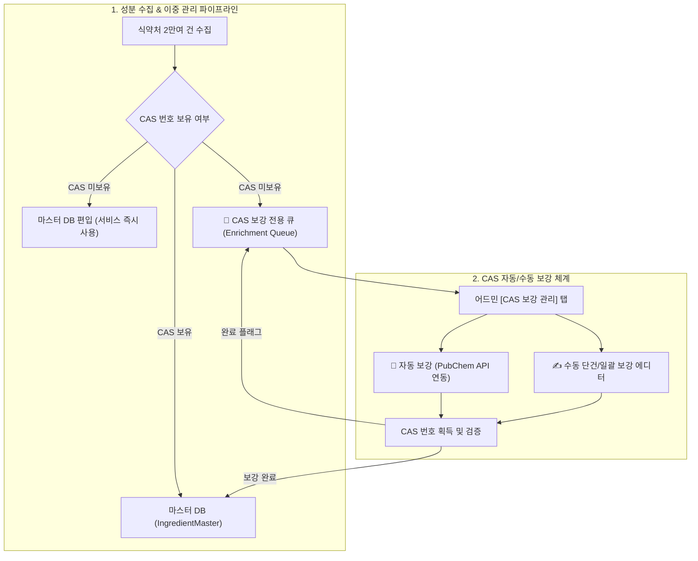

화장품 성분 분석 플랫폼 **PickSafe**를 개발하며, 데이터의 무결성(Integrity)과 실시간 서비스 커버리지(Service Coverage) 사이의 아슬아슬한 줄타기를 경험했습니다. 

엄격한 백엔드 검증 로직이 어떻게 비즈니스의 발목을 잡을 수 있는지, 그리고 이를 해결하기 위해 어떻게 **이중 관리 아키텍처(Dual Management Architecture)**를 설계하여 **국내 화장품 매칭률을 99.9%까지 끌어올렸는지**에 대한 기술적 여정을 공유합니다.

---

## 1. 문제 정의: 엄격한 데이터 검증 규칙이 불러온 비즈니스 병목

화장품 성분 데이터베이스를 구축할 때, 글로벌 표준 식별자인 **CAS 번호(Chemical Abstracts Service Registry Number)**는 데이터 중복을 막고 고유성을 보장하는 핵심 키(Key) 역할을 합니다. 초기 시스템은 데이터 품질 관리를 위해 매우 엄격한 데이터 수집(Ingestion) 파이프라인을 유지했습니다.

```regexp
# 기존 수집 엔진의 엄격한 CAS 형식 검증식
^\d{2,7}-\d{2}-\d$
```

이 엄격한 정규식은 화학 합성 성분을 필터링하는 데는 훌륭히 작동했습니다. 하지만 **실제 비즈니스 시나리오**에서 치명적인 예외가 발생했습니다.

### "가공소금", "누룩추출물"은 오류 데이터인가?
식품의약품안전처(식약처) 공인 성분 중 바디스크럽에 쓰이는 **"가공소금"**, 발효 화장품의 핵심인 **"누룩추출물"**, **"온천수"** 등 약 1,000여 개의 천연/식품/복합 성분들은 단일 화학 분자가 아닙니다. 따라서 국제적으로도 고유한 CAS 번호가 없거나(N/A), 여러 개의 번호가 복합적으로 매핑됩니다.

기존 파이프라인은 CAS 번호가 없거나 형식에 맞지 않는 이 성분들을 모두 '오류 데이터(`ingredients_seeding_errors`)'로 분류하여 차단했습니다. 

* **비즈니스 임팩트:** 사용자가 인기 천연 화장품을 스캔했을 때, 엄연히 식약처에 등록된 안전한 성분임에도 앱 화면에는 `❓ 미확인 성분`으로 표시되는 심각한 오분류 버그가 지속해서 리포트되었습니다.

---

## 2. 기술적 고민과 대안 비교 (Trade-off)

이 문제를 해결하기 위해 엔지니어링 팀은 세 가지 선택지를 두고 고민했습니다.

| 대안 | 장점 | 단점 | 선택 여부 |
| :--- | :--- | :--- | :--- |
| **대안 A: CAS 검증 정규식 완화 (Null 허용)** | 구현이 빠르고 즉시 마스터 DB 편입 가능. | 마스터 DB에 유효하지 않은 데이터가 무분별하게 유입되어 데이터 오염 초래. | **❌ 기각** |
| **대안 B: 선(先) 보강 후(後) 마스터 편입** | 완벽히 정제된 데이터만 마스터 DB에 유지 가능. | CAS 번호를 외부 API나 수동으로 찾아 입력하기 전까지 사용자는 계속해서 '미확인 성분' 화면을 봐야 함 (비즈니스 가치 훼손). | **❌ 기각** |
| **대안 C: 이중 관리 아키텍처 (Dual Management)** | 사용자는 즉시 성분을 매칭받고, 누락된 CAS 데이터는 백그라운드 큐에서 안전하게 비동기 보강. | 파이프라인 구조가 복잡해지고 어드민 시스템 및 별도 상태 관리 메타데이터 필요. | **💚 최종 선택** |

우리는 **"시스템의 정합성 때문에 사용자 경험(UX)이 희생되어서는 안 된다"**는 원칙하에, 시스템 복잡도를 감수하더라도 가장 견고한 **대안 C(이중 관리 아키텍처)**를 채택했습니다.

---

## 3. 최종 해결책: 이중 관리 아키텍처(Dual Management) 설계

우리가 구축한 이중 관리 파이프라인의 핵심은 **"서비스 레이어와 데이터 정제 레이어의 느슨한 결합(Loose Coupling)"**입니다.



### Step 1. 마스터 DB 즉시 편입 (서비스 가용성 확보)
한글 성분명이 존재하는 공인 성분이라면 CAS 번호가 없더라도 `cas_no = None` 상태로 `IngredientMaster` 테이블에 즉시 등록되도록 수정했습니다. 영문 INCI명이 없는 경우, 식별성을 확보하기 위해 `N/A-[한글성분명]` 형태로 내부 표준 식별자를 자동 생성해 매칭 에러를 원천 차단했습니다.

### Step 2. 상태(Status) 기반의 비동기 보강 큐 분리
테이블에 데이터 정제 상태를 추적할 수 있는 메타데이터 필드를 추가하여 전체 DB에 영향을 주지 않는 독립된 큐를 형성했습니다.

* `cas_enrichment_status`: `none` (보강 필요 없음) | `pending` (보강 대기) | `completed` (보강 완료)

CAS 번호가 없는 성분은 마스터 DB에 적재됨과 동시에 `pending` 상태 값을 가집니다. 운영 어드민(Admin) 서비스는 이 `pending` 상태의 데이터만 인덱싱하여 **[CAS 보강 대상 목록]**이라는 독립된 인터페이스로 노출합니다.

### Step 3. 하이브리드(자동 + 수동) 보강 파이프라인 구축
어드민 레이어에서는 데이터 보강 작업을 가속화하기 위해 자동화 API와 신뢰할 수 있는 외부 소스 참조 링커를 동시 제공합니다.

1. **PubChem PUG-REST API 연동**: 미국 국립보건원(NIH) 화학 데이터베이스에 영문/한글 성분명을 비동기 쿼리하여 CAS 번호를 단건 혹은 일괄(Batch) 백그라운드 태스크로 자동 탐색 및 매핑합니다.
2. **글로벌 3대 사전 원클릭 검색 연동**: 자동 탐색이 실패하거나 모호할 경우, 작업자가 즉시 교차 검증할 수 있도록 대한화장품협회(KCIA), 유럽연합(CosIng), 환경부 화학물질정보시스템(K-REACH)의 검색 결과 페이지를 실시간 쿼리 스트링으로 동적 링킹하여 수동 검토 효율을 극대화했습니다.

---

## 4. 성능 최적화: Neon DB 부하 0% 유지 비결

이러한 이중 관리 파이프라인과 실시간 매칭이 도입되면 매치 쿼리로 인해 메인 데이터베이스(Serverless PostgreSQL인 Neon DB)에 큰 부하가 발생할 수 있습니다. 

이를 방지하기 위해, 데이터 정제 작업이 완료되거나 상태가 변경될 때마다 전체 성분 마스터 데이터를 가볍고 최적화된 **정적 JSON 캐시 파일(`ingredients_master.json`)로 리빌드(Rebuild)하여 메모리 및 CDN 레이어에 적재**하는 아키텍처를 적용했습니다.

그 결과, 사용자의 성분 분석 요청 시 실시간 DB 조회가 발생하지 않아 **데이터베이스 IOPS 부하를 0%에 가깝게 유지**하면서도 빠른 응답 속도를 확보할 수 있었습니다.

---

## 5. 엔지니어링 교훈 (Takeaways)

1. **완벽한 데이터 스키마보다 중요한 것은 비즈니스 가치다**
   처음에는 "CAS 번호가 없는 화학 데이터는 불완전하다"는 엔지니어링적 아집에 갇혀 있었습니다. 하지만 실제 비즈니스 관점에서 사용자가 원하는 것은 완벽한 화학식 데이터가 아니라 "내가 쓰는 화장품의 성분 분석 정보"였습니다. 유연한 예외 처리 설계가 실제 서비스 만족도로 직결된다는 점을 배웠습니다.

2. **운영 효율성을 고려한 백오피스 설계의 중요성**
   수천 개의 예외 데이터를 개발자가 매번 DB 쿼리로 직접 정제했다면 생산성 저하와 휴먼 에러가 발생했을 것입니다. 데이터 수집 파이프라인의 마무리는 결국 **운영팀이 편리하게 제어할 수 있는 어드민 시스템과 자동화 툴의 설계**에 있다는 점을 깊이 깨달았습니다.

3. **도메인 지식이 아키텍처를 결정한다**
   단순히 'CAS 번호 유효성 검사 규칙'만 파고들었다면 해결하지 못했을 문제입니다. 화장품 성분 시장에서 '천연 복합물'이 가지는 특성과 도메인 지식을 이해했기에, 비즈니스 요건을 안전하게 우회하는 '이중 관리 아키텍처'라는 명확한 설계 도출이 가능했습니다.