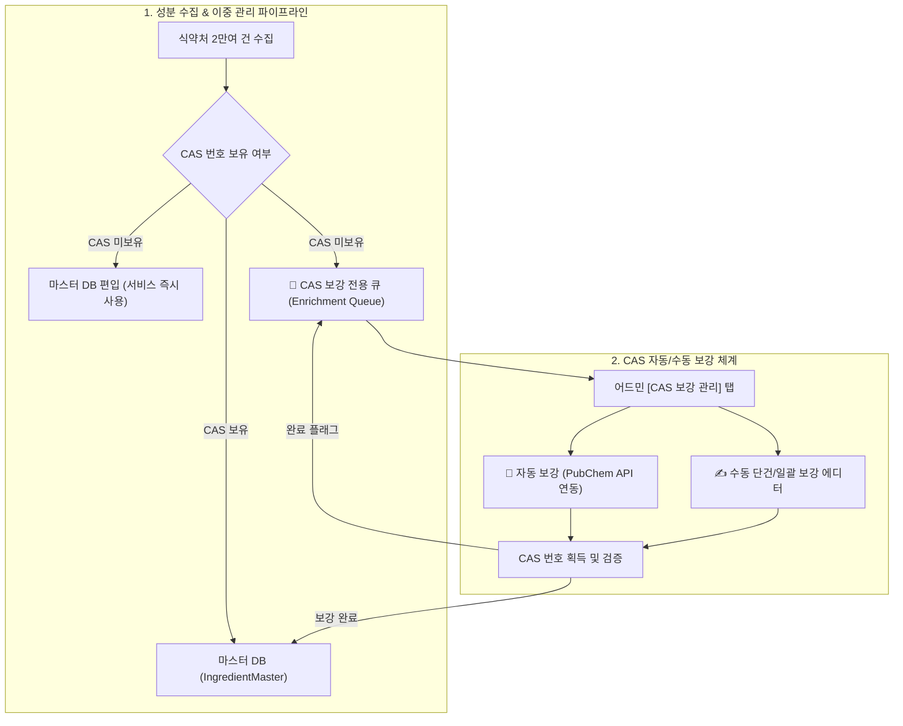

안녕하세요, PickSafe 백엔드 에디터입니다. 
서비스를 운영하면서 가장 마주하기 싫지만 피할 수 없는 순간 중 하나는 **"데이터 정합성과 사용자 경험(UX)이 충돌할 때"**입니다. 

최근 PickSafe 팀은 국내 식약처 공인 화장품 성분 데이터를 연동하는 과정에서, 천연 성분들이 대거 스캔 누락되는 병목 현상을 마주했습니다. 이번 글에서는 엄격한 화학적 유효성 검증 규칙이 불러온 의외의 부작용을 해결하기 위해, **CAS 번호 이중 관리(Dual Management) 아키텍처**를 도입하고 비즈니스 지표를 개선한 과정을 공유해 드립니다.

---

## 1. Problem: "가공소금"과 "누룩추출물"은 왜 미확인 성분이 되었을까?

국내 화장품 성분 데이터베이스를 구축하기 위해 식약처 공인 성분 약 2만 건을 마스터 DB에 적재하는 파이프라인을 운영하고 있었습니다. 그런데 수집 과정에서 약 1,000건의 데이터가 지속적으로 오류 검토 큐(`ingredients_seeding_errors`)로 빠지는 현상이 발견되었습니다.

### 원인 분석
기존 수집 엔진은 데이터의 무결성을 보장하기 위해 화학 성분의 **CAS 번호(Chemical Abstracts Service Registry Number)** 유효성 검증(예: `숫자-숫자-숫자` 포맷)을 엄격하게 적용하고 있었습니다. 

하지만 문제는 **천연 복합물 및 식품 원료**에 있었습니다. 
- "가공소금", "누룩추출물", "온천수" 같은 천연/발효/복합 성분은 단일 화학 분자가 아니기 때문에 국제적으로 CAS 번호가 없거나(N/A), 복수 존재합니다.
- 기존 시스템은 CAS 번호가 없다는 이유만으로 이 성분들을 **'잘못된 데이터'로 간주하여 수집을 거부**했습니다.

### 비즈니스적 임팩트
이로 인해 사용자가 바디스크럽(가공소금 함유)이나 발효 화장품(누룩/효모추출물 함유)을 스캔했을 때, 분명 시중에 유통되는 안전한 성분임에도 앱에서는 `❓ 미확인`으로 오분류되는 치명적인 UX 저하가 발생했습니다. 개발팀의 엄격한 데이터 정합성 기준이 실제 사용자 서비스의 가치를 깎아먹고 있었던 것입니다.

---

## 2. Trade-off & Architecture: 데이터 무결성과 사용자 경험의 타협점

이 문제를 해결하기 위해 두 가지 대안을 놓고 고민했습니다.

* **대안 A: 엄격한 유효성 검증 유지 (CAS가 없는 성분은 수집 제외)**
  * *장점*: 마스터 DB의 데이터 스키마가 매우 깨끗하게 유지됨.
  * *단점*: 천연/발효 화장품 스캔 매칭률 개선 불가. 사용자 불만 지속 발생.
* **대안 B: 서비스 즉시 반영 + 운영 큐 분리 (이중 관리 아키텍처)**
  * *장점*: 천연 성분도 즉시 서비스에 노출하여 매칭률 100% 달성. 미보유 CAS는 별도 큐에서 백그라운드 관리.
  * *단점*: 관리자(Admin) 사이드에서 처리해야 할 운영 오버헤드(메타데이터 관리 및 보강 작업)가 늘어남.

우리는 **사용자 경험(UX) 극대화**를 최우선 가치로 두어 **[대안 B: CAS 번호 이중 관리(Dual Management) 아키텍처]**를 전격 채택했습니다.

---

## 3. Implementation: 어떻게 구현했는가?

### ① 마스터 DB 즉시 편입 및 상태값 추가
한글 성분명이 존재하는 식약처 공인 성분은 CAS 번호가 없더라도 `cas_no = None`으로 `IngredientMaster`에 즉시 등록하도록 파이프라인을 수정했습니다. INCI명이 비어있는 경우 `N/A-[한글성분명]`으로 표준 식별자를 부여하여 보존했습니다.

또한, 레코드별 CAS 보강 상태를 추적하기 위해 `cas_enrichment_status` (`'none'` | `'pending'` | `'completed'`) 메타데이터 필드와 인덱스를 DB(DEV/PROD)에 추가했습니다.

### ② CAS 보강 전용 큐 및 자동화 파이프라인 구축
관리자가 2만 건 전체를 일일이 확인할 수 없으므로, 어드민 내에 **`[📌 CAS 보강 대상 목록]` 전용 탭**을 신설하여 `pending` 상태인 성분만 독립적으로 모아볼 수 있게 했습니다.

여기에 개발 공수를 줄이기 위해 두 가지 자동화 장치를 결합했습니다.
* **PubChem PUG-REST 오픈 API 연동**: 미국 국립보건원(NIH) 오픈 API를 활용해 영문/한글 성분명으로 화학 CAS 번호를 단건 혹은 백그라운드 배치로 **일괄 자동 탐색**하는 기능을 구현했습니다.
* **3대 공인 사전 원클릭 링크 연동**: 관리자가 수동 검증 시 🇰🇷 KCIA(대한화장품협회), 🇪🇺 CosIng(유럽연합), 🏛️ K-REACH(환경부) 사전을 새 창으로 바로 띄워 교차 검증할 수 있도록 UI를 개선했습니다.

### ③ 성능 최적화 (캐시 리빌드)
DB 쿼리 부하를 0%로 유지하기 위해, 성분 마스터 변경 사항이 반영될 때마다 정적 JSON 캐시(`ingredients_master.json`)를 리빌드하도록 설계하여 대규모 트래픽 상황에서도 응답 속도를 방어했습니다.

---

## 4. Takeaway: 엔지니어링 교훈

이번 작업을 통해 얻은 교훈은 명확합니다.

1. **완벽한 데이터보다 실용적인 비즈니스 가치가 우선이다**: 엄격한 정합성(CAS 유효성)에 집착해 정상적인 천연 성분 데이터를 버리는 것은 개발자적 오만일 수 있습니다. '일단 서비스에 노출하고, 누락된 메타데이터는 백그라운드 시스템으로 보완한다'는 이중 관리 전략이 비즈니스 성장에 훨씬 유연한 구조를 만들어 줍니다.
2. **운영 자동화(Automation) 없는 예외 처리는 기술 부채가 된다**: CAS 번호가 없는 1,000여 건의 데이터를 단순히 에러 큐에 방치했다면 운영팀의 수작업 지옥이 되었을 것입니다. PubChem API 연동과 원클릭 공인 사전 조회를 통해 '운영 오버헤드'를 최소화한 것이 이번 프로젝트의 숨은 성공 요인입니다.

앞으로도 PickSafe는 철저한 아키텍처 설계와 유연한 문제 해결을 통해, 사용자에게는 가장 정확하고 신뢰도 높은 스캔 경험을 제공할 예정입니다. 읽어주셔서 감사합니다!