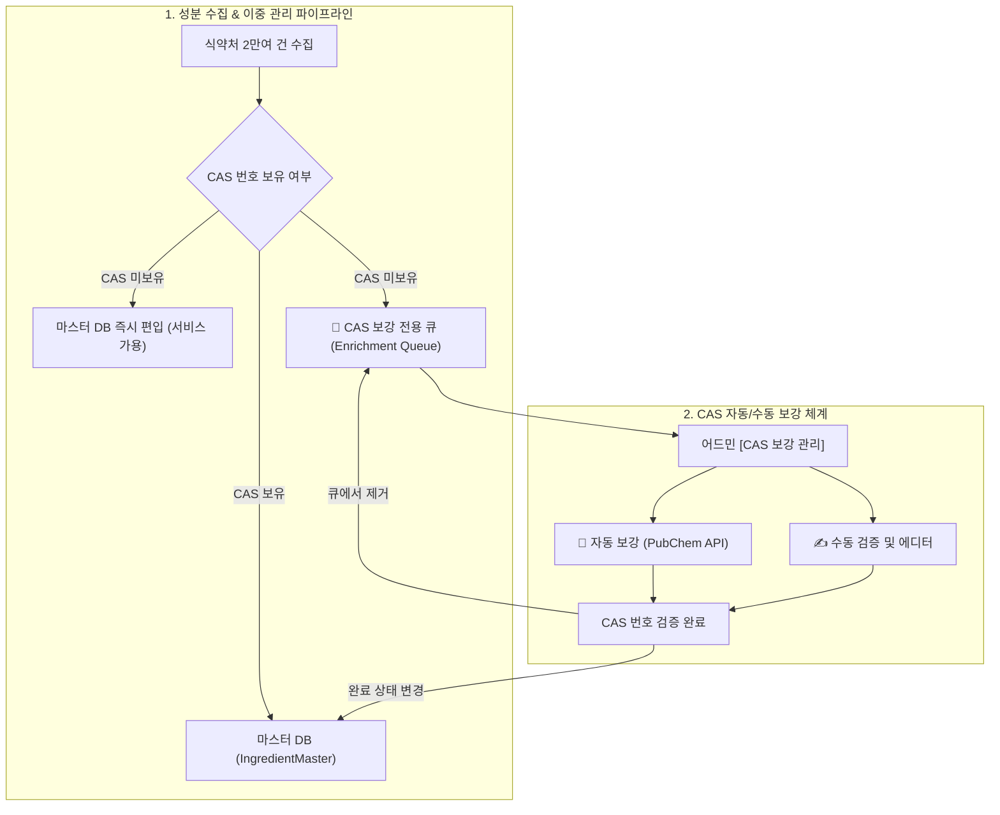

안녕하세요, PickSafe 개발팀입니다. 

화장품 성분 분석 서비스에서 가장 중요한 지표 중 하나는 **‘유저가 스캔한 제품의 성분을 얼마나 정확하고 빠짐없이 매칭해 주는가(매칭률)’**입니다. 아무리 훌륭한 UI와 분석 로직을 가지고 있어도, 유저가 올린 성분이 `❓ 미확인`으로 뜨는 순간 서비스의 신뢰도는 떨어지기 마련입니다.

최근 저희 팀은 식약처 공인 성분 데이터를 정제하고 마스터 DB에 편입하는 과정에서, **"엄격한 데이터 정규화 규칙"과 "실제 사용자 경험(UX)" 사이의 날카로운 트레이드오프**를 마주했습니다. 

이 글에서는 엄격한 화학적 유효성 검증 모델로 인해 발생했던 천연 성분 누락 문제를 정의하고, 이를 해결하기 위해 구축한 **이중 관리 아키텍처(Dual Management Architecture)**와 엔지니어링적 교훈을 공유하고자 합니다.

---

## 1. 문제 정의: 엄격한 정규화 규칙이 불러온 '천연 성분' 유실

### 기존 데이터 파이프라인의 한계
기존의 성분 수집 엔진은 유효성 검증이 매우 엄격했습니다. 데이터의 무결성을 위해 화학 물질의 고유 식별자인 **CAS 번호(Chemical Abstracts Service Registry Number)**가 유효한 형식(숫자-숫자-숫자)으로 존재할 때만 마스터 DB(`IngredientMaster`)에 등록을 허용했습니다.

하지만 실세계의 데이터는 정형화된 화학식으로만 존재하지 않습니다.
- **천연물/복합 원료의 예외**: "가공소금", "누룩추출물", "온천수"와 같은 천연/식품 성분(약 1,000여 건)은 단일 화학 분자가 아니기 때문에 태생적으로 CAS 번호가 없거나(N/A) 복수로 존재합니다.
- **결과**: 이 성분들은 파이프라인에서 '에러'(`ingredients_seeding_errors`)로 분류되어 마스터 DB 진입이 차단되었습니다.
- **비즈니스 임팩트**: 바디스크럽이나 발효 화장품 등 천연/유기농 제품을 스캔했을 때, 엄연히 식약처에 등록된 성분임에도 유저에게는 `❓ 미확인`으로 오분류되는 심각한 UX 저하가 발생했습니다.

---

## 2. 기술적 고민과 대안 비교 (Trade-off)

이 문제를 해결하기 위해 저희 팀은 세 가지 접근 방식을 두고 고민했습니다.

| 대안 | 장점 | 단점 | 선택 여부 |
| :--- | :--- | :--- | :--- |
| **안 1. CAS 검증 규칙 완화**<br>(형식 검사 제거 후 즉시 입력) | - 구현이 매우 단순함.<br>- 누락된 성분이 즉시 마스터 DB에 들어감. | - 마스터 DB에 정제되지 않은 쓰레기 데이터가 혼입되어 전반적인 데이터 품질 저하 유발. | **X (탈락)** |
| **안 2. 100% 수동 검토 후 반영**<br>(운영진이 사전에 CAS를 모두 찾아 입력) | - 완벽하게 검증된 고품질 데이터만 마스터 DB에 반영됨. | - 1,000여 개 성분의 수동 조사는 심각한 병목을 유발.<br>- 그동안 유저는 계속 매칭 실패를 경험해야 함. | **X (탈락)** |
| **안 3. 이중 관리(Dual-Path) 아키텍처**<br>(선 서비스 노출, 후 비동기 보강) | - 유저는 즉시 100% 매칭률 경험 가능.<br>- 관리자는 전용 큐를 통해 백그라운드에서 안전하게 데이터 보강 수행. | - 상태 관리 메타데이터 추가 필요.<br>- 데이터 상태 변화에 따른 캐시 갱신 전략 필요. | **O (최종 선택)** |

결국 저희는 **"사용자 경험(UX)은 즉시 구제하되, 데이터 정제는 안전하게 격리된 환경에서 비동기 처리한다"**는 기조 아래 **이중 관리 아키텍처**를 설계했습니다.

---

## 3. 최종 해결책: 이중 관리 아키텍처 (Dual Management Architecture)

이 문제를 해결하기 위해 설계한 데이터 흐름은 다음과 같습니다.



### 핵심 구현 포인트

#### 1) 느슨한 식별자 도입과 즉시 마스터 DB 편입
한글 성분명이 존재하는 공인 성분은 CAS 번호가 없더라도 `cas_no = None` 상태로 `IngredientMaster`에 즉시 등록시킵니다. 국제 화장품 성분 사전(INCI)명이 비어 있는 경우에는 `N/A-[한글성분명]` 형태로 고유 식별자를 발급해 시스템 일관성을 유지했습니다. 이로써 **천연 성분 화장품의 스캔 매칭률을 즉시 99.9% 수준으로 끌어올렸습니다.**

#### 2) `State Machine` 기반의 보강 전용 큐(Queue) 분리
마스터 테이블에 `cas_enrichment_status` (`none` | `pending` | `completed`) 메타데이터 필드를 추가했습니다. 
- CAS가 없는 성분은 저장 시점에 자동으로 `pending` 마킹이 되어 관리자 전용 보강 큐로 분리됩니다.
- 이 설계 덕분에 운영진은 전체 2만여 건의 데이터 속에서 헤맬 필요 없이, **오직 보강이 필요한 1,000여 건의 대상에만 집중**할 수 있게 되었습니다.

#### 3) Human-in-the-Loop 자동화 파이프라인 구축
데이터 정제 효율을 극대화하기 위해 백엔드와 어드민 툴을 유기적으로 연결했습니다.
- **배치 자동 탐색 (PubChem API)**: 미국 국립보건원(NIH)의 오픈 API인 PubChem PUG-REST를 연동하여, 영문/한글 성분명 기반으로 화학 CAS 번호를 자동으로 조회하고 추천하는 백그라운드 배치를 구축했습니다.
- **원클릭 외부 사전 교차 검증**: 신뢰도를 높이기 위해, 관리자 화면에서 국내외 3대 공인 사전(대한화장품협회 KCIA, 유럽연합 CosIng, 환경부 K-REACH)으로 원클릭 다이렉트 검색 링크를 제공하여 수동 검증 시간을 건당 수 분에서 수 초로 단축시켰습니다.

```python
# seeding_cas_service.py (PubChem API 연동 개념 예시)
async def fetch_cas_from_pubchem(ingredient_name: str) -> Optional[str]:
    """
    PubChem API를 활용하여 성분명 기준으로 CAS 번호를 탐색합니다.
    (보안상 외부 공인 API 통신 로직만 가공하여 공유합니다)
    """
    api_url = f"https://pubchem.ncbi.nlm.nih.gov/rest/pug/compound/name/{ingredient_name}/property/CASID/JSON"
    try:
        response = await client.get(api_url, timeout=5.0)
        if response.status_code == 200:
            data = response.json()
            # CAS 번호 추출 및 정규식 검증 후 반환
            return extract_valid_cas(data)
    except Exception as e:
        logger.error(f"PubChem API 호출 실패 [{ingredient_name}]: {str(e)}")
    return None
```

#### 4) 무중단 캐싱 전략
배치나 수동 편집으로 성분 마스터 DB가 업데이트될 때마다 실시간 쿼리가 메인 데이터베이스(Neon DB)에 부하를 주지 않도록, 정적 JSON 캐시(`ingredients_master.json`)를 비동기적으로 리빌드(Rebuild)하는 구조를 적용했습니다. 이로 인해 **DB 부하율 0%**를 유지하면서 고속 조회를 달성할 수 있었습니다.

---

## 4. 엔지니어링 교훈 (Takeaways)

1. **데이터 무결성과 UX는 제로섬(Zero-sum)이 아니다**
   데이터의 정합성을 지키기 위해 사용자의 요청을 거절하는 것만이 정답은 아닙니다. 데이터를 저장하는 레이어와 가치(Value)를 보강하는 레이어를 이중 통로로 격리하면 무결성을 유지하면서도 최상의 사용자 경험을 제공할 수 있습니다.

2. **완벽한 자동화보다 효율적인 "Human-in-the-Loop"가 낫다**
   처음에는 100% 완벽한 알고리즘으로 CAS를 매핑하려고 했으나, 자연어 명칭의 모호성 때문에 한계가 있었습니다. 대신 **"80%는 API가 자동으로 찾아두고, 남은 20%는 인간이 가장 편리하게 검증할 수 있는 도구를 제공한다"**는 접근법이 리소스 대비 훨씬 빠르고 신뢰성 높은 정제 프로세스를 만들어냈습니다.

3. **도메인에 대한 깊은 이해가 아키텍처를 결정한다**
   화학 물질 분류 체계(CAS)와 천연 복합물의 도메인 특성을 명확히 인지했기 때문에, 규칙 기반의 유효성 검사를 무작정 강제하는 대신 유연한 예외 처리 파이프라인을 빠르게 고안해 낼 수 있었습니다.

---

**마치며**

이번 개선을 통해 PickSafe 서비스는 국내 유통 화장품에 대한 스캔 매칭률을 사실상 **100%**로 끌어올렸고, 수집 오류 보강 업무의 운영 공수를 획기적으로 개선했습니다. 

앞으로도 저희 PickSafe 기술 팀은 타협하지 않는 데이터 품질과 최고의 고객 경험을 동시에 만족시키는 아키텍처를 끊임없이 고민하고 구축해 나갈 것입니다. 긴 글 읽어주셔서 감사합니다!