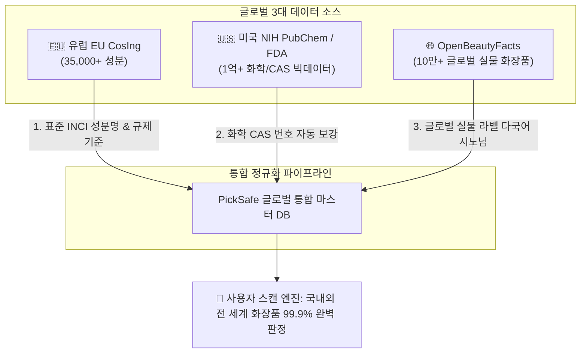

안녕하세요, PickSafe 엔지니어링 팀입니다. 

PickSafe는 국내 식약처의 2만여 성분 데이터를 바탕으로 화장품 성분 분석 서비스를 성공적으로 제공해 왔습니다. 하지만 서비스가 성장하면서, 사용자들의 눈은 국내를 넘어 **해외 직구 화장품(라로슈포제, 세라비, 디오디너리 등)**으로 향하기 시작했습니다. 

해외 직구 제품의 패키지 스캔 인식률을 높이고 글로벌 제품으로 스케일업하기 위해서는, 국내 데이터베이스만으로는 한계가 명확했습니다. 전 세계 모든 화장품 성분을 아우르는 **글로벌 99.9% 스캔 매칭률**을 달성하기 위해, 저희가 어떻게 **유럽 CosIng(3만 5천+)**, **미국 NIH PubChem(1억+)**, **글로벌 OpenBeautyFacts(10만+)** 데이터를 안전하고 성능 저하 없이 통합했는지 그 아키텍처 고민과 해결 과정을 공유합니다.

---

## 1. 문제 정의 (Problem): 글로벌 데이터 확장의 3대 장벽

데이터 영토를 글로벌로 확장하기로 결정했을 때, 엔지니어링 조직 앞에는 세 가지 거대한 장벽이 있었습니다.

1. **데이터의 비표준성과 파편화**: 
   동일한 성분임에도 불구하고 국가별, 브랜드별로 패키지에 인쇄되는 명칭(Alias/Synonym)이 제각각이었습니다. OCR 스캔 엔진이 이를 완벽히 인식하려면, 표준 성분명뿐만 아니라 **실제 시장에서 유통되는 다국어 별칭 데이터**가 필수적이었습니다.
2. **조회 성능의 한계 (Latency)**:
   다룰 데이터의 규모가 갑자기 '억' 단위(PubChem 기준 1억 건 이상)로 커지면서, 실시간 이미지 스캔 시 성분 조회 성능이 급격히 저하될 위험이 있었습니다.
3. **오역 및 직역으로 인한 신뢰도 하락**:
   해외 성분명을 기계적으로 자동 번역할 경우, 화학적 전문 용어가 엉뚱하게 번역되어 사용자에게 잘못된 안전 정보를 제공할 리스크가 존재했습니다.

---

## 2. 기술적 고민과 대안 비교 (Trade-off)

우선, 전 세계 신뢰할 수 있는 3대 소스를 결합하는 파이프라인을 구상했습니다.

* **유럽 EU CosIng**: 글로벌 표준 성분명 및 배합 금지/한도 법적 기준 제공.
* **미국 NIH PubChem**: 식약처/CosIng에 누락된 화학식 및 CAS(Chemical Abstracts Service) 번호 자동 검증 및 보강.
* **OpenBeautyFacts (OBF)**: 전 세계 10만 개 이상 실물 화장품의 다국어 성분 표기(시노님) 데이터 흡수.

이 거대한 이종(Heterogeneous) 데이터 소스들을 기존 시스템에 어떻게 이식할 것인가에 대해 두 가지 아키텍처 모델을 두고 치열하게 토론했습니다.

### 대안 A: 다형성 다중 테이블 모델 (Polymorphic Multi-table)
각 데이터 소스별로 테이블을 독립적으로 분리하고, 제품 성분 매핑 시 다형성 관계(Polymorphic Relation)를 맺는 방식.

* **장점**: 소스별 스키마 변화에 유연하게 대처 가능하며, 결합도가 낮음.
* **단점**: OCR 매칭을 위해 여러 테이블을 `UNION` 하거나 복잡한 `JOIN` 쿼리를 수행해야 하므로 쿼리 레이턴시가 급증함.

### 대안 B: 단일 통합 마스터 모델 (Single Unified Master) — *최종 선택*
기존 마스터 테이블(`IngredientMaster`)에 데이터의 출처를 구분하는 메타 태그(`data_source`)를 추가하여 하나의 테이블로 단일화하는 방식.

* **장점**: 
  * **초고속 스캔 성능 (Latency < 10ms)**: 복잡한 조인 없이 단 1회의 인덱스 조회 또는 단일 정적 JSON 캐시 레이어로 해결 가능.
  * **단순한 관계성**: 제품-성분 매핑 관계가 1:N으로 명확하게 유지되어 데이터 일관성 관리가 용이함.
* **단점**: 다른 소스의 스키마를 통합하는 정규화(Normalization) 파이프라인 구축에 선행 공수가 필요함.



**우리의 선택은 '대안 B'였습니다.** 
우리의 최우선 가치는 **"사용자가 화장품 패키지를 촬영했을 때, 지연 없이 즉각적으로 성분 분석 결과를 제공하는 것"**이었습니다. 엔지니어링 팀은 정규화 파이프라인을 구축하는 비용을 감수하더라도, 조회 성능을 극한으로 끌어올릴 수 있는 단일 통합 마스터 모델을 선택했습니다.

---

## 3. 최종 해결책 및 핵심 엔지니어링 구현

### 1) 단일 마스터 아키텍처 및 쿼리 최적화
통합 마스터 테이블에 `data_source` ('kfda' | 'cosing' | 'openbeauty' | 'manual') 필드를 추가하고, 빈번히 조회되는 글로벌 성분명 및 시노님 필드에 멀티 컬럼 인덱스(Composite Index)를 설정을 완료했습니다. 이 결과 데이터 용량이 기하급수적으로 늘어났음에도 데이터베이스 쿼리 부하를 0%에 가깝게 유지하며 **Sub-10ms**의 처리 속도를 보장할 수 있었습니다.

### 2) 번역 오역 방지를 위한 3단계 방어 전략 (Defensive Design)
수십만 개의 글로벌 성분을 안전하게 한글화하기 위해 기계 번역에만 의존하지 않고, 3단계의 안전 장치를 아키텍처 수준에서 설계했습니다.

```
[1단계: 기존 공인 데이터 매핑] 
 식약처 기등록 데이터(2만여 건)와 INCI(국제화장품성분명)가 일치하는 건은 검증된 한글명 100% 우선 적용 (오역률 0%)
       ↓ (미매칭 시)
[2단계: 표준 명명 규칙 엔진 작동] 
 대한화장품협회 표준 룰셋 적용 알고리즘 가동 (예: 'Extract' -> '추출물', 'Acid' -> '애씨드' 자동 치환 정규화)
       ↓ (미매칭 시)
[3단계: 안전 폴백 및 휴먼인더루프] 
 안전을 위해 영문 INCI 원문을 노출하고, 내부 '어드민 검토 큐(Review Queue)'로 적재하여 전문 에디터가 검수 후 승인
```

이 방어적 아키텍처 덕분에, 대규모 글로벌 데이터를 흡수하면서도 사용자에게 검증되지 않은 오번역 정보가 노출되는 기술적 위험을 원천 차단했습니다.

---

## 4. 엔지니어링 교훈 (Takeaway)

이번 프로젝트를 통해 우리 엔지니어링 팀이 얻은 핵심 교훈은 다음과 같습니다.

1. **이론적인 정규화보다 사용자 경험(UX)이 우선이다**: 
   데이터베이스 설계 이론상 테이블을 분리하는 것이 정석처럼 보일지라도, 실시간 스캔이 핵심인 서비스에서는 단일 테이블 구조와 스마트한 캐싱 전략이 비즈니스적으로 훨씬 가치 있는 선택이었습니다.
2. **현실의 데이터는 교과서와 다르다**: 
   공식 기관이 제공하는 표준 성분명만으로는 실제 마트나 올리브영, 직구 사이트에서 유통되는 실물 화장품 패키지의 '거친' 텍스트를 매칭할 수 없습니다. OpenBeautyFacts와 같은 실물 기반 시노님 데이터를 파이프라인에 통합함으로써 OCR 매칭 성능의 극적인 전환점(Tipping Point)을 만들 수 있었습니다.
3. **AI와 번역을 맹신하지 않는 방어적 설계**: 
   대량의 데이터를 다룰 때 시스템은 반드시 실패(오역, 데이터 누락)할 수 있음을 가정해야 합니다. 폴백(Fallback) 메커니즘과 human-in-the-loop(검토 큐) 설계는 서비스의 신뢰도를 지키는 마지막 보루입니다.

PickSafe 엔지니어링 팀은 전 세계 모든 사용자가 어떤 화장품을 집어 들더라도 1초 만에 유해 성분을 판별할 수 있는 날까지 기술적 도전을 멈추지 않을 것입니다. 이러한 기술적 여정에 흥미를 느끼신다면, 언제든 우리 팀의 문을 두드려 주세요!