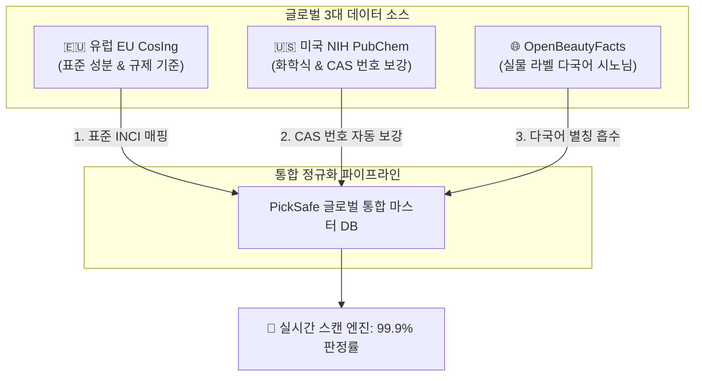

안녕하세요, PickSafe 팀의 백엔드 아키텍트입니다. 

PickSafe는 사용자들에게 안전한 화장품 성분 정보를 제공하는 서비스입니다. 최근 해외 직구 화장품의 급증과 글로벌 시장 진출 준비로 인해, 기존 국내 식약처(KFDA) 기준 2만여 개의 성분 데이터를 넘어 **전 세계의 모든 화장품을 커버할 수 있는 글로벌 스캔 매칭률 99.9%** 달성이라는 새로운 미션을 마주하게 되었습니다.

이를 위해 우리는 **🇪🇺 유럽 CosIng(35,000+ 종), 🇺🇸 미국 NIH PubChem(1억+ 화학 빅데이터), 🌐 글로벌 OpenBeautyFacts(10만+ 시판 화장품)**라는 거대한 3대 글로벌 데이터 소스를 하나로 통합하는 파이프라인을 구축했습니다. 

이 과정에서 우리 팀이 마주했던 기술적 페인 포인트(Pain Point)와 아키텍처적 의사결정, 그리고 실무에서 얻은 엔지니어링 교훈들을 공유하고자 합니다.

---

## 1. 우리가 해결해야 했던 문제 (Problem Definition)

단순히 외부 API나 공개된 CSV 데이터를 데이터베이스에 적재하는 것은 어렵지 않습니다. 하지만 **실시간 화장품 성분 분석 서비스**의 특성을 고려했을 때, 글로벌 확장은 다음과 같은 세 가지 큰 장애물을 동반했습니다.

### ① 극단적인 데이터 스케일 차이와 정규화 문제
* 국내 식약처 성분은 약 2만 건 수준이지만, 미국 NIH PubChem은 1억 건이 넘는 화학 물질 정보를 가지고 있습니다. 
* 서로 다른 세 개의 데이터 소스가 제공하는 스키마 구조, 데이터 포맷(CAS 번호 누락, 이명/별칭 등)이 완전히 제각각이었습니다. 이들을 어떻게 정밀하게 검증하고 연결할 것인가가 첫 번째 과제였습니다.

### ② OCR 인식률을 떨어뜨리는 '실물 라벨 표기(시노님)'의 다양성
* 글로벌 화장품 패키지에는 표준화된 성분명(INCI) 외에도 브랜드 고유의 영문/다국어 별칭(Alias)이나 오타 섞인 실물 라벨 표기가 혼재되어 있었습니다. 
* 이미지 스캔(OCR) 엔진이 이 다양한 표기법들을 단 하나의 표준 성분 데이터로 정확히 매핑하지 못하면 매칭률은 급감할 수밖에 없었습니다.

### ③ 자동 번역 엔진의 한계와 안전성 리스크 (오역/직역)
* 해외 최신 성분이나 복합 화학 성분을 AI나 단순 번역기만 돌릴 경우, 엉뚱한 한글명으로 오역되어 소비자에게 잘못된 성분 정보나 알레르기 유발 정보를 전달할 치명적인 위험이 있었습니다. 안전이 핵심 가치인 PickSafe에서 오역은 서비스 신뢰도와 직결되는 문제였습니다.

---

## 2. 기술적 고민과 대안 비교 (Trade-off)

가장 치열하게 논의되었던 부분은 **"이 거대한 다국적 데이터를 어떤 방식으로 모델링하고 저장할 것인가"**였습니다. 두 가지 아키텍처 대안을 두고 비교 검토를 진행했습니다.



### 대안 A: 다형성(Polymorphic) 다중 테이블 구조
* 각 데이터 소스(KFDA, CosIng, PubChem 등)별로 전용 테이블을 두고, 이들을 조인(Join)하거나 다형성 관계를 맺어 조회하는 방식.
* **장점**: 각 소스별 고유 스키마를 100% 보존할 수 있어 데이터 변경에 유연함.
* **단점**: 사용자가 성분을 스캔할 때마다 수많은 테이블을 조인하거나 유니온(Union)해야 하므로 DB 부하가 급증하고 레이턴시(Latency)가 악화됨.

### 대안 B: 단일 통합 마스터 구조 (`IngredientMaster` + 출처 태그) 
* 하나의 마스터 테이블에 모든 성분을 통합하되, `data_source` 필드('kfda' | 'cosing' | 'openbeauty' | 'manual')를 두어 인덱싱을 타게 만드는 방식.
* **장점**: 
  * 단 1회의 쿼리 또는 캐싱된 정적 인덱스 조회를 통해 **10ms 이내의 극단적인 실시간 스캔 성능** 달성 가능 (DB 부하 거의 0%).
  * 제품과 성분 간의 매핑 테이블(`ProductIngredient`)의 외래키 관계가 극도로 단순해져 비즈니스 로직 유지보수가 쉬움.
* **단점**: 다양한 데이터 소스의 공통 분모를 추출하여 하나의 스키마로 통합하는 정규화 파이프라인 설계 공수가 큼.

### 💡 최종 선택: 대안 B (단일 통합 마스터)
우리는 실시간 사용자 경험(OCR 분석 결과가 1초 내에 반환되어야 함)을 최우선으로 생각하여 **대안 B**를 선택했습니다. 데이터 적재(Write) 시점에 파이프라인이 조금 더 복잡해지더라도, 사용자 조회(Read) 시점의 복잡도와 레이턴시를 최소화하는 것이 '성공적인 서비스 디자인'에 부합한다고 판단했기 때문입니다.

---

## 3. 최종 구현 및 엔지니어링 해결책

이 결정을 바탕으로, 우리는 세 가지 핵심 전략을 통해 글로벌 데이터를 정제하고 파이프라인을 성공적으로 안착시켰습니다.

### ① 3대 데이터 소스의 시너지 파이프라인 구축
* **유럽 CosIng**: 글로벌 표준 성분명(INCI) 및 유럽 SCCS 기준 82종의 향료 알레르기/배합 한도 법적 기준을 파싱하여 시스템의 '법적/안전 기준 뼈대'를 세웠습니다.
* **미국 PubChem**: 식약처나 CosIng에 고유 화학 식별자(CAS 번호)가 누락된 경우, 공식 화학 식별 데이터를 백그라운드에서 자동으로 추적 및 매칭하여 누락된 CAS 번호를 보강했습니다.
* **OpenBeautyFacts (OBF)**: 전 세계 10만 개 이상 실물 화장품 라벨에 인쇄된 브랜드별 다국어 별칭(Alias) 데이터를 수집하여, OCR 스캔 시 '시노님(Synonym) 사전' 역할을 하도록 구축했습니다.

### ② 오역 방지를 위한 '3단계 안전 번역 프로토콜'
번역 오류로 인한 사용자 혼선을 원천 차단하기 위해 다음과 같은 단계별 검증 엔진을 도입했습니다.

```
[1단계: 공인 매핑] ➔ 식약처 공인 한글명(20,518건)이 존재할 경우 번역 없이 100% 우선 매핑
       ↓ (일치 데이터 없음)
[2단계: 규칙화 정규화] ➔ 대한화장품협회 표준 규칙셋 적용 (ex: "Extract"는 "추출물", "Oil"은 "오일")
       ↓ (복잡한 화학물)
[3단계: 안전 폴백] ➔ 영어 INCI 원문 노출 + 어드민 자동 검토 큐(Queue) 적재 후 수동 승인
```

이 안전망 덕분에 새로운 해외 특허 추출물이나 복잡한 합성 화합물이 등록되더라도 오역 리스크 없이 안전하고 빠르게 한글 매핑을 확장할 수 있게 되었습니다.

---

## 4. 엔지니어링 교훈 (Takeaways)

이번 글로벌 성분 데이터베이스 확장 프로젝트를 진행하며 배운 핵심 교훈은 다음과 같습니다.

1. **Read-Heavy 서비스에서는 Write 시점의 무거움을 감수하는 것이 옳다**
   * 사용자 화면에서 10ms 단위의 빠른 응답 속도를 내기 위해, 데이터 수집 파이프라인(Ingestion pipeline)에서 고도로 결합하고 정제하는 방식을 선택한 것은 탁월한 결정이었습니다. 이로 인해 데이터베이스 아키텍처가 극도로 단순해졌습니다.
2. **휴리스틱과 결정론적 규칙(Rule-set)은 AI보다 강할 때가 있다**
   * 모든 번역과 정규화를 거대 언어 모델(LLM)이나 기계 번역에 의존하기보다, 도메인 지식에 기반한 규칙셋(대한화장품협회 명명법 등)을 1차 필터로 둔 것이 리소스 비용을 아끼고 정합성을 100% 보장하는 지름길이었습니다.
3. **데이터의 단순 합산이 아닌 상호 보완적 아키텍처의 중요성**
   * 서로 다른 세 개의 대형 퍼블릭 데이터를 연결(Cosing의 규제 기준 + PubChem의 CAS 데이터 + OBF의 시노님 데이터)했을 때 발생하는 데이터 시너지는 단일 데이터 소스를 단순히 늘려나가는 것보다 훨씬 강력한 비즈니스 임팩트를 만든다는 점을 실감했습니다.

PickSafe 팀은 단순한 기술 스택의 적용을 넘어, 대규모 데이터를 제어하며 사용자에게 "가장 빠르고 정확하며 안전한 가치"를 전달하기 위해 치열하게 고민하고 있습니다. 글로벌 무대로 나아가는 저희 여정에 앞으로도 많은 관심 부탁드립니다!