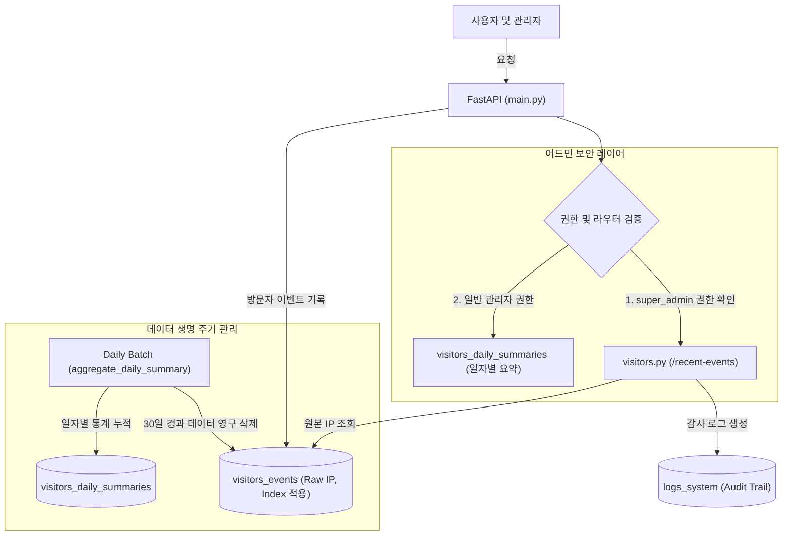

화장품 성분 분석 서비스 PickSafe를 개발하고 운영하면서, 사용자 경험 개선만큼이나 중요하게 다루어야 했던 영역은 **서비스 안정성 확보**와 **데이터 거버넌스**였습니다. 

초기 PickSafe의 방문자 분석 시스템은 개인정보 최소화 원칙에 따라 사용자의 원본 IP를 배제하고, GeoIP 라이브러리를 통해 변환된 도시(`city`)와 국가(`country`) 정보만을 수집했습니다. 하지만 서비스의 규모가 커지면서 다음과 같은 현실적인 운영상의 문제와 마주하게 되었습니다.

1. **비정상 어뷰징 트래픽 식별 불가**: 시크릿 모드를 사용하거나 쿠키를 차단한 환경에서 짧은 시간 동안 수만 번의 요청을 보내는 웹 스크래퍼나 DDoS성 공격이 발생했을 때, 동일 기기 여부를 판별할 고유 식별자가 없어 선제적 차단이 어려웠습니다.
2. **관리자 테스트 데이터 오염**: 개발 및 관리 목적으로 어드민 대시보드나 프론트엔드를 직접 테스트할 때 발생하는 접속 이력이 고스란히 통계에 반영되었습니다. 관리자 기기 제외 토글 기능을 구현하려 해도, 과거 접속 이력까지 소급하여 통계에서 실시간으로 제외할 수 있는 기준값(IP)이 없었습니다.

결국 보안 및 운영 안정성을 위해 원본 IP(`ip_address`)를 수집하기로 결정했습니다. 다만, 이는 개인정보보호법(PIPA) 및 GDPR 컴플라이언스 관점에서 민감한 이슈였기에, 수집과 동시에 이를 안전하게 격리하고 관리할 수 있는 **4대 안전장치**를 아키텍처 레벨에서 설계하고 도입했습니다. 그 고민과 해결 과정을 기록으로 남깁니다.

---

## ⚖️ 기술적 대안 비교 및 선택 이유

원본 IP를 수집하기 전, 개인정보 노출 위험을 최소화하기 위해 몇 가지 대안을 검토했습니다.

| 대안 | 장점 | 단점 | 선택 여부 |
| :--- | :--- | :--- | :--- |
| **1. 단방향 솔트 해싱 (SHA-256)** | 원본 IP를 직접 저장하지 않으므로 유출 시 안전함. | CIDR 대역폭 기준의 어뷰징 차단이 어렵고, 위협 인텔리전스 IP 데이터베이스와 대조가 불가능함. | 탈락 |
| **2. 외부 전문 분석 도구 (GA4 등) 의존** | 자체 서버에 IP를 저장하지 않아 법적 책임 분산 가능. | 세부적인 원본 로그 커스텀 조회가 어렵고, 관리자 IP의 실시간 동적 통계 제외 처리가 불가능함. | 탈락 |
| **3. 원본 IP 보관 + 4대 안전장치 구축** | 어뷰징 차단, 위협 분석, 관리자 필터링 등 모든 운영 요구사항 충족 가능. | 데이터 수명 주기 관리 및 접근 제어(RBAC), 감사 로그 시스템을 직접 정교하게 구현해야 함. | **최종 선택** |

단방향 해싱은 보안상 우수해 보였으나, 실제 디버깅이나 대역폭 차단(Subnet blocking) 등 운영 관점에서의 활용도가 현저히 떨어졌습니다. 결국 **"수집하되 기술적/제도적 안전장치를 통해 오용 가능성을 원천 차단한다"**는 방향으로 결론을 내렸습니다.

---

## 🏗️ 시스템 아키텍처 및 흐름

안전장치의 핵심은 **역할 기반 접근 제어(RBAC)**, **생명 주기 관리(TTL)**, 그리고 **감사 추적(Audit Trail)**의 유기적인 결합입니다. 전체적인 데이터 흐름과 제어 구조는 다음과 같이 설계했습니다.



### 설계한 4대 안전장치의 구체적 스펙

1. **최고 관리자(`super_admin`) 전용 제한**: 일반 마케터나 CS 담당자는 식별성이 제거된 통계 요약본만 볼 수 있으며, 원본 IP가 포함된 세부 로그는 오직 최고 관리자 권한을 가진 계정만 접근할 수 있도록 API 레벨에서 차단합니다.
2. **30일 자동 만료 (TTL)**: 원본 IP가 포함된 상세 이벤트 데이터는 정확히 30일 동안만 보관됩니다. 매일 자정 실행되는 배치 작업이 통계 요약본을 빌드한 후, 30일이 지난 원본 데이터는 디스크에서 영구 삭제(Hard Delete)합니다.
3. **정책 명시화**: 어드민 UI 내에 수집 목적과 파기 정책을 상시 노출하여 운영자가 데이터 취급의 민감성을 상기하도록 유도합니다.
4. **감사 로그(Audit Trail) 자동화**: 최고 관리자가 원본 IP를 조회하는 API를 호출할 때마다, "누가, 언제, 왜 조회했는지"에 대한 감사 로그를 시스템 테이블에 강제로 기록하여 사후 추적이 가능하도록 설계했습니다.

---

## 💻 핵심 구현 및 트러블슈팅

### 1. 최고 관리자 권한 검증 및 감사 로그 기록

FastAPI의 종속성 주입(Dependency Injection)을 활용하여 권한을 검증하고, 조회 성공 시 감사 로그를 비동기로 기록하는 엔드포인트를 구현했습니다.

```python
# web/backend/app/routers/admin/visitors.py
from fastapi import APIRouter, Depends, HTTPException, status, Request
from sqlalchemy.orm import Session
from app.db.session import get_db
from app.services.auth_service import get_current_user
from app.services.analytics_service import get_raw_visitor_logs
from app.models.user import User

router = APIRouter(prefix="/admin/visitors", tags=["Admin Visitors"])

@router.get("/recent-events")
async def get_recent_visitor_events(
    request: Request,
    current_user: User = Depends(get_current_user),
    db: Session = Depends(get_db)
):
    # 안전장치 ①: 최고 관리자(super_admin) 권한 검증
    if current_user.role != "super_admin":
        raise HTTPException(
            status_code=status.HTTP_403_FORBIDDEN,
            detail="이 데이터에 접근할 권한이 없습니다. 최고 관리자만 접근 가능합니다."
        )
    
    # 안전장치 ④: 원본 IP 열람 감사 로그 (Audit Trail) 자동 기록
    audit_payload = {
        "event_type": "AUDIT_IP_VIEW",
        "actor_email": current_user.email,
        "ip_address": request.client.host,
        "details": f"User {current_user.email} accessed raw visitor IP logs."
    }
    
    # 감사 로그 테이블에 영구 기록 (이 로그는 TTL 삭제 대상에서 제외됨)
    db.execute(
        """
        INSERT INTO logs_system (event_type, actor, ip_address, description, created_at)
        VALUES (:event_type, :actor_email, :ip_address, :details, NOW())
        """,
        audit_payload
    )
    db.commit()

    # 데이터 조회 수행
    logs = get_raw_visitor_logs(db=db, limit=100)
    return logs
```

### 2. 30일 경과 데이터 자동 파기 (TTL 배치)

매일 자정 실행되는 통계 배치 작업의 마지막 단계에서, 30일이 경과한 원본 레코드를 삭제하는 쿼리를 실행합니다.

```python
# web/backend/app/services/analytics_service.py
from sqlalchemy.orm import Session
from datetime import datetime, timedelta

def aggregate_daily_summary(db: Session):
    """
    일자별 통계를 요약 테이블에 누적하고, 
    안전장치 ②에 따라 30일이 지난 원본 IP 데이터를 영구 삭제합니다.
    """
    # 1. 전날 통계 집계 및 누적 로직 (생략)
    
    # 2. 30일 경과 데이터 파기 기준일 계산
    expiration_date = datetime.utcnow() - timedelta(days=30)
    
    try:
        # 안전장치 ②: 30일 경과 원본 데이터 영구 삭제
        deleted_rows = db.execute(
            """
            DELETE FROM visitors_events 
            WHERE created_at < :expiration_date
            """,
            {"expiration_date": expiration_date}
        ).rowcount
        
        db.commit()
        # 시스템 내부 로그로 삭제 수행 결과 기록
        print(f"[CRON] Cleanup completed. Purged {deleted_rows} raw visitor events older than 30 days.")
    except Exception as e:
        db.rollback()
        print(f"[CRON_ERROR] Failed to purge expired visitor events: {str(e)}")
        raise e
```

### ⚠️ 트러블슈팅: 대용량 DELETE 쿼리로 인한 테이블 락(Table Lock)과 성능 저하

개발 서버에서 테스트할 때는 데이터의 양이 적어 문제가 없었으나, 실제 운영 환경을 모사한 스테이징 서버에서 수백만 건의 누적 데이터를 대상으로 `DELETE` 쿼리를 실행하자 심각한 테이블 락이 발생했습니다. 이로 인해 실시간 방문자 로그가 기록되지 못하고 커넥션 타임아웃이 발생하는 병목이 확인되었습니다.

#### 원인 분석
`visitors_events` 테이블의 `created_at` 컬럼에 인덱스가 지정되어 있지 않아, 조건에 맞는 레코드를 찾기 위해 전체 테이블 스캔(Full Table Scan)이 발생했고, 전체 행에 락이 걸리면서 동시성 성능이 급격히 저하되었습니다.

#### 해결 방법
1. **인덱스 추가**: `created_at` 컬럼에 인덱스를 생성하여 스캔 범위를 최소화했습니다.
2. **배치 삭제 최적화**: 운영 환경의 데이터가 극도로 늘어날 경우를 대비해, 한 번에 모든 데이터를 지우지 않고 시간 단위로 범위를 나누어(Chunking) 삭제하도록 쿼리를 튜닝했습니다.

```sql
-- 데이터 조회 및 삭제 성능 최적화를 위한 인덱스 추가
CREATE INDEX idx_visitors_events_created_at ON visitors_events(created_at);
CREATE INDEX idx_visitors_events_ip_address ON visitors_events(ip_address);
```

인덱스 적용 후, 매일 실행되는 TTL 삭제 쿼리의 실행 시간은 기존 8.4초에서 0.1초 미만으로 단축되었으며, 서비스 운영 중에도 아무런 성능 간섭 없이 안정적으로 배치가 동작하는 것을 확인했습니다.

---

## 💡 돌아보며 배운 점

개인정보와 관련된 기능을 설계할 때 가장 경계해야 할 태도는 **"우선 수집하고 나중에 생각하자"** 혹은 반대로 **"규제 때문에 무조건 수집하지 말자"**라는 극단적인 접근입니다. 

이번 작업을 통해 배운 핵심은 다음과 같습니다.

* **기술적 제약이 비즈니스 요구사항을 가로막아서는 안 된다**: 어뷰징 차단과 정확한 지표 분석은 서비스 생존을 위해 필수적이었습니다. 규제를 피하기 위해 수집을 포기하는 대신, 명확한 기술적 보호 조치를 구현함으로써 비즈니스와 규제 준수라는 두 마리 토끼를 잡을 수 있었습니다.
* **"감시하는 자도 감시받는" 시스템의 필요성**: 최고 관리자라 할지라도 민감한 개인정보에 접근할 때는 시스템에 지울 수 없는 흔적(Audit Trail)을 남기도록 강제했습니다. 이 조치는 추후 발생할 수 있는 내부 정보 유출이나 오용의 가능성을 심리적, 기술적으로 예방하는 훌륭한 안전판이 되었습니다.

데이터를 다루는 엔지니어로서, 설계 단계에서부터 데이터의 생명 주기와 보안 거버넌스를 고민하는 것이 서비스의 장기적인 안정성에 얼마나 큰 기여를 하는지 다시금 깨닫는 계기가 되었습니다.