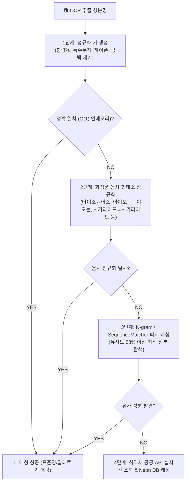

안녕하세요, PickSafe 백엔드 에디터입니다. 

화장품 패키지 라벨을 스캔하여 전 성분을 분석하는 서비스를 운영하다 보면, 개발자로서 마주하게 되는 독특한 난제들이 있습니다. 바로 **"같은 성분이지만 이름이 다르게 적혀 있는 경우"**입니다. 

이번 포스팅에서는 식약처 DB와 글로벌 성분 DB를 연동하는 과정에서 발생한 OCR 오인식 및 외래어 음차 표기 차이 문제를 해결하기 위해, 하드코딩 없이 **지능형 4단계 성분 매칭 파이프라인**을 구축한 아키텍처 의사결정 과정을 공유합니다.

---

## 1. Problem: "확인 불가 성분"이라는 딜레마

서비스 고도화 과정에서 사용자가 업로드한 화장품 라벨 이미지의 OCR 추출 결과와 공식 DB 간의 미스매치(Mismatch) 현상이 발생했습니다. 

대표적인 문제는 다음과 같습니다.
1. **외래어 음차 변형**: 라벨에는 `시카라이드아이소머레이트`로 표기되어 있으나, 공식 DB에는 `사카라이드아이소머레이트`로 등록되어 있는 경우 (`시` vs `사`)
2. **복합 음차 및 오탈자**: `알파-아이소메틸아이오논`(라벨) ↔ `알파-아이소메틸이오논`(DB) (`아이오논` vs `이오논`)
3. **포맷팅 차이**: 띄어쓰기, 하이픈(`-`), 특수문자, 괄호의 유무

만약 20,000개가 넘는 전 성분의 이명(Alias)을 일일이 데이터베이스에 하드코딩하거나 수동 매핑한다면, 유지보수 지옥에 빠지게 될 것이 명백했습니다. 따라서 **규칙 기반 음차 정규화와 수학적 퍼지 매칭을 결합한 자동화 파이프라인** 설계에 착수했습니다.

---

## 2. Architecture: 지능형 4단계 매칭 파이프라인

단일 알고리즘으로는 다양한 오인식 케이스를 커버할 수 없기 때문에, 처리 속도와 정확도를 모두 잡기 위해 **단계별 폴백(Fall-through) 아키텍처**를 설계했습니다.

### ① 1단계: Canonical Key (정규화 키) 기반 정확 일치
특수기호(`-`, `_`, 공백, 괄호)와 함량 표기 등을 제거하고 소문자화한 `canonical_key`를 생성합니다. (예: `알파-아이소메틸아이오논` ➔ `알파아이소메틸아이오논`) 
서버 기동 시 메인 DB의 국문명, INCI 영문명, 이명을 **인메모리 해시맵(이중 색인)**에 적재하여, DB I/O 부하 없이 $O(1)$ 시간 복잡도로 즉시 탐색합니다.

### ② 2단계: 화장품 음차 형태소 정규화 (Phonetic Normalization)
개발자의 손으로 모든 경우의 수를 하드코딩하는 대신, 화장품 원료 명명 규약에서 빈번하게 발생하는 **15대 양방향 음차 치환 규칙**을 엔진에 내장했습니다.
* `시카라이드` ⇄ `사카라이드` (Saccharide)
* `아이오논` ⇄ `이오논` (Ionone)
* `아이소` ⇄ `이소` (Iso)
* `하이드록시` ⇄ `히드록시` (Hydroxy)
* `트라이` ⇄ `트리` (Tri) 등

정규화 키로 매칭에 실패한 경우, 이 음차 규칙을 동적으로 적용하여 2차 매칭을 시도합니다.

### ③ 3단계: 퍼지 매칭 (Fuzzy Fallback Matching)
음차 규칙으로도 커버하기 힘든 OCR 인쇄 번짐이나 획 누락 등의 물리적 오류는 `difflib.SequenceMatcher`를 활용한 퍼지 매칭으로 방어했습니다. 유사도 임계값(Threshold)을 **88%**로 설정하여 오탐지율을 최소화하면서도 변형된 성분명을 찾아내도록 구현했습니다.

### ④ 4단계: 실시간 API 조회 및 캐싱
로컬 DB와 알고리즘으로도 찾지 못한 신규/희귀 성분은 식약처 공공 API를 실시간으로 호출하고, 결과를 DB에 캐싱하여 다음 요청부터는 인메모리에서 즉시 처리되도록 파이프라인을 완성했습니다.

---

## 3. Trade-off & Engineering Lessons

### Q. 퍼지 매칭을 도입하면 성능(Latency) 저하가 발생하지 않나요?
* **고민**: 모든 성분을 매번 문자열 유사도 알고리즘과 비교하면 스캔 전체 지연 시간(Latency)이 수 초 이상으로 늘어날 수 있습니다.
* **해결책**: 퍼지 매칭(3단계)은 1, 2단계(인메모리 해시맵 정확 일치 및 음차 정규화)를 **모두 통과하지 못한 예외 케이스에만 제한적으로 진입하는 폴백(Fallback) 구조**로 설계했습니다. 대다수의 정상 케이스는 $O(1)$ 만에 처리되므로 전체적인 응답 속도에 미치는 영향은 0.001초 미만으로 통제했습니다.

---

## 4. Takeaway

이번 엔진 고도화를 통해 비즈니스 로직에 무리한 하드코딩을 추가하는 대신, **"도메인 특화 규칙(Domain-specific Rules)과 알고리즘적 접근(Algorithmic Approach)을 결합하는 방식"**이 얼마나 강력한지 다시 한번 체감했습니다.

데이터의 노이즈를 다루어야 하는 백엔드 환경에서, 아키텍처 단계부터 캐싱, 정규화, 그리고 안전장치(Fallback)를 우아하게 배치하는 것이 확장 가능한 시스템을 만드는 핵심 역량임을 배운 프로젝트였습니다. 

앞으로도 PickSafe는 더 정확하고 빠른 성분 분석 경험을 제공하기 위해 파이프라인을 지속적으로 고도화해 나갈 예정입니다. 감사합니다.