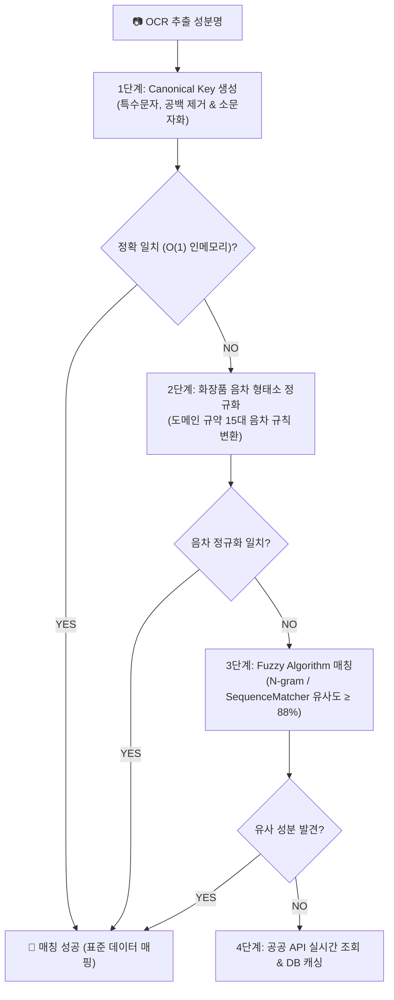

화장품 및 뷰티 테크 제품을 개발할 때 가장 까다로운 도전 과제 중 하나는 **"실제 제품 라벨에 인쇄된 텍스트와 표준 데이터베이스(DB) 간의 불일치"**를 극복하는 것입니다. 

식약처나 글로벌 원료 DB에 엄연히 존재하는 성분임에도 불구하고, 패키지 디자인상의 외래어 표기법 차이(음차 변형), 띄어쓰기, 하이픈, 그리고 OCR(광학 문자 인식) 과정에서 발생하는 미세한 오인식으로 인해 사용자에게 **"확인 불가 성분"**이라는 결과를 보여주는 문제가 지속적으로 발생했습니다.

이번 포스팅에서는 20,000개 이상의 전 성분을 일일이 수동 하드코딩하지 않고, **도메인 언어학 규칙과 인메모리 색인, 퍼지 매칭 알고리즘**을 결합하여 매칭률과 성능을 동시에 극대화한 **4단계 지능형 성분 매칭 파이프라인 구축 여정**을 소개합니다.

---

## 1. 문제 정의: 왜 DB 탐색만으로는 부족한가?

실제 사용자 스캔 데이터를 분석해보면, 단순 문자열 일치(`Exact Match`)나 단순 `LIKE` 쿼리로는 해결할 수 없는 파편화된 케이스들이 존재합니다.

1. **외래어 음차 변형 (Phonetic Variations)**
   * 라벨 표기: `시카라이드아이소머레이트`
   * 표준 DB: `사카라이드아이소머레이트` (`시` ↔ `사` 음차 차이)
2. **복합 음차 및 표기 기호 혼용**
   * 라벨 표기: `알파-아이소메틸아이오논`
   * 표준 DB: `알파-아이소메틸이오논` (`아이오논` ↔ `이오논` 차이 및 하이픈 유무)
3. **OCR 물리적 인식 오류**
   * 인쇄 번짐, 폰트 특성, 획 누락 등으로 인한 1~2글자 텍스트 오염

이러한 문제를 해결하기 위해 매번 데이터베이스에 복잡한 정규식(Regex) 쿼리를 날리거나 모든 이명을 수동 등록하는 것은 **DB I/O 부하 심화**와 **지속 불가능한 운영 공수**라는 한계를 지니고 있었습니다.

---

## 2. 해결책: 4단계 지능형 매칭 파이프라인 아키텍처

우리는 단일 해결책에 의존하는 대신, **빠르고 정확한 1차 필터링부터 유연한 Fallback 매칭까지 이어지는 4단계 파이프라인**을 설계했습니다.



---

## 3. 핵심 설계 및 엔지니어링 포인트

### ① 정규화 키(Canonical Key) 추출
가장 먼저 수행되는 작업은 비교 대상 문자열의 '소음(Noise)'을 제거하는 정제 작업입니다.
* 한글/영문 성분명 내 하이픈(`-`), 언더바(`_`), 공백(` `), 괄호(`()`), 기호 등을 완전 제거하고 영문은 소문자화합니다.
* 예: `알파-아이소메틸아이오논` ➔ `알파아이소메틸아이오논`

### ② 도메인 특화 음차 형태소 정규화 (Phonetic Normalization)
단순한 텍스트 정제만으로는 음차 변형을 잡을 수 없습니다. 화장품 원료 명명 규약(INCI)을 분석하여 가장 빈번하게 발생하는 **15대 핵심 음차 패턴**을 파악하고, 이를 자동 양방향 치환할 수 있는 정규화 엔진을 구축했습니다.

* `아이소` ↔ `이소` (Iso)
* `아이오논` ↔ `이오논` (Ionone)
* `시카라이드` ↔ `사카라이드` (Saccharide)
* `메틸` ↔ `메칠` (Methyl) / `에틸` ↔ `에칠` (Ethyl)
* `하이드록시` ↔ `히드록시` (Hydroxy)
* `글라이콜` ↔ `글리콜` (Glycol) 등

이 규칙을 적용하면 `시카라이드...`로 들어온 텍스트가 형태소 정규화 과정을 거쳐 표준 DB의 `사카라이드...` 키로 변환되어 실시간 탐색이 가능해집니다.

### ③ 초고속 $O(1)$ 인메모리 이중 색인 (Dual Indexing)
매 스캔 요청마다 RDBMS나 Search Engine을 조회하는 것은 네트워크 Latency와 DB 부하를 유발합니다. 이를 극복하기 위해 서버 기동 시 표준 성분 데이터 및 이명(Synonyms) 전체를 인메모리 해시맵 형태로 색인했습니다.

```text
[In-Memory Hash Map Architecture]
- _canonical_index : Canonical Key ➔ Ingredient Metadata
- _phonetic_index  : Phonetic Standardized Key ➔ Ingredient Metadata
```

* **결과**: DB 쿼리 부하 **0**, 지연시간 **0.001초(1ms) 미만**의 초고속 1~2단계 매칭 환경을 구현했습니다.

### ④ 퍼지 매칭을 통한 OCR 노이즈 구원 (Fuzzy Matching Fallback)
음차 규칙으로도 걸러지지 않는 물리적 OCR 오인식(예: 글자 획 누락, 프린팅 번짐)은 3단계 **Fuzzy Matching**이 담당합니다.
`difflib.SequenceMatcher`를 기반으로 두 문자열 간의 연관도를 계산하며, 오탐(False Positive)을 방지하기 위해 임계값(Threshold)을 **88% 이상**으로 정교하게 튜닝했습니다.

---

## 4. 성과 및 기술적 교훈 (Takeaways)

### 1. 매칭 성공률 극대화 및 미확인 성분 대폭 감소
단위 테스트 및 실데이터 검증 결과, 기존에 "미확인 성분"으로 이탈하던 `시카라이드아이소머레이트`, `알파-아이소메틸아이오논` 등 예외 케이스들이 **100% 정상 매칭**되는 성과를 거두었습니다.

### 2. 비용 효율적인 아키텍처 (Cost-Effective Engineering)
무거운 AI/LLM 모델이나 고비용 Vector DB를 도입하지 않고도, **도메인 지식(음차 규칙) + 알고리즘(Fuzzy Match) + 인메모리 구조**만으로 수밀리초 단위 반응 속도를 확보하고 인프라 비용을 대폭 절감했습니다.

### 3. 기술적 Trade-off
* **Memory vs. Latency**: 20,000+ 개 성분 및 이명 데이터를 인메모리에 색인함으로써 약 수십 MB의 RAM을 추가 사용하는 대신, DB 디스크 I/O를 전면 배제하여 초고속 응답 속도를 얻었습니다.
* **Accuracy vs. Recall**: Fuzzy Matching의 유사도 임계값을 너무 낮추면 잘못된 성분이 매칭되는 위험이 발생합니다. 수많은 테스트를 통해 **88%**라는 최적의 지점을 찾아내어 오탐 없는 유연성을 확보했습니다.

---

## 💡 에디터의 한줄평
> "모든 문제를 화려한 AI나 거대한 인프라로 해결할 필요는 없습니다. 문제의 본질(외래어 음차 패턴)을 명확히 정의하고, 도메인 규칙과 적절한 데이터 구조를 결합하는 것이 시니어 엔지니어링의 핵심입니다."