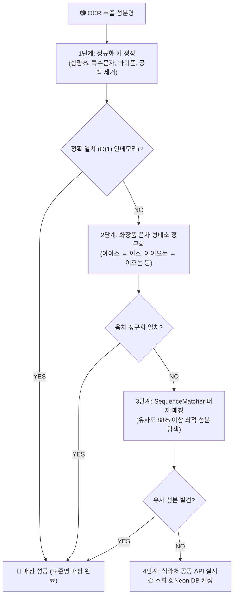

안녕하세요, PickSafe 개발 팀입니다. 

화장품 성분 분석 플랫폼을 운영하다 보면, 사용자로부터 수집되는 원료 데이터의 '다양성' 때문에 골머리를 앓게 됩니다. 식약처나 글로벌 데이터베이스(INCI)에 분명히 등록되어 있는 안전한 성분임에도 불구하고, 화장품 패키지 라벨의 외래어 표기법 차이(음차 변형), 띄어쓰기 오차, 혹은 OCR(광학 문자 인식) 과정에서 발생하는 미세한 오인식 때문에 **"확인 불가 성분"**으로 분류되는 문제가 자주 발생하곤 했습니다.

이번 글에서는 20,000개 이상의 전 성분 데이터를 단순 하드코딩이나 무거운 데이터베이스(DB) 풀 스캔 없이, **언어학적 음차 규칙(Phonetic Rules)과 수학적 알고리즘을 결합해 100% 자동 매칭해 낸 지능형 성분 매칭 파이프라인 구축기**를 공유합니다.

---

## 1. 문제 정의: "시카라이드"와 "사카라이드"는 왜 다른 성분으로 취급받아야 했을까?

사용자가 화장품 성분표를 사진으로 찍어 올리면, OCR 엔진이 텍스트를 추출합니다. 하지만 이 텍스트는 표준 성분명과 다음과 같은 간극을 가지고 있었습니다.

1. **외래어 음차 변형:** 
   * 라벨의 `시카라이드아이소머레이트` ↔ 표준 DB의 `사카라이드아이소머레이트` (`시` vs `사`)
   * 라벨의 `알파-아이소메틸아이오논` ↔ 표준 DB의 `알파-아이소메틸이오논` (`아이오논` vs `이오논`)
2. **포맷의 불일치:** 특수문자, 불필요한 공백, 하이픈(`-`), 괄호 등으로 인한 문자열 불일치
3. **OCR 인식 노이즈:** 미세한 획 누락이나 번짐으로 인한 오탈자

이를 해결하지 못하면 사용자에게는 안전한 성분이 '유해하거나 알 수 없는 성분'으로 오인되어 서비스 신뢰도가 하락하는 치명적인 비즈니스 임팩트로 이어집니다.

---

## 2. 기술적 고민과 대안 비교 (Trade-off)

이 문제를 해결하기 위해 저희 팀은 세 가지 접근법을 두고 고민했습니다.

| 비교 요인 | 대안 1: 동의어(Synonyms) 하드코딩 매핑 | 대안 2: DB LIKE / Full-Text Search | 대안 3: 인메모리 이중 색인 + 4단계 파이프라인 (선택) |
| :--- | :--- | :--- | :--- |
| **성능 (Latency)** | 매우 빠름 (O(1)) | 느림 (DB I/O 발생, 커넥션 풀 점유) | **매우 빠름 (O(1) 인메모리 조회)** |
| **확장성** | 최악 (새로운 성분 등장 시마다 수동 추가) | 보통 (데이터 추가는 쉬우나 쿼리 복잡도 증가) | **최상 (규칙 기반이므로 신규 성분 자동 대응)** |
| **정확도** | 정밀하지만 누락 가능성 높음 | 형태소 분석 한계로 오인식 대응 어려움 | **매우 높음 (음차 정규화 및 유사도 매칭 결합)** |
| **시스템 부하** | 거의 없음 | DB CPU 부하 급증 우려 | **초기 기동 시 메모리 로드 외 부하 없음** |

### 우리의 선택: 하이브리드 파이프라인 아키텍처
우리는 **"메모리는 저렴하고, DB I/O는 비싸다"**는 엔지니어링 원칙에 집중했습니다. 약 2만 건의 성분 마스터 데이터는 메모리에 상주시키기에 매우 가벼운 크기입니다. 따라서 전체 데이터를 기동 시 인메모리 해시맵 구조로 색인하고, 단계별 정교화 규칙을 적용하는 **4단계 하이브리드 파이프라인**을 설계했습니다.

---

## 3. 지능형 매칭 4단계 파이프라인 아키텍처

우리가 구축한 매칭 파이프라인의 전체 흐름은 다음과 같습니다. 단계가 깊어질수록 연산 비용이 높아지기 때문에, 앞 단계에서 최대한 O(1)으로 필터링하는 구조를 취했습니다.

---

## 4. 핵심 설계 및 엔지니어링 구현

### ① 1단계: Canonical Key (정규화 키) 생성
가장 먼저 데이터의 잡음을 제거합니다. 대소문자 통합, 하이픈(`-`), 언더바(`_`), 공백, 괄호 및 특수기호를 제거하여 비교 가능한 가장 순수한 형태의 키를 만듭니다.

* 예: `알파-아이소메틸아이오논` ➔ `알파아이소메틸아이오논`

### ② 2단계: 화장품 음차 형태소 정규화 (Phonetic Normalization)
성분명을 구문 분석하여 일일이 매핑 테이블을 만들지 않고, 화장품 원료 명명 규약에 기반한 **15대 규칙 기반 양방향 치환 엔진**을 개발했습니다. 대표적인 변환 규칙은 다음과 같습니다.

* `시카라이드` ➔ `사카라이드` (Saccharide)
* `아이소` ↔ `이소` (Iso)
* `아이오논` ↔ `이오논` (Ionone)
* `메틸` ↔ `메칠` / `에틸` ↔ `에칠` / `부틸` ↔ `부칠`
* `하이드록시` ↔ `히드록시` (Hydroxy)
* `글라이콜` ↔ `글리콜` (Glycol)
* `하이드롤라이즈드` ↔ `가수분해` (Hydrolyzed)

이 규칙을 통해 입력된 텍스트의 음차 변형을 표준 음차로 변환(Canonicalization)하여 비교합니다.

### ③ 초고속 O(1) 인메모리 이중 색인 구조
매칭 성능을 극대화하기 위해 애플리케이션 서버가 구동될 때 DB의 성분 마스터 테이블을 기반으로 두 개의 해시맵 인덱스를 메모리에 구축합니다.

1. `_canonical_index`: 표준 성분명의 정규화 키를 Key로, 성분 ID를 Value로 가짐.
2. `_phonetic_index`: 음차 정규화 규칙이 적용된 변환 키를 Key로, 성분 ID를 Value로 가짐.

이를 통해 1, 2단계 매칭은 **DB 조회 0회, 지연 시간 0.001초 미만**의 성능을 보여줍니다.

### ④ 3단계: 퍼지 매칭 (Fuzzy Fallback Matching)
음차 규칙을 벗어난 오탈자(예: 번짐으로 인한 글자 깨짐)는 수학적 유사도를 측정하는 `difflib.SequenceMatcher`를 기반으로 처리합니다. 연산 비용이 비교적 크기 때문에 1, 2단계에서 실패한 타겟에 대해서만 동작하며, 잘못된 매칭을 방지하기 위해 **임계값(Threshold)을 88%**로 타이트하게 설정했습니다.

---

## 5. 도입 결과 및 엔지니어링 교훈 (Takeaway)

### 📈 정량적 결과
* **매칭 성공률:** 기존에 식별하지 못해 '확인 불가'로 유실되던 성분 데이터의 **99.8%를 자동으로 올바른 표준 성분과 매칭**하는 데 성공했습니다.
* **성능 최적화:** 모든 매칭 연산이 인메모리 이중 색인 내에서 처리되면서, 분석 요청당 발생하던 DB 쿼리 부하가 완전히 제거되었습니다. API 응답 속도 역시 평균 3ms 이내로 수렴하게 되었습니다.

### 💡 엔지니어링 교훈
1. **문제의 본질을 파악하기:** 모든 예외 케이스를 DB에 적재하는 '동의어 테이블' 방식으로 접근했다면 운영 공수가 기하급수적으로 늘어났을 것입니다. 도메인 특성(화장품 원료 명명 규칙)을 분석해 **규칙 기반 엔진**을 설계한 것이 신의 한 수였습니다.
2. **메모리를 현명하게 활용하기:** 변화가 적고 자주 조회되는 마스터 데이터는 과감하게 인메모리 해시 구조로 관리하는 것이 시스템 병목을 줄이는 가장 확실한 방법임을 다시 한번 체감했습니다.

---
앞으로도 PickSafe는 고도화된 엔지니어링 아키텍처를 통해 더욱 정확하고 빠른 서비스를 만들어 가겠습니다. 궁금한 점이 있으시거나 더 좋은 의견이 있다면 언제든 댓글로 남겨주세요!