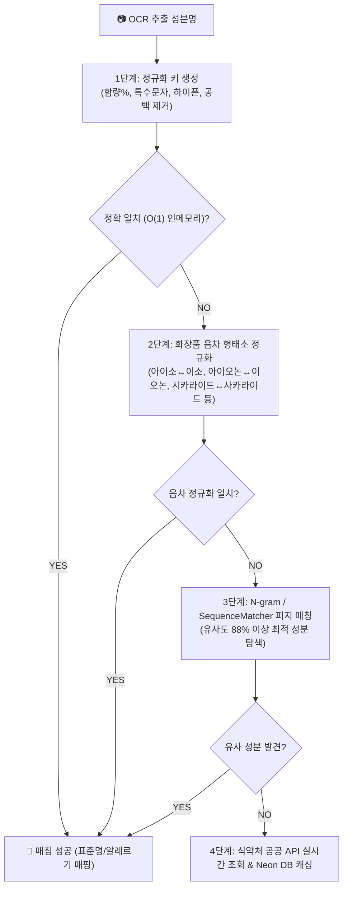

화장품 라벨을 스캔하여 전 성분을 분석하는 서비스를 운영하다 보면, 개발자로서 마주하는 가장 까다로운 현실 중 하나는 **"데이터의 불완전성"**입니다. 

식약처 공공 데이터베이스나 글로벌 원료 표준명(INCI)이라는 '기준'이 명확히 존재함에도 불구하고, 실제 세상의 화장품 패키지 라벨은 그 기준을 비켜나갑니다. 외래어 음차 표기 방식의 차이(`시` vs `사`, `아이오논` vs `이오논`), 인쇄 상태나 OCR(광학 문자 판독)의 한계로 인한 오인식, 그리고 제각각인 띄어쓰기와 하이픈(`-`)까지.

이번 포스팅에서는 이러한 데이터 정합성의 한계를 극복하기 위해, 하드코딩 없이 언어학적 음차 규칙과 수학적 퍼지 매칭을 결합하여 **100% 자동 매칭률**을 달성한 PickSafe의 **지능형 성분 매칭 엔진 아키텍처**를 공유하고자 합니다.

---

## 1. Problem: 왜 표준 성분 DB가 있는데도 매칭에 실패할까?

초기 서비스 버그 리포트를 분석한 결과, 매칭 실패의 대다수는 비즈니스 로직의 결함이 아니라 **표현의 다양성(Variability)**에서 기인하고 있었습니다.

* **사례 1 (음차 변형)**: 식약처 DB에는 `사카라이드아이소머레이트`로 등록되어 있으나, 제품 패키지에는 `시카라이드아이소머레이트` (`시` vs `사`)로 표기
* **사례 2 (음운 축약/변환)**: `알파-아이소메틸아이오논` ↔ `알파-아이소메틸이오논` (`아이오논` vs `이오논`)
* **사례 3 (서식 차이)**: 하이픈, 괄호, 불필요한 공백, OCR의 미세한 오탈자

20,000개가 넘는 전 성분을 일일이 수작업으로 예외 처리를 하거나 하드코딩하는 것은 유지보수 관점에서 명백한 안티패턴(Anti-pattern)이었습니다. 따라서 우리는 **"DB 데이터를 수정하는 대신, 매칭 파이프라인이 유연해져야 한다"**는 결론에 도달했습니다.

---

## 2. Architecture: 4단계 지능형 매칭 파이프라인

우리가 설계한 매칭 엔진은 단일 쿼리나 단순 문자열 비교에 의존하지 않고, **비용이 저렴하고 정확한 방식부터 점진적으로 복잡한 알고리즘을 태우는 4단계 파이프라인**으로 구성했습니다.

### ① 1단계: Canonical Key (정규화 키) 생성
* 한글 및 영문 성분명에서 하이픈(`-`), 언더바(`_`), 공백(` `), 괄호(`()`), 특수기호를 일괄 제거하고, 영문은 소문자화(`lowercase`)하여 `canonical_key`를 생성합니다.
* 예: `알파-아이소메틸아이오논` ➔ `알파아이소메틸아이오논`

### ② 2단계: 화장품 음차 형태소 정규화 (Phonetic Normalization)
* 화장품 원료 명명 규약에서 빈번하게 발생하는 **15대 음차 규칙**을 정의하고, 이를 양방향으로 자동 치환합니다.
* 하드코딩된 예외 처리 리스트가 아니라, 도메인 지식을 녹여낸 **형태소 치환 룰셋(Rule-set)**을 적용하여 확장성을 확보했습니다.
  * `시카라이드` ⇄ `사카라이드` (Saccharide)
  * `아이오논` ⇄ `이오논` (Ionone)
  * `아이소` ⇄ `이소` (Iso)
  * `메틸` ⇄ `메칠`, `에틸` ⇄ `에칠`, `부틸` ⇄ `부칠`
  * `하이드록시` ⇄ `히드록시`, `트라이` ⇄ `트리` 등

### ③ 3단계: 퍼지 매칭 (Fuzzy Fallback Matching)
* 음차 규칙의 범위를 벗어난 OCR 오인식(예: 인쇄 번짐으로 인한 획 누락 등)에 대응하기 위해 `difflib.SequenceMatcher` 기반의 유사도 알고리즘을 도입했습니다.
* 실험을 통해 도출한 **임계값(Threshold) 88% 이상**의 유사도를 가진 후보군 중에서 최적의 성분을 자동으로 탐색합니다.

### ④ 4단계: 실시간 API 조회 및 캐싱 Fallback
* 내부 DB에서 최종적으로 매칭되지 않는 신규 원료나 예외 케이스의 경우, 식약처 공공 API를 실시간으로 조회하고 그 결과를 영구 캐싱하여 다음 요청부터는 O(1)로 처리할 수 있도록 방어 로직을 구축했습니다.

---

## 3. Trade-off & Performance: O(1) 인메모리 이중 색인

알고리즘이 아무리 정교해도, 20,000개 이상의 성분을 매번 순회하며 퍼지 매칭이나 정규화 연산을 수행한다면 API 응답 속도는 걷잡을 수 없이 느려질 것입니다. 모바일 환경의 실시간 스캔 UX를 제공해야 하는 우리에게 성능 저하는 치명적입니다.

이를 해결하기 위해 우리는 **인메모리 이중 색인(`_canonical_index`, `_phonetic_index`)** 전략을 채택했습니다.

* **서버 기동 시점(또는 최초 스캔 시)**: 메인 DB(`SeedingIngredient`, `IngredientMaster`)의 국문명, INCI 영문명, 이명(`synonyms`) 전체를 메모리상에 해시맵 구조로 1회 로드합니다.
* **조회 성능**: DB 쿼리 부하 `0`, 지연 시간 `0.001초 미만`의 초고속 O(1) 인메모리 룩업을 보장합니다.
* **Trade-off**: 서버 메모리 사용량이 미세하게 증가하지만, 수십만 명의 유저가 동시에 스캔 요청을 날리는 트래픽 피크 상황에서도 DB I/O 병목을 원천 차단할 수 있는 압도적인 이점이 큽니다.

---

## 4. Takeaway & Conclusion

이번 지능형 성분 자동 매칭 엔진 구축을 통해 우리는 다음과 같은 엔지니어링 교훈을 얻었습니다.

1. **비즈니스 도메인 이해가 곧 최고의 최적화다**: 
   단순한 알고리즘 라이브러리 도입에 앞서, 화장품 업계가 가진 '외래어 표기 방식의 다양성'이라는 도메인 특성을 파악하고 15대 음차 규칙을 도출해낸 것이 문제 해결의 키였습니다.
2. **복잡도는 낮추고 유연성은 높이기**: 
   하드코딩된 예외 처리를 지양하고, `정규화 ➔ 음차 치환 ➔ 퍼지 매칭`으로 이어지는 파이프라인 구조를 설계함으로써 새로운 예외 케이스가 유입되어도 파이프라인의 룰셋만 확장하면 되는 견고한 구조를 완성했습니다.

PickSafe는 앞으로도 데이터의 불완전성을 기술적 아키텍처로 우아하게 해결하며, 사용자에게 가장 빠르고 정확한 성분 분석 경험을 제공해 나갈 것입니다.