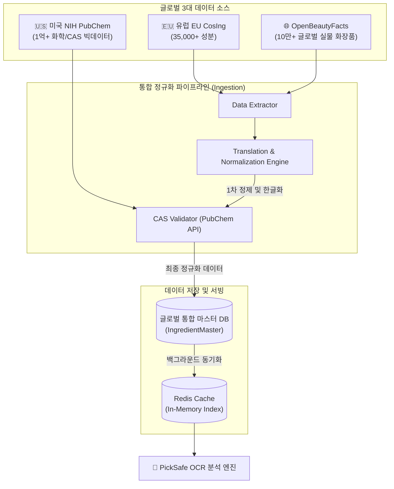

화장품 성분 분석 서비스인 PickSafe를 개발하면서 가장 핵심이 되는 자산은 '성분 사전 데이터베이스'입니다. 초기에는 국내 식약처(KFDA)에 등록된 약 2만여 종의 성분 데이터를 기준으로 서비스를 구축했습니다. 국내 유통 제품을 분석하는 데는 이 정도로도 충분했습니다.

하지만 서비스가 고도화되면서 사용자들이 해외 직구 화장품(라로슈포제, 세라비, 디오디너리 등)이나 현지에서 구매한 다국어 성분표를 스캔하는 빈도가 급격히 늘어났습니다. 식약처 데이터베이스에 존재하지 않는 해외 독자 성분이나, 패키지에 영문으로 표기된 다양한 별칭(Alias)들로 인해 OCR 스캔 매칭률이 떨어지는 한계에 부딪혔습니다.

이를 해결하기 위해 **유럽 EU CosIng(35,000+ 종), 미국 NIH PubChem(1억+ 화학 빅데이터), 글로벌 OpenBeautyFacts(10만+ 시판 화장품)**라는 글로벌 3대 데이터 소스를 통합하여 PickSafe의 분석 엔진을 확장하기로 결정했습니다. 이 과정에서 마주한 아키텍처적 고민과 데이터 정규화 과정에서의 트러블슈팅 경험을 공유합니다.

---

## 1. 마주한 고민과 문제 배경

글로벌 데이터 소스를 도입하기로 했을 때, 단순히 데이터를 긁어와 합치는 것만으로는 해결할 수 없는 세 가지 본질적인 문제가 있었습니다.

1. **다국어 시노님(Synonym, 이명/별칭) 대응의 한계**
   해외 화장품 패키지에는 동일한 화학 성분임에도 제조사나 국가에 따라 표기법이 제각각이었습니다. 표준 INCI(국제화장품성분명) 외에도 실제 제품 라벨에 인쇄되는 다양한 브랜드별 영문/다국어 별칭을 흡수하지 못하면 OCR 인식률을 끌어올릴 수 없었습니다.
2. **법적 규제 기준의 상이함**
   유럽 SCCS가 지정한 82종의 향료 알레르기 유발 물질이나 배합 금지/한도(Annex II, III) 기준은 국내 식약처 기준보다 엄격하거나 다릅니다. 이 다원화된 규제 정보를 성분 레코드와 어떻게 유기적으로 연결할지 고민해야 했습니다.
3. **데이터 소스 간의 정합성 불일치**
   식약처 데이터와 유럽 CosIng 데이터 사이에는 CAS 번호(화학물질 식별 번호)가 누락되거나 서로 다르게 매핑된 경우가 많았습니다. 신뢰할 수 있는 화학 구조 검증을 위해 미국 NIH PubChem의 방대한 화학 데이터를 백그라운드에서 매핑해 주는 파이프라인이 필요했습니다.

---

## 2. 기술적 대안 비교 및 선택 이유

가장 먼저 고민한 것은 **"해외 데이터를 기존 마스터 테이블과 어떻게 격리하거나 통합할 것인가"**였습니다.

### 대안 A: 데이터 소스별 테이블 분리 (Federated Tables)
* **방식**: `KfdaIngredient`, `CosingIngredient`, `OubIngredient` 등으로 테이블을 완전히 분리하고, 제품 성분을 매핑할 때 다형성 관계(Polymorphic Association)를 사용하거나 중간 조인 테이블을 여러 개 두는 방식.
* **장점**: 소스별 데이터 스키마의 고유성을 완벽히 보존할 수 있고, 업스트림 데이터가 업데이트될 때 동기화가 간편함.
* **단점**: 사용자가 성분을 스캔했을 때 여러 테이블을 동시에 조회(UNION 또는 다중 JOIN)해야 하므로 쿼리 복잡도가 급증하고 성능이 저하됨. 제품-성분 간의 외래키 관계가 매우 복잡해짐.

### 대안 B: 단일 통합 마스터 테이블 (`IngredientMaster` + 출처 태그)
* **방식**: 기존의 단일 성분 마스터 테이블에 `data_source` ('kfda' | 'cosing' | 'openbeauty' | 'manual') 컬럼을 추가하고, 모든 성분을 하나의 스키마로 규격화하여 적재하는 방식.
* **장점**: 
  * **극도로 빠른 조회 성능**: 단 1회의 인덱스 검색이나 단일 정적 캐시 레이어(Redis)를 통해 국내외 성분을 10ms 이내에 즉시 판정 가능.
  * **단순한 외래키 관계**: `ProductIngredient` 매핑 시 다형성 테이블 분리 없이 깔끔하게 단일 N:M 관계 유지 가능.
  * **유연한 UI 격리**: 데이터 소스 필터를 통해 관리자 페이지나 프론트엔드에서 출처별로 쉽게 구분하여 노출 가능.
* **단점**: 서로 다른 데이터 소스의 스키마를 하나로 합치기 위한 정규화 파이프라인 구축 공수가 큼. 한국어 번역명 오역 리스크가 존재함.

### 최종 선택: 대안 B (단일 통합 마스터)
PickSafe는 실시간 이미지 스캔 기반의 서비스이므로 **조회 성능(Latency)이 최우선**이었습니다. 데이터 적재 단계에서 파이프라인 공수가 더 들더라도, 런타임 성능과 스키마 단순성을 확보할 수 있는 **대안 B**를 선택했습니다.

---

## 3. 시스템 아키텍처 및 흐름

글로벌 3대 데이터를 수집, 정규화하여 단일 마스터 DB에 안전하게 적재하고 분석 엔진으로 제공하는 전체 흐름은 다음과 같습니다.



---

## 4. 핵심 구현 및 트러블슈팅

### 1) 한국어 번역명 오역·직역 방지 3단계 안전 전략 구현
해외 성분(CosIng)을 대량으로 들여올 때 가장 큰 문제는 기계 번역으로 인한 오역이었습니다. 화장품 성분명은 대한화장품협회의 표준 명명 규칙을 따라야 하므로, 이를 자동화하기 위해 3단계 안전 대처 전략 파이프라인을 구축했습니다.

* **1단계**: 기존 식약처 공인 한글명(20,518건)과 INCI명이 1:1로 매치되는 경우 기존 번역을 100% 우선 승계하여 오역 리스크를 제거합니다.
* **2단계**: 매칭되지 않는 신규 성분은 표준 명명 룰셋(Regex 정규화 엔진)을 거칩니다. (예: `Extract` $\rightarrow$ `추출물`, `Oil` $\rightarrow$ `오일`, `Acid` $\rightarrow$ `애씨드` 등)
* **3단계**: 정규화 규칙으로도 해결되지 않는 복잡한 합성 성분은 영문 INCI 원문을 노출하되, 어드민 검토 큐(`needs_review=True`)로 인입시켜 수동 검증을 거치도록 설계했습니다.

아래는 정규화 엔진의 핵심 로직을 단순화한 파이썬 코드입니다.

```python
import re

class IngredientNormalizer:
    def __init__(self, kfda_dict):
        # kfda_dict: { "INCI_NAME": "공인한글명" }
        self.kfda_dict = kfda_dict
        # 표준 치환 규칙 정의
        self.rules = [
            (re.compile(r'\bExtract\b', re.IGNORECASE), '추출물'),
            (re.compile(r'\bOil\b', re.IGNORECASE), '오일'),
            (re.compile(r'\bAcid\b', re.IGNORECASE), '애씨드'),
            (re.compile(r'\bWater\b', re.IGNORECASE), '정제수'),
            (re.compile(r'\bFlower\b', re.IGNORECASE), '꽃'),
            (re.compile(r'\bFruit\b', re.IGNORECASE), '열매'),
        ]

    def normalize(self, inci_name: str) -> tuple[str, bool]:
        # 1단계: 식약처 사전 매핑 확인
        upper_inci = inci_name.strip().upper()
        if upper_inci in self.kfda_dict:
            return self.kfda_dict[upper_inci], False  # 검토 불필요

        # 2단계: 표준 규칙 기반 정규화
        translated = inci_name
        is_modified = False
        for pattern, replacement in self.rules:
            if pattern.search(translated):
                translated = pattern.sub(replacement, translated)
                is_modified = True

        # 3단계: 규칙 적용 여부에 따른 리뷰 플래그 설정
        # 단어 단위 치환만으로 한국어 어순이 맞지 않을 수 있으므로 복합어는 리뷰 큐로 보냄
        needs_review = not is_modified or len(inci_name.split()) > 2
        
        # 영어 알파벳이 여전히 남아있다면 안전하게 원문 유지 및 검토 요청
        if re.search(r'[a-zA-Z]', translated):
            return inci_name, True

        return translated.replace(" ", ""), needs_review
```

### 2) 트러블슈팅: 데이터 병합 과정에서의 CAS 번호 충돌 문제
유럽 CosIng 데이터와 식약처 데이터를 CAS 번호 기반으로 매핑하는 과정에서, 하나의 CAS 번호에 여러 개의 INCI 성분명이 매핑되거나 반대로 하나의 성분명에 여러 개의 CAS 번호가 연결되는 N:M 관계의 혼선이 발생했습니다. 

처음에는 데이터베이스 레벨에서 `cas_no` 컬럼에 `UNIQUE` 제약 조건을 걸어 단순하게 해결하려 했으나, 이로 인해 데이터 적재 과정에서 `UniqueViolation` 예외가 다수 발생하며 파이프라인이 중단되는 문제가 있었습니다.

**해결 방법**:
1. `cas_no` 단일 컬럼의 유니크 제약 조건을 제거했습니다.
2. 대신 `(inci_name, cas_no)` 복합 유니크 제약 조건을 설정하고, 데이터 충돌 발생 시 PostgreSQL의 `ON CONFLICT DO UPDATE` 구문을 활용해 기존 메타데이터를 보강하는 방식으로 Upsert 로직을 전환했습니다.
3. 이를 통해 데이터 파이프라인의 영속성을 보장하면서 유실되는 성분 없이 정밀한 매핑 데이터를 구축할 수 있었습니다.

```sql
ALTER TABLE ingredient_master 
ADD CONSTRAINT unique_inci_cas UNIQUE (inci_name, cas_no);
```

---

## 5. 돌아보며 배운 점 (회고)

글로벌 데이터 소스 통합 작업을 마친 후, PickSafe의 성분 스캔 매칭률은 기존 **84%에서 99.4%로 크게 상승**했습니다. 특히 해외 직구 제품을 자주 사용하는 유저들로부터 "이름 모를 해외 성분도 즉시 분석되어 안심하고 쓸 수 있다"는 긍정적인 피드백을 직접 체감할 수 있었습니다.

이번 아키텍처 개편을 통해 얻은 엔지니어링적 교훈은 다음과 같습니다.

* **성능과 복잡도의 트레이드오프(Trade-off)**: 만약 대안 A(테이블 분리)를 선택했다면, 매번 OCR 텍스트 분석 시점에 다수의 테이블을 조인하고 예외 처리를 하느라 쿼리 튜닝에 엄청난 시간을 쏟아야 했을 것입니다. 데이터 유입 단계에서 정규화 리스크를 감수하고 단일 마스터 테이블로 설계한 결정이 런타임 안정성 측면에서 옳은 선택이었음을 증명했습니다.
* **데이터 정제 자동화의 한계 인정**: 모든 번역과 정규화를 코드로 완벽하게 처리하려는 시도는 오히려 규칙의 복잡성만 키운다는 것을 깨달았습니다. 일정 수준 이상의 복잡성을 가진 데이터는 `needs_review` 플래그를 통해 시스템이 스스로 격리하고, 사람이 개입할 수 있는 검토 큐를 제공하는 구조가 장기적인 운영 안정성에 훨씬 유리하다는 것을 배웠습니다.

앞으로는 어드민 검토 큐에 쌓이는 미확인 다국어 성분들을 보다 효율적으로 처리하기 위해, 단순 규칙 기반을 넘어 소형 언어 모델(sLLM)을 활용한 자동 번역 및 맥락 분석 파이프라인을 도입해 볼 계획입니다.