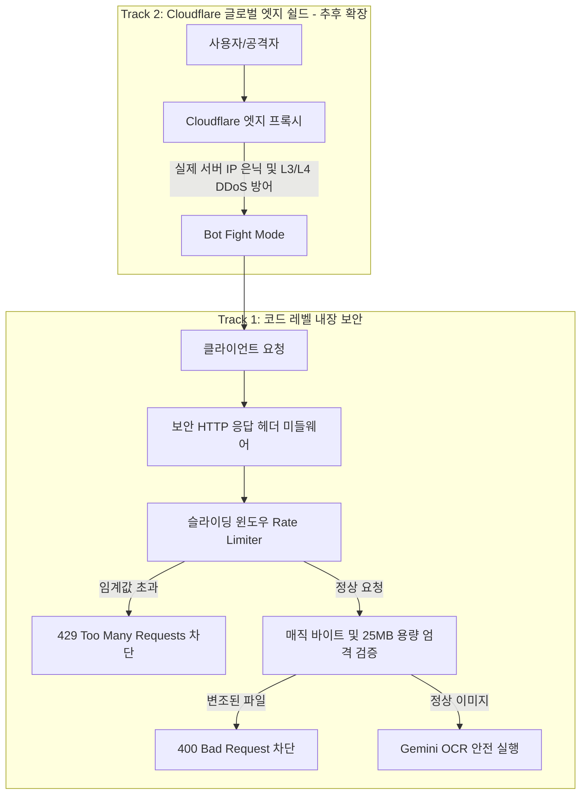

안녕하세요, **PickSafe** 백엔드 엔지니어링 팀입니다. 

PickSafe는 이미지 기반 성분 라벨 OCR 분석을 위해 고성능 **Gemini Vision AI**를 핵심 코어로 활용하고 있습니다. AI 기술은 서비스에 강력한 가치를 제공하지만, 동시에 고비용의 API 호출 구조와 대용량 파일 처리라는 잠재적인 인프라 리스크를 동반합니다.

이번 글에서는 악의적인 봇이나 스크립트에 의한 **AI API 비용 폭탄(Cost Bombing), 무차별 대입(Brute Force) 공격, 그리고 DoS(서비스 거부) 위험**을 방어하기 위해 설계한 **2-Track 보안 및 스마트 Rate Limiting 아키텍처**의 기술적 고민과 의사결정 과정을 공유합니다.

---

## 1. 배경 및 문제 정의 (Context & Problem Statement)

서비스를 고도화하는 과정에서 다음과 같은 치명적인 인프라 및 보안 위협 요소들을 식별했습니다.

1. **AI API 비용 폭탄 및 리소스 고갈 (Cost Bombing / DoS)**
   - 악의적인 봇이 `/scan` 엔드포인트로 초당 수십 건의 대용량 이미지를 연속 전송할 경우, Gemini API 쿼터가 즉시 고갈되거나 서버 메모리가 포화되어 일반 사용자의 서비스가 마비될 수 있음.
2. **인증 무차별 대입 공격 (Brute Force)**
   - 로그인 및 인증 엔드포인트에 무작위 요청을 시도하여 계정을 탈취하거나 백엔드에 불필요한 부하를 유발하는 위협.
3. **악성 파일 업로드 및 페이로드 공격**
   - 실행 파일(.php, .sh 등)을 이미지 확장자로 위장하거나 수십 MB에 달하는 거대 파일을 전송하여 서버 I/O를 마비시키는 행위.
4. **클라이언트 사이드 웹 취약점**
   - 적절한 보안 HTTP 응답 헤더 누락 시 발생할 수 있는 XSS, Clickjacking, MIME Sniffing 등의 보안 홀.

인프라가 본격적으로 스케일업 되기 전, **애플리케이션 레이어에서부터 철저하게 방어선을 구축**해야 했습니다.

---

## 2. 기술적 고민과 아키텍처 대안 비교

인프라 보호를 위해 어떤 계층에서 어떻게 방어할 것인지에 대한 설계 고민이 있었습니다.

* **고민 1. 인프라 레벨 vs 애플리케이션 레벨 Rate Limiting**
  - **대안 A (인프라/API Gateway 전면 위임)**: Cloudflare나 AWS API Gateway 등 외부 엣지에서만 트래픽을 통제하는 방식. 인프라 변경 시 유연하지만, 현재 PaaS 기반의 빠른 배포 환경에서는 초기 비용과 설정 복잡도가 증가함.
  - **대안 B (코드 레벨 내장 + 글로벌 엣지 2-Track)**: 당장은 FastAPI 미들웨어 레벨에서 세밀한 슬라이딩 윈도우(Sliding Window) 제어를 수행하고, 추후 자체 도메인 연동 시 Cloudflare 엣지 쉴드를 이중으로 결합하는 방식.
  - **결정**: **대안 B**를 채택했습니다. 비즈니스 로직과 가장 인접한 곳에서 엔드포인트 특성(스캔 vs 인증)에 맞는 세밀한 제어가 가능하며, 추후 인프라 확장 시에도 자연스럽게 연동할 수 있기 때문입니다.

---

## 3. 핵심 구현 및 세부 기술 설계 (Technical Specifications)

### 1) 슬라이딩 윈도우 (Sliding Window) 기반 Rate Limiter
단순한 고정 윈도우(Fixed Window) 방식은 경계 시점에 트래픽이 몰리는 버스트(Burst) 현상을 막지 못합니다. 이에 따라 인메모리 기반의 **슬라이딩 타임 윈도우 알고리즘**을 직접 구현하여 미들웨어에 장착했습니다.

* **엔드포인트별 차등 제한**
  - **스캔 API (`/scan`)**: 동일 IP당 **1분 5회**, **1시간 30회**로 엄격히 제한 (Gemini API 보호).
  - **인증 API (`/auth/login` 등)**: 동일 IP당 **1분 10회** 제한 (Brute Force 방어).
  - **헬스체크 및 관리자 라우트**: Whitelist 처리하여 모니터링 누락 방지.
* 제한 초과 시 표준 규격인 `HTTP 429 Too Many Requests`와 함께 `Retry-After` 헤더를 반환하여 클라이언트 측의 올바른 재시도 유도.

### 2) 매직 바이트(Magic Bytes) 기반의 엄격한 파일 무결성 검증
단순히 파일 확장자(`jpg`, `png`)만 믿고 처리했다가는 서버가 셸 스크립트나 악성 바이너리를 마주할 수 있습니다. 

* **용량 제한**: 최대 `25MB`로 제한하여 최신 스마트폰의 고화질 성분표 사진은 온전히 수용하면서도(`413 Payload Too Large`), 수백 MB에 달하는 거대 DoS 파일 폭탄은 진입 즉시 차단.
* **매직 바이트 검사**: 업로드된 파일의 첫 바이트를 직접 읽어 실제 포맷을 검증합니다.
  - JPEG (`\xFF\xD8\xFF`), PNG (`\x89PNG`), WebP (`RIFF...WEBP`) 등 허용된 시그니처가 아닐 경우 즉시 `400 Bad Request`로 차단합니다.

### 3) 엔터프라이즈 급 보안 HTTP 응답 헤더 강제화
모든 응답에 5대 핵심 보안 헤더 미들웨어를 적용하여 OWASP Top 10 주요 취약점을 원천 차단했습니다.
- `X-Content-Type-Options: nosniff`
- `X-Frame-Options: SAMEORIGIN`
- `X-XSS-Protection: 1; mode=block`
- `Referrer-Policy: strict-origin-when-cross-origin`
- `Permissions-Policy: camera=(self), microphone=(), geolocation=()`

---

## 4. 2-Track 방어 아키텍처 흐름

---

## 5. 결론 및 엔지니어링 교훈 (Takeaways)

이번 아키텍처 설계를 통해 얻은 교훈은 명확합니다. **"외부 유료 API나 AI 모델을 연동하는 시스템에서 Rate Limiting과 페이로드 검증은 선택이 아닌 생존 조건"**이라는 점입니다.

1. **비용 리스크 선제 차단**: AI API를 활용하는 서비스라면 비즈니스 로직 구현만큼이나 앞단에서 트래픽을 통제하는 방어선 설계가 선행되어야 합니다.
2. **신뢰할 수 있는 입력값 검증**: 확장자 검증이라는 안일한 방식을 버리고, 매직 바이트와 바이트 단위 용량 제한을 통해 서버의 안정성을 견고하게 지켜낼 수 있었습니다.

PickSafe는 앞으로도 안정적이고 확장 가능한 아키텍처를 바탕으로 사용자에게 안전한 서비스를 제공해 나갈 것입니다. 

읽어주셔서 감사합니다.