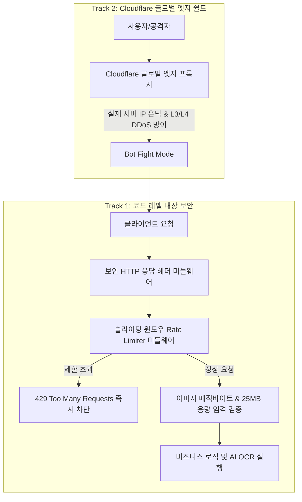

안녕하세요, **PickSafe** 백엔드 엔지니어링 팀입니다. 

PickSafe는 사용자 친화적인 성분 라벨 OCR 분석을 위해 Google Gemini Vision AI를 핵심 엔진으로 채택하고 있습니다. 하지만 AI 기반 서비스를 운영할 때 마주하는 가장 현실적인 고민은 바로 **'비용 폭탄'**과 **'리소스 고갈 공격(DoS)'**입니다.

이번 포스팅에서는 악의적인 봇의 무차별 요청과 대용량 페이로드 공격으로부터 서버와 API 쿼터를 안전하게 보호하기 위해 설계한 **2-Track 방어 아키텍처와 슬라이딩 윈도우 Rate Limiting 구현기**를유지보수 관점에서 공유해 드립니다.

---

## 1. 마주한 문제 (Problem Statement)

AI 기능을 제공하는 웹 서비스를 개발·운영해 보신 분들이라면 공감하시겠지만, 다음과 같은 치명적인 보안 위협이 존재합니다.

1. **AI API 쿼터 고갈 및 비용 폭탄 (Cost Bombing)**
   - 악의적인 스크립트가 OCR 분석 엔드포인트(`/scan/upload`)로 초당 수십 건의 대용량 이미지를 연속 전송할 경우, Gemini API 유료 쿼터가 순식간에 소진되거나 서버 메모리가 고갈되어 일반 사용자가 서비스를 이용하지 못하는 상황이 발생할 수 있습니다.
2. **인증 무차별 대입 공격 (Brute Force)**
   - 로그인 엔드포인트(`/auth/login` 등)를 대상으로 한 무작위 크리덴셜 스패밍 위협.
3. **악성 파일 업로드 및 페이로드 폭탄**
   - 실행 파일을 이미지 확장자로 위장하거나 수십 MB에 달하는 거대 파일을 전송해 백엔드 I/O를 마비시키는 공격.
4. **기본적인 웹 취약점 노출**
   - XSS, Clickjacking, MIME Sniffing 등을 방어할 수 있는 HTTP 응답 헤더 누락.

---

## 2. 기술적 고민과 대안 비교 (Trade-off & Architecture)

인프라 레벨(예: API Gateway, Nginx, Cloudflare 등)에서 1차 방어를 수행하는 것이 정석이지만, 프로젝트 초기 배포 환경의 유연성과 빠른 대응을 위해 **코드 레벨의 내장 방어**와 **글로벌 엣지 쉴드**를 결합한 **2-Track 방어 아키텍처**를 구상했습니다.

### 왜 '슬라이딩 타임 윈도우(Sliding Window Log)' 알고리즘인가?
단순한 고정 윈도우(Fixed Window) 방식은 윈도우 경계 시점에 허용량의 2배에 달하는 트래픽이 몰리는 '경계 뭉침 현상(Thundering Herd)'의 약점이 있습니다. 

PickSafe는 정밀한 제어가 필요했기에, 인메모리 기반의 **슬라이딩 타임 윈도우 로그 방식**을 채택하여 특정 시간 구간 동안의 요청 기록을 정밀하게 추적하고, 초과 시 즉시 `429 Too Many Requests`와 `Retry-After` 헤더를 내려주어 클라이언트가 합리적으로 재시도할 수 있도록 설계했습니다.

---

## 3. 핵심 구현 내용 (Technical Specifications)

### ① 엔드포인트별 차등 Rate Limiting 적용
비즈니스 특성에 따라 중요도와 리소스 소모량이 다르므로 제한 규칙을 다르게 가져갔습니다.
* **스캔 AI API (`/scan/*`)**: 동일 IP 기준 **1분 5회**, **1시간 30회**로 엄격히 제한 (AI 쿼터 보호)
* **인증 API (`/auth/*`)**: 동일 IP 기준 **1분 10회** 제한 (브루트포스 방어)
* **헬스체크 및 관리자 라우트**: 무중단 모니터링을 위해 Whitelist 처리

### ② 매직 바이트(Magic Bytes) 기반 파일 무결성 검증
단순히 파일 확장자(`jpg`, `png`)만 믿고 서버에 적재하는 것은 치명적인 보안 홀입니다. 업로드된 파일의 스트림 헤더(첫 몇 바이트)를 직접 읽어 실제 파일 형식을 검증하도록 구현했습니다.
* **JPEG**: `\xFF\xD8\xFF`
* **PNG**: `\x89PNG`
* **WebP**: `RIFF....WEBP`
위조된 파일은 엔드포인트 진입 즉시 `400 Bad Request`로 차단합니다. 또한, 최신 스마트폰의 고화질 원본 성분표(7~15MB)를 원활히 수용하면서도 25MB를 초과하는 거대 페이로드는 `413 Payload Too Large`로 사전 차단하여 메모리 고갈을 원천 봉쇄했습니다.

### ③ 엔터프라이즈 보안 HTTP 응답 헤더 강제화
FastAPI 미들웨어를 통해 모든 응답에 OWASP 권장 보안 헤더를 자동 주입합니다.
- `X-Content-Type-Options: nosniff`
- `X-Frame-Options: SAMEORIGIN`
- `X-XSS-Protection: 1; mode=block`
- `Referrer-Policy: strict-origin-when-cross-origin`

---

## 4. 맺음말 및 Takeaway

이번 보안 아키텍처 설계를 통해 얻은 가장 큰 교훈은 **"보안은 미루는 것이 아니라 아키텍처의 기초 단계부터 함께 고려해야 한다"**는 점입니다.

외부 인프라(Cloudflare 등)에만 의존하지 않고, 애플리케이션 레코드 자체에서 1차적인 방어선(Rate Limiting, 매직 바이트 검증, 보안 헤더)을 견고하게 구축해 둔 덕분에 비용 폭탄 리스크를 원천 차단하고 서비스 안정성을 높일 수 있었습니다.

PickSafe 팀은 앞으로도 안정적이고 확장 가능한 아키텍처를 바탕으로 사용자에게 신뢰할 수 있는 서비스를 제공하기 위해 고민을 지속하겠습니다. 읽어주셔서 감사합니다!