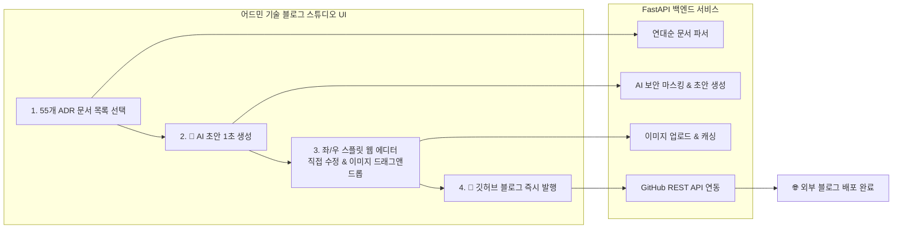

안녕하세요, **PickSafe Core Architecture Team**입니다.

스타트업이나 테크 기업에서 기술 블로그를 운영할 때 겪는 가장 큰 고민 중 하나는 **"개발 생산성과 콘텐츠 퀄리티 사이의 트레이드오프"**입니다. 

PickSafe는 그동안 축적해 온 55개의 핵심 기술 의사결정 문서(ADR)를 대외 기술 블로그(`daniel-dataflow.github.io`)에 투명하게 공개하고자 했습니다. 하지만 이 과정을 자동화하는 과정에서 몇 가지 치명적인 한계에 부딪혔고, 이를 해결하기 위해 사내 어드민 웹 기반의 **'Blog Studio(기술 블로그 스튜디오)'**를 직접 구축하게 되었습니다.

이번 글에서는 100% 자동화의 함정을 극복하고, 개발자와 에디터 모두가 만족하는 원스톱 퍼블리싱 시스템을 설계한 아키텍처적 고민과 기술적 선택을 공유합니다.

---

## 1. 배경 및 문제 정의: 왜 100% 자동화는 실패하는가?

초기 구상은 간단했습니다. "GitHub Actions를 이용해 사내 저장소의 ADR 마크다운을 블로그 저장소로 자동 동기화하면 되지 않을까?" 

하지만 프로젝트를 진행할수록 다음과 같은 명확한 한계가 드러났습니다.

1. **전면 자동화의 검수 불가 딜레마 (Human-in-the-Loop 부재)**
   - 순수 내부용 ADR 문서에는 외부 공개 시 오해를 살 수 있거나 다듬어지지 않은 표현이 포함될 수 있습니다. 
   - 100% 자동 변환 시 개발자가 실제 발행될 글의 문맥과 강조 포인트를 사전에 검수할 수 없습니다. 반대로 블로그 레포지토리에서 직접 수정하면, 향후 사내 동기화 과정에서 수정본이 덮어씌워져 유실될 위험이 있었습니다.
2. **마크다운 렌더링 및 시각적 검증의 부재**
   - 텍스트 기반의 마크다운 원문만으로는 웹 브라우저에서 타이포그래피, 줄바꿈, 이미지 배치가 어떻게 렌더링될지 실시간으로 확인하기 어려웠습니다.
3. **복잡한 개발 도구 의존성**
   - 엔지니어가 아닌 작성자가 매번 터미널에서 Git 명령어나 파이썬 스크립트를 실행하는 것은 사용자 경험(UX) 관점에서 최악이었습니다.

> **"브라우저에서 초안을 생성하고, AI의 도움을 받아 다듬은 뒤, 이미지 드래그 앤 드롭과 함께 원클릭으로 발행할 수 있는 사내 CMS가 필요하다."**

---

## 2. 시스템 아키텍처 및 작업 흐름 (Architecture)

우리는 기존 사내 어드민 시스템에 매끄럽게 녹아들 수 있는 **FastAPI + Vanilla JS 기반의 3단 스플릿 에디터**를 설계했습니다.

### 핵심 워크플로우
1. **문서 선택**: 좌측 탐색기에서 55개 ADR 중 발행할 문서를 선택합니다.
2. **AI 초안 생성**: LLM을 통해 내부 보안 정보를 마스킹하고, 블로그 포맷에 맞는 매력적인 초안을 1초 만에 추출합니다.
3. **스플릿 에디터 검수**: 중앙의 마크다운 에디터에서 직접 글을 수정하고, 이미지를 드래그 앤 드롭으로 삽입합니다. 우측 뷰포트에서 실시간 렌더링 결과를 확인합니다.
4. **원클릭 발행**: 발행 버튼을 누르면 백엔드가 GitHub REST API를 통해 타겟 저장소에 직접 커밋 및 푸시를 수행합니다.

---

## 3. 기술적 구현 및 트레이드오프 (Technical Details)

### 1) 백엔드: FastAPI를 활용한 유연한 API 라우팅
백엔드는 비동기 처리가 우수하고 기존 PickSafe 백엔드 스택과 완벽히 호환되는 **FastAPI**를 채택했습니다. 주요 엔드포인트는 다음과 같이 구성했습니다.

- **`GET /admin/api/blog/decisions`**: 사내 문서 저장소를 파싱하여 연대순 목록, 제목, 작성일자, 상태를 반환합니다.
- **`POST /admin/api/blog/generate-draft`**: LLM API를 호출하여 민감한 내부 코어나 엔드포인트 등의 보안 정보를 안전하게 마스킹하고, 독자 친화적인 기술 블로그 톤으로 변환합니다.
- **`POST /admin/api/blog/upload-image`**: 에디터에 드래그된 이미지를 서버에 안전하게 캐싱하고, 마크다운용 상대 경로를 반환합니다.
- **`POST /admin/api/blog/publish`**: 최종 마크다운 파일과 에셋을 **GitHub REST API** 및 개인 액세스 토큰(PAT)을 활용해 외부 블로그 레포지토리의 지정된 경로로 직접 푸시합니다. 별도의 로컬 Git 클라이언트 설치가 필요 없습니다.

### 2) 프렌드엔디: 3단 반응형 블로그 스튜디오 UI
프론트엔드는 SPA 프레임워크를 무리하게 도입하기보다, 기존 어드민 템플릿과의 결합도를 높이기 위해 글래스모피즘 디자인이 적용된 바닐라 JS 기반 3단 레이아웃을 구현했습니다.
- **좌측 (Navigator)**: 실시간 검색 필터와 작성일 뱃지가 포함된 ADR 목록
- **중앙 (Editor)**: 서식 툴바, 단축키, 이미지 드래그 앤 드롭을 지원하는 마크다운 에디터
- **우측 (Live Preview)**: 실제 블로그와 100% 동일한 CSS가 적용되어 타이핑 즉시 결과를 보여주는 실시간 뷰포트

---

## 4. 도입 효과 및 Takeaways

이 내부 툴을 도입한 이후, 기술 블로그 발행 프로세스는 다음과 같이 극적으로 변화했습니다.

1. **생산성과 품질의 공존 (AI 80% + Human 20%)**: 
   AI가 보일러플레이트와 초안 작성을 80% 이상 담당하고, 개발자/에디터가 핵심 인사이트와 뉘앙스를 20% 보정함으로써 최고 퀄리티의 포스팅을 빠른 속도로 생산할 수 있게 되었습니다.
2. **개발 환경 독립성**: 
   로컬 개발 서버(`http://localhost:8100/admin/blog`)에서도 브라우저만 띄우면 언제든 콘텐츠를 관리하고 배포할 수 있습니다.
3. **무결점 배포**: 
   자동화의 편리함을 누리면서도 '사람의 검수(Human-in-the-loop)' 단계를 거치기 때문에, 사내 비밀 정보 유출 위험이나 덮어쓰기 유실 사고를 원천 차단했습니다.

### 마무리하며
기술 조직의 성장은 내부의 지식을 얼마나 효과적으로 외부와 공유하는가에 달려있습니다. 

PickSafe는 단순한 수동 복사-붙여넣기나 위험천만한 100 자동화 대신, **개발자의 워크플로우에 밀착된 맞춤형 내부 툴(CMS)을 직접 설계**함으로써 기술 공유의 장벽을 낮추었습니다. 앞으로도 더 나은 엔지니어링 문화를 만들기 위한 시도를 아낌없이 공유하겠습니다. 

감사합니다.