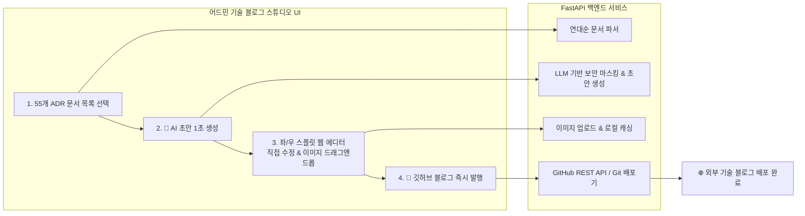

안녕하세요, **PickSafe Core Architecture Team**입니다.

스타트업과 프로덕트 팀이 성장함에 따라 가장 중요해지는 자산 중 하나는 바로 **'기술 의사결정 기록(ADR, Architecture Decision Record)'**입니다. 저희 PickSafe 팀 역시 수많은 기술적 고민과 트레이드오프를 거치며 55개의 방대한 ADR을 축적해 왔습니다. 

그리고 이 소중한 지식 자산을 대외용 기술 블로그(`daniel-dataflow.github.io`)를 통해 세상에 공유하고자 프로젝트를 시작했습니다. 하지만 이 과정에서 **"어떻게 하면 개발 생산성을 해치지 않으면서, 가장 매력적이고 무결한 형태로 글을 발행할 수 있을까?"**라는 치열한 고민을 마주했습니다.

이번 포스팅에서는 이 문제를 해결하기 위해 내부 어드민 웹 기반의 **'기술 블로그 스튜디오(Blog Studio)'**를 구축한 아키텍처적 고민과 엔지니어링 과정을 공유합니다.

---

## 1. 문제 정의 (Context & Problem Statement)

처음에는 GitHub Actions를 활용해 내부 문서 저장소와 블로그 저장소를 100% 자동 동기화하는 파이프라인을 구상했습니다. 하지만 곧 다음과 같은 한계와 딜레마에 부딪혔습니다.

1. **전면 자동화의 검수 불가 딜레마**
   - 100% 자동 변환은 편리하지만, 실제 발행될 글의 문맥, 강조 포인트, 생생한 디테일을 개발자(또는 대표님)가 사전에 눈으로 확인하고 보충하기 어렵습니다.
   - 그렇다고 블로그 레포지토리에서 직접 글을 수정하면, 추후 내부 저장소와의 단방향 동기화 과정에서 덮어씌워져 수정본이 유실될 위험이 컸습니다.
2. **시각적 검증의 부재**
   - 순수 마크다운 텍스트만으로는 실제 웹 브라우저에서 제목 서식, 줄바꿈, 이미지 배치가 어떻게 렌더링될지 실시간으로 확인하기 어려웠습니다.
3. **개발 도구 의존성**
   - 글 하나를 올리기 위해 매번 터미널에서 Git 명령어나 파이썬 스크립트를 수동 실행해야 한다면, 발행 주기가 자연스럽게 길어질 수밖에 없습니다.

> **"선택 ➔ AI 초안 ➔ 직접 수정 & 이미지 드래그앤드롭 ➔ 원클릭 발행"**이 브라우저 어드민 화면 안에서 완결되는 원스톱 CMS 솔루션이 절실히 필요했습니다.

---

## 2. 시스템 아키텍처 및 작업 흐름 (Architecture & Workflow)

이를 해결하기 위해 기존에 구축되어 있던 FastAPI 기반의 내부 어드민 웹 서비스 내부에 **'블로그 스튜디오'** 모듈을 확장했습니다.

### 핵심 컴포넌트 설계

* **FastAPI 백엔드 (`app/routers/admin/blog.py`)**
  - **문서 파싱**: 저장소 내의 ADR 문서들을 연대순 목록 순서대로 파싱하여 메타데이터와 함께 반환합니다.
  - **보안 마스킹 및 초안 생성**: LLM API를 활용해 내부 비즈니스 로직이나 민감할 수 있는 정보를 자동으로 마스킹하고, 기술 블로그 톤앤매너에 맞는 초안을 생성합니다.
  - **Git 연동**: 수정된 마크다운과 에셋을 GitHub REST API를 통해 외부 블로그 레포지토리로 직접 커밋 & 푸시합니다.
* **프론트엔드 UI (`blog.html`, `blog.js`, `blog.css`)**
  - 글래스모피즘(Glassmorphism) 디자인을 적용하여 모던한 감성을 살렸으며, **좌측 문서 탐색기, 중앙 스마트 마크다운 에디터, 우측 실시간 라이브 렌더링 뷰포트**의 3단 스플릿 구조로 사용자 경험을 극대화했습니다.

---

## 3. 기술적 고민과 Trade-off

### Q1. 왜 별도의 CMS를 구축하지 않고 어드민에 통합했는가?
- **대안**: WordPress나 Ghost 같은 상용/ 오픈소스 CMS 도입
- **선택**: 내부 FastAPI 어드민 내장 모듈 구현
- **이유**: PickSafe의 ADR 문서는 이미 내부 레포지토리에 마크다운 형태로 존재합니다. 외부 CMS를 도입하면 문서 싱크를 맞추기 위해 불필요한 웹훅과 동기화 로직이 추가되어 시스템 복잡도가 급증합니다. 기존 어드민의 인증/인가 시스템을 그대로 재사용하고, 파일 시스템에 직접 접근하는 방식이 유지보수 관점에서 훨씬 가볍고 안전하다고 판단했습니다.

### Q2. 보안 정보 유출 방지 (Security First)
- 내부 기술 문서를 외부로 발행할 때 가장 경계해야 할 것은 **비밀 키, 내부 API 엔드포인트, DDL 스키마 원본 등의 영업비밀 노출**입니다.
- 이를 위해 AI 초안 생성 단계(`POST /admin/api/blog/generate-draft`)에서 백엔드 레벨과 프롬프트 레벨의 이중 필터를 거쳐 민감 정보를 마스킹하도록 설계했습니다. 발행 직전 최종 검수 단계를 거치기 때문에 휴먼 에러로 인한 보안 사고를 원천 차단합니다.

---

## 4. 마무리 및 Takeaway

이번 블로그 스튜디오 구축을 통해 PickSafe 팀은 다음과 같은 이점을 얻었습니다.

1. **AI 초안 80% + 개발자 디테일 20%의 앙상블**: AI가 빠르게 뼈대를 잡고, 개발자가 핵심 인사이트와 뉘앙스를 다듬어 최고 퀄리티의 포스팅을 단 몇 분 만에 생산할 수 있게 되었습니다.
2. **생산성과 안정성의 동시 확보**: 로컬 개발 환경(`http://localhost:8100/admin/blog`)에서도 브라우저만 띄우면 즉시 작업이 가능하며, 검수 완료된 클린한 콘텐츠만 안전하게 배포됩니다.

좋은 기술을 만드는 것만큼, 그 기술의 여정을 투명하고 매력적으로 기록하는 것도 엔지니어링의 중요한 일부입니다. 앞으로 발행될 PickSafe의 기술 블로그 포스팅들에 많은 관심 부탁드립니다!