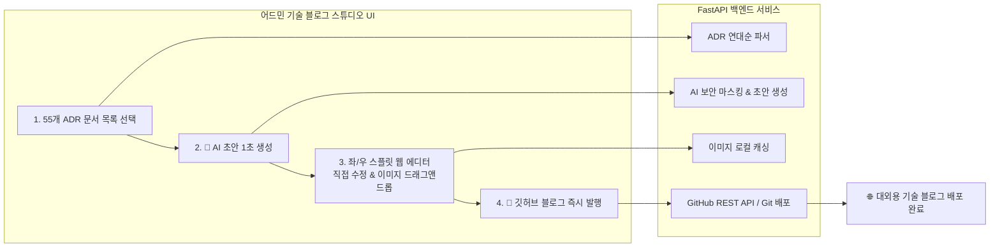

안녕하세요, PickSafe Core Architecture Team입니다.

스타트업이나 기술 조직에서 꾸준히 기술 블로그를 운영하는 것은 늘 고된 과제입니다. 특히 프로덕트 개발 과정에서 쏟아지는 수십 개의 기술 의사결정 문서(ADR)를 대외용 블로그 글로 가공하는 작업은 개발 생산성을 갉아먹는 주범이 되기도 합니다.

PickSafe는 현재까지 55개의 ADR을 축적해왔고, 이를 외부에 투명하게 공유하기 위해 대외용 블로그(`daniel-dataflow.github.io`)를 운영하고 있습니다. 초기에는 이 과정을 100% 자동화하려 했으나, 몇 가지 치명적인 한계에 부딪혔습니다. 

이번 글에서는 **전면 자동화의 딜레마를 해결하기 위해 사내 어드민 내부에 구축한 '기술 블로그 스튜디오(Blog Studio)'의 아키텍처와 기술적 고민(Trade-off)**을유감없이 공유해 드립니다.

---

## 1. Problem: 100% 자동화의 함정과 개발자 경험(DX)의 부재

초기 블로그 파이프라인은 GitHub Actions 기반의 완전 자동화 구조를 지향했습니다. 사내 저장소의 문서를 정기적으로 파싱해 블로그 레포지토리에 동기화하는 방식이었습니다. 하지만 곧 다음의 문제들이 수면 위로 떠올랐습니다.

1. **검수 불가 딜레마 (Human-in-the-Loop 부재)**
   - AI나 자동 스크립트가 변환한 초안을 사전에 눈으로 확인하고 문맥을 다듬을 수 있는 안전장치가 없었습니다.
   - 그렇다고 블로그 레포지토리에서 직접 글을 수정하면, 추후 사내 레포지토리에서 단방향 동기화가 일어날 때 수정본이 무참히 덮어씌워져 유실되는 위험이 있었습니다.
2. **시각적 검증의 부재**
   - 마크다운 원문 텍스트만으로는 실제 웹 브라우저에서 렌더링된 서식, 줄바꿈, 이미지 배치가 어떻게 보일지 예측하기 어려웠습니다.
3. **불필요한 컨텍스트 스위칭**
   - 글 하나를 올리기 위해 터미널을 열고 Git 명령어나 파이썬 스크립트를 수동 실행해야 했습니다. 

> **"브라우저 어드민 화면에서 '선택 ➔ AI 초안 ➔ 직접 수정 및 이미지 드래그앤드롭 ➔ 원클릭 발행'까지 한 번에 끝낼 수 없을까?"** 
> 이 고민에서 Blog Studio 프로젝트가 시작되었습니다.

---

## 2. Architecture: FastAPI와 GitHub REST API의 결합

전체 시스템은 직관적인 사용자 경험을 제공하기 위해 **FastAPI 백엔드**와 **반응형 웹 프론트엔드**로 설계되었습니다.

### 핵심 컴포넌트 및 동작 흐름

1. **문서 탐색 및 파싱 (`/admin/api/blog/decisions`)**
   - 사내 저장소의 ADR 디렉토리를 탐색하고, 인덱스 문서의 연대순 목록에 맞춰 번호, 제목, 작성일자, 초안 상태를 JSON으로 반환합니다.
2. **AI 기반 보안 마스킹 및 초안 생성 (`/admin/api/blog/generate-draft`)**
   - 영업비밀이나 내부 인프라 정보를 보호하기 위해, LLM 연동 단계에서 민감한 데이터(내부 엔드포인트, 시크릿 등)를 자동으로 마스킹합니다.
   - 동시에 개발자가 읽기 좋고 대외 독자들이 매력적으로 느낄 만한 기술 블로그 포맷으로 재가공합니다.
3. **미디어 핸들링 (`/admin/api/blog/upload-image`)**
   - 에디터 본문에 이미지를 드래그 앤 드롭하는 즉시 서버에 안전하게 캐싱하고, 마크다운 표준 상대 경로를 반환하여 즉시 렌더링되도록 구현했습니다.
4. **원클릭 퍼블리싱 (`/admin/api/blog/publish`)**
   - 최종 검수가 끝난 마크다운과 에셋을 GitHub REST API와 보안 토큰(PAT)을 활용해 블로그 레포지토리의 지정된 경로로이 직접 커밋 & 푸시합니다.

---

## 3. Engineering Decisions & Trade-offs

### Q. 왜 별도의 CMS를 두지 않고 기존 어드민 웹 내부에 구축했을까?
* **Trade-off (도입 비용 vs 파편화 방지)**: 외부 서드파티 CMS나 별도의 블로그 관리용 웹 서버를 구축하는 방법도 고려했습니다. 그러나 인증 인프라를 이중으로 관리해야 하고, 사내 데이터와의 연동성 측면에서 오버헤드가 컸습니다. 
* **결정**: 이미 구축되어 있는 FastAPI 기반 어드민 내부에 라우터와 뷰를 확장하는 방식을 택했습니다. 로컬 개발 환경(`http://localhost:8100/admin/blog`)에서도 별도의 인프라 없이 즉시 테스트할 수 있어 개발자 경험(DX)이 극대화되었습니다.

### Q. 자동 발행 대신 '휴먼 에디터' 단계를 고집한 이유
* **Trade-off (자동화의 효율성 vs 콘텐츠의 품질)**: 100% 자동화는 사람이 개입하지 않아 편하지만, 기술 블로그의 '품질'을 담보할 수 없습니다. AI가 놓친 맥락이나 어색한 표현이 그대로 노출되면 오히려 기술 조직의 브랜딩에 마이너스가 됩니다.
* **결정**: **"AI 초안 80% + 개발자 디테일 20%"** 조합을 타겟으로 잡았습니다. AI가 1초 만에 뼈대를 잡고, 개발자가 웹 에디터를 통해 문장을 매끄럽게 다듬고 이미지를 배치하는 구조가 가장 완벽한 앙상블을 낸다는 결론에 이르렀습니다.

---

## 4. Takeaway & Conclusion

이번 Blog Studio 구축을 통해 얻은 가장 큰 교훈은 **"자동화는 목적이 아니라 수단이어야 한다"**는 점입니다. 

모든 것을 시스템에 맡겨버리면 편리할 것 같지만, 사람이 최종적으로 검수하고 정제하는 '크래프트(Craft)'의 영역을 남겨두는 것이 결과적으로 더 높은 퀄리티의 결과물을 만들어냅니다.

PickSafe는 이제 터미널 창을 띄우거나 복잡한 Git 명령어를 치지 않고도, 어드민 화면에서 마우스 클릭 몇 번으로 우리의 치열한 기술적 고민들을 세상에 멋지게 공유할 수 있게 되었습니다. 앞으로도 PickSafe가 마주한 기술적 도전과 해결 과정들을 이 블로그 스튜디오를 통해 더 생생하게 전해드리겠습니다.

감사합니다.