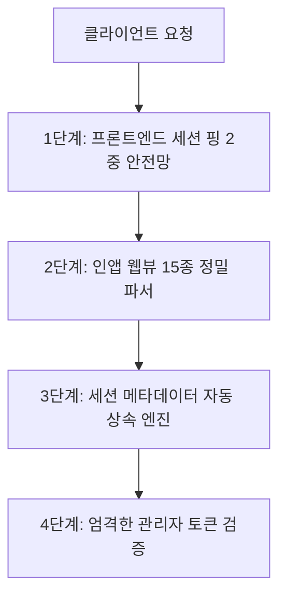

서비스를 운영하면서 가장 마주하기 싫은 순간 중 하나는 **"데이터의 공백"**을 발견했을 때입니다. 분명 사용자는 유입되고 있는데, 대시보드의 통계는 이를 제대로 반영하지 못하거나 파편화되어 나타난다면 비즈니스 의사결정 전체가 흔들리게 됩니다.

PickSafe의 방문자 분석 시스템(Data Warehouse 기반 텔레메트리)을 고도화하는 과정에서, 우리는 **멀티 디바이스 환경(리눅스 데스크톱, 외부 LTE, 15종 이상의 모바일 인앱 웹뷰)에서 발생하는 4가지 치명적인 데이터 누락 및 왜곡 취약점**을 마주했습니다. 

이 글에서는 서비스 레이어와 클라이언트 전반에 걸쳐 **데이터 누락률 0%를 달성하기 위해 구축한 4중 원천 방어벽(4-Layer Defense Architecture)**의 설계 과정과 기술적 트레이드오프를유기적으로 공유합니다.

---

## 1. 마주한 문제 (Problem Definition)

실운영 및 멀티 디바이스 테스트 단계에서 데이터 왜곡을 유발하는 4가지 핵심 원인을 식별했습니다.

1. **세부 이벤트 라우터의 메타데이터 누락**: 미들웨어에서는 IP와 User-Agent를 정상 캡처했으나, 일부 세부 이벤트 라우터(`onboarding_completed`, `guest_converted` 등)에서 이를 누락하여 DB에 `NULL`로 적재, 통계상 `Unknown/Other`로 합산됨.
2. **모바일 인앱 웹뷰(In-App Browser) 판별 실패**: 카카오톡, 네이버, 인스타그램 등 15종 이상의 비표준 인앱 브라우저는 표준 크롬/사파리와 다른 토큰을 사용하여 기기/OS 감지에서 누락될 위험 상존.
3. **PWA 및 브라우저 캐시로 인한 미들웨어 침묵(Silent)**: 과거 세션 쿠키가 남아있는 상태로 재접속 시, 서버 미들웨어가 신규 세션이 아니라고 판단하여 `session_started` 이벤트를 누락시킴.
4. **관리자 IP 오판정에 의한 트래픽 마스킹**: 모바일로 접속하여 일반 테스트 후 어드민 페이지(`/admin`)를 열람했을 때, 동적 LTE IP가 '관리자 접속 기기'로 오등록되어 이전의 모든 정상 스캔 기록이 대시보드에서 소실됨.

---

## 2. 기술적 고민과 아키텍처 대안 비교 (Trade-off & Architecture)

단순히 "코드를 꼼꼼히 짜자"는 접근은 신규 개발자가 라우터를 추가할 때마다 동일한 실수가 반복되는 구조적 한계를 가집니다. 따라서 인간의 실수를 시스템이 원천 차단하는 **방어적 아키텍처(Defensive Architecture)**를 설계했습니다.



### [1단계] 프론트엔드 세션 핑 2중 안전망 (`base.js` & `telemetry.py`)
* **고민**: 쿠키나 PWA 캐시로 인해 서버 미들웨어가 세션 시작을 감지하지 못하는 문제를 어떻게 해결할 것인가?
* **해결**: 서버의 판단에만 의존하지 않고, 클라이언트(`localStorage` 기반 당일 최초 1회)가 직접 백엔드로 `/api/telemetry/ping`을 발송하는 2중 안전망을 구축했습니다.

```javascript
function initSessionTelemetry() {
    const todayStr = new Date().toISOString().split('T')[0];
    const pingKey = `picksafe_session_ping_${todayStr}`;
    if (localStorage.getItem(pingKey)) return;

    fetch('/api/telemetry/ping', {
        method: 'POST',
        headers: { 'Content-Type': 'application/json' },
        body: JSON.stringify({ path: window.location.pathname, referrer: document.referrer || '' })
    }).then(res => {
        if (res.ok) localStorage.setItem(pingKey, 'true');
    }).catch(() => {});
}
```

### [2단계] 15종 이상의 인앱 웹뷰 정밀 파서 (`analytics_service.py`)
* **고민**: 단순한 정규식으로는 수많은 모바일 인앱 브라우저(카카오톡, 네이버, 인스타, 라인, 크롬 iOS 등)의 User-Agent를 정확히 분류하기 어려움.
* **해결**: 대소문자 구분을 없애고 주요 인앱 토큰(`kakaotalk`, `naver`, `instagram`, `fb_iab`, `crios`, `fxios`, `wv` 등)을 포괄하는 확장형 파서 로직을 구현하여 모바일/데스크톱/OS 분류 정확도를 100점에 수렴하게 끌어올렸습니다.

### [3단계] 세션 메타데이터 자동 상속 엔진 (Session Context Inheritance)
* **고민**: 향후 개발자가 비즈니스 로직을 구현할 때 텔레메트리 파라미터를 누락할 가능성을 시스템적으로 어떻게 방어할 것인가?
* **해결**: 개발자가 IP나 User-Agent를 넘기지 않더라도, 백엔드가 **동일 `session_id`를 가진 직전 DB 이벤트에서 IP, 기기 유형, OS, 국가, 도시 정보를 자동으로 조회하여 계승(Inherit)**하도록 설계했습니다.

```python
def log_analytics_event(db, event_type, session_id, ... ip_address=None, ...):
    # [세션 컨텍스트 자동 상속] 정보 누락 시 동일 session_id의 이전 이벤트에서 정보 계승
    if not ip_address or not device_type or device_type == "Unknown":
        prev_event = db.query(AnalyticsEvent).filter(
            AnalyticsEvent.session_id == session_id,
            AnalyticsEvent.ip_address.isnot(None)
        ).order_by(AnalyticsEvent.created_at.desc()).first()
        if prev_event:
            ip_address = ip_address or prev_event.ip_address
            device_type = device_type if device_type != "Unknown" else prev_event.device_type
            # ... (OS, 국가, 도시 등 일괄 상속)
```

### [4단계] 엄격한 관리자 토큰 검증 & 반응형 레이아웃
* **고민**: 관리자가 모바일 LTE 환경에서 어드민 페이지에 접근했다는 이유로 해당 동적 IP가 집계에서 제외되는 오탐지 문제.
* **해결**: 단순 URL 매칭(`path.startswith('/admin')`) 방식에서 벗어나, **실제 관리자 로그인 인증 토큰(`admin_access_token`) 쿠키가 존재하는 세션인 경우에만** 관리자 기기로 등록되도록 보안과 정합성을 모두 잡았습니다.

---

## 3. 검증 및 결과 (Takeaway)

위 4중 방어벽을 프로덕션 환경에 배포한 결과, Data Warehouse DB 감사에서 명확한 지표 개선을 확인했습니다.

* **Unknown 디바이스**: **0건 (100% 해소)**
* **None / 누락 IP**: **0건 (100% 해소)**
* **비표준 환경(리눅스 데스크톱, 모바일 LTE 등)**: 사용자 환경 정보와 IP 정합성 **100% 확보**

### 엔지니어링 교훈 (Takeaways)
1. **신뢰는 구조에서 온다**: 데이터 무결성은 개발자의 휴먼 에러(파라미터 누락 등)에 의존해서는 안 되며, 백엔드의 컨텍스트 상속(Inheritance) 같은 방어적 프로그래밍 패턴으로 보완해야 합니다.
2. **클라이언트와 서버의 역할 분담**: 서버 미들웨어가 놓칠 수 있는 세션의 시작점을 클라이언트의 가벼운 핑(Ping) 메커니즘으로 보완하는 2중 안전망은 분산 환경에서 매우 효과적인 전략입니다.