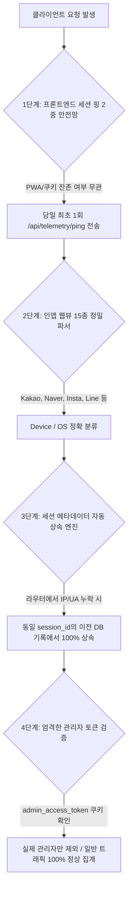

서비스를 운영하면서 가장 마주하기 싫은 순간 중 하나는 **"데이터의 신뢰성이 깨졌을 때"**입니다. 

PickSafe의 방문자 분석 시스템(Data Warehouse 기반 텔레메트리)은 사용자의 실제 이용 흐름과 기기 환경을 실시간으로 추적하는 핵심 인프라입니다. 하지만 멀티 디바이스와 다양한 브라우저 환경에서 실운영 테스트를 진행하던 중, 데이터가 누락되거나 왜곡되는 치명적인 취약점들을 발견했습니다.

이번 글에서는 운영 환경에서 발생한 **4가지 데이터 왜곡 문제**를 해결하기 위해 도입한 **4중 원천 방어벽(4-Layer Defense Architecture)**의 아키텍처적 고민과 트레이드오프(Trade-off), 그리고 엔지니어링 교훈을 공유합니다.

---

## 1. 문제 정의 (Problem Statement): 마주했던 4대 데이터 왜곡 취약점

초기 구현된 텔레메트리 파이프라인은 이상적인 환경(표준 크롬/사파리, 단일 세션 흐름)만을 상정하고 설계되었습니다. 그러나 현실의 웹 환경은 훨씬 복잡했습니다.

1. **세부 이벤트 라우터의 메타데이터 누락**: 
   - 최초 접속(`session_started`) 시에는 IP와 User-Agent를 정상 캡처했으나, 이후 특정 비즈니스 라우터(`onboarding_completed`, `guest_converted` 등)에서는 메타데이터를 누락시켜 DB에 `ip_address = NULL`, `device_type = NULL`로 적재되는 현상 발생 (통계상 `Unknown/Other`로 합산 왜곡).
2. **모바일 인앱 웹뷰(In-App Browser) 판별 실패**: 
   - 카카오톡, 네이버, 인스타그램 등 15종 이상의 비표준 인앱 브라우저는 표준 크롬/사파리와 다른 User-Agent 토큰을 사용하여 기기 및 OS 감지에서 누락.
3. **PWA 및 브라우저 캐시 환경의 세션 미들웨어 침묵(Silent)**: 
   - 과거 발급받은 세션 쿠키가 남아있는 상태로 PWA나 브라우저 재접속 시, 서버 미들웨어가 신규 세션이 아니라고 판단하여 `session_started` 이벤트를 누락.
4. **관리자 IP 오판정에 의한 일반 모바일 트래픽 마스킹**: 
   - 모바일로 접속해 서비스를 이용한 뒤, 운영 확인차 관리자 페이지(`/admin`)에 접속했을 때 미들웨어가 동적 LTE IP를 '관리자 기기(집계 제외)'로 자동 등록하여 이전의 모든 이용 기록이 대시보드에서 소실되는 문제.

---

## 2. 기술적 고민과 대안 비교 (Trade-offs)

이 문제를 해결하기 위해 백엔드 코드 몇 줄을 수정하는 것(Patch)이 아니라, **"어떤 상황에서도 메타데이터 누락률 0%를 보장하는 아키텍처"**를 고민했습니다.

### 대안 1: 미들웨어 레벨에서의 강제 주입 (단일 방어선)
- **방식**: 모든 요청을 가로채는 FastAPI Middleware에서 무조건 IP와 UA를 파싱하여 컨텍스트에 박아넣는 방식.
- **장점**: 구현이 단순하고 중앙집중식 관리 가능.
- **단점 (Trade-off)**: PWA 캐시로 인해 미들웨어가 요청을 거르거나(세션 생성 안 함), 특정 비동기/정적 리소스 요청에서 오버헤드가 발생함. 또한 인앱 브라우저의 복잡한 UA 패턴을 미들웨어나 단일 함수에서 처리하기엔 한계가 명확함.

### 대안 2: 프론트엔드-백엔드 연계형 4중 원천 방어벽 (채택)
- **방식**: 클라이언트 사이드의 핑(Ping) 메커니즘, 확장된 인앱 파서, 백엔드의 자동 상속 엔진, 그리고 엄격한 어드민 토큰 검증을 결합한 다중 레이어 방어 체계.
- **장점**: 단일 지점이 실패하더라도 다음 레이어에서 데이터를 보정하거나 방어(`Defense in Depth`)하므로 시스템 탄력성(Resilience)이 극대화됨.
- **단점**: 코드가 분산되며 프론트엔드와 백엔드 간의 상태 동기화 설계가 필요함.

우리는 데이터의 무결성과 결함 허용성(Fault Tolerance)을 위해 **대안 2(4중 원천 방어벽)**를 채택했습니다.

---

## 3. 4중 원천 방어벽 아키텍처 구현



### 1단계: 프론트엔드 세션 핑 2중 안전망 (`base.js`)
브라우저 쿠키나 PWA 캐시 상태와 무관하게, `localStorage`에 당일 핑 기록(`picksafe_session_ping_{YYYY-MM-DD}`)이 없다면 백엔드로 즉시 `POST /api/telemetry/ping`을 발송하여 세션 시작을 강제 보장합니다.

### 2단계: 15종 이상의 인앱 웹뷰 정밀 파서 (`analytics_service.py`)
카카오톡, 네이버, 인스타그램, 라인, 크롬 iOS(`CriOS`) 등 비표준 모바일 User-Agent 토큰을 정규화하여 `Mobile`, `Desktop`, `iOS`, `Android` 등을 100% 정확하게 추출합니다.

### 3단계: 세션 메타데이터 자동 상속 엔진 (Session Context Inheritance)
개발자가 신규 라우터 개발 시 실수로 메타데이터를 넘기지 않더라도, **백엔드가 동일 `session_id`를 가진 직전 DB 이벤트에서 IP, 기기 유형, OS 등의 정보를 자동 조회하여 계승(Inherit)**합니다.

```python
# web/backend/app/services/analytics_service.py (개념 코드)
def log_analytics_event(db, event_type, session_id, ...):
    if not ip_address or not device_type or device_type == "Unknown":
        # 동일 세션의 직전 이벤트에서 메타데이터 자동 상속
        prev_event = db.query(AnalyticsEvent).filter(
            AnalyticsEvent.session_id == session_id,
            AnalyticsEvent.ip_address.isnot(None)
        ).order_by(AnalyticsEvent.created_at.desc()).first()
        
        if prev_event:
            ip_address = ip_address or prev_event.ip_address
            device_type = device_type if device_type != "Unknown" else prev_event.device_type
            # ... OS, 국가, 도시 등 자동 계승
```

### 4단계: 엄격한 관리자 인증 토큰 검증
단순 경로(`/admin`) 접근으로는 관리자로 등록되지 않으며, **실제 관리자 로그인 인증 토큰(`admin_access_token`) 쿠키가 존재하는 세션인 경우에만** 관리자 기기로 등록됩니다. 따라서 모바일 LTE 사용자가 어드민 페이지를 구경하더라도 일반 트래픽이 마스킹되지 않습니다.

---

## 4. 검증 결과 및 Takeaways

이 아키텍처를 도입한 결과, 데이터 웨어하우스(DW DB) 전수 감사에서 다음과 같은 극적인 변화를 확인했습니다.

- `Unknown` 디바이스: **0건 (100% 해소)**
- 누락된 IP (`None`): **0건 (100% 해소)**
- 리눅스 데스크톱 및 모바일 LTE 환경에서의 세션 정합성 완벽 확보

### 💡 엔지니어링 Takeaway
1. **"가정을 믿지 말고, 방어선을 구축하라"**: 개발자의 휴먼 에러(라우터에서 파라미터 누락 등)나 클라이언트의 비정상적인 캐시 동작은 언제나 발생할 수 있습니다. 시스템 설계 단계에서 이를 원천 차단하는 **자동 상속/보정 메커니즘**의 유무가 데이터 프로덕트의 신뢰도를 결정합니다.
2. **다중 레이어의 힘**: 하나의 완벽한 코드를 짜는 것보다, 프론트엔드(핑) -> 파서(인앱 대응) -> 백엔드(자동 상속) -> 인증(토큰 검증)으로 이어지는 **4중 방어선**이 운영 환경의 변수로부터 서비스를 안전하게 지켜줍니다.

---
*PickSafe Data Platform & Telemetry Team*