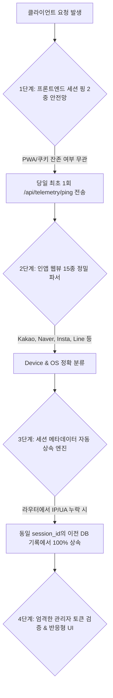

안녕하세요, PickSafe Data Platform & Telemetry Team입니다. 

서비스를 운영하면서 가장 진땀을 빼는 순간 중 하나는 **"대시보드의 데이터가 실제 사용자 행동과 다를 때"**입니다. 사용자들은 분명 활발하게 서비스를 이용하고 있는데, 통계 툴이나 내부 댈러스 대시보드에는 `Unknown` 기기나 `NULL` 값으로 찍히는 데이터가 발생하기 시작했습니다.

이번 포스팅에서는 멀티 디바이스 환경(리눅스 데스크톱, 외부 LTE 모바일, 15종 이상의 비표준 인앱 브라우저 등)에서 발생했던 **4대 데이터 누락 및 왜곡 취약점**을 분석하고, 이를 근본적으로 해결하기 위해 구축한 **'4중 원천 방어벽(4-Layer Telemetry Defense Architecture)'**의 아키텍처와 기술적 고민(Trade-off)을 공유하고자 합니다.

---

## 1. 문제 정의: 텔레메트리 데이터가 왜곡되던 4가지 순간

PickSafe의 방문자 분석 시스템은 사용자 접속부터 스캔, 찜, 회원 전환까지의 전체 퍼널을 실시간으로 추적합니다. 하지만 멀티 디바이스 테스트 과정에서 다음과 같은 치명적인 데이터 왜곡 요인들을 발견했습니다.

1. **세부 이벤트 라우터의 메타데이터 누락**: 
   미들웨어에서는 IP와 User-Agent를 잘 잡아놓고도, 개별 라우터(`onboarding_completed`, `guest_converted` 등)에서 백엔드로 이를 전달하지 않아 DB에 `ip_address = NULL`로 적재되는 현상.
2. **모바일 인앱 웹뷰(In-App Browser) 판별 실패**: 
   카카오톡, 네이버, 인스타그램 등 15종이 넘는 모바일 인앱 브라우저는 표준 브라우저와 다른 User-Agent 토큰을 사용하여 기기/OS 감지 로직을 우회해 버림.
3. **PWA/브라우저 캐시 환경의 미들웨어 침묵(Silent)**: 
   브라우저에 기존 `session_id` 쿠키가 남아있는 상태로 재접속할 경우, 서버 미들웨어가 "신규 세션이 아니다"라고 판단하여 `session_started` 이벤트를 누락시킴.
4. **관리자 IP 오판정에 의한 트래픽 마스킹**: 
   관리자가 모바일로 접속해 서비스를 테스트한 뒤 호기심에 어드민 페이지(`/admin`)를 열람했을 때, 미들웨어가 해당 모바일의 동적 LTE IP를 '관리자 접속 기기'로 등록해 버려 **이전의 모든 일반 스캔 기록이 대시보드에서 통째로 숨겨지는 문제**.

---

## 2. 기술적 고민과 대안 비교 (Trade-off)

이 문제를 해결하기 위해 두 가지 방향을 두고 고민했습니다.

* **대안 A: 프론트엔드/백엔드 호출부 전수 조사 및 수정 (Strict Validation)**
  * *장점*: 정석적인 방법. 모든 API 호출 시 명시적으로 클라이언트 메타데이터를 전달하도록 강제함.
  * *단점*: 향후 개발자들이 새로운 라우터나 이벤트를 추가할 때 휴먼 에러가 발생할 확률이 매우 높음. 근본적인 방어선이 아님.
* **대안 B: 방어적 프로그래밍과 자동화 계층을 결합한 다중 안전망 (4-Layer Defense)**
  * *장점*: 개발자의 실수가 있더라도 백엔드와 프론트엔드가 양방향에서 데이터를 보정하고 방어함. `Unknown` 발생률을 이론상 0%로 수렴시킬 수 있음.
  * *단점*: 백엔드 로직의 복잡도가 소폭 증가하며, 데이터베이스 쿼리 최적화에 신경 써야 함.

우리는 **데이터의 무결성과 신뢰성**이 비즈니스 지표 산출에 있어 타협할 수 없는 가치라고 판단하여 **대안 B(4중 원천 방어벽)**를 채택했습니다.

---

## 3. 4중 원천 방어벽 설계 및 구현



### [1단계] 프론트엔드 세션 핑 2중 안전망 (`base.js`)
쿠키나 PWA 캐시 상태로 인해 미들웨어가 세션 시작을 감지하지 못하는 문제를 해결하기 위해, 클라이언트 사이드에서 당일 최초 접속 시 강제로 핑을 날리는 안전망을 구축했습니다.
```javascript
function initSessionTelemetry() {
    const todayStr = new Date().toISOString().split('T')[0];
    const pingKey = `picksafe_session_ping_${todayStr}`;
    if (localStorage.getItem(pingKey)) return;

    fetch('/api/telemetry/ping', {
        method: 'POST',
        headers: { 'Content-Type': 'application/json' },
        body: JSON.stringify({ path: window.location.pathname, referrer: document.referrer || '' })
    }).then(res => {
        if (res.ok) localStorage.setItem(pingKey, 'true');
    }).catch(() => {});
}
```

### [2단계] 15종 이상의 인앱 웹뷰 정밀 파서 (`analytics_service.py`)
표준 크롬/사파리 외에 국내외 주요 인앱 브라우저(`KakaoTalk`, `Naver`, `Instagram`, `Line`, `CriOS` 등)의 User-Agent 패턴을 분석하여 모바일/데스크톱 및 OS를 정밀하게 분류하는 파서를 구현했습니다.
```python
def parse_user_agent(user_agent: str) -> Tuple[str, str]:
    ua = (user_agent or "").lower()
    # 인앱 웹뷰 및 비표준 토큰 정밀 감지
    is_mobile = (
        "mobile" in ua or "iphone" in ua or "kakaotalk" in ua or 
        "naver" in ua or "instagram" in ua or "line" in ua or 
        "crios" in ua or "wv" in ua or os_name in ("iOS", "Android")
    )
    device_type = "Tablet" if is_tablet else ("Mobile" if is_mobile and os_name not in ("macOS", "Windows") else "Desktop")
    return device_type, os_name
```

### [3단계] 세션 메타데이터 자동 상속 엔진 (Session Context Inheritance)
개발자가 신규 라우터 개발 시 실수로 메타데이터를 누락하더라도 데이터가 유실되지 않도록, 백엔드에서 **동일한 `session_id`를 가진 직전 이벤트의 IP와 기기 정보를 자동으로 조회하여 계승(Inherit)**하는 방어 로직을 추가했습니다.
```python
def log_analytics_event(db, event_type, session_id, ...):
    # IP나 디바이스 정보가 누락된 경우 동일 session_id의 이전 이벤트에서 자동 상속
    if not ip_address or not device_type or device_type == "Unknown":
        prev_event = db.query(AnalyticsEvent).filter(
            AnalyticsEvent.session_id == session_id,
            AnalyticsEvent.ip_address.isnot(None)
        ).order_by(AnalyticsEvent.created_at.desc()).first()
        
        if prev_event:
            ip_address = ip_address or prev_event.ip_address
            device_type = device_type if device_type != "Unknown" else prev_event.device_type
            # ... (OS, 국가, 도시 등 일괄 상속)
```

### [4단계] 엄격한 관리자 토큰 검증 & 모바일 반응형 레이아웃
단순 URL 접근으로 일반 사용자의 LTE IP가 관리자로 오인 등록되는 버그를 방어하기 위해, **실제 관리자 인증 토큰 쿠키(`admin_access_token`)가 존재하는 세션**에만 관리자 권한을 부여하도록 수정했습니다. 또한 모바일 뷰포트에서 통계 테이블이 깨지지 않도록 `min-width`와 터치 스크롤 최적화를 적용했습니다.

---

## 4. 엔지니어링 교훈 및 결과 (Takeaways)

이번 아키텍처 개선을 통해 얻은 성과는 명확했습니다.

* **데이터 무결성 확보**: DW DB 전수 감사 결과, `Unknown` 디바이스 및 누락된 IP가 **0건(100% 해소)**으로 수렴했습니다.
* **휴먼 에러에 대한 방어력(Resilience)**: 새로운 기능을 개발할 때 비즈니스 로직 외의 트래킹 코드 누락에 대한 부담감이 크게 줄어들었습니다. 시스템 스스로 데이터를 보정할 수 있기 때문입니다.

데이터 기반 서비스에서 정확한 텔레메트리는 모든 의사결정의 출발점입니다. 단단한 아키텍처 설계는 결국 제품의 신뢰성으로 직결된다는 것을 다시 한번 배운 계기가 되었습니다.