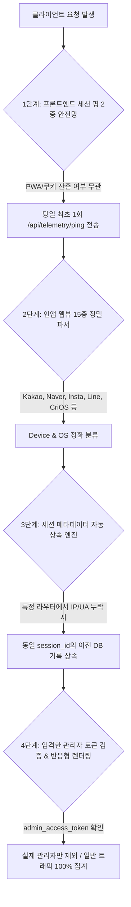

서비스를 운영하면서 가장 마주하기 싫은 순간 중 하나는 **"데이터의 공백"**을 발견했을 때입니다. 실제 사용자들은 활발히 서비스를 이용하고 있는데, 데이터 웨어하우스(DW) 분석 대시보드에는 `Unknown` 기기나 `NULL` IP가 찍히거나, 특정 테스트 이후 전체 트래픽이 신기루처럼 사라지는 현상이 발생한다면 어떨까요?

PickSafe의 방문자 분석 시스템(Telemetry)을 고도화하는 과정에서 우리는 정확히 이와 같은 데이터 누락 및 왜곡 취약점과 마주했습니다. 

이번 글에서는 신규 라우터 개발 누락, 모바일 인앱 브라우저의 다양성, PWA 캐시 환경, 그리고 운영자 IP 오판정이라는 4가지 현실적인 문제를 해결하기 위해 적용한 **'4중 원천 방어벽(4-Layer Telemetry Defense Architecture)'**의 아키텍처와 트러블슈팅 경험을유유히 공유하려 합니다.

---

## 1. 마주한 문제: 4대 데이터 왜곡 취약점

초기 운영 단계의 텔레메트리 파이프라인은 미들웨어 중심의 단순한 구조였습니다. 하지만 멀티 디바이스(리눅스 데스크톱, 외부 LTE 모바일, 인앱 브라우저 등) 환경에서 테스트를 진행하며 다음과 치명적인 취약점들이 드러났습니다.

1. **라우터 파편화로 인한 메타데이터 누락**: 
   - `session_started` 이벤트는 미들웨어에서 잘 잡았지만, 이후 사용자가 접하는 세부 이벤트 라우터(`onboarding_completed`, `guest_converted` 등)에서 IP와 User-Agent를 명시적으로 넘기지 않아 DB에 `NULL`로 적재되는 현상이 발생했습니다.
2. **모바일 인앱 웹뷰(In-App Browser) 감지 실패**: 
   - 카카오톡, 네이버, 인스타그램 등 국내외 주요 인앱 브라우저는 표준 크롬/사파리와 다른 독자적인 User-Agent 토큰을 사용합니다. 기존 파서는 이를 처리하지 못해 기기 정보가 누락되었습니다.
3. **PWA 및 브라우저 캐시로 인한 세션 미들웨어 침묵(Silent)**: 
   - 브라우저에 과거 `session_id` 쿠키가 남아있는 상태로 재접속할 경우, 서버 미들웨어가 신규 세션이 아니라고 판단하여 `session_started` 이벤트를 아예 발생시키지 않았습니다.
4. **관리자 IP 오판정에 의한 일반 모바일 트래픽 마스킹**: 
   - 모바일로 서비스를 테스트하다가 운영 확인차 관리자 페이지(`/admin`)에 접속하면, 미들웨어가 해당 동적 LTE IP를 '관리자 접속 기기'로 자동 등록했습니다. 이로 인해 이전에 발생했던 일반 사용자로서의 모든 스캔 기록이 대시보드 통계에서 통째로 숨겨지는 치명타가 발생했습니다.

---

## 2. 4중 원천 방어벽(4-Layer Defense) 아키텍처 설계

우리의 목표는 명확했습니다. **향후 어떠한 비정상 요청이나 개발자의 실수가 있더라도 `Unknown`, `None`, 메타데이터 누락이 0%가 되도록 시스템적으로 차단**하는 것입니다.



---

### [1단계] 프론트엔드 세션 핑 2중 안전망
브라우저 쿠키나 PWA 캐시 상태에 의존하지 않고, 클라이언트가 로드될 때 `localStorage`에 당일 날짜 기반의 핑 기록(`picksafe_session_ping_{YYYY-MM-DD}`)이 있는지 확인합니다. 
당일 최초 접속이라면 백엔드로 즉시 `POST /api/telemetry/ping`을 발송하여, 쿠키 잔존 여부와 무관하게 DW에 `session_started` 이벤트가 100% 적재되도록 보장했습니다.

### [2단계] 15종 이상의 인앱 웹뷰 정밀 파서
서버단(`analytics_service.py`)에서 카카오톡, 네이버, 인스타그램, 페이스북 IAB, 라인, 삼성브라우저, 크롬 iOS(`CriOS`), 안드로이드 웹뷰(`wv`) 등 비표준 토큰을 모두 식별할 수 있도록 정규화된 파서를 구축했습니다. 대소문자나 토큰 순서에 구애받지 않고 모바일/데스크톱 및 OS를 정밀하게 분류합니다.

### [3단계] 세션 메타데이터 자동 상속 엔진 (Session Context Inheritance)
가장 엔지니어링적으로 만족도가 높았던 부분입니다. 개발자가 향후 새로운 라우터를 개발하다가 실수로 IP나 User-Agent를 이벤트 로깅 함수에 전달하지 않더라도, **백엔드가 동일 `session_id`를 가진 직전 DB 이벤트에서 IP, 기기 유형, OS, 국가/도시 정보를 자동으로 조회하여 계승(Inherit)**하도록 구현했습니다.

```python
def log_analytics_event(db, event_type, session_id, ...):
    # [세션 컨텍스트 자동 상속] IP나 디바이스 정보가 누락된 경우 동일 session_id의 이전 이벤트에서 정보 계승
    if not ip_address or not device_type or device_type == "Unknown" or not os_name or os_name == "Other":
        prev_event = db.query(AnalyticsEvent).filter(
            AnalyticsEvent.session_id == session_id,
            AnalyticsEvent.ip_address.isnot(None)
        ).order_by(AnalyticsEvent.created_at.desc()).first()
        if prev_event:
            ip_address = ip_address or prev_event.ip_address
            device_type = device_type if (device_type and device_type != "Unknown") else prev_event.device_type
            os_name = os_name if (os_name and os_name != "Other") else prev_event.os_name
            ...
```
이로 인해 휴먼 에러로 인한 데이터 누락 가능성을 아키텍처 레벨에서 원천 차단했습니다.

### [4단계] 엄격한 관리자 인증 토큰 검증 및 UI 방어
- **관리자 판정 로직 강화**: 단순 경로(`/admin`) 접근으로는 관리자로 등록되지 않으며, 유효한 **관리자 로그인 인증 토큰(`admin_access_token`) 쿠키가 존재하는 세션인 경우에만** 관리자 기기로 등록되도록 변경했습니다. 이제 개발/운영자가 모바일 LTE로 어드민을 둘러보아도 일반 사용자 트래픽이 마스킹되지 않습니다.
- **모바일 반응형 테이블**: 8개 컬럼의 복잡한 대시보드 테이블이 모바일 뷰포트(360px)에서 찌그러지지 않도록 `min-width: 760px`과 `-webkit-overflow-scrolling: touch`를 적용해 모바일/PC 어디서나 매끄러운 터치 스크롤 경험을 제공합니다.

---

### 3. 검증 결과 및 Takeaways

위 아키텍처를 프로덕션 환경에 배포한 후 DW DB 전수 레코드를 감사한 결과는 고무적이었습디다.

- `Unknown` 디바이스: **0건 (100% 해소)**
- `None` / 누락 IP: **0건 (100% 해소)**
- 리눅스 데스크톱, 모바일 LTE 환경에서의 스캔 세션 및 사용자 여정 타임라인이 누락 없이 완벽히 정합성을 유지했습니다.

#### 💡 Engineering Takeaway
1. **클라이언트 상태에만 의존하지 마라**: PWA나 브라우저 캐시는 서버의 세션 관리와 어긋날 수 있습니다. 프론트엔드에서 독자적인 가벼운 핑(Ping) 메커니즘을 두는 것이 안정성을 크게 높여줍니다.
2. **방어 코드는 '사람'이 아니라 '시스템'이 하라**: 개발자가 코드를 작성할 때마다 메타데이터를 넘기는지 강제하기보다, 서버 레이어에서 이전 컨텍스트를 자동 상속(Inheritance)받는 구조를 만드는 것이 휴먼 에러를 방어하는 가장 확실한 방법입니다.

안정적인 데이터 파이프라인은 정확한 비즈니스 의사결정의 기초입니다. PickSafe는 이번 4중 방어벽 설계를 통해 신뢰할 수 있는 데이터 인프라의 기틀을 단단히 다졌습니다.