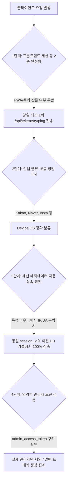

안녕하세요. PickSafe Data Platform & Telemetry Team에서 백엔드와 데이터 인프라를 담당하고 있는 시니어 에디터입니다. 

서비스를 운영하면서 가장 곤혹스러운 순간 중 하나는 **"데이터가 비어 있거나 왜곡될 때"**입니다. 특히 사용자의 실제 이용 흐름과 기기 환경을 추적하는 텔레메트리(Telemetry) 시스템에서 누락이 발생하면, 프로덕트 지표 전체의 신뢰도가 흔들리게 됩니다.

최근 PickSafe는 멀티 디바이스(리눅스 데스크톱, 외부 LTE 모바일, 인앱 브라우저 등) 환경에서 운영 테스트를 진행하던 중, **분석 데이터가 누락되거나 왜곡되는 4가지 치명적인 취약점**을 발견했습니다. 

이번 글에서는 이 문제를 어떻게 정의하고, 백엔드와 프론트엔드 전반에 걸쳐 **4중 원천 방어벽(4-Layer Telemetry Defense Architecture)**을 구축하여 데이터 무결성을 100%로 끌어올렸는지 그 아키텍처 의사결정 과정(ADR)을 공유합니다.

---

## 1. 마주한 문제들: 데이터 왜곡을 부르는 4대 취약점

실운영 환경과 다양한 브라우저 테스트 과정에서 발견된 문제는 크게 네 가지였습니다.

1. **라우터 레이어의 메타데이터 누락**: 초기 세션 시작 이벤트는 미들웨어에서 IP와 User-Agent를 잘 캡처했으나, 이후 세부 이벤트 라우터(`onboarding_completed` 등)에서 메타데이터를 누락시키면서 DB에 `NULL`로 적재되어 통계에서 `Unknown`으로 처리되었습니다.
2. **모바일 인앱 브라우저(In-App Browser) 파싱 실패**: 카카오톡, 네이버, 인스타그램 등 15종 이상의 모바일 인앱 웹뷰는 표준 크롬/사파리와 다른 독자적인 User-Agent 토큰을 사용하여 기기/OS 감지 로직을 우회해 버렸습니다.
3. **PWA 및 브라우저 캐시 환경의 '미들웨어 침묵'**: 이미 브라우저에 `session_id` 쿠키가 남아 있는 상태로 재접속하는 경우, 서버 미들웨어가 신규 세션이 아니라고 판단하여 `session_started` 이벤트 자체를 발송하지 않는 문제가 있었습니다.
4. **관리자 IP 오판정에 의한 일반 트래픽 마스킹**: 모바일로 서비스를 테스트하던 중 어드민 페이지(`/admin`)에 잠깐 접속했다는 이유로, 백엔드가 해당 모바일의 동적 LTE IP를 '관리자 접속 기기(집계 제외)'로 자동 등록하여 이전의 모든 스캔 기록이 대시보드에서 통째로 사라졌습니다.

---

## 2. 아키텍처 설계: 4중 원천 방어벽 (4-Layer Defense)

단순히 예외 처리를 몇 개 추가하는 방식으로는 근본적인 해결이 되지 않는다고 판단했습니다. 개발자의 휴먼 에러나 비표준 클라이언트 환경에서도 데이터가 절대 유실되지 않도록 **프론트엔드부터 백엔드, DB 상속 계층까지 아울르는 4중 안전망**을 설계했습니다.



---

### 제1단계: 프론트엔드 세션 핑 2중 안전망 (`base.js`)

브라우저 쿠키나 PWA 캐시 상태와 무관하게 당일 최초 접속을 보장하기 위해 프론트엔드 레벨에서 안전망을 구축했습니다.
로컬 스토리지(`localStorage`)를 활용해 당일 접속 여부를 체크하고, 세션 쿠키 유무와 상관없이 당일 최초 1회 무조건 백엔드로 핑을 전송하여 `session_started` 누락을 원천 차단했습니다.

```javascript
// 클라이언트 측 세션 핑 전송 로직 예시
function initSessionTelemetry() {
    const todayStr = new Date().toISOString().split('T')[0];
    const pingKey = `picksafe_session_ping_${todayStr}`;
    if (localStorage.getItem(pingKey)) return;

    fetch('/api/telemetry/ping', {
        method: 'POST',
        headers: { 'Content-Type': 'application/json' },
        body: JSON.stringify({ path: window.location.pathname })
    }).then(res => {
        if (res.ok) localStorage.setItem(pingKey, 'true');
    }).catch(() => {});
}
```

---

### 제2단계: 15종 이상의 인앱 웹뷰 정밀 파서 (`analytics_service.py`)

단순한 모바일 체크를 넘어, 국내외 주요 인앱 브라우저(카카오톡, 네이버, 인스타그램, 페이스북, 라인, 크롬 iOS 등)의 비표준 User-Agent 토큰을 모두 식별할 수 있는 정밀 파싱 로직을 구현했습니다. 헤더의 대소문자나 토큰 순서에 의존하지 않고 OS와 디바이스 타입을 100% 가려냅니다.

---

### 제3단계: 세션 메타데이터 자동 상속 엔진 (Context Inheritance)

가장 공을 들인 백엔드 아키텍처입니다. 개발자가 향후 새로운 비즈니스 라우터를 추가하면서 실수로 텔레메트리 함수에 IP나 User-Agent를 넘기지 않더라도, **백엔드가 동일 `session_id`를 가진 직전 DB 이벤트에서 IP, 기기 유형, OS 정보를 자동으로 조회하여 계승(Inherit)**하도록 만들었습니다.

```python
def log_analytics_event(db, event_type, session_id, ...):
    # [세션 컨텍스트 자동 상속] 누락된 메타데이터가 있다면 이전 이벤트에서 자동 계승
    if not ip_address or not device_type or device_type == "Unknown":
        prev_event = db.query(AnalyticsEvent).filter(
            AnalyticsEvent.session_id == session_id,
            AnalyticsEvent.ip_address.isnot(None)
        ).order_by(AnalyticsEvent.created_at.desc()).first()
        
        if prev_event:
            ip_address = ip_address or prev_event.ip_address
            device_type = device_type if device_type != "Unknown" else prev_event.device_type
            # OS 및 로케일 정보도 동일하게 계승
            ...
```
이로 인해 휴먼 에러로 인한 `None`이나 `Unknown` 발생률은 이론상 0%가 되었습니다.

---

### 제4단계: 엄격한 관리자 인증 토큰 검증

모바일 LTE 환경에서 테스트 중 어드민 페이지에 접근했다는 이유로 일반 트래픽이 통계에서 누락되는 문제를 해결하기 위해, 관리자 판정 로직에 **엄격한 인증 토큰 검증**을 도입했습니다. 
단순 URL 접근이 아니라 실제 관리자 로그인 토큰(`admin_access_token`) 쿠키가 존재하는 세션인 경우에만 관리자 기기로 등록되도록 변경하여, 일반 사용자의 모바일 LTE IP가 마스킹되는 사이드 이펙트를 완벽히 해결했습니다.

---

## 3. 엔지니어링 Takeaway

이번 4중 방어벽 구축을 통해 얻은 교훈은 명확합니다.

1. **데이터 파이프라인은 '방어적(Defensive)'으로 설계해야 한다**: 프론트엔드의 캐시 정책이나 개발자의 휴먼 에러는 언제든 발생할 수 있습니다. 시스템은 이러한 예외 상황을 가정하고 하위 계층(DB/서버)에서 한 번 더 잡아줄 수 있는 구조(상속 메커니즘 등)를 갖춰야 합니다.
2. **비표준 환경에 대한 집착**: 모바일 웹 환경은 데스크톱보다 훨씬 복잡하고 파편화되어 있습니다. 인앱 브라우저와 동적 IP 환경을 고려하지 않은 텔레메트리는 반쪽짜리 통계에 불과합니다.

철저한 아키텍처 설계와 검증 결과, 현재 PickSafe의 텔레메트리 데이터 웨어하우스는 `Unknown` 디바이스 및 누락 IP **0건(100% 해소)**을 달성하며 견고하게 운영되고 있습니다. 

앞으로도 PickSafe 팀은 신뢰할 수 있는 데이터 기반 위에서 더 나은 제품 경험을 만들어 가겠습니다. 읽어주셔서 감사합니다.