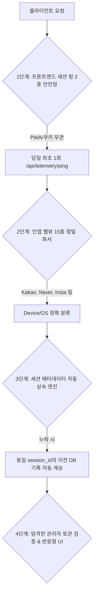

서비스를 운영하면서 가장 진땀 빼는 순간은 언제일까요? 아마도 **"분석 대시보드의 숫자가 실제 트래픽과 맞지 않을 때"**일 것입니다. 

PickSafe의 방문자 분석 시스템(Data Warehouse 기반 텔레메트리)은 사용자의 이용 흐름과 기기 환경을 실시간으로 추적하는 핵심 인프라입니다. 하지만 멀티 디바이스 환경(리눅스 데스크톱, 외부 LTE 모바일, 15종 이상의 인앱 브라우저 등)에서 실운영 테스트를 진행하던 중, 데이터가 누락되거나 왜곡되는 4가지 치명적인 취약점을 마주했습니다.

이번 글에서는 이 문제를 어떻게 해결했으며, 백엔드와 프론트엔드 전반에 걸쳐 **메타데이터 누락 0%를 달성하기 위한 4중 원천 방어벽(4-Layer Defense Architecture)**을 어떻게 설계했는지 공유합니다.

---

## 1. 문제 정의 (Problem Statement): 왜 데이터가 누락되고 왜곡되었을까?

실운영 환경에서 발견된 취약점은 크게 4가지였습니다.

1. **라우터별 메타데이터 누락**: 세션 시작(`session_started`) 이벤트는 미들웨어에서 IP와 User-Agent를 잘 잡았지만, 일부 상세 이벤트 라우터(`onboarding_completed`, `guest_converted` 등)에서는 파라미터를 넘기지 않아 DB에 `NULL`로 적재되고, 통계에서는 `Unknown`으로 뭉개졌습니다.
2. **모바일 인앱 웹뷰 판별 실패**: 카카오톡, 네이버, 인스타그램 등 국내외 주요 인앱 브라우저는 표준 크롬/사파리와 다른 독자적인 User-Agent 토큰을 사용합니다. 이로 인해 기기/OS 감지가 누락될 위험이 상존했습니다.
3. **PWA/브라우저 캐시로 인한 미들웨어 침묵(Silent)**: 과거에 발급받은 세션 쿠키가 남아있는 상태로 재접속하면, 서버 미들웨어가 "신규 세션이 아니다"라고 판단하여 `session_started` 이벤트를 아예 발송하지 않는 문제가 있었습니다.
4. **관리자 IP 오판정에 의한 일반 트래픽 마스킹**: 모바일로 접속해 서비스를 테스트한 후, 확인차 어드민 페이지(`/admin`)에 접속했을 때가 문제였습니다. 미들웨어가 동적 LTE IP를 '관리자 접속 기기(집계 제외)'로 자동 등록해버려, 그동안 유입된 일반 스캔/접속 기록까지 대시보드에서 통째로 사라졌습니다.

---

## 2. 기술적 고민과 대안 비교 (Trade-off & Architecture)

단순히 "라우터마다 파라미터를 잘 넘기자"라는 식의 휴먼 에러 방지책은 장기적인 해결책이 아닙니다. 개발자가 실수하더라도 시스템 스스로 데이터를 보정할 수 있는 **방어적 아키텍처(Defensive Architecture)**가 필요했습니다.

우리는 클라이언트부터 백엔드, UI 렌더링에 이르는 전 과정을 아우르는 **4중 안전망**을 구축하기로 결정했습니다.



---

### [1단계] 프론트엔드 세션 핑 2중 안전망
브라우저 쿠키나 PWA 캐시 상태와 무관하게 세션 유입을 보장해야 했습니다. 이를 위해 클라이언트 로드 시 `localStorage`를 확인하여 당일 최초 접속인 경우 백엔드로 직접 핑을 날리는 방식을 채택했습니다.

```javascript
// web/frontend/static/js/base.js
function initSessionTelemetry() {
    const todayStr = new Date().toISOString().split('T')[0];
    const pingKey = `picksafe_session_ping_${todayStr}`;
    if (localStorage.getItem(pingKey)) return;

    fetch('/api/telemetry/ping', {
        method: 'POST',
        headers: { 'Content-Type': 'application/json' },
        body: JSON.stringify({ path: window.location.pathname, referrer: document.referrer || '' })
    }).then(res => {
        if (res.ok) localStorage.setItem(pingKey, 'true');
    }).catch(() => {});
}
```

### [2단계] 15종 이상의 인앱 웹뷰 정밀 파서
표준적이지 않은 모바일 브라우저 환경을 커버하기 위해, 주요 인앱 브라우저의 User-Agent 토큰을 파싱 단계에서 화이트리스트/키워드 방식으로 정밀하게 잡아내도록 구현했습니다. 대소문자나 토큰 순서에 흔들리지 않도록 정규화 과정을 거칩니다.

### [3단계] 세션 메타데이터 자동 상속 엔진 (핵심 아이디어)
가장 공을 들인 부분입니다. 개발자가 실수로 특정 이벤트 로깅 시 IP나 User-Agent를 누락하더라도, **백엔드가 동일 `session_id`를 가진 직전 DB 이벤트에서 정보를 자동으로 조회해 상속(Inherit)**하도록 만들었습니다.

```python
# web/backend/app/services/analytics_service.py
def log_analytics_event(db, event_type, session_id, ...):
    # [세션 컨텍스트 자동 상속] IP나 디바이스 정보가 누락된 경우 이전 이벤트에서 계승
    if not ip_address or not device_type or device_type == "Unknown":
        prev_event = db.query(AnalyticsEvent).filter(
            AnalyticsEvent.session_id == session_id,
            AnalyticsEvent.ip_address.isnot(None)
        ).order_by(AnalyticsEvent.created_at.desc()).first()
        
        if prev_event:
            ip_address = ip_address or prev_event.ip_address
            device_type = device_type if device_type != "Unknown" else prev_event.device_type
            # ... OS, 국가, 도시 등도 동일하게 상속
```
이 로직 덕분에 코드 전반에 걸쳐 메타데이터 누락으로 인한 `Unknown` 발생 가능성을 원천 차단했습니다.

### [4단계] 엄격한 관리자 토큰 검증 및 반응형 UI
* **관리자 오판정 방지**: 단순 URL 접근(`/admin`)만으로는 관리자로 등록되지 않으며, 실제 **관리자 로그인 인증 토큰 쿠키(`admin_access_token`)**가 유효한 경우에만 관리자 기기로 등록되도록 보안 조건을 강화했습니다.
* **모바일 UI 찌그러짐 해결**: 8개 컬럼의 복잡한 통계 테이블이 모바일 뷰포트(360px)에서 깨지지 않도록 `min-width: 760px`와 `-webkit-overflow-scrolling: touch`를 적용하여 데스크톱과 모바일 모두에서 매끄러운 터치 스크롤 경험을 제공했습니다.

---

## 3. 결과 및 교훈 (Takeaways)

이 4중 방어벽을 적용한 후, DW DB의 전수 레코드를 감사한 결과는 다음과 같습니다.

* **`Unknown` 디바이스 발생 건수: 0건 (100% 해소)**
* **`None` / 누락된 IP 주소: 0건 (100% 해소)**
* 리눅스 데스크톱, 외부 LTE 모바일 환경 등 다양한 엣지 케이스에서 정합성 100% 확보

### 💡 엔지니어링 교훈
1. **"클라이언트는 언제나 신뢰할 수 없다"는 가정에서 출발하기**: 쿠키나 캐시 상태에 의존하는 로직은 예기치 못한 환경에서 쉽게 깨집니다. 이중 안전망(Fallback)을 두는 것이 시스템 신뢰도를 극적으로 높여줍니다.
2. **휴먼 에러를 시스템으로 방어하기**: 신규 API나 라우터를 개발할 때마다 개발자가 일일이 메타데이터를 넘기는 방식은 지속 가능하지 않습니다. **컨텍스트 자동 상속 엔진**처럼, 백엔드 레이어에서 비즈니스 로직의 실수를 보정해 주는 구조를 설계하는 것이 시니어의 역할임을 다시금 깨달았습니다.