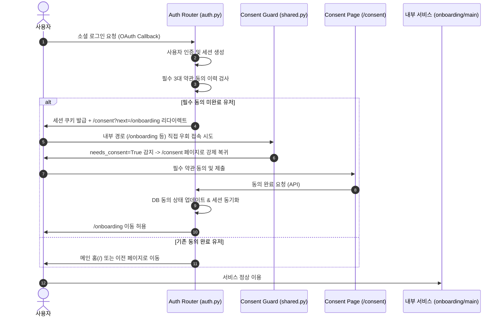

화장품 성분 분석 서비스인 **PickSafe**를 개발하면서, 사용자 인증과 개인정보보호법 준수 사이에서 기술적인 허점을 발견했습니다. 소셜 로그인을 통해 성공적으로 인증을 마쳤으나, 정작 필수 약관 동의를 완료하지 않은 사용자가 서비스 내부 API에 접근할 수 있는 보안 결함이 존재했던 것입니다. 

이 문제를 해결하기 위해 인증(Authentication)과 준수(Compliance) 단계를 엄격히 분리하는 **Consent Guard(동의 가드)** 아키텍처를 설계하고, 글로벌 사용자를 위한 표준 알레르기 성분 26종 및 약관의 6개 국어 다국어화 작업을 진행했습니다. 이 과정에서 마주한 고민과 해결 과정을 담백하게 기록해 둡니다.

---

## 🎯 마주한 고민과 문제 배경

### 1. 인증 완료와 동의 완료의 괴리 (보안 결함)
기존 OAuth2(Google/Facebook) 로그인 플로우에서는 사용자가 소셜 인증을 마치면 `finalize_login` 시점에 즉시 HttpOnly 세션 쿠키를 발급했습니다. 

문제는 이 시점에 사용자가 필수 약관(이용약관, 개인정보처리방침, 건강정보 수집 동의)에 동의했는지 여부를 강제하지 않았다는 점입니다. 사용자가 `/consent` 화면에서 브라우저를 닫거나, 주소창에 직접 `/home`이나 `/onboarding`을 입력해 우회하면, 동의하지 않은 상태에서도 로그인 세션이 유효하여 서비스를 자유롭게 이용할 수 있었습니다. 이는 개인정보보호법상 심각한 위반 소지가 있는 보안 취약점이었습니다.

### 2. 동의 절차의 파편화와 중복 UX
기존에는 `/consent` 화면에서 개인정보 동의를 받고, 이후 진입하는 `/onboarding` 화면(기피 성분 설정)에서 민감정보인 "건강 정보 수집 동의"를 또 한 번 요구하고 있었습니다. 중복된 동의 요구는 사용자 경험(UX)을 저해했고, 데이터 수집 동의 시점이 분산되어 백엔드에서 동의 이력을 일관되게 관리하기 어려웠습니다.

### 3. 글로벌 사용자를 위한 다국어 지원 미흡
일본 및 중화권 사용자가 유입되기 시작하면서 두 가지 문제가 도드라졌습니다.
* **알레르기 성분의 현지어 부재:** `하이드록시메틸펜틸사이클로헥센카복스알데하이드` 같은 복잡한 한국어 성분명이나 생소한 영문 INCI명만 노출되어, 해외 사용자가 자신의 알레르기 성분을 직관적으로 선택하기 어려웠습니다.
* **약관 문서의 번역 누락:** 다국어 UI는 지원하면서도 정작 법적 문서인 약관 마크다운 파일은 한/영/포르투갈어만 존재하여 일본어, 중국어 사용자가 약관을 읽을 수 없었습니다.

---

## ⚖️ 기술적 대안 비교 및 선택 이유

### 고민 1: Consent Guard 구현 방식
동의하지 않은 세션의 내부 경로 접근을 차단하기 위해 두 가지 방안을 검토했습니다.

| 비교 항목 | 대안 A: 전역 미들웨어(Middleware) 검증 | 대안 B: 라우터 데코레이터 및 Context 가드 (선택) |
| :--- | :--- | :--- |
| **작동 방식** | 모든 HTTP 요청을 미들웨어에서 가로채 DB의 동의 여부를 매번 조회. | 라우팅 공통 Context(`inject_translation`)에 `needs_consent` 플래그를 주입하고 프론트엔드 공통 템플릿 레이어에서 가드 동작. |
| **장점** | 백엔드 수준에서 완벽한 원천 차단 가능. | DB 쿼리 오버헤드가 적고, 정적 자원(JS/CSS) 및 특정 예외 경로 처리가 유연함. |
| **단점** | 정적 파일 요청, API 요청 등 모든 트래픽에 DB 조회가 발생하여 성능 저하 유발. | 프론트엔드 가드 우회 가능성에 대비해 API 엔드포인트별 보조 검증 로직이 추가로 필요함. |

**선택 이유:** 성능 최적화와 유연성을 고려하여 **대안 B**를 선택했습니다. 로그인 완료 시 세션에 동의 여부 상태를 캐싱하고, 공통 템플릿 컨텍스트를 통해 클라이언트 사이드에서 즉각적인 리다이렉트를 처리하도록 설계했습니다. 동시에 민감한 데이터를 다루는 API 라우터 내부에서도 세션 기반의 유효성 검증을 2중으로 수행하여 보안성을 확보했습니다.

### 고민 2: 다국어 알레르기 성분 데이터 관리
* **대안 A (RDB 다대다 번역 테이블 구축):** 성분 ID와 언어 코드를 복합키로 가지는 번역 테이블을 별도로 파서 조인(Join)하는 방식.
* **대안 B (Flat Key-Value 사전 및 메모리 캐싱 - 선택):** 표준 알레르기 성분은 26종으로 고정되어 있으므로, 백엔드 기동 시 번역 맵을 메모리에 로드하고 JSON 구조로 서빙하는 방식.

**선택 이유:** 대상 데이터가 26종으로 매우 한정적이고 변경 빈도가 거의 없으므로, 불필요한 DB 조인을 피하고 빠른 응답 속도를 확보하기 위해 **대안 B**를 채택했습니다. seed 스크립트를 통해 DB에 현지어 매핑 데이터를 적재한 후, 서비스 레이어에서 빠르게 딕셔너리 조회를 수행하도록 구현했습니다.

---

## 🏗️ 시스템 아키텍처 및 흐름

Consent Guard의 핵심 흐름과 소셜 로그인 이후의 리다이렉트 분기 구조는 다음과 같습니다.



---

## 💻 핵심 구현 및 트러블슈팅

### 1. Consent Guard 구현 (Backend & Frontend)

**Backend (`auth.py` & `shared.py`):**
로그인 완료 시 세션 정보를 검사하여 필수 3대 약관(`terms_of_service`, `privacy_policy`, `sensitive_health_data`) 동의 여부를 판별합니다.

```python
# web/backend/app/routers/auth.py
@router.get("/finalize_login")
async def finalize_login(request: Request, db: Session = Depends(get_db)):
    user = get_current_user(request)
    
    # 필수 3대 동의 여부 확인
    has_consented = db.query(UserConsent).filter(
        UserConsent.user_id == user.id,
        UserConsent.terms_of_service == True,
        UserConsent.privacy_policy == True,
        UserConsent.sensitive_health_data == True
    ).first()

    if not has_consented:
        # 동의 미완료 시 온보딩을 next 파라미터로 안고 consent로 강제 이동
        return RedirectResponse(url="/consent?next=/onboarding", status_code=303)
        
    return RedirectResponse(url="/", status_code=303)
```

모든 페이지 렌더링 시 거치는 공통 컨텍스트 주입기(`shared.py`)에서 `needs_consent` 플래그를 동적으로 판단합니다. 단, 무한 리다이렉트를 방지하기 위해 약관 동의 페이지 자체나 정적 자원, 아웃로그인 관련 경로는 제외해야 합니다.

```python
# web/backend/app/routers/shared.py
def inject_translation(request: Request):
    user = request.state.user
    path = request.url.path
    
    needs_consent = False
    # 예외 경로 정의 (동의가 필요 없는 오픈 경로)
    bypass_paths = ["/consent", "/terms", "/privacy", "/auth", "/static"]
    
    if user and not any(path.startswith(p) for p in bypass_paths):
        # DB 혹은 세션에서 동의 여부 체크
        if not user.has_completed_essential_consent:
            needs_consent = True

    return {
        "needs_consent": needs_consent,
        "current_user": user
    }
```

**Frontend (`base.html` / Global Guard):**
템플릿 레이어에서 `needs_consent`가 감지되면 클라이언트 사이드에서 즉시 차단합니다.

```html
<!-- web/frontend/templates/base.html -->

<script>
    // 세션은 있으나 필수 동의가 없는 경우 즉시 리다이렉트
    window.location.replace("/consent?next=" + encodeURIComponent(window.location.pathname));
</script>

```

---

### 2. 미체크 항목 시각 피드백 (Red Border UX)

단순히 텍스트 경고창만 띄우는 것보다, 누락된 체크박스 영역 전체를 붉은 테두리로 감싸고 부드럽게 스크롤하는 인터랙션을 추가하여 가입 이탈률을 줄이고자 했습니다.

```javascript
// web/frontend/static/js/consent.js
document.querySelector("#consent-form").addEventListener("submit", function(e) {
    let hasError = false;
    const requiredGroups = document.querySelectorAll(".consent-group.required");

    requiredGroups.forEach(group => {
        const checkbox = group.querySelector("input[type='checkbox']");
        if (!checkbox.checked) {
            group.classList.add("has-error"); // CSS: border: 2px solid #ef4444;
            if (!hasError) {
                // 첫 번째 미체크 항목으로 부드럽게 스크롤 이동
                group.scrollIntoView({ behavior: "smooth", block: "center" });
                hasError = true;
            }
        } else {
            group.classList.remove("has-error");
        }
    });

    if (hasError) {
        e.preventDefault();
    }
});

// 체크박스 클릭 시 실시간으로 빨간 테두리 해제
document.querySelectorAll(".consent-group input[type='checkbox']").forEach(checkbox => {
    checkbox.addEventListener("change", function() {
        if (this.checked) {
            this.closest(".consent-group").classList.remove("has-error");
        }
    });
});
```

---

### 3. 알레르기 유발 성분 26종 6개 국어 동적 매핑

다국어 처리를 위해 데이터베이스 시드(`seed_multilingual_db.py`)를 통해 표준 26종 알레르기 성분 사전을 구축했습니다. 이후 백엔드에서 클라이언트의 로케일에 맞는 번역명을 정적 딕셔너리 기반으로 빠르게 매핑하여 서빙합니다.

```python
# web/backend/app/services/translation.py
ALLERGEN_TRANSLATIONS = {
    "Butylphenyl Methylpropional": {
        "ko": "부틸페닐메틸프로피오날",
        "en": "Butylphenyl Methylpropional",
        "ja": "ブチルフェニルメチルプロピオナール",
        "zh-CN": "丁苯基甲基丙醛",
        "zh-TW": "丁苯基甲基丙醛",
        "pt-BR": "Butilfenil Metilpropional"
    },
    "Benzyl Alcohol": {
        "ko": "벤질알코올",
        "en": "Benzyl Alcohol",
        "ja": "ベンジルアルコール",
        "zh-CN": "苯甲醇",
        "zh-TW": "苯甲醇",
        "pt-BR": "Álcool Benzílico"
    }
    # ... 총 26종 표준 알레르기 성분 수록
}

def get_ingredient_translation(name: str, lang: str) -> str:
    translations = ALLERGEN_TRANSLATIONS.get(name)
    if translations:
        return translations.get(lang, name) # 해당 언어 번역이 없으면 기본 INCI명(en) 반환
    return name
```

클라이언트는 `/allergens/standard-list` API를 호출할 때 헤더의 `Accept-Language` 혹은 세션 언어 설정을 기준으로 현지어 이름을 최우선적으로 받아보게 됩니다.

---

### 4. 약관 마크다운 파일 다국어 폴백 (Locale Fallback)

사용자의 로케일 코드가 다양하게 들어올 때(`pt-BR`, `zh-CN` 등), 정확히 일치하는 파일이 없으면 상위 로케일(`pt`, `zh`)이나 기본값(`en`)으로 안전하게 폴백(Fallback)하는 매커니즘이 필요했습니다.

```python
# web/backend/app/routers/shared.py
import os

def find_consent_file(doc_type: str, lang: str) -> str:
    """
    doc_type: 'terms', 'privacy', 'health'
    lang: 'ko', 'en', 'ja', 'zh-CN', 'zh-TW', 'pt-BR' 등
    """
    base_dir = "docs/consent"
    
    # 1단계: 요청된 로케일 그대로 탐색 (예: privacy_zh-CN.md)
    file_path = os.path.join(base_dir, f"{doc_type}_{lang}.md")
    if os.path.exists(file_path):
        return file_path
        
    # 2단계: 하이픈 분할을 통한 상위 로케일 탐색 (예: pt-BR -> pt)
    main_lang = lang.split("-")[0]
    file_path = os.path.join(base_dir, f"{doc_type}_{main_lang}.md")
    if os.path.exists(file_path):
        return file_path
        
    # 3단계: 기본값인 영어(en)로 폴백
    return os.path.join(base_dir, f"{doc_type}_en.md")
```

---

## 💡 돌아보며 배운 점 (회고)

### 1. 무한 리다이렉트 루프 트러블슈팅의 교훈
초기 검증 과정에서 `/consent` 페이지 진입 시 브라우저가 먹통이 되며 `Too many redirects` 에러를 뿜는 현상이 있었습니다. 원인은 전역 컨텍스트 가드(`shared.py`)에서 리다이렉트 예외 경로 필터링을 꼼꼼히 하지 않아, `/consent` 페이지 자체를 요청할 때도 `needs_consent = True`가 작동하여 자기 자신으로 계속 리다이렉션을 지시했기 때문이었습니다. 

이를 해결하기 위해 `bypass_paths` 리스트를 촘촘하게 정의하고, 정적 자원(`.css`, `.js`, 이미지 등) 경로까지 예외 처리를 확실하게 해 주어야 안정적인 서비스 서빙이 가능하다는 것을 재차 깨달았습니다.

### 2. 보안과 UX는 제로섬이 아니다
개인정보 보호 조치를 강화하는 과정(Consent Guard 도입)은 사용자에게 단계를 하나 더 강제하는 것이므로 자칫 허들로 작용할 수 있습니다. 하지만 이 과정에서 **온보딩 단계의 중복 동의 요소를 제거하여 프로세스를 단순화**하고, **미체크 항목에 대한 직관적인 Red Border UX 피드백**을 추가함으로써 보안 규정 준수와 UX 개선이라는 두 마리 토끼를 모두 잡을 수 있었습니다.

### 3. 글로벌 스케일을 위한 아키텍처적 준비
단순 텍스트 번역을 넘어, 도메인 지식(화장품 화학 성분명)의 다국어 매핑 데이터가 서비스의 신뢰도에 얼마나 큰 영향을 미치는지 체감했습니다. 표준 26종 알레르기 사전을 정교하게 구축해 둔 덕분에 향후 성분 검색 및 맞춤 추천 엔진 고도화 과정에서도 다국어 인덱싱을 매끄럽게 확장할 수 있는 튼튼한 밑바탕이 마련되었습니다.