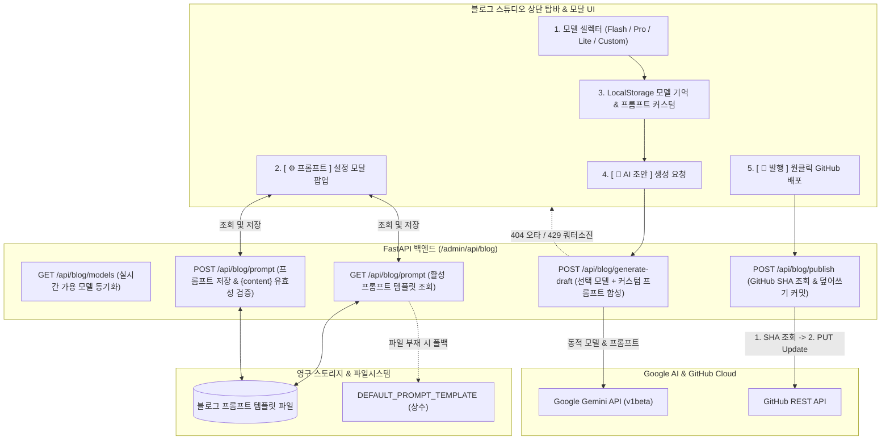

안녕하세요. PickSafe Security & Core Architecture Team입니다.

저희 팀은 개발자 경험(DX)을 극대화하기 위해 어드민 내부에 **기술 블로그 스튜디오(ADR #30)**를 자체 구축하여 운영해 왔습니다. 그러나 실제 운영 과정에서 단일 AI 모델 하드코딩과 경직된 프롬프트 구조로 인한 한계에 부딪히게 되었고, 이를 해결하기 위해 **다중 AI 모델 동적 선택기, 실시간 프롬프트 커스텀 엔진, 그리고 멱등성을 보장하는 발행 안전망**을 도입했습니다. 

이번 글에서는 이 기능을 설계하고 구현하는 과정에서 마주한 기술적 고민(Trade-off)과 아키텍처적 선택들을 공유하고자 합니다.

---

## 1. 배경 및 문제 정의 (Context & Problem Statement)

초기 블로그 스튜디오는 단일 하드코딩된 AI 모델(Gemini Flash 계열)과 백엔드 파이썬 코드에 박혀 있는 프롬프트를 기반으로 동작했습니다. 하지만 실무 운영이 지속되면서 다음과 같은 4가지 치명적인 병목이 발생했습니다.

1. **AI 모델 용도의 파편화**: 
   - 가벼운 개요 작성에는 고속 모델이 유리하지만, 복잡한 분산 아키텍처나 Mermaid 심층 분석 글을 쓸 때는 추론 능력이 뛰어난 상위 모델이 필요했습니다. 단일 모델 고정은 유연성을 크게 떨어뜨렸습니다.
2. **미래 호환성(Future-Proof) 부재**: 
   - 새로운 AI 모델이 출시될 때마다 백엔드 소스 코드를 수정하고 재배포해야 하는 번거로움이 있었습니다.
3. **백엔드 프롬프트 튜닝의 불편함**: 
   - 글의 어조, H2/H3 계층 규칙, 기밀 마스킹 정책 등을 수정하려면 파이썬 파일을 수정하고 서버를 재시작해야 했습니다.
4. **재수정 발행 시 중복 파일 생성 문제**: 
   - 이미 배포된 블로그 글을 스튜디오에서 다시 수정해 발행할 때, 고유 식별 처리가 미흡하면 원치 않는 중복 파일이 생성될 위험이 있었습니다.

---

## 2. 시스템 아키텍처 및 작업 흐름 (Architecture & Workflow)

이러한 문제를 해결하기 위해 프론트엔드(UI), 백엔드(FastAPI), 영구 스토리지, 외부 클라우드(Google AI & GitHub) 간의 유기적인 연동 구조를 설계했습니다.

---

## 3. 세부 설계 및 핵심 구현

### 3.1. 백엔드 동적 모델 디스패처 및 Fail-Safe 방어망
백엔드는 클라이언트로부터 전달받은 모델명 페이로드를 동적으로 바인딩하여 AI 클라이언트에 전달합니다. 

* **동적 모델 바인딩**: `POST /api/blog/generate-draft` 엔드포인트는 요청받은 모델명을 사용하여 요청을 처리합니다. 관리자가 직접 새로운 모델명을 입력(`Custom`)해도 백엔드 수정 없이 즉시 대응이 가능합니다.
* **Fail-Safe 예외 처리**: 
  - `404 Not Found` (모델명 오타 또는 미지원 모델): `"존재하지 않거나 지원되지 않는 모델명입니다."`라는 명확한 메시지를 반환하여 사용자가 기본 모델로 재시도할 수 있도록 유도합니다.
  - `429 Too Many Requests` (API 쿼터 초과): 쿼터 소진 안내와 함께 예비 API 키 스위칭을 유도하는 방어 로직을 심었습니다.

### 3.2. 실시간 AI 프롬프트 템플릿 관리 엔진 (파일 기반 영속성)
프롬프트를 코드에서 분리하기 위해 로컬 파일시스템 기반의 템플릿 매니저를 구현했습니다.

* 관리자가 모달 창을 통해 프롬프트를 수정하고 저장하면, 서버의 전용 텍스트 파일에 영구 저장됩니다. 만약 파일이 유실되더라도 시스템 내부의 기본 상수(`DEFAULT_PROMPT_TEMPLATE`)로 자동 폴백(Fallback)됩니다.
* **유효성 검증(Validation)**: 템플릿 저장 시 핵심 치환 변수(예: `{content}`)가 누락되었는지 검증하여, 실수로 인한 템플릿 렌더링 에러를 원천 차단했습니다.
* **원클릭 초기화**: 언제든 기본값으로 되돌릴 수 있는 Reset 페이로드 처리 로직을 함께 구현하여 운영 편의성을 높였습니다.

### 3.3. GitHub SHA 기반 멱등성(Idempotency) 보장 발행
블로그 글을 여러 번 수정하고 발행할 때 가장 중요한 것은 **중복 파일 생성 방지**입니다. 

이를 위해 파일명을 고유 식별 키(Key)로 활용하고, GitHub REST API의 특성을 이용한 멱등 메커니즘을 적용했습니다.
1. 발행 요청 시, `GET`을 통해 GitHub 상에 해당 파일이 이미 존재하는지 확인하고 **기존 파일의 SHA 해시**를 조회합니다.
2. 조회된 SHA가 존재할 경우, `PUT` 요청 본문에 해당 `sha` 값을 포함하여 전송합니다.
3. 결과적으로 GitHub는 파일이 중복 생성되는 대신, **기존 파일에 대한 안전한 Update(Overwrite) 커밋**을 수행하여 깔끔한 히스토리를 유지합니다.

---

## 4. 도입 효과 (Takeaway)

이번 아키텍처 고도화를 통해 다음과 같은 엔지니어링 성과를 얻을 수 있었습니다.

1. **AI 생성 품질의 정교한 제어**: 복잡한 아키텍처 문서에는 추론 능력이 뛰어난 상위 모델을, 가벼운 포스팅에는 고속 모델을 상황에 맞게 골라 쓸 수 있게 되었습니다. 또한 코드 배포 없이 UI에서 실시간으로 프롬프트를 튜닝할 수 있어 실험 속도가 비약적으로 향상되었습니다.
2. **배포 제약 없는 미래 호환성(Future-Proof)**: Google이 새로운 AI 모델을 출시하더라도 백엔드 배포 대기 시간 없이 관리자 화면에서 즉시 적용할 수 있습니다.
3. **운영 안정성 확보**: 철저한 Fail-Safe 방어 코드와 GitHub SHA 기반 멱등성 발행을 통해 휴먼 에러나 네트워크 예외 상황에서도 시스템 신뢰도를 높였습니다.

앞으로도 PickSafe는 개발 생산성을 높이고 시스템의 견고함을 더하는 아키텍처 개선을 지속해 나갈 것입니다. 읽어주셔서 감사합니다.