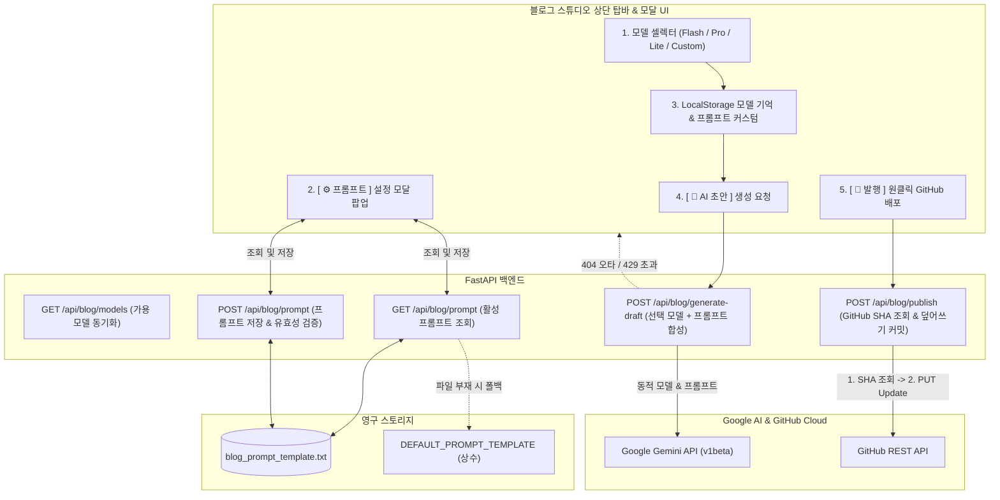

안녕하세요, PickSafe Core Architecture Team입니다.

PickSafe 어드민 내부 시스템으로 도입된 **기술 블로그 스튜디오(ADR #30)**는 개발 생산성을 획기적으로 높여주었습니다. 하지만 실무 운영 과정에서 **"단일 AI 모델의 유연성 부족"**, **"코드 재배포 없는 프롬프트 튜닝 필요성"**, 그리고 **"재수정 발행 시 멱등성 보장"**이라는 새로운 엔지니어링 과제에 직면하게 되었습니다.

이번 글에서는 이러한 문제를 해결하기 위해 도입한 **다중 AI 모델 동적 선택기**, **실시간 프롬프트 커스텀 엔진**, 그리고 **GitHub SHA 기반 멱등 발행 안전망**의 아키텍처 설계와 트러블슈팅 경험을 공유합니다.

---

## 1. 배경 및 마주한 문제 (Problem Statement)

초기 블로그 스튜디오는 단일 하드코딩 모델(`gemini-3.6-flash`)을 기반으로 동작했습니다. 그러나 운영을 거듭하며 다음과 같은 한계가 명확해졌습니다.

1. **AI 모델 선택의 경직성**:
   - 가벼운 개요 작성에는 빠른 처리 속도가 유리하지만, 복잡한 분산 아키텍처나 Mermaid 심층 분석 글에는 더 고성능의 모델이 필요합니다. 단일 모델 고정은 태스크 성격에 따른 최적화를 가로막았습니다.
2. **미래 호환성(Future-Proof) 결여**:
   - Google Gemini 신규 모델이 출시될 때마다 백엔드 파이썬 코드를 수정하고 재배포해야 하는 번거로움이 있었습니다.
3. **Fail-Safe 부재**:
   - 관리자가 모델명을 직접 입력(Custom)할 때 오타(`404 Not Found`)나 API 쿼터 초과(`429 Too Many Requests`)가 발생했을 때의 방어 로직이 부족했습니다.
4. **프롬프트 튜닝의 운영 비용**:
   - 글의 어조, 서식 규격, 기밀 마스킹 정책 등을 변경하려면 백엔드 소스코드를 직접 수정해야 했습니다.
5. **발행의 멱등성(Idempotency) 문제**:
   - 이미 배포된 블로그 글을 스튜디오에서 수정 후 다시 발행할 때, 파일이 중복 생성되는 문제가 발생했습니다. 동일 파일에 대한 '수정 커밋(Update)'으로 안전하게 반영되어야 했습니다.

---

## 2. 시스템 아키텍처 및 작업 흐름 (Architecture)

전체 시스템은 Frontend UI, FastAPI Backend, 영구 파일 시스템, 그리고 External Cloud(Google AI / GitHub) 간의 유기적인 파이프라인으로 설계되었습니다.

---

## 3. 핵심 설계 및 구현 (Design & Implementation)

### 3.1. 백엔드 동적 모델 디스패처
하드코딩을 제거하기 위해 요청 페이로드(`payload.get("model", "gemini-3.6-flash")`)를 통해 모델명을 동적으로 바인딩하도록 구조를 변경했습니다. 

또한, 외부 API 호출 시 발생할 수 있는 예외에 대응하기 위한 Fail-Safe 계층을 두었습니다.
- **`404 Not Found` (미지원/오타 모델)**: 명확한 에러 메시지(`"존재하지 않거나 지원되지 않는 모델명입니다."`)를 반환하여 사용자가 즉시 인지하고 기본 모델로 재시도할 수 있도록 유도합니다.
- **`429 Too Many Requests` (쿼터 초과)**: 쿼터 리셋 안내 및 예비 API 키 스위칭을 고려한 안내 메시지를 제공합니다.

### 3.2. 실시간 AI 프롬프트 템플릿 관리 엔진
백엔드 코드를 수정하지 않고 프롬프트를 튜닝할 수 있도록 파일 기반 영구 저장 방식을 채택했습니다.
- 관리자가 수정한 커스텀 프롬프트는 전용 텍스트 파일에 저장되며, 파일이 없을 경우 내장된 `DEFAULT_PROMPT_TEMPLATE`로 자동 폴백(Fallback)됩니다.
- 저장 요청 시 필수 치환 변수(예: `{content}`)가 누락되었는지 검증하여 템플릿 훼손으로 인한 파싱 에러를 원천 방지합니다.
- 초기화(`reset: true`) 요청 시 커스텀 파일을 즉시 삭제하고 시스템 기본값으로 복원하는 안전 장치도 마련했습니다.

### 3.3. GitHub SHA 해시 기반 멱등 재수정 발행 메커니즘
동일한 글을 반복해서 수정·발행할 때 Git 레포지토리에 중복 파일이 쌓이는 것을 막기 위해 **GitHub REST API의 SHA 기반 Update 메커니즘**을 구현했습니다.

1. 좌측 사이드바에서 선택된 고유 **`파일명(filename)`**을 식별 키로 사용합니다.
2. 발행 요청 시 먼저 `GET` 요청을 통해 GitHub 상에 존재하는 해당 파일의 기존 SHA 해시 값을 조회합니다.
3. SHA가 존재하는 경우, `PUT` 요청 본문에 `sha` 값을 함께 포함하여 전송함으로써 기존 파일을 새로운 내용으로 안전하게 덮어쓰기(Update 커밋)합니다.

---

## 4. 도입 효과 및 배운 점 (Takeaways)

1. **운영 효율성과 AI 활용 극대화**:
   - 태스크 특성에 맞춰 `Pro`와 `Flash` 모델을 자유롭게 선택할 수 있게 되었으며, 코드 배포 없이 프롬프트를 실시간으로 튜닝할 수 있어 실험 주기가 대폭 단축되었습니다.
2. **미래 지향적(Future-Proof) 아키텍처**:
   - 신규 모델 출시 시 Custom 입력 기능을 통해 소스코드 수정 없이 1초 만에 대응할 수 있는 확장성을 확보했습니다.
3. **신뢰할 수 있는 발행 파이프라인**:
   - Fail-Safe 방어망과 SHA 기반 멱등 발행 메커니즘을 통해 어드민 사용자의 휴먼 에러 및 데이터 유실 위험을 완전히 차단했습니다.

앞으로도 PickSafe는 확장 가능하고 견고한 아키텍처를 바탕으로 개발자 경험(DX)을 지속적으로 개선해 나갈 것입니다. 감사합니다.