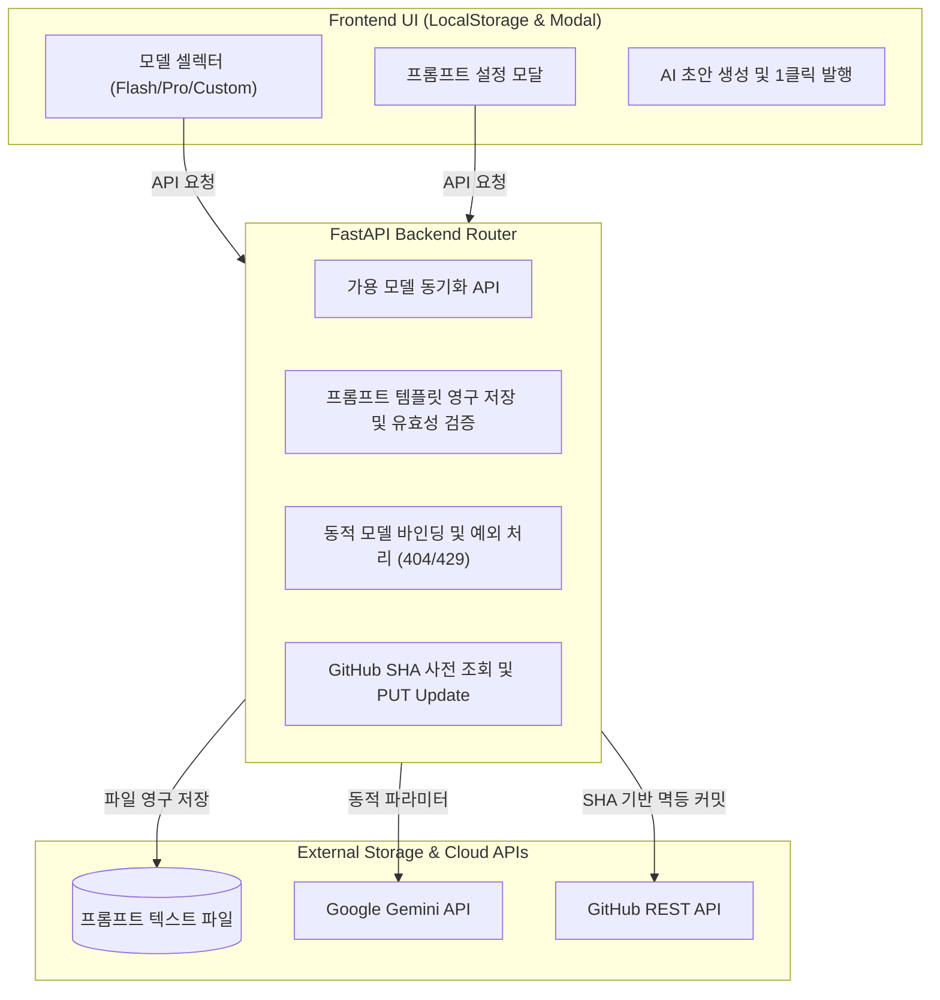

안녕하세요, PickSafe Core Architecture Team입니다.

사내 어드민 환경에 도입된 '기술 블로그 스튜디오(ADR #30)'가 성공적으로 안착한 이후, 실무 운영 과정에서 몇 가지 명확한 한계에 부딪혔습니다. 가장 큰 문제는 **단일 하드코딩된 AI 모델과 고정된 프롬프트**였습니다. 

초고속 개요 작성이 필요한 문서와 복잡한 분산 아키텍처 및 Mermaid 심층 분석이 필요한 문서는 요구되는 AI 모델의 성격이 완전히 다릅니다. 또한, 새로운 AI 모델이 출시될 때마다 백엔드 코드를 수정하고 재배포해야 하는 번거로움도 존재했습니다.

이번 포스팅에서는 이러한 문제를 해결하기 위해 **다중 AI 모델 동적 선택기**, **실시간 프롬프트 커스텀 엔진**, 그리고 **GitHub SHA 기반 멱등(Idempotency) 발행 안전망**을 구축한 아키텍처 의사결정 과정(ADR)을 공유합니다.

---

## 1. 마주한 기술적 문제 (Problem Statement)

1. **단일 AI 모델(`gemini-3.6-flash`)의 유연성 부족**
   - 작업 성격에 맞게 모델(Flash, Pro 등)을 유연하게 교체할 수 없는 구조.
2. **미래 호환성(Future-Proof) 부재**
   - 신규 모델 출시 시 백엔드 소스코드 배포 없이 관리자가 직접 모델명을 입력하거나 선택할 수 있는 동적 디스패처 필요.
3. **Fail-Safe 방어 체계의 부재**
   - 직접 입력(Custom) 시 모델명 오타(`404 Not Found`)나 쿼터 초과(`429`) 발생 시 시스템 중단을 막고 안전하게 폴백(Fallback)할 수 있는 안전망 필요.
4. **하드코딩된 프롬프트의 튜닝 한계**
   - 글의 어조나 서식 규격 변경을 위해 파이썬 코드를 수정하고 서버를 재시작해야 하는 생산성 저하 요인 존재.
5. **재수정 발행 시 중복 파일 생성 문제**
   - 이미 배포된 블로그 글을 수정 발행할 때, 파일이 중복 생성되지 않고 동일 파일에 대한 '수정 커밋(Update)'으로 안전하게 반영되는 멱등성 보장 필요.

---

## 2. 아키텍처 설계 및 대안 비교 (Architecture & Trade-offs)

이러한 문제를 해결하기 위해 전체 시스템을 아래와 같은 구조로 재설계했습니다.

### 🔑 주요 설계 포인트와 Trade-off

#### ① 동적 모델 디스패처와 Fail-Safe
백엔드 생성 엔드포인트에서 클라이언트가 전달한 모델명을 동적으로 바인딩하도록 구현했습니다. 
* **Trade-off**: 사용자가 직접 모델명을 입력(Custom)할 수 있게 열어두면 오타로 인한 `404 Not Found`나 API 쿼터 소진에 따른 `429 Too Many Requests` 위험이 증가합니다.
* **해결책**: 백엔드에서 예외 발생 시 에러 코드를 분석하여 친절한 안내 메시지와 함께 기본 모델로 자동 폴백(Auto-Fallback)을 시도하도록 방어 코드를 작성했습니다.

#### ② 프롬프트 파일 시스템 분리 및 변수 검증
하드코딩되어 있던 프롬프트를 별도의 텍스트 파일로 분리하고, API를 통해 실시간으로 읽고 쓸 수 있도록 구현했습니다.
* **Trade-off**: 관리자가 실수로 핵심 치환 변수(예: `{content}`)를 삭제하면 AI 파이프라인이 깨질 수 있습니다.
* **해결책**: 프롬프트 저장 요청 시 필수 치환 변수 포함 여부를 정규식 및 조건문으로 검증하여 템플릿 훼손을 원천 차단했습니다. 또한 파일이 유실되더라도 시스템 내장 기본 템플릿으로 안전하게 폴백되도록 설계했습니다.

#### ③ GitHub SHA 해시 기반 멱등(Idempotency) 발행
블로그 글을 수정 후 다시 발행할 때 파일이 중복 생성되는 문제를 해결해야 했습니다.
* **해결책**: 본문 제목이 아닌 좌측 사이드바에서 선택된 **파일명(filename)**을 고유 식별 키로 사용합니다. 배포 전 `GET` 요청으로 GitHub 상의 기존 파일 **SHA 해시**를 먼저 조회한 뒤, `PUT` 요청 본문에 해당 `SHA`를 포함시켜 덮어쓰기(Update) 커밋을 수행합니다. 이를 통해 깔끔한 단일 커밋 히스토리를 유지할 수 있습니다.

---

## 3. 도입 효과 (Takeaways)

1. **AI 생성 품질 및 운영 효율 극대화**
   - 아키텍처 다이어그램 등 깊이 있는 분석이 필요할 때는 `Pro` 모델을, 빠른 개요 작성에는 `Flash` 모델을 상황에 맞게 선택할 수 있게 되었습니다.
   - 코드 배포 없이도 프롬프트 모달을 통해 문체와 포맷을 실시간으로 튜닝할 수 있습니다.
2. **코드 무수정 신규 모델 확장성 확보 (Future-Proof)**
   - Google이 새로운 Gemini 버전을 출시하더라도 관리자 UI에서 Custom 입력으로 즉시 대응이 가능해졌습니다.
3. **견고한 발행 안정성**
   - 모델명 오타나 쿼터 소진 시에도 친절한 안내와 안전한 폴백 메커니즘이 작동하며, 재수정 발행 시에도 중복 파일 없이 깔끔한 이력을 유지합니다.

---

이번 고도화를 통해 PickSafe의 콘텐츠 생산 파이프라인은 더욱 유연하고 견고해졌습니다. 앞으로도 개발 생산성을 높이고 시스템 안정성을 확보하는 아키텍처 개선 경험을 나누겠습니다. 감사합니다.