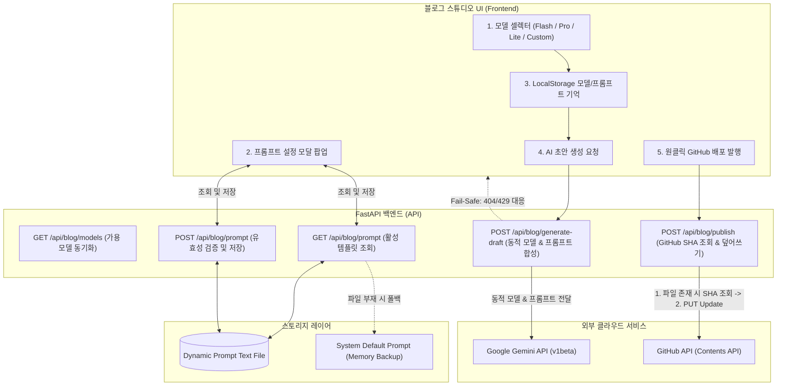

안녕하세요, PickSafe Core Architecture 팀입니다. 

최근 생성형 AI(Generative AI)의 발전 속도는 눈이 멀어질 정도로 빠릅니다. 새로운 모델이 거의 매주 출시되고 있으며, 각 모델은 비용, 속도, 그리고 추론 능력 면에서 고유한 강점을 가집니다. 

PickSafe 개발 조직은 기술적 성과를 외부와 빠르게 공유하기 위해 **'블로그 스튜디오'**라는 사내 LLM 기반 콘텐츠 제작 도구를 운영하고 있습니다. 초기 버전은 빠르게 POC(Proof of Concept)를 검증하기 위해 단일 모델과 하드코딩된 프롬프트로 기획되었으나, 실제 운영 과정에서 유연성과 확장성 측면의 한계에 부딪혔습니다.

본 포스팅에서는 **코드 배포 없는 실시간 LLM 스위칭**, **런타임 프롬프트 핫 리로드(Hot Reload)**, 그리고 **GitHub API를 활용한 멱등성(Idempotency) 있는 안전한 배포 파이프라인**을 구축하며 겪은 기술적 고민과 해결 과정을 공유합니다.

---

## 1. 성장통과 마주한 한계들 (Context & Problem Statement)

기존 블로그 스튜디오는 작동은 했지만, 매일 글을 생산하고 편집하는 관리자 입장에서 다음과 같은 치명적인 병목이 존재했습니다.

### ① 단일 하드코딩 모델의 한계
초기 시스템은 `gemini-3.6-flash` 모델로 고정되어 있었습니다. 간단한 아키텍처 개요나 짧은 글을 쓸 때는 비용과 속도 측면에서 훌륭했지만, **복잡한 분산 시스템을 분석하거나 구조화된 Mermaid 다이어그램을 정교하게 그려야 할 때는 추론 능력이 뛰어난 상위 모델(Pro)의 지원이 절실**했습니다.

### ② 미래 호환성(Future-Proof)의 부재
새로운 고성능 AI 모델이 출시될 때마다 백엔드 개발자가 파이썬 소스코드를 수정하고, 테스트한 뒤, 서버를 재배포해야 했습니다. 비즈니스 요구사항에 맞춰 신속하게 신규 모델을 도입할 수 없는 비효율적인 구조였습니다.

### ③ 유효하지 않은 모델 입력에 대한 Fail-Safe 부재
사용자가 직접 임의의 신규 모델명을 입력할 수 있게 열어두더라도, 오타나 API 권한 문제로 `404 Not Found` 혹은 `429 Too Many Requests`(쿼터 초과) 에러가 발생했을 때 시스템이 먹통이 되는 현상이 발생했습니다. 이에 대한 우아한 폴백(Fallback) 처리가 필요했습니다.

### ④ 프롬프트 미세 조정을 위한 '배포 사이클'의 낭비
블로그의 톤앤매너(전문성 vs 친근함), 마크다운 규격, 기밀 데이터 마스킹 규칙 등을 튜닝하려면 백엔드 소스코드 내의 프롬프트 문자열을 직접 고쳐야 했습니다. **프롬프트 단 한 줄을 고치기 위해 백엔드 컨테이너 전체를 재빌드 및 배포해야 하는 상황**이었습니다.

### ⑤ 재수정 발행 시 중복 생성 문제 (Idempotency)
AI가 초안을 잡은 포스팅을 발행한 뒤, 오타가 발견되어 스튜디오에서 재수정 후 재발행을 누르면 동일한 파일이 중복 생성되거나 Git 히스토리가 꼬이는 문제가 있었습니다. API 레벨에서 멱등성(Idempotency)이 보장되는 안전망이 요구되었습니다.

---

## 2. 시스템 아키텍처와 해결 방향

우리는 이 문제를 해결하기 위해 시스템의 책임을 명확히 분리하기로 결정했습니다. 

* **프론트엔드**는 사용자의 맥락(선택한 모델, 커스텀 프롬프트 템플릿)을 LocalStorage와 React/HTML 상태로 관리하며 유연한 UX를 제공합니다.
* **백엔드(FastAPI)**는 라우팅 로직을 추상화하여 동적으로 모델을 디스패칭하고, 파일 시스템 기반의 경량 영구 저장소를 활용해 프롬프트를 관리합니다.
* **배포 레이어**는 GitHub REST API의 SHA 값을 활용해 생성/수정을 단일 인터페이스로 통합합니다.



---

## 3. 핵심 기술 의사결정과 구현 세부사항

### 3.1. 런타임 동적 모델 디스패처 & Fail-Safe 구축
백엔드에서는 하드코딩된 API 엔드포인트 대신, 클라이언트가 요청한 모델 식별자를 실시간으로 외부 LLM SDK에 바인딩하는 구조를 취했습니다.

```python
# [보안상 비즈니스 로직 요약 및 마스킹 처리]
@router.post("/api/blog/generate-draft")
async def generate_draft(payload: DraftRequestSchema):
    # 클라이언트가 LocalStorage 또는 셀렉터에서 선택해 보낸 모델명 수신
    requested_model = payload.model or "gemini-3.6-flash"
    
    try:
        # 동적 모델 바인딩 및 LLM 요청 수행
        response = await llm_service.generate_content(
            model_name=requested_model,
            prompt=payload.custom_prompt,
            content=payload.raw_content
        )
        return {"status": "success", "data": response}
        
    except LLMModelNotFoundError:
        # Fail-Safe 1: 모델 오타 또는 미지원 모델 입력 시 404 대응
        logger.warn(f"Invalid model requested: {requested_model}. Fallback initiated.")
        return JSONResponse(
            status_code=404,
            content={"detail": f"존재하지 않거나 미지원 모델명({requested_model})입니다. 기본 안정 모델로 전환하여 재시도해 주세요."}
        )
    except LLMQuotaExceededError:
        # Fail-Safe 2: 쿼터 소진(429) 시 사용자 가이드 및 예비 정책 안내
        return JSONResponse(
            status_code=429,
            content={"detail": "API 호출 한도를 초과했습니다. 잠시 후 시도하거나 경량형 모델(Lite)을 선택해 주세요."}
        )
```
이 설계를 통해 운영자는 신규 모델 출시 당일, 백엔드 코드 수정 없이 프론트엔드의 `Custom` 입력 폼에 모델명을 기입하는 것만으로 신규 기능을 즉시 테스트할 수 있는 **Future-Proof 아키텍처**를 확보했습니다.

---

### 3.2. 실시간 프롬프트 핫 스와핑 (Hot Swapping) & 검증 엔진
우리는 무거운 데이터베이스 대신 **파일 시스템 기반의 프롬프트 관리 방식**을 채택했습니다. 동적 설정 정보는 Git으로 관리하거나 즉시 쓰기가 가능해야 하므로, 서버 로컬의 특정 디렉토리에 템플릿 텍스트 파일을 두었습니다.

다만, 관리자의 실수로 템플릿의 필수 예약 키워드인 `{content}`(블로그 본문이 치환되는 영역)를 누락하고 저장할 경우 AI가 빈 결과물을 뱉는 대형 사고가 발생할 수 있습니다. 이를 방지하기 위해 **엄격한 토큰 검증 엔진**을 중간에 삽입했습니다.

```python
@router.post("/api/blog/prompt")
async def save_custom_prompt(payload: PromptSaveSchema):
    # 필수 치환 변수 검증 (Guard Clause)
    required_token = "{content}"
    if required_token not in payload.template_text:
        raise HTTPException(
            status_code=400, 
            detail=f"필수 변수인 '{required_token}' 가 누락되었습니다. 템플릿에 반드시 포함해야 합니다."
        )
        
    if payload.reset_to_default:
        # 초기화 요청 시, 로컬 템플릿 파일 삭제 후 시스템 기본 런타임 상수로 자동 복구
        await file_service.delete_prompt_file()
        return {"message": "기본 프롬프트로 복원되었습니다."}
        
    # 유효성 통과 시 영구 파일 스토리지에 쓰기 진행
    await file_service.write_prompt_file(payload.template_text)
    return {"message": "실시간 프롬프트 템플릿이 성공적으로 반영되었습니다."}
```
이 핫 스왑 메커니즘 덕분에 기획자나 테크니컬 라이터가 직접 블로그 톤앤매너나 Mermaid 다이어그램 작성법 등을 실시간으로 튜닝하며, **개발팀의 개입 없이 프로덕션의 AI 결과물 퀄리티를 최적화**할 수 있게 되었습니다.

---

### 3.3. Git SHA 기반 멱등성(Idempotency) 배포 안전망
블로그 스튜디오에서 작성된 포스팅은 GitHub Pages 기반의 정적 기술 블로그 리포지토리에 커밋 형태로 직접 발행됩니다. 

이때 동일한 파일명으로 수정 발행을 진행할 경우, GitHub REST API의 특성상 **기존 파일의 고유 SHA 해시값**을 알아야 충돌 없이 업데이트(Overwrite)가 가능합니다. 이를 고려하지 않고 단순 덮어쓰기를 시도하면 `409 Conflict` 에러가 발생합니다.

우리는 이 문제를 해결하기 위해 **'선(先) 조회 후(後) 발행' 2단계 파이프라인**을 설계해 완벽한 멱등성을 확보했습니다.

```python
# [보안상 저장소 상세 경로 및 API 토큰 마스킹 처리]
async def publish_to_github(filename: str, content: str, commit_message: str):
    target_path = f"posts/{filename}"
    
    # 1단계: 기존 파일의 존재 여부 및 SHA 조회
    existing_sha = None
    async with httpx.AsyncClient() as client:
        get_response = await client.get(
            f"https://api.github.com/repos/{ORGANIZATION}/{REPO}/contents/{target_path}",
            headers=GITHUB_AUTH_HEADERS
        )
        
        if get_response.status_code == 200:
            # 파일이 이미 존재하므로, 기존 SHA 값을 확보 (수정 모드 전환)
            existing_sha = get_response.json().get("sha")
            logger.info(f"Existing file detected. SHA: {existing_sha}")

    # 2단계: 확보한 SHA를 기반으로 Create/Update 통합 분기 실행
    payload = {
        "message": commit_message,
        "content": base64.b64encode(content.encode("utf-8")).decode("utf-8"),
    }
    if existing_sha:
        payload["sha"] = existing_sha  # 멱등성 보장을 위한 핵심 토큰 주입

    async with httpx.AsyncClient() as client:
        put_response = await client.put(
            f"https://api.github.com/repos/{ORGANIZATION}/{REPO}/contents/{target_path}",
            headers=GITHUB_AUTH_HEADERS,
            json=payload
        )
        if put_response.status_code not in [200, 201]:
            raise GitHubDeploymentException(f"GitHub 배포 실패: {put_response.text}")
            
    return {"status": "published", "sha": existing_sha}
```
이제 사용자는 "발행" 버튼을 몇 번이고 중복해서 누르거나 기존 내용을 대폭 수정해 재발행하더라도, 파일이 중복 생성되는 버그 없이 깔끔하게 Git 히스토리에 수정 커밋(Update Commit)으로 기록됩니다.

---

## 4. 도입 효과 및 비즈니스 가치 (Benefits & Takeaways)

이번 개선 프로젝트를 통해 PickSafe Core Architecture 팀은 기술적으로도, 비즈니스적으로도 유의미한 성과를 거두었습니다.

1. **비용 효율성과 퀄리티의 유연한 트레이드오프**: 
   간단한 글은 비용이 저렴하고 매우 빠른 `Flash` 모델로 초안을 잡고, 고도화된 기술적 깊이가 필요한 아키텍처 포스팅은 높은 추론 성능을 가진 `Pro` 모델을 선택하는 유연함을 얻었습니다. 이는 **불필요한 인프라 비용을 절감하는 동시에 콘텐츠 퀄리티를 유지**할 수 있는 기반이 되었습니다.
2. **운영 기민성 극대화 (Operations Agility)**:
   새로운 프롬프트 룰을 추가하거나 문체를 변경하기 위해 더 이상 **배포 파이프라인을 가동할 필요가 없습니다.** 런타임에서 클릭 몇 번으로 즉시 반영되므로, 기획 피드백 루프가 며칠에서 단 몇 초로 단축되었습니다.
3. **완벽한 신뢰성 (Resilience)**:
   사용자의 비정상적인 입력이나 API 한도 초과 등 어떤 상황에서도 친절한 UI/UX 피드백과 함께 시스템 수준의 안정적인 폴백 처리가 보장됩니다. 중복 발행 문제 역시 API 레벨에서 깔끔히 해결되었습니다.

### 마치며 (Engineering Lesson)
가장 좋은 아키텍처는 **변하는 것(AI 모델, 프롬프트 문구, 사용자 요청)**과 **변하지 않는 것(배포 파이프라인의 멱등성, 코어 예외 처리 엔진)**을 명확하게 분리하는 데서 시작된다는 점을 다시 한번 배울 수 있었습니다. 

앞으로도 PickSafe는 탄탄한 엔지니어링 토대 위에서 고객에게 더 안전하고 신뢰할 수 있는 가치를 제공하기 위해 끊임없이 아키텍처를 고도화해 나갈 것입니다. 다음 여정도 기대해 주세요!