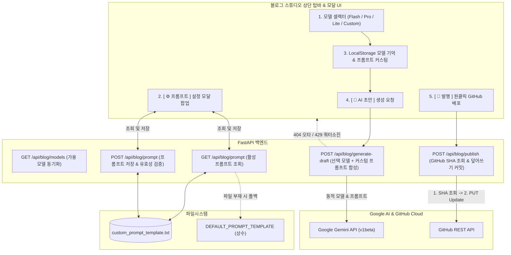

안녕하세요, PickSafe Core Architecture Team입니다.

사내 어드민 환경 내에 기술 블로그 스튜디오를 구축한 이후, 운영 효율성을 극대화하기 위해 **다중 AI 모델 동적 선택기, 실시간 프롬프트 커스텀 엔진, 그리고 GitHub 멱등 발행 안전망**을 도입했습니다. 

이번 글에서는 단일 하드코딩 모델 구조에서 겪었던 한계와 이를 극복하기 위해 설계한 아키텍처, 그리고 트러블슈팅 과정에서 얻은 엔지니어링 인사이트를 공유하고자 합니다.

---

## 1. 배경 및 문제 정의 (Problem Statement)

초기 블로그 스튜디오는 단일 하드코딩 모델(`gemini-3.6-flash`) 기반으로 동작하도록 설계되었습니다. 그러나 실무에서 다음과 같은 한계와 고도화 요구가 지속적으로 제기되었습니다.

1. **단일 모델의 유연성 부족**: 초고속 개요 작성이 필요한 작업과, 복잡한 분산 아키텍처 및 Mermaid 다이어그램 심층 분석이 필요한 작업은 요구하는 AI 모델의 성격(Flash vs Pro)이 다릅니다. 하나의 모델로는 최적의 결과를 얻기 어려웠습니다.
2. **미래 호환성(Future-Proof) 부재**: 새로운 Gemini 모델이 출시될 때마다 백엔드 소스 코드를 수정하고 배포해야 하는 번거로움이 있었습니다.
3. **Fail-Safe 장치 부재**: 관리자가 모델명을 직접 입력(Custom)할 때 오타가 발생하면 `404 Not Found` 에러로 이어져 UX가 저하되었습니다.
4. **프롬프트 튜닝의 제약**: 글의 어조나 서식 규격(H2/H3 계층), 기밀 마스킹 정책 등을 변경하려면 파이썬 코드를 수정하고 서버를 재시작해야 했습니다.
5. **발행 멱등성(Idempotency) 문제**: 이미 배포된 블로그 글을 수정하여 재발행할 때, 파일이 중복 생성되는 대신 기존 파일에 대한 '수정 커밋(Update)'으로 안전하게 반영되어야 했습니다.

---

## 2. 시스템 아키텍처 및 작업 흐름

위 문제들을 해결하기 위해 프론트엔드 UI, FastAPI 백엔드, 영구 파일 스토리지, 그리고 외부 클라우드(Google AI, GitHub)를 유기적으로 연결하는 아키텍처를 설계했습니다.

---

## 3. 핵심 설계 및 구현 (Design & Implementation)

### 3.1. 백엔드 동적 모델 디스패처 및 Fail-Safe
- **동적 모델 바인딩**: `POST /api/blog/generate-draft` 엔드포인트에서 클라이언트가 전달한 모델명(`payload.get("model")`)을 동적으로 받아 Gemini API 요청에 바인딩합니다.
- **예외 처리 (Fail-Safe)**: 
  - `404 Not Found`(지원되지 않는 모델명/오타) 발생 시, `"존재하지 않거나 지원되지 않는 모델명입니다."`라는 명확한 메시지를 반환하여 기본 모델로의 재시도를 유도합니다.
  - `429 Too Many Requests`(쿼터 초과) 발생 시, 쿼터 리셋 안내 및 예비 키 스위칭 가이드를 제공합니다.

### 3.2. 실시간 AI 프롬프트 템플릿 관리 엔진
- **파일 기반 영구 저장 및 폴백**: 커스텀 프롬프트는 전용 텍스트 파일에 저장되며, 파일이 존재하지 않을 경우 시스템 내장 기본 템플릿(`DEFAULT_PROMPT_TEMPLATE`)으로 안전하게 폴백(Fall-back)됩니다.
- **변수 유효성 검증**: 템플릿 저장 시 필수 치환 변수(예: `{content}`)가 누락되었는지 검증하여 시스템 오작동을 원천 차단했습니다.
- **원클릭 초기화**: 관리자가 원할 경우 언제든 시스템 기본 프롬프트로 즉시 복원할 수 있는 Reset 기능을 구현했습니다.

### 3.3. GitHub SHA 기반 멱등 재수정 발행 메커니즘
동일한 글을 반복해서 수정·발행할 때 깃허브에 불필요한 중복 파일이 쌓이지 않도록 **SHA 해시 기반 덮어쓰기** 메커니즘을 적용했습니다.

1. 파일명을 고유 식별 키로 사용하여 `GET` 요청으로 GitHub 상의 기존 파일 **SHA 해시**를 먼저 조회합니다.
2. 기존 파일이 존재할 경우, `PUT` 요청 본문에 해당 `sha` 값을 포함하여 전송합니다.
3. 이를 통해 GitHub는 파일을 새로 생성하는 대신 **기존 파일을 안전하게 덮어쓰는 Update 커밋**을 수행하여 깔끔한 히스토리를 유지합니다.

---

## 4. 도입 효과 (Takeaways)

1. **운영 효율성 및 콘텐츠 품질 향상**: 작업 성격에 맞게 Flash와 Pro 모델을 자유롭게 전환하고, 코드 배포 없이도 실시간으로 프롬프트를 튜닝하여 AI 생성 결과물의 완성도를 크게 높였습니다.
2. **높은 확장성 (Future-Proof)**: Google이 새로운 Gemini 버전을 출시하더라도 백엔드 배포 없이 관리자 UI에서 Custom 입력만으로 즉시 대응할 수 있는 구조를 완성했습니다.
3. **견고한 시스템 안정성**: 예외 상황(오타, 쿼터 초과)에 대한 친절한 방어 로직과 멱등성이 보장되는 발행 프로세스를 통해 어드민 운영 리스크를 최소화했습니다.

이번 아키텍처 고도화를 통해 PickSafe는 AI 도구를 단순 활용하는 것을 넘어, 비즈니스 환경 변화에 유연하게 대응할 수 있는 내부 프로덕션 레벨의 도구 체계를 갖추게 되었습니다. 앞으로도 개발 생산성을 높이는 기술적 시도를 지속해 나가겠습니다.