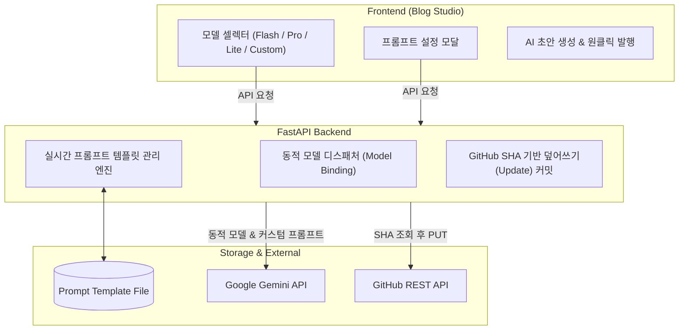

안녕하세요, PickSafe Core Architecture Team입니다.

PickSafe 어드민 내부에 구축된 **기술 블로그 스튜디오(ADR #30)**는 개발 생산성을 획기적으로 높여준 핵심 도구입니다. 하지만 실무 운영 과정에서 단일 하드코딩 모델과 고정된 프롬프트 구조가 가져오는 한계를 마주하게 되었습니다. 

이번 글에서는 **단일 AI 모델의 제약을 극복하고, 코드 배포 없이 모델과 프롬프트를 실시간으로 제어하며, GitHub 발행의 멱등성(Idempotency)을 보장하기 위해 어떤 아키텍처적 고민과 해결책을 선택했는지** 공유하고자 합니다.

---

## 1. 마주한 기술적 고민 (Problem Statement)

초기 블로그 스튜디오는 신속한 초안 작성을 위해 특정 AI 모델(`gemini-3.6-flash`)과 단일 프롬프트를 백엔드 코드 내에 하드코딩하여 운영했습니다. 그러나 서비스 고도화 과정에서 다음과 같은 제약 사항들이 명확해졌습니다.

1. **AI 모델 선택의 유연성 부족**: 
   - 가벼운 개요 작성에는 빠른 속도의 모델이 유리하고, 복잡한 분산 아키텍처나 Mermaid 심층 분석에는 추론 능력이 뛰어난 모델이 필요합니다. 단일 모델 고정은 작업 성격에 따른 최적화를 가로막았습니다.
2. **미래 호환성(Future-Proof)의 부재**: 
   - Google Gemini 신규 모델이 출시될 때마다 백엔드 파이썬 코드를 수정하고 재배포해야 하는 번거로움이 있었습니다.
3. **Fail-Safe 메커니즘 부재**: 
   - 관리자가 모델명을 직접 커스텀 입력할 때 오타(`404 Not Found`)나 쿼터 초과(`429 Too Many Requests`)가 발생할 경우, 시스템이 graceful하게 대응하지 못하고 에러를 그대로 노출했습니다.
4. **프롬프트 튜닝의 병목**: 
   - 글의 어조, 서식 규격, 기밀 마스킹 정책 등을 변경하려면 코드 수정과 서버 재시작이 필요했습니다.
5. **재수정 발행 시 중복 파일 생성 문제**: 
   - 이미 배포된 블로그 글을 수정하여 다시 발행할 때, 고유 식별 키 관리가 미흡하면 동일한 내용의 파일이 중복 생성되는 문제가 발생했습니다.

---

## 2. 아키텍처 및 핵심 해결 전략 (Architecture & Trade-offs)

이러한 문제를 해결하기 위해 **FastAPI 백엔드**, **파일 기반 영구 스토리지**, 그리고 **GitHub REST API**를 유기적으로 연결하는 동적 제어 파이프라인을 설계했습니다.

### ① 백엔드 동적 모델 디스패처 구현
하드코딩된 모델 호출 방식을 제거하고, 클라이언트가 요청하는 페이로드(`payload.get("model")`)에 따라 런타임에 모델을 동적으로 바인딩하도록 변경했습니다. 
* **오타 및 에러 방어 (Fail-Safe)**: 
  - `404 Not Found`(미지원 모델명) 발생 시, 사용자에게 명확한 가이드를 제공하고 기본 모델로 자동 폴백(Auto-Fallback)할 수 있는 예외 처리를 추가했습니다.
  - `429 Too Many Requests`(쿼터 초과) 시그널 감지 시 예비 키 스위칭 유도를 위한 친절한 에러 메시지를 반환합니다.

### ② 파일 기반 실시간 프롬프트 템플릿 관리 엔진
프롬프트의 영속성을 위해 코드가 아닌 파일 시스템(`web/backend/data/blog_prompt_template.txt`)을 선택했습니다.
* **유연성 vs 안정성 타협점**: 데이터베이스를 도입하기에는 오버엔지니어링이라 판단하여 텍스트 파일 기반 저장을 선택했습니다. 대신, 저장 시 필수 치환 변수(예: `{content}`)가 누락되었는지 검증하는 로직을 두어 템플릿 훼손을 원천 차단했습니다.
* 파일이 손상되거나 삭제될 경우 내장된 `DEFAULT_PROMPT_TEMPLATE` 상수로 자동 폴백되도록 설계하여 시스템 안정성을 높였습니다.

### ③ GitHub SHA 해시 기반 멱등(Idempotency) 발행
블로그 글을 수정 후 재발행할 때 중복 파일이 생기는 것을 막기 위해, 파일명을 고유 식별 키(Key)로 활용하고 GitHub API의 특성을 활용했습니다.
1. 발행 요청 시 `GET /contents/{path}`를 통해 기존 파일의 **SHA 해시 값**을 먼저 조회합니다.
2. SHA가 존재하는 경우, `PUT` 요청 본문에 해당 `sha`를 포함하여 전송함으로써 새로운 파일을 만드는 것이 아니라 기존 파일을 안전하게 **덮어쓰기(Update) 커밋**하도록 구현했습니다. 이를 통해 깔끔한 단일 커밋 히스토리를 유지할 수 있습니다.

---

## 3. 도입 효과 (Takeaways)

이번 아키텍처 개선을 통해 다음과 같은 엔지니어링적 성과를 거둘 수 있었습니다.

1. **운영 효율성 극대화**: 
   - 아키텍처 다이어그램 설계에는 `Pro` 모델을, 빠른 개요 작성에는 `Flash` 모델을 상황에 맞게 선택할 수 있게 되었습니다. 또한 코드 배포 없이 UI 모달을 통해 실시간으로 프롬프트를 튜닝할 수 있습니다.
2. **Zero-Deploy 모델 확장성 (Future-Proof)**: 
   - 새로운 Gemini 모델이 출시되더라도 백엔드 수정 없이 'Custom 입력'을 통해 즉시 현업에 투입할 수 있는 구조를 완성했습니다.
3. **견고한 프로덕션 신뢰성**: 
   - 예외 상황(API 오타, 쿼터 초과)에 대한 탄탄한 Fail-Safe 방어막과 GitHub 멱등 발행 메커니즘을 통해 어드민 운영 안정성을 한 차원 높였습니다.

기술은 비즈니스의 속도를 뒷받침해야 합니다. 이번 다중 AI 모델 동적 선택기와 실시간 프롬프트 엔진 구축은, 변화하는 AI 생태계에 유연하게 대응하면서도 시스템의 안정성을 놓치지 않은 모범적인 사례가 되었습니다.

감사합니다.