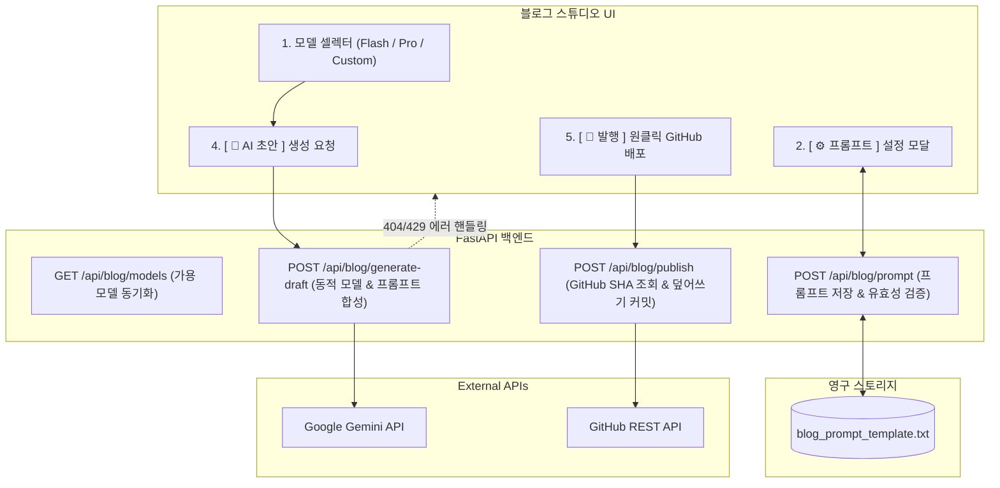

안녕하세요. PickSafe Security & Core Architecture Team입니다.

저희 팀은 내부 기술 블로그와 아키텍처 문서화를 효율화하기 위해 **블로그 스튜디오(Blog Studio)**를 자체 구축하여 운영하고 있습니다. 초기에는 단일 AI 모델과 하드코딩된 프롬프트를 활용해 빠르게 초안을 생성하는 데 집중했으나, 실무 운영 과정에서 확장성과 유연성 측면의 명확한 한계를 마주하게 되었습니다.

이번 글에서는 **단일 모델의 한계를 극복하고, AI 모델의 변화에 유연하게 대응하며, 안전한 발행(Idempotency)을 보장하기 위해 어떤 기술적 고민과 아키텍처 결정을 내렸는지** 공유해 드립니다.

---

## 1. 배경 및 마주한 문제 (Problem Definition)

초기 블로그 스튜디오를 운영하며 아래와 같은 5가지 실무적 페인 포인트(Pain Point)가 발생했습니다.

1. **단일 하드코딩 모델의 한계**:
   - 가벼운 개요 작성에 적합한 모델과, 복잡한 분산 아키텍처 및 Mermaid 다이어그램 심층 분석에 적합한 모델은 다릅니다. 단일 모델 고정은 유연성을 크게 떨어뜨렸습니다.
2. **미래 호환성(Future-Proof) 부재**:
   - 새로운 AI 모델이 출시될 때마다 백엔드 소스 코드를 수정하고 재배포해야 하는 번거로움이 있었습니다.
3. **사용자 입력 에러(Fail-Safe) 대응 미비**:
   - 관리자가 직접 모델명을 커스텀 입력할 때 오타(`404 Not Found`)나 쿼터 초과(`429 Too Many Requests`)가 발생했을 때의 방어 로직이 필요했습니다.
4. **프롬프트 튜닝의 병목**:
   - 글의 어조, H2/H3 계층 구조, 기밀 마스킹 정책 등을 변경하려면 백엔드 코드를 수정하고 서버를 재시작해야 했습니다.
5. **재수정 발행 시 멱등성(Idempotency) 보장**:
   - 이미 배포된 글을 스튜디오에서 수정 후 발행할 때, 파일이 중복 생성되는 대신 기존 파일에 대한 '수정 커밋(Update)'으로 안전하게 반영되어야 했습니다.

---

## 2. 시스템 아키텍처 및 작업 흐름 (Architecture)

이러한 문제를 해결하기 위해 프론트엔드(UI/UX), FastAPI 백엔드, 영구 스토리지, 외부 클라우드(Google Gemini API, GitHub REST API)를 유기적으로 연결하는 아키텍처를 설계했습니다.

---

## 3. 핵심 기술 결정과 구현 (Design & Trade-offs)

### 3.1. 백엔드 동적 모델 디스패처
* **구현 방식**: `POST /api/blog/generate-draft` 엔드포인트에서 요청받은 모델명(`payload.get("model")`)을 동적으로 바인딩하여 AI 클라이언트를 호출합니다.
* **Fail-Safe 처리**: 
  - 지원하지 않는 모델명 입력으로 `404 Not Found` 발생 시, 클라이언트에게 명확한 에러 메시지를 전달하고 기본 모델로 재시도를 유도합니다.
  - 쿼터 초과(`429 Too Many Requests`) 시그널 감지 시 예비 키 스위칭 안내를 제공하여 운영 중단 리스크를 최소화했습니다.

### 3.2. 파일 기반 실시간 프롬프트 템플릿 엔진
* **트레이드오프**: DB를 도입하는 방법도 있었으나, 설정 파일 단건의 단순성과 빠른 로컬 디버깅을 위해 **파일 시스템 기반 영구 저장소(`blog_prompt_template.txt`)**를 선택했습니다.
* **안전망**: 
  - 관리자가 프롬프트를 저장할 때 핵심 치환 변수(예: `{content}`)가 누락되었는지 검증하여 템플릿 훼손을 방지합니다.
  - 파일 유실 시 코드 내장 상수(`DEFAULT_PROMPT_TEMPLATE`)로 자동 폴백되는 구조를 구현했습니다.

### 3.3. GitHub SHA 해시 기반 멱등(Idempotency) 발행
* **문제 해결**: 파일 제목 변경이나 중복 생성 문제를 방지하기 위해, 사이드바에서 선택된 **고유 `파일명(filename)`을 식별 키**로 사용합니다.
* **동작 흐름**:
  1. 배포 전 `GET` 요청을 통해 GitHub 레포지토리의 기존 파일 `SHA` 해시 값을 조회합니다.
  2. 이미 존재하는 파일일 경우, `PUT` 요청 본문에 해당 `SHA`를 포함하여 전송함으로써 새로운 파일 생성이 아닌 **기존 파일에 대한 안전한 Update 커밋(덮어쓰기)**을 보장합니다.

---

## 4. 도입 효과 (Takeaways)

1. **AI 생성 품질의 정교한 제어**: 복잡한 아키텍처 분석에는 고성능 모델을, 빠른 초안 작성에는 고속 모델을 상황에 맞게 선택하여 생산성을 극대화했습니다.
2. **제로 딜레이 확장성 (Future-Proof)**: Google이 신규 Gemini 모델을 출시해도 코드 배포 없이 `Custom 입력`을 통해 즉시 현업에 투입할 수 있습니다.
3. **안정적인 히스토리 관리**: 멱등성이 보장되는 GitHub 연동 덕분에 수정을 거듭해도 레포지토리에 깔끔한 단일 커밋 히스토리가 유지됩니다.

이번 아키텍처 고도화를 통해 PickSafe는 운영 효율성과 시스템 유연성을 동시에 잡을 수 있었습니다. 앞으로도 개발자 경험(DX)을 높이는 인프라 개선 과정을 지속해서 공유해 드리겠습니다.

감사합니다.