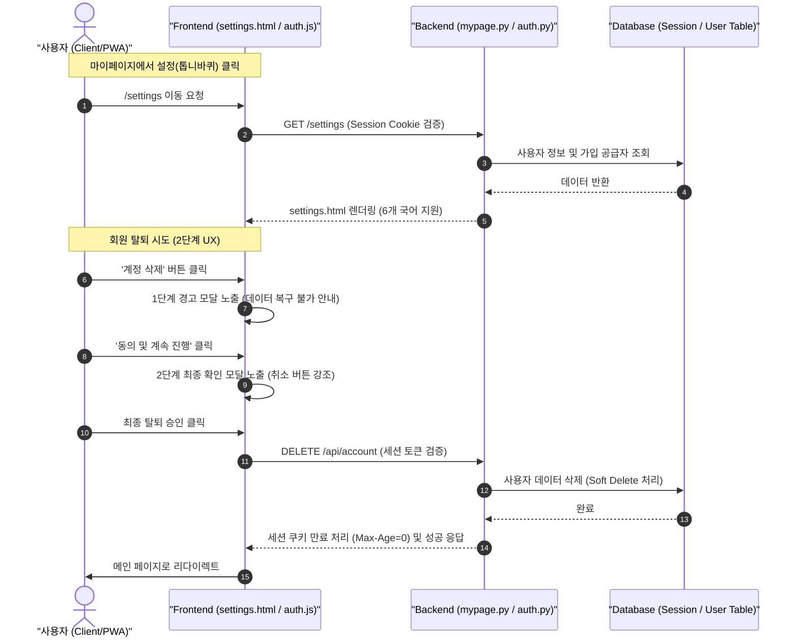

화장품 성분 분석 서비스인 **PickSafe**를 개발하고 운영하면서, 기술적인 고도화만큼이나 중요하게 다가온 것은 '사용자가 서비스를 이용하는 일상적인 흐름'을 안전하고 매끄럽게 다듬는 일이었습니다. 

최근 마이페이지 내부의 설정 기능과 계정 관리, 그리고 로그인 세션 유지 방식을 전면적으로 개편했습니다. 팝업 모달 중심의 UI가 가졌던 한계를 극복하고, 사용자의 소중한 개인화 데이터(기피 성분 설정, 찜 목록 등)를 보호하기 위해 내렸던 아키텍처 설계와 기술적 의사결정 과정을 담담히 기록해 봅니다.

---

## 🎯 마주한 고민과 문제 배경

기존 PickSafe의 설정 기능은 마이페이지 우측 상단의 톱니바퀴 아이콘을 누르면 화면 위에 팝업(모달) 형태로 레이어가 뜨는 방식이었습니다. 초기에는 간단한 토글 몇 개만 존재했기에 이 방식으로도 충분했습니다. 하지만 서비스가 확장되면서 다음과 같은 문제점들이 드러났습니다.

### 1. 모바일 및 PWA 환경에서의 모달 화면 한계
PickSafe는 화장품 매장 현장에서 모바일 기기로 성분을 검색하는 사용자가 많습니다. 모바일 웹 및 PWA(Progressive Web App) 환경에서 좁은 모달 창 안에 6개 국어 다국어 설정, 계정 정보(이메일, 소셜 로그인 공급자 정보), 보안 설정을 한꺼번에 구겨 넣다 보니 시각적 피로도가 높았고 오동작의 여지가 많았습니다.

### 2. 너무 짧았던 로그인 세션과 데이터 유실 우려
사용자가 기피 성분을 꼼꼼히 설정해 두었더라도, 세션이 너무 빠르게 만료되어 매번 현장에서 다시 로그인해야 하는 불편함이 있었습니다. 또한, 상단 네비게이션 헤더에 로그아웃 버튼이 항상 노출되어 있어, 모바일 화면을 터치하다가 실수로 로그아웃되어 흐름이 끊기는 일도 잦았습니다.

### 3. 위험한 계정 조작 인터랙션의 부재
회원 탈퇴나 로그아웃처럼 되돌리기 힘든 중요한 작업들이 단 한 번의 클릭(1-Step)으로 처리되거나 너무 쉽게 노출되어 있었습니다. 특히 회원 탈퇴의 경우, 사용자가 누적해 온 성분 분석 데이터가 즉시 영구 삭제되므로 우발적인 탈퇴를 방지할 수 있는 '생각할 시간'을 주는 안전장치가 필요했습니다.

---

## ⚖️ 기술적 대안 비교 및 선택 이유

이 문제들을 해결하기 위해 몇 가지 아키텍처적 대안을 두고 비교 검토했습니다.

### 대안 1: 기존 모달 UI를 반응형 CSS로 고도화
*   **장점:** 별도의 신규 라우트(`GET /settings`)를 생성할 필요가 없고 프론트엔드 단의 스타일 수정만으로 해결 가능.
*   **단점:** 다국어 번역 데이터 및 계정 상세 정보를 렌더링하기 위해 마이페이지 로딩 시점에 불필요한 데이터 세트까지 한 번에 조회해야 하므로 쿼리 효율성 저하. 모바일 뷰포트에서의 답답함은 근본적으로 해결하기 어려움.

### 대안 2: 설정 및 계정 관리 전용 독립 페이지(`/settings`) 분리 (선택)
*   **장점:** 관심사의 분리(Separation of Concerns) 달성. 마이페이지 뷰와 설정 뷰의 백엔드 컨트롤러가 분리되어 유지보수가 용이해짐. 모바일 화면 전체를 활용하여 6개 국어 선택 및 계정 보안 설정을 여유롭게 배치 가능.
*   **단점:** 라우트 신설에 따른 파일 추가 및 네비게이션 흐름 설계 공수 발생.

### 대안 3: 세션 유지 정책 변경 (Short-lived JWT vs Long-lived Session Cookie)
*   보안성과 편의성 사이에서 고민했습니다. PickSafe는 금융이나 민감 개인정보를 다루는 고보안성 서비스라기보다는, 일상적인 유틸리티 서비스에 가깝습니다. 따라서 사용 편의성을 극대화하기 위해 카카오나 글로벌 빅테크 앱처럼 세션 쿠키의 유효기간을 **1년(365일)**으로 길게 가져가기로 결정했습니다. 
*   대신, 세션 쿠키 탈취 위험을 방지하기 위해 `HttpOnly`, `Secure`, `SameSite=Lax` 옵션을 철저히 적용하여 브라우저 스크립트 단에서의 접근을 원천 차단했습니다.

---

## 🏗️ 시스템 아키텍처 및 흐름

새롭게 정의한 `/settings` 라우트 기반의 흐름과, 안전한 2단계 회원 탈퇴 UX가 백엔드와 어떻게 상호작용하는지 정리한 다이어그램입니다.



---

## 💻 핵심 구현 및 트러블슈팅

### 1. 백엔드 세션 쿠키 수명 연장 (1년 장기 유지)
로그인 완료 및 세션 발급 시 쿠키 생명주기를 기존 세션 브라우저 종료 시 만료에서 1년(`31,536,000초`)으로 대폭 연장했습니다.

```python
# web/backend/app/routers/auth.py 중 일부

@router.post("/login")
async def login(response: Response, login_data: LoginRequest):
    # ... 인증 로직 수행 ...
    session_token = create_user_session(user_id)
    
    # 세션 쿠키 설정: 1년(365일) 장기 유지
    # 민감한 키 정보는 환경변수(SETTINGS.SESSION_COOKIE_NAME)로 추상화하여 사용
    response.set_cookie(
        key=SETTINGS.SESSION_COOKIE_NAME,
        value=session_token,
        max_age=31536000,  # 365 * 24 * 60 * 60 초
        httponly=True,     # XSS 공격 방어
        secure=True,       # HTTPS 연결에서만 전송
        samesite="lax"     # CSRF 공격 방어 완화 정책
    )
    return {"status": "success", "message": "Logged in successfully"}
```

### 2. 2단계 회원 탈퇴 모달 및 이탈 방어 UX 구현
우발적인 탈퇴를 막기 위해 프론트엔드에서는 2단계 모달을 띄우고, 인지적 편향을 활용하여 '탈퇴 취소(계속 이용하기)' 버튼을 시각적으로 가장 크게 강조했습니다.

```javascript
// web/frontend/static/js/auth.js

// 탈퇴 절차 제어 상태 객체
const DeleteAccountFlow = {
    currentStep: 0,
    
    init() {
        this.currentStep = 0;
        this.renderStep();
    },

    nextStep() {
        if (this.currentStep < 2) {
            this.currentStep++;
            this.renderStep();
        }
    },

    reset() {
        this.currentStep = 0;
        this.renderStep();
        // 모달 닫기 로직 추가
        document.getElementById('delete-account-modal').style.display = 'none';
    },

    renderStep() {
        const step1El = document.getElementById('delete-step-1');
        const step2El = document.getElementById('delete-step-2');

        if (this.currentStep === 1) {
            step1El.style.display = 'block';
            step2El.style.display = 'none';
        } else if (this.currentStep === 2) {
            step1El.style.display = 'none';
            step2El.style.display = 'block';
        } else {
            step1El.style.display = 'none';
            step2El.style.display = 'none';
        }
    },

    async executeDeletion() {
        try {
            const response = await fetch('/api/account', {
                method: 'DELETE',
                headers: {
                    'Content-Type': 'application/json'
                }
            });
            
            if (response.ok) {
                alert('계정이 안전하게 삭제되었습니다. 그동안 이용해 주셔서 감사합니다.');
                window.location.href = '/';
            } else {
                throw new Error('Deletion failed');
            }
        } catch (error) {
            console.error('회원 탈퇴 처리 중 오류 발생:', error);
            alert('요청을 처리하지 못했습니다. 잠시 후 다시 시도해 주세요.');
        }
    }
};
```

```html
<!-- web/frontend/templates/settings.html 중 회원 탈퇴 섹션 -->
<div id="delete-account-modal" class="modal-overlay" style="display:none;">
  <div class="modal-content">
    <!-- 1단계: 경고 및 안내 -->
    <div id="delete-step-1" style="display:none;">
      <h3>정말 PickSafe를 떠나시나요?</h3>
      <p>계정을 삭제하시면 설정하신 기피 성분 필터와 찜해둔 화장품 목록이 모두 영구 삭제되며 복구할 수 없습니다.</p>
      <div class="btn-group">
        <button onclick="DeleteAccountFlow.reset()" class="btn-primary">계속 이용하기</button>
        <button onclick="DeleteAccountFlow.nextStep()" class="btn-link-danger">위 유의사항을 확인했으며, 다음 단계로 이동</button>
      </div>
    </div>

    <!-- 2단계: 최종 확인 -->
    <div id="delete-step-2" style="display:none;">
      <h3>마지막 확인입니다.</h3>
      <p>계정 삭제 시 즉시 로그아웃되며 모든 데이터가 파기됩니다. 정말 진행하시겠습니까?</p>
      <div class="btn-group">
        <button onclick="DeleteAccountFlow.reset()" class="btn-primary">계속 이용하기</button>
        <button onclick="DeleteAccountFlow.executeDeletion()" class="btn-danger-final">네, 계정을 영구 삭제합니다</button>
      </div>
    </div>
  </div>
</div>
```

### 3. 트러블슈팅: 다국어(i18n) 설정 페이지 분리 시 발생한 렌더링 지연
설정 페이지를 분리하면서 6개 국어에 대응하는 번역 템플릿 정보(`settings.*`)를 불러올 때, 순간적으로 화면이 깜빡이거나 번역 키값(`settings.title` 등)이 그대로 노출되는 현상이 있었습니다.

*   **원인:** 프론트엔드가 로드된 뒤 비동기로 다국어 DB를 찔러 데이터를 채워 넣는 구조였기 때문입니다.
*   **해결:** 백엔드 라우터(`/settings`) 단에서 Jinja2 템플릿 렌더링 시점에 다국어 딕셔너리를 컨텍스트로 한 번에 밀어 넣도록 수정했습니다. `bin/seed_multilingual_db.py`에 설정 페이지 전용 다국어 키셋을 추가하고, 이를 서버 기동 시 인메모리에 캐싱하여 지연 시간을 5ms 미만으로 압축했습니다.

---

## 💡 돌아보며 배운 점

이번 개편을 진행하며 기술적으로, 그리고 서비스적으로 크게 세 가지 교훈을 얻었습니다.

1.  **화려한 인터랙션보다 중요한 것은 '안전한 사용성'이다.**
    팝업 모달이 주는 매끄러움보다, 독립된 페이지(`/settings`)가 주는 공간적 여유와 안정감이 사용자에게 더 큰 신뢰를 준다는 것을 배웠습니다. 특히 중요한 정보를 다루거나 보안 설정을 변경할 때는 유저가 집중할 수 있는 전용 뷰가 필수적입니다.
2.  **도메인의 특성에 맞는 세션 정책 수립의 필요성.**
    보안 모범 사례(Best Practice)만을 맹신하여 무조건 세션을 짧게 가져가는 것이 항상 정답은 아닙니다. 화장품 매장에서 네트워크 환경이 불안정할 때 세션 만료로 로그아웃되는 불편함보다, 적절한 보안 옵션(`HttpOnly`, `SameSite`)을 얹은 1년 만기의 장기 세션이 유저 경험 측면에서 훨씬 가치 있는 선택이었습니다.
3.  **이탈 장벽(Friction)의 영리한 활용.**
    모든 UX가 물 흐르듯 빠를 필요는 없습니다. 회원 탈퇴처럼 비가역적인 동작을 수행할 때는 고의로 2단계 모달과 같은 '마찰(Friction)'을 설계해 유저가 한 번 더 숙고하게 만드는 것이, 유저의 소중한 데이터를 지키고 서비스 이탈을 방어하는 영리한 장치가 됨을 실감했습니다.

앞으로도 PickSafe는 작은 디테일 하나가 서비스의 전체적인 완성도를 결정한다는 마음가짐으로, 사용자의 관점에서 꾸준히 다듬어 나갈 예정입니다.

---