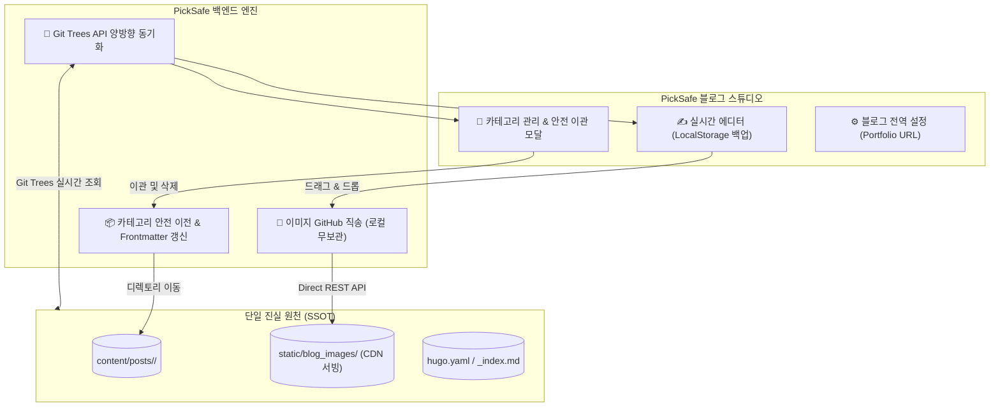

안녕하세요. PickSafe Security & Core Architecture Team입니다.

현대적인 콘텐츠 관리 시스템(CMS)을 자체 구축할 때, 우리는 종종 데이터 저장소를 어디에 둘 것인가에 대한 근본적인 고민과 마주합니다. 데이터베이스(RDBMS/NoSQL)를 구축하는 것이 일반적이지만, **기술 블로그나 문서 중심의 서비스라면 "Git 저장소 자체를 단일 진실 원천(SSOT, Single Source of Truth)으로 삼는 것"이 엄청난 운영 상의 이점을 가져다줍니다.**

PickSafe 블로그 스튜디오를 고도화하면서, 외부 GitHub 블로그 레포지토리와 완벽하게 연동되는 양방향 실시간 동기화 파이프라인을 구축했습니다. 이번 포스팅에서는 이 시스템을 설계하며 마주했던 4가지 핵심 아키텍처 고민과 해결 과정을 공유합니다.

---

## 1. 배경 및 마주한 문제 (Problem Statement)

초기 블로그 스튜디오 도입 당시, 로컬 디스크 중심의 파일 조작과 외부 GitHub 레포지토리 간의 정합성이 어긋나는 문제가 발생했습니다. 대표적인 4가지 페인 포인트는 다음과 같습니다.

1. **캐시 고립 및 비동기화**: 사용자가 GitHub 웹 UI나 외부에서 카테고리/포스트를 생성해도, 백엔드가 로컬 디스크 파일만 단순 조회하여 새로고침을 해도 최신 상태를 반영하지 못함.
2. **카테고리 삭제 시 데이터 유실 위험**: 카테고리를 삭제할 때 하위 마크다운 포스트에 대한 마이그레이션(이관) 정책이 없어 고아 파일이 되거나 유실될 위험 존재.
3. **이미지 파일 중복 및 Git 오염**: 본문 이미지가 로컬, 문서 디렉토리, 원격 레포 등 여러 곳에 중복 저장되면서 PickSafe 메인 Git 상태가 수십 개의 바이너리 파일로 더럽혀짐.
4. **파일명 및 메타데이터 파편화**: 파일명이 임의로 생성되거나 특수문자가 섞여, Git 기반 정적 블로그(Hugo 등)의 라우팅 규칙과 깨지는 현상 발생.

---

## 2. 아키텍처 핵심 원칙: "GitHub = SSOT"

우리는 시스템의 복잡도를 낮추기 위해 명확한 원칙을 세웠습니다.

> **"GitHub = 단일 진실 원천(SSOT)"**  
> **"PickSafe 백엔드 = 초경량 실시간 스튜디오 컨트롤러"**

PickSafe 서버 자체에는 영구적인 블로그 데이터를 저장하지 않고, 모든 파일과 이미지는 GitHub REST API와 Git Trees API를 통해 직접 제어하도록 구조를 대전환했습니다.

---

## 3. 핵심 해결 전략 (Implementation Details)

### 3.1. Git Trees API를 활용한 실시간 양방향 동기화
로컬 캐시 의존성을 끊기 위해, 백엔드는 카테고리나 포스트 목록을 조회할 때마다 GitHub의 Git Trees API(`GET /git/trees/main?recursive=1`)를 호출하도록 구현했습니다. 
* 이를 통해 외부(GitHub 웹 등)에서 변경된 사항을 별도의 `git pull` 명령어 없이도 실시간으로 감지하고 동기화할 수 있게 되었습니다.
* 또한, `.gitignore`를 통해 PickSafe 메인 저장소에는 블로그 관련 바이너리나 임시 파일이 절대 적재되지 않도록 원천 차단했습니다.

### 3.2. 카테고리 생애주기 관리와 '글 유실 0%' 이관 워크플로우
카테고리 삭제 시 발생할 수 있는 데이터 유실을 방지하기 위해 **안전 이관 다이얼로그**를 도입했습니다.
* **글이 존재하는 카테고리 삭제 시**: 삭제하려 할 경우, 반드시 대상 마크다운 파일들을 이관할 '새로운 카테고리'를 선택하도록 강제합니다. 선택 시 백엔드에서 파일 이동과 동시에 본문 Frontmatter의 `category: "..."` 값을 일괄 자동 갱신합니다.
* **빈 카테고리 삭제 시**: 즉시 안전하게 제거합니다.

### 3.3. 이미지 직송(Direct Upload) 파이프라인
에디터에 드래그앤드롭되는 이미지는 PickSafe 서버 로컬 디스크를 거치지 않고, GitHub 블로그 저장소의 `static/blog_images/` 경로로 **Direct REST API 커밋**됩니다. 
* 서버 용량 부담이 사라지고, 이미지 URL이 곧바로 CDN 최적화된 GitHub Pages 경로로 연결되어 아키텍처가 매우 단순해졌습니다.
* 추가로, 브라우저 `localStorage` 기반의 실시간 오토세이브 기능을 결합하여 네트워크 불안정이나 브라우저 강제 종료 상황에서도 작성 중인 글이 유실되지 않도록 방어했습니다.

### 3.4. 본문 기반 정밀 파일명 정규화 엔진
Hugo 등 정적 사이트 generator의 라우팅 안정성을 위해, 본문 Frontmatter의 `date`와 `title`을 파싱하여 `YYYY-MM-DD-제목.md` 포맷으로 자동 변환하는 정규화 엔진을 구현했습니다. 제목이 수정되거나 날짜가 변경될 경우에도 구버전 파일을 안전하게 정리하고 신규 파일명으로 덮어씁니다.

---

## 4. 도입 효과 및 마무리 (Takeaways)

이번 아키텍처 개편을 통해 얻은 이점은 명확합니다.

| 구분 | 개편 전 | 개편 후 (현재) |
| :--- | :--- | :--- |
| **SSOT 확보** | 로컬 / docs / GitHub 3중 파편화 | **GitHub 블로그 저장소 단일화** |
| **외부 변경 감지** | 수동 `git pull` 필요 | **API 호출 시 100% 실시간 동기화** |
| **데이터 안정성** | 카테고리 삭제 시 유실 위험 | **안전 이관 및 Frontmatter 자동 갱신** |
| **메인 Git 상태** | 수십 개의 임시 이미지/파일 오염 | **Git 오염도 0% (.gitignore & 직송)** |

**[핵심 엔지니어링 교훈]**  
시스템의 복잡도를 줄이는 가장 좋은 방법은 "데이터의 진짜 주인이 누구인가"를 명확히 정의하는 것입니다. 모든 상태를 자체 DB나 로컬 디스크에 동기화하려고 애쓰기보다, 외부의 검증된 플랫폼(이 경우 GitHub)을 단일 진실 원천(SSOT)으로 삼고 애플리케이션은 얇고 빠른 '컨트롤러' 역할에 집중하게 만듦으로써, 유지보수성과 확장성을 동시에 잡을 수 있었습니다.

앞으로도 PickSafe는 단순한 기능 구현을 넘어, 견고하고 지속 가능한 아키텍처를 고민해 나가겠습니다. 감사합니다.