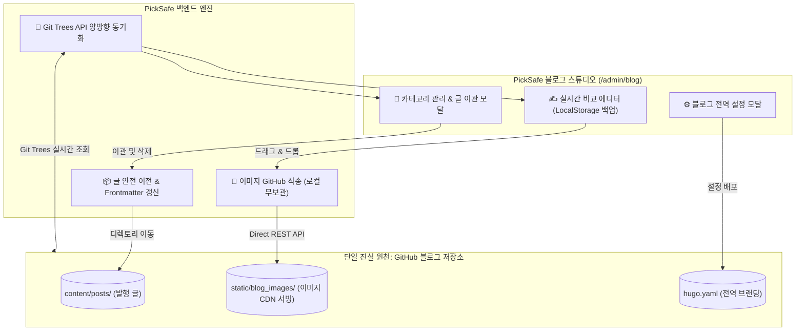

안녕하세요, **PickSafe Core Architecture Team**입니다. 
이번 포스팅에서는 외부 GitHub 블로그와의 완벽한 연동, 데이터 유실 방지, 그리고 리소스 파편화를 해결하기 위해 설계한 **블로그 스튜디오의 양방향 실시간 동기화 및 SSOT 이미지 파이프라인 아키텍처** 도입 과정을 공유합니다.

---

## 1. 배경 및 문제 정의 (Context & Problem Statement)

PickSafe 블로그 스튜디오를 도입한 이후, 독립된 어드민 페이지와 외부 GitHub 블로그 레포지토리 간의 운영 워크플로우에서 다음과 같은 4가지 핵심 기술적 부채와 한계에 직면했습니다.

1. **원격 저장소와의 비동기화 및 캐시 고립**
   - 사용자가 GitHub 웹 UI나 외부 클라이언트를 통해 새로운 카테고리를 생성하거나 글을 발행하더라도, 백엔드가 로컬 디스크 파일만 단순 조회하고 있어 최신 상태를 반영하지 못하는 문제가 있었습니다.
2. **카테고리 삭제 시 데이터 유실(Data Loss) 위험**
   - 특정 카테고리를 삭제할 때, 해당 폴더에 속해 있던 마크다운 포스트들에 대한 마이그레이션 정책이 부재하여 자칫 고아 파일이 되거나 데이터가 유실될 위험이 컸습니다.
3. **이미지 3중 복제 및 Git 저장소 오염**
   - 본문 이미지가 [내부 백엔드 정적 디렉토리], [문서 디렉토리], [GitHub 블로그 레포] 등 무려 3곳에 중복 저장되면서, PickSafe 메인 Git 레포지토리가 수십 개의 불필요한 바이너리 변경사항으로 오염되었습니다.
4. **파일 이름 정규화 및 설정 연동 부재**
   - 날짜 및 특수문자가 섞인 파일명이 무분별하게 생성되었고, 전역 포트폴리오 및 프로젝트 URL 설정이 스튜디오 내에서 원클릭으로 배포되지 않는 불편함이 있었습니다.

---

## 2. 핵심 설계 원칙: "GitHub = SSOT"

> **Core Principle: "GitHub는 단일 진실 원천(SSOT)으로, PickSafe는 초경량 실시간 스튜디오 컨트롤러로 정의한다."**

---

## 3. 기술적 고민과 대안 비교 (Trade-offs & Implementation)

### 3.1. 원격 저장소 동기화: 로컬 파일 시스템 vs GitHub Git Trees API
- **대안 A (로컬 파일 시스템 의존):** 구현이 단순하지만, 외부 환경(GitHub Web UI 등)에서 변경된 사항을 인지하려면 별도의 `git pull` 크론잡이나 수동 명령어가 필요했습니다.
- **대안 B (GitHub Git Trees API 채택):** API 요청 시점마다 `https://api.github.com/repos/{owner}/{repo}/git/trees/main?recursive=1`을 호출하여, 원격 저장소의 전체 트리를 재귀적으로 스캔합니다. 이를 통해 페이지를 열거나 새로고침할 때 추가적인 지연 없이 **100% 실시간으로 원격 상태를 동기화**할 수 있도록 구현했습니다.

### 3.2. 이미지 파이프라인: 로컬 저장 후 푸시 vs GitHub 직송(Direct Upload)
- **문제점:** 에디터에 업로드된 이미지를 서버 로컬에 저장하고 Git으로 커밋하는 방식은 백엔드 스토리지 낭비와 메인 저장소 오염을 유발했습니다.
- **해결책:** 이미지를 첨부하는 즉시 GitHub 블로그 저장소(`static/blog_images/`)로 직접 REST API 요청을 날려 커밋하도록 파이프라인을 변경했습니다. `.gitignore`를 통해 PickSafe 메인 저장소의 바이너리 오염을 원천 차단하고, 브라우저 `localStorage`를 활용한 실시간 임시 백업으로 사용자 경험(UX)까지 모두 잡았습니다.

### 3.3. 카테고리 생애주기 관리 (글 유실 방지 워크플로우)
- 카테고리 삭제 시 발생할 수 있는 데이터 유실을 막기 위해 **안전 이관 다이얼로그**를 도입했습니다.
- 글이 존재하는 카테고리를 삭제하려 할 경우, 대상 마크다운 파일들을 이관할 새 카테고리를 강제로 지정하게 하였으며, 이동과 동시에 본문 Frontmatter 내 `category: "..."` 메타데이터가 자동으로 갱신되도록 처리하여 링크 깨짐 현상을 방지했습니다.

---

## 4. 도입 효과 및 Takeaways (Consequences & Impact)

이번 아키텍처 개편을 통해 얻은 성과는 다음과 같습니다.

| 구분 | 개편 전 | 개편 후 |
| :--- | :--- | :--- |
| **데이터 진실 원천** | 로컬 / 문서 / GitHub 3중 파편화 | **GitHub 블로그 저장소 단일 원천화 (SSOT)** |
| **동기화 속도** | 수동 `git pull` 필요 | **모달 오픈/새로고침 시 100% 실시간 동기화** |
| **PickSafe Git 상태** | 임시 파일 및 이미지로 인한 오염 발생 | **Git 오염도 0% (.gitignore & LocalStorage 보호)** |
| **이미지 파이프라인** | 3중 중복 저장 | **GitHub 원격 저장소 직송 단일화** |

### 💡 엔지니어링 교훈 (Takeaways)
1. **SSOT의 명확화:** 시스템 간 데이터 경계가 모호할 때, '진실의 원천(Single Source of Truth)'을 외부 서비스(이 경우 GitHub)로 명확히 정의하는 것만으로도 복잡한 상태 관리 로직을 대폭 줄일 수 있었습니다.
2. **인프라 파이프라인의 분리:** 메인 서비스의 Git 레포지토리와 콘텐츠 배포 레포지토리의 역할을 분리하고, 에디터의 자원을 외부 스토리지(GitHub Direct API)로 오프로드(Offload)함으로써 애플리케이션 서버의 부하와 저장소 오염을 동시에 해결할 수 있었습니다.