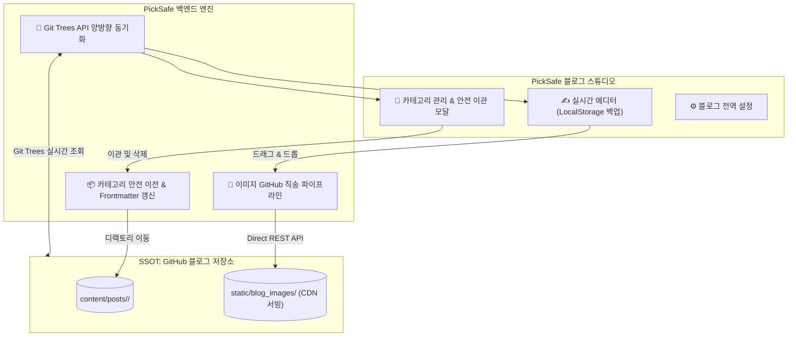

안녕하세요, PickSafe Core Architecture Team입니다.

PickSafe 내부 서비스의 운영 효율성을 높이기 위해 자체 구축한 **블로그 스튜디오(Blog Studio)**는 외부 정적 블로그 저장소와 연동되어 작동합니다. 하지만 서비스가 고도화되면서, **"로컬 환경과 원격 저장소 간의 상태 불일치"**, **"이미지 바이너리로 인한 Git 오염"**, 그리고 **"카테고리 삭제 시의 데이터 유실 위험"** 등 실무에서 마주할 수 있는 전형적인 아키텍처 병목 현상들이 발생했습니다.

이번 포스팅에서는 이러한 문제를 어떻게 정의하고, **GitHub를 단일 진실 원천(SSOT, Single Source of Truth)**으로 삼는 양방향 실시간 동기화 아키텍처로 개선했는지 그 과정과 트레이드오프를 공유합니다.

---

## 1. 배경 및 마주한 문제 (Problem Statement)

초기 블로그 스튜디오 도입 당시에는 빠른 기능 구현에 집중한 나머지, 다음과 같은 5가지 아키텍처적 한계점을 안고 있었습니다.

1. **원격 저장소와 로컬 캐시의 고립 (비동기화)**
   - GitHub 웹 UI나 타 경로에서 새로운 카테고리나 글이 생성되어도, 백엔드가 로컬 디스크 파일만 단순 조회하고 있어 최신 상태를 반영하지 못했습니다.
2. **카테고리 삭제 시 데이터 유실(Data Loss) 위험**
   - 카테고리를 삭제할 때 하위 마크다운 포스트에 대한 마이그레이션(이관) 정책이 없어, 고아 파일이 되거나 데이터가 통째로 유실될 위험이 있었습니다.
3. **이미지 파일 3중 복제 및 Git 저장소 오염**
   - 본문 이미지가 [내부 Static], [문서 디렉토리], [GitHub 블로그 레포]에 중복 저장되면서, PickSafe 메인 Git 상태가 수십 개의 바이너리 변경사항으로 더럽혀졌습니다.
4. **파일명 정규화 누락**
   - 사용자 입력에 따라 파일명 규칙이 깨지거나 날짜 파싱이 누락되는 현상이 발생했습니다.

---

## 2. 핵심 설계 원칙: GitHub = SSOT

이 문제를 해결하기 위해 세운 아키텍처의 대원칙은 명확했습니다.

> **"GitHub를 단일 진실 원천(SSOT)으로 삼고, PickSafe 백엔드는 초경량 실시간 스튜디오 컨트롤러로만 동작한다."**

이를 구현하기 위해 아래와 같은 구조로 시스템을 재설계했습니다.

---

## 3. 주요 구현 내용 (Implementation Details)

### 3.1. GitHub Git Trees API 기반 양방향 실시간 동기화
로컬 캐시에 의존하던 방식을 탈피하여, API 호출 시점에 GitHub의 `git/trees/{branch}?recursive=1` 엔드포인트를 직접 조회하도록 변경했습니다.
* **실시간 원격 스캔**: 사용자가 페이지를 새로고침하거나 모달을 열 때, 원격 저장소의 모든 카테고리와 포스트 상태를 실시간으로 동기화합니다.
* **클린업 자동화**: 외부에서 수정되거나 삭제된 파일은 로컬 환경에서도 정합성을 맞추도록 처리했습니다.

### 3.2. 카테고리 생애주기 관리 및 유실 방지 이관 워크플로우
카테고리 삭제 시 발생할 수 있는 데이터 유실을 막기 위해 **안전 이관 다이얼로그**를 도입했습니다.
* 글이 존재하는 카테고리를 삭제하려 할 경우, **대상 이관 카테고리를 강제로 선택**하게 합니다.
* 선택된 카테고리로 마크다운 파일들을 이동시킴과 동시에, 파일 내부의 `category: "..."` Frontmatter 값을 백엔드에서 자동으로 갱신하여 Hugo 렌더링 에러를 원천 차단했습니다.

### 3.3. 이미지 직송(Direct Upload) 및 Git 오염 방지
* **이미지 직송 파이프라인**: 에디터에 업로드되는 이미지는 PickSafe 로컬 디스크를 거치지 않고, GitHub 블로그 저장소(`static/blog_images/`)로 곧바로 REST API 커밋을 날립니다.
* **Git 상태 클린화**: `.gitignore`에 로컬 임시 저장 경로들을 엄격하게 차단하여, 메인 애플리케이션 레포지토리의 Git 변경사항 오염도를 `0%`로 만들었습니다.
* **프론트엔드 안전장치**: 브라우저 `localStorage`를 활용한 실시간 오토세이브 기능을 결합해 예기치 못한 브라우저 종료 시에도 작성 중인 데이터를 완벽히 보호합니다.

---

## 4. 도입 효과 (Impact)

리팩토링 이후 시스템은 다음과 같이 극적으로 개선되었습니다.

| 구분 | 개선 전 | 개선 후 |
| :--- | :--- | :--- |
| **데이터 진실 원천(SSOT)** | 로컬 / 문서 / GitHub 3중 파편화 | **GitHub 블로그 저장소 단일 원천화** |
| **외부 생성 카테고리 인식** | 로컬 `git pull` 필요 | **새로고침 시 100% 실시간 동기화** |
| **카테고리 삭제 안정성** | 데이터 유실(고아 파일) 위험 존재 | **안전 이관 및 Frontmatter 자동 갱신** |
| **PickSafe Git 상태** | 30개 이상의 임시 바이너리 오염 | **Git 오염도 0% (Clean Workspace 유지)** |

---

## 5. 엔지니어링 교훈 (Takeaways)

이번 아키텍처 개선을 통해 얻은 가장 큰 교훈은 **"상태(State)의 위치를 명확히 정의하는 것의 중요성"**입니다. 

분산된 환경에서 데이터를 다룰 때 여러 곳에 상태를 분산시키면 동기화 비용과 버그가 기하급수적으로 증가합니다. **"Single Source of Truth (SSOT)"** 원칙을 철저히 적용하여 저장소의 역할과 애플리케이션의 역할을 분리함으로써, 시스템의 복잡성을 낮추고 유지보수성을 극대화할 수 있었습니다.

앞으로도 PickSafe는 견고하고 확장 가능한 아키텍처를 바탕으로 안정적인 개발 환경을 구축해 나갈 것입니다. 읽어주셔서 감사합니다.