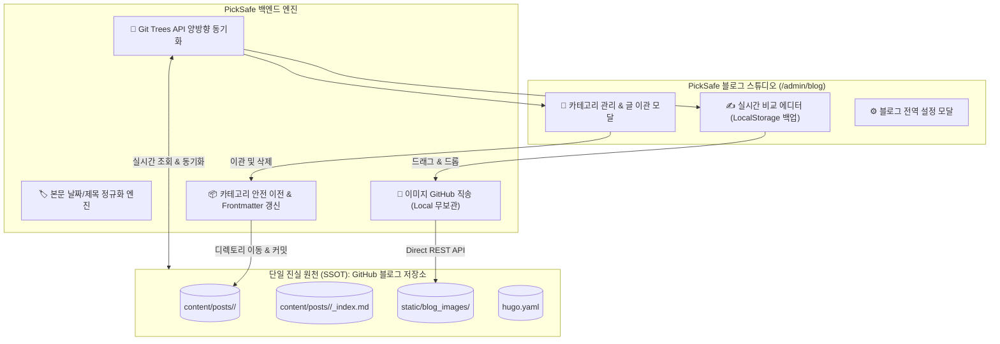

안녕하세요, PickSafe Core Architecture Team입니다.

PickSafe 내부 서비스의 지식 공유와 생태계 확장을 위해 자체 개발한 **'블로그 스튜디오'**를 운영하면서, 외부 Git 기반 블로그(`daniel-dataflow.github.io`)와 긴밀하게 연동해야 하는 과제를 마주했습니다. 

초기 버전은 로컬 파일 시스템을 중심으로 동작하여 구현이 단순했지만, 실제 운영 환경에서는 **데이터 파편화, 이미지 중복 저장으로 인한 Git 오염, 카테고리 삭제 시 데이터 유실 위험** 등 다양한 아키텍처적 한계가 드러났습니다.

이번 포스팅에서는 이러한 문제를 해결하기 위해 **"GitHub = 단일 진실 원천(SSOT)", "PickSafe = 초경량 실시간 스튜디오 컨트롤러"**라는 철학을 바탕으로 시스템을 전면 개편한 아키텍처 의사결정(ADR) 과정을 공유합니다.

---

## 1. 마주한 문제 (Problem Statement)

초기 블로그 스튜디오를 프로덕션 환경에 배포한 뒤, 실사용 과정에서 다음과 같은 5가지 치명적인 페인 포인트(Pain Point)가 발생했습니다.

1. **캐시 고립 및 비동기화**: 사용자가 GitHub 웹 UI나 외부 환경에서 새로운 카테고리나 글을 생성해도, PickSafe 백엔드가 로컬 디스크 파일만 단순 조회하고 있어 최신 상태를 반영하지 못함.
2. **카테고리 삭제 시 데이터 유실(Data Loss) 위험**: 포스트가 포함된 카테고리를 삭제할 때, 하위 마크다운 파일들을 안전하게 이관(Migration)하는 정책이 없어 고아 파일이 되거나 유실될 위험 존재.
3. **이미지 파일 3중 복제 및 Git 오염**: 본문 이미지가 [내부 static 폴더], [문서 디렉토리], [GitHub 블로그 레포]에 중복 저장되면서 PickSafe 메인 저장소가 수십 개의 바이너리 변경사항으로 지저분해짐.
4. **파일명 정규화 누락**: 파일명이 임의로 생성되거나 특수문자가 섞여, 일관된 `YYYY-MM-DD-제목.md` 컨벤션을 유지하기 위한 정밀 파싱 엔진의 부재.
5. **외부 메타데이터 연동 부재**: 전역 포폴 링크(`portfolio_url`)나 카테고리별 프로젝트 링크가 스튜디오 UI와 원격 블로그 설정(`hugo.yaml`, `_index.md`) 간에 실시간 연동되지 않음.

---

## 2. 기술적 고민과 대안 비교 (Trade-off & Architecture)

### 핵심 설계 원칙: Git Trees API 기반 실시간 동기화
로컬 디스크를 신뢰하는 구조에서 벗어나기 위해, 모든 상태의 기준점을 외부 원격 저장소로 설정했습니다.

* **대안 A: 주기적 웹훅(Webhook) 및 백그라운드 싱크 큐**
  * *장점*: API 호출 횟수를 아낄 수 있음.
  * *단점*: 사용자가 스튜디오에 진입한 직후 최신 상태가 반영되지 않아 레이스 컨디션 발생 가능. 실시간성이 중요한 어드민 스튜디오에는 부적합.
* **대안 B: GitHub Git Trees API를 활용한 온디맨드 실시간 동기화 (선택)**
  * *장점*: 어드민 페이지(카테고리 목록, 발행 글 목록 등)에 진입할 때마다 `GET /git/trees/main?recursive=1`을 호출하여 100% 최신 상태를 보장. 별도의 무거운 DB 서버를 두지 않고도 Git 자체가 DB 역할 수행.
  * *단점*: GitHub API Rate Limit 고려 필요 (실내/소수 인원 운영 환경에서는 충분히 여유로움).

---

## 3. 주요 구현 내용 (Implementation Details)

### 3.1. 이미지 직송 파이프라인 (Local Zero-Binary)
에디터에 드래그 앤 드롭되는 이미지를 PickSafe 로컬 디스크나 중간 문서 디렉토리에 거치지 않고, **GitHub 블로그 저장소(`static/blog_images/`)로 곧바로 REST API를 통해 업로드**하도록 파이프라인을 재설계했습니다.
* `.gitignore`에 내부 static 및 문서 디렉토리를 철저히 격리하여, PickSafe 메인 저장소의 Git Status는 항상 Clean 상태를 유지하도록 방어했습니다.

### 3.2. 카테고리 생애주기 관리 및 글 유실 방지 모달
카테고리 삭제 시 발생할 수 있는 데이터 유실을 막기 위해 안전 장치를 두었습니다.
* 포스트가 존재하는 카테고리를 삭제하려 할 경우, **마이그레이션 대상 카테고리를 필수로 선택**하도록 강제합니다.
* 백엔드에서는 선택된 폴더로 마크다운 파일을 일괄 이동(Move)시킴과 동시에, 파일 내부의 Frontmatter `category: "..."` 값을 자동으로 갱신하고 단일 커밋으로 처리합니다.

### 3.3. 브라우저 LocalStorage 기반 임시 백업
네트워크 끊김이나 예기치 않은 브라우저 종료로부터 작성 중인 글을 보호하기 위해, 입력 즉시 브라우저 `localStorage`에 자동 백업되도록 구현했습니다. 발행(Publish)이 성공적으로 완료되면 로컬 스토리지는 깔끔하게 비워집니다.

---

## 4. 도입 효과 및 결과 (Consequences & Impact)

이번 아키텍처 개편을 통해 얻은 정량적·정성적 개선 효과는 다음과 같습니다.

| 구분 | 개편 전 (Legacy) | 개편 후 (Current) |
| :--- | :--- | :--- |
| **데이터 진실 원천(SSOT)** | 로컬 / Docs / GitHub 3중 파편화 | **GitHub 블로그 저장소 단일 원천화** |
| **외부 생성 카테고리/글 인식** | 로컬 `git pull` 전까지 인식 불가 | **페이지 새로고침 시 100% 실시간 동기화** |
| **카테고리 삭제 안정성** | 글 유실 및 고아 파일 위험 존재 | **기존 글 안전 이관 및 Frontmatter 자동 갱신** |
| **PickSafe Git 상태** | 30개 이상의 임시 파일/이미지로 오염 | **Git 오염도 0% (LocalStorage & .gitignore 보호)** |
| **이미지 파이프라인** | 로컬 2곳 + 원격 1곳 (3중 저장) | **GitHub 원격 저장소 직송 단일화** |

---

## 5. 엔지니어링 교훈 (Takeaways)

1. **"상태(State)는 하나여야 한다"**: 분산된 환경에서 로컬 캐시와 원격 저장소를 동시에 신뢰하려 들면 동기화 이슈로 인해 반드시 기술 부채가 쌓입니다. 과감하게 외부 Git 저장소를 Single Source of Truth(SSOT)로 지정하고, 백엔드는 가벼운 '프록시 컨트롤러' 역할에 집중시키는 것이 유지보수 관점에서 훨씬 유리합니다.
2. **운영자(Editor)의 실수를 방어하는 UX**: 데이터 유실 가능성이 있는 기능(카테고리 삭제 등)은 시스템 레벨에서 대안(이관 대상 선택 등)을 강제하는 안전장치(Safeguard)를 백엔드와 프론트엔드 양측에 구현해야 견고한 프로덕션 서비스가 됩니다.

이상으로 PickSafe 블로그 스튜디오의 GitHub 양방향 실시간 동기화 아키텍처 개선기를 마칩니다. 읽어주셔서 감사합니다!