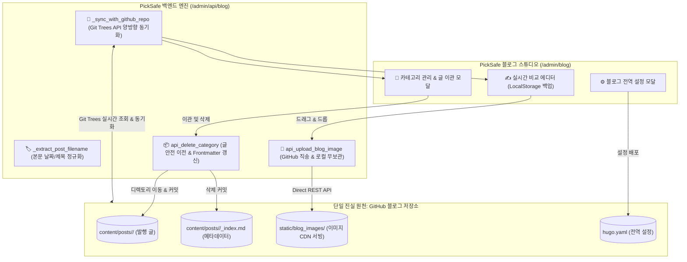

안녕하세요, **PickSafe** 코어 아키텍처 팀입니다.

최근 PickSafe 블로그 스튜디오 운영 과정에서 외부 GitHub 블로그 저장소와의 연동성을 높이고, 개발 생산성과 시스템 안정성을 동시에 확보하기 위한 대규모 아키텍처 개편(ADR)을 진행했습니다. 

이번 포스팅에서는 **"GitHub를 단일 진실 원천(SSOT)으로 삼고, PickSafe를 초경량 실시간 스튜디오 컨트롤러로 설계"**하기까지 마주했던 5가지 기술적 난제와 이를 해결한 아키텍처적 트레이드오프, 그리고 엔지니어링 교훈을 공유합니다.

---

## 1. 배경 및 문제 정의 (Context & Problem Statement)

초기 블로그 스튜디오 도입 당시에는 로컬 디스크 중심의 단순 파일 I/O 방식으로 빠르게 구현했으나, 실제 운영 단계에서 다음과 같은 5가지 치명적인 한계가 드러났습니다.

1. **원격 저장소 비동기화**: GitHub 웹 UI나 외부에서 생성된 카테고리/글을 로컬 백엔드가 인지하지 못해 새로고침을 해도 최신 상태를 반영하지 못함.
2. **데이터 유실 위험**: 카테고리 삭제 시 하위 마크다운 포스트들의 마이그레이션(이관) 정책이 없어 고아 파일이 되거나 데이터가 유실됨.
3. **이미지 3중 복제 및 Git 오염**: 본문 이미지가 PickSafe 내부, 문서 디렉토리, GitHub 레포 등 3곳에 중복 저장되면서 PickSafe 메인 Git 상태가 불필요한 바이너리 파일로 지저분해짐.
4. **파일명 정규화 누락**: 작성일자나 특수문자 처리가 일관되지 않아 SEO 및 파일 관리 파이프라인에 혼선 발생.
5. **설정 및 링크 연동 부재**: Hugo 테마 전역 설정(`portfolio_url`) 및 카테고리별 외부 프로젝트 링크를 스튜디오에서 통합 제어할 수 없음.

---

## 2. 시스템 아키텍처 및 핵심 설계 원칙

이 문제를 해결하기 위해 세운 대원칙은 명확했습니다. 
> **"모든 콘텐츠의 단일 진실 원천(SSOT)은 GitHub 레포지토리이며, PickSafe 백엔드는 DB 없이 GitHub REST/Git Trees API를 직접 조작하는 실시간 컨트롤러로 동작한다."**

---

## 3. 핵심 해결 전략 및 구현 상세

### 3.1. GitHub Git Trees API 기반 양방향 실시간 동기화
매번 무거운 Git Clone을 수행하는 대신, GitHub REST API의 **Git Trees (`/git/trees/{branch}?recursive=1`)**를 활용했습니다.
- 백엔드 API 호출 시점에 원격 저장소의 파일 트리 구조를 재귀적으로 스캔하여 메모리 상에서 최신 상태를 동기화합니다.
- 외부에서 추가된 카테고리나 포스트는 즉시 로컬 캐시/UI에 반영하고, 원격에서 삭제된 파일은 자동으로 정리하여 **"항상 일치하는 원격 상태"**를 보장합니다.

### 3.2. 카테고리 생애주기 관리와 '글 유실 0%' 이관 워크플로우
카테고리 삭제 시 발생할 수 있는 데이터 유실을 막기 위해 **안전 이관 다이얼로그(`#catDeleteModal`)**를 도입했습니다.
- 하위 포스트가 존재하는 카테고리를 삭제하려고 하면, 관리자가 **이동할 대상 카테고리를 필수로 선택**하도록 강제합니다.
- 선택된 대상 폴더로 마크다운 파일들을 일괄 이동시키고, 파일 내부의 Frontmatter(`category: "..."`)까지 자동으로 갱신한 뒤 안전하게 커밋합니다.

### 3.3. 이미지 직송(Direct Upload) 파이프라인과 Git 클린화
기존의 3중 복제 문제를 해결하기 위해 이미지를 PickSafe 로컬 서버를 거치지 않고 **GitHub 블로그 저장소(`static/blog_images/`)로 곧바로 REST API 요청을 통해 업로드**하도록 변경했습니다.
- 에디터 작성 내용은 브라우저 `localStorage`에 실시간으로 자동 임시 저장(Autosave)하여 예기치 못한 브라우저 종료에도 100% 복구되도록 설계했습니다.
- 결과적으로 `.gitignore`에 문서 및 이미지 디렉토리를 완전히 격리하여, **PickSafe 메인 레포지토리의 Git 변경사항 오염도를 0%**로 만들었습니다.

### 3.4. 본문 기반 정밀 파일명 정규화 엔진
발행 시점에 Frontmatter의 `date`와 본문 구조를 파싱하여 `YYYY-MM-DD-제목.md` 포맷으로 파일명을 강제 정규화합니다. 특수문자나 잘못 지정된 날짜로 인해 발생하는 정적 사이트 빌드 오류를 원천 차단했습니다.

---

## 4. 도입 효과 및 Takeaways

이번 아키텍처 개편을 통해 얻은 정량적·정성적 효과는 다음과 같습니다.

| 구분 | 개편 전 (Legacy) | 개편 후 (Current) |
| :--- | :--- | :--- |
| **데이터 진실 원천** | 로컬 / 문서 / GitHub 3중 파편화 | **GitHub 블로그 저장소 단일 원천화 (SSOT)** |
| **외부 변경 인지** | `git pull` 수동 실행 필요 | **페이지 접근 시 Git Trees API 실시간 동기화** |
| **카테고리 삭제 안정성** | 고아 파일 발생 및 데이터 유실 위험 | **안전 이관 및 Frontmatter 자동 갱신** |
| **PickSafe Git 상태** | 30개 이상의 임시 바이너리 오염 | **Git 오염 0% (`.gitignore` 및 LocalStorage 보호)** |
| **이미지 파이프라인** | 로컬 2곳 + 원격 1곳 중복 저장 | **GitHub 원격 저장소 직송 단일화** |

### 💡 엔지니어링 교훈 (Takeaways)
1. **SSOT(Single Source of Truth)의 중요성**: 분산된 저장소 간의 상태 동기화를 직접 맞추려 하기보다, 명확한 단 하나의 원천(이 경우 GitHub)을 정의하고 시스템을 그에 맞추어 설계하는 것이 복잡도를 획기적으로 낮춘다는 점을 재확인했습니다.
2. **stateless 백엔드의 힘**: PickSafe 백엔드가 자체 DB에 블로그 데이터를 저장하는 대신 GitHub API를 대행하는 컨트롤러 역할에 집중함으로써, 인프라스트럭처의 복잡성을 줄이고 배포 유연성을 극대화할 수 있었습니다.