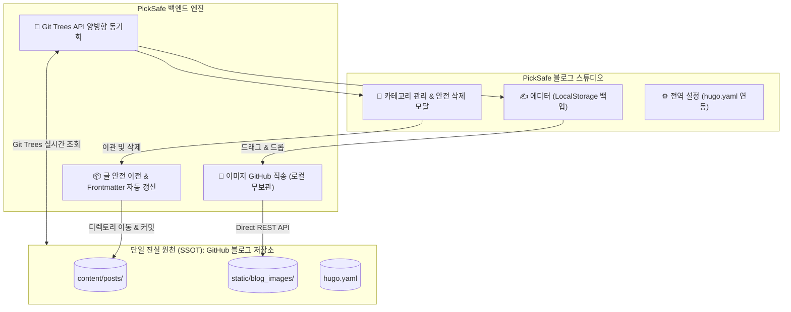

안녕하세요. PickSafe Core Architecture Team입니다.

현대적인 콘텐츠 관리 시스템(CMS)을 개발할 때, 로컬 스토리지와 원격 저장소 간의 동기화 문제는 언제나 우리를 괴롭히는 단골 손님입니다. 특히 외부 정적 블로그(예: Hugo 기반 GitHub Pages)와 연동되는 내부 어드민 스튜디오를 구축할 때, **"어디가 진실의 원천(SSOT, Single Source of Truth)인가?"**라는 질문에 명확한 답을 내리지 못하면 데이터 유실과 동기화 오류라는 지옥을 맛보게 됩니다.

이번 포스팅에서는 PickSafe 블로그 스튜디오에 **GitHub Git Trees API 기반 양방향 실시간 동기화 엔진**과 **이미지 직송 파이프라인**을 도입하며 마주한 기술적 고민과 해결 과정을 공유하려 합니다.

---

## 1. 마주한 문제들 (Problem Statement)

초기 블로그 스튜디오를 구축했을 때, 시스템은 다음과 같은 치명적인 아키텍처 한계를 가지고 있었습니다.

1. **캐시 고립 및 비동기화**: 
   백엔드가 로컬 디스크 파일만 단순 조회하고 있어, GitHub 웹 UI나 타 경로를 통해 생성된 신규 카테고리와 글을 어드민 화면에서 인식하지 못했습니다. (새로고침을 해도 소용없음)
2. **카테고리 삭제 시 데이터 유실(Data Loss) 위험**: 
   글이 포함된 카테고리를 삭제할 때 마크다운 파일들의 마이그레이션 정책이 없어, 자칫하면 소중한 포스트들이 고아 파일이 되거나 유실될 위험이 있었습니다.
3. **이미지 파일 3중 복제와 Git 오염**: 
   본문 이미지가 [내부 Static], [문서 디렉토리], [GitHub 레포]에 중복 저장되면서, PickSafe 메인 Git 상태가 수십 개의 바이너리 변경사항으로 더럽혀졌습니다.
4. **파일명 파편화**: 
   작성일자와 제목 특수문자가 섞여 파일명이 제각각 생성되는 문제가 있었습니다.

---

## 2. 핵심 설계 원칙: "GitHub = SSOT"

우리가 내린 결론은 명확했습니다. 

> **"PickSafe 백엔드는 데이터를 영구 저장하는 데이터베이스가 아니라, GitHub 저장소를 실시간으로 조작하는 초경량 스튜디오 컨트롤러다."**

이 철학에 따라 시스템 아키텍처를 전면 개편했습니다.

---

## 3. 핵심 해결 과제와 구현

### 3.1. GitHub Git Trees API를 통한 실시간 동기화
로컬 디스크 캐시에 의존하는 대신, API 호출 시점에 GitHub의 `git/trees/{branch}?recursive=1` 엔드포인트를 직접 조회하도록 변경했습니다. 
이를 통해 외부에서 변경된 원격 저장소의 상태를 지연 없이 100% 동기화하며, 로컬과 원격 간의 불일치 문제를 원천 차단했습니다.

### 3.2. 카테고리 생애주기 관리와 글 유실 0% 이관 엔진
카테고리 삭제 시 발생할 수 있는 데이터 유실을 방지하기 위해 **안전 이관 다이얼로그**를 도입했습니다.
- 글이 존재하는 카테고리 삭제 시, 사용자는 반드시 이주시킬 대상 카테고리를 선택해야 합니다.
- 시스템은 마크다운 파일들의 물리적 디렉토리 이동뿐만 아니라, 파일 내부의 `category: "..."` Frontmatter까지 자동으로 일괄 갱신합니다.

### 3.3. 이미지 직송(Direct Upload) 파이프라인
에디터에 업로드되는 이미지는 PickSafe 서버 로컬 디스크를 거치지 않고, GitHub 블로그 저장소(`static/blog_images/`)로 즉시 REST API를 통해 직송됩니다.
여기에 더해 `.gitignore`를 통해 문서 및 이미지 디렉토리를 철저히 배제함으로써, **PickSafe 메인 저장소의 Git 오염도를 0%**로 유지했습니다. 브라우저 창이 닫혀도 작업 중인 내용이 날아가지 않도록 `localStorage` 기반의 임시 백업 시스템도 함께 구축했습니다.

---

## 4. 도입 효과 (Impact)

아키텍처 개편 후, 운영 측면에서 드라마틱한 개선을 이뤄냈습니다.

| 구분 | 개편 전 | 개편 후 |
| :--- | :--- | :--- |
| **SSOT 여부** | 로컬 / 문서 / GitHub 3중 파편화 | **GitHub 블로그 저장소 단일 원천화** |
| **동기화 속도** | 수동 `git pull` 필요 | **페이지 로드 시 100% 실시간 동기화** |
| **카테고리 삭제** | 데이터 유실 위험 존재 | **안전 이관 및 Frontmatter 자동 갱신** |
| **Git 오염도** | 30개 이상의 임시 파일/바이오너리 오염 | **Git 오염 0% (.gitignore & 직송 구조)** |

---

## 5. 엔지니어링 교훈 (Takeaways)

이번 작업을 통해 얻은 가장 큰 교훈은 **"복잡한 로컬 캐싱 레이어를 만드는 것보다, 신뢰할 수 있는 외부 API(이 경우 GitHub)를 단일 진실 원천(SSOT)으로 믿고 컨트롤러 역할에 집중하는 것이 시스템을 훨씬 단순하고 견고하게 만든다"**는 점입니다.

서버는 무상태(Stateless)에 가깝게 유지하고, 데이터의 정합성은 원격 저장소의 프로토콜에 위임하는 방식. 앞으로도 확장성 있고 유지보수하기 쉬운 아키텍처를 고민하는 개발자분들께 좋은 레퍼런스가 되기를 바랍니다.

감사합니다.