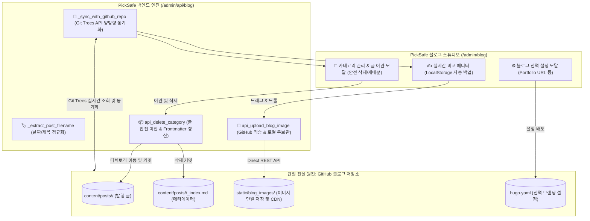

안녕하세요. PickSafe Security & Core Architecture Team입니다.

PickSafe 내부에서 운영 중인 **블로그 스튜디오**는 개발자의 글쓰기 경험을 극대화하고, 외부 GitHub 블로그와 원활하게 연동하기 위해 설계된 어드민 서비스입니다. 

초기 버전은 로컬 디스크 파일 시스템을 기반으로 빠르게 구축되었으나, 실제 운영 과정에서 **"외부 GitHub 저장소와의 상태 불일치", "이미지 파일 중복으로 인한 Git 저장소 오염", "카테고리 삭제 시 데이터 유실 위험"** 등 다양한 아키텍처적 한계에 부딪히게 되었습니다.

이번 글에서는 이러한 문제를 해결하기 위해 **GitHub를 단일 진실 원천(SSOT, Single Source of Truth)으로 정의**하고, Git Trees API와 안전한 생애주기 관리 워크플로우를 도입하여 시스템을 리팩토링한 기술적 의사결정 과정(ADR)을 공유합니다.

---

## 1. 마주한 문제들 (Problem Statement)

초기 블로그 스튜디오는 로컬 파일 시스템(`docs/`, `web/frontend/static/`)을 기준으로 동작했습니다. 하지만 이는 다음과 같은 5가지 치명적인 부작용을 낳았습니다.

1. **원격 저장소와의 비동기화 및 캐시 고립**
   - 사용자가 GitHub 웹 UI나 독립된 환경에서 새로운 카테고리를 만들거나 글을 발행해도, PickSafe 백엔드는 로컬 디스크만 바라보고 있어 최신 상태를 반영하지 못했습니다.
2. **카테고리 삭제 시 데이터 유실(Data Loss) 위험**
   - 카테고리를 삭제할 때 해당 폴더에 속한 마크다운 포스트들을 어떻게 처리할 것인지에 대한 마이그레이션 정책이 없어, 고아 파일이 되거나 데이터가 통째로 유실될 위험이 있었습니다.
3. **이미지 3중 복제 및 Git 오염**
   - 본문 이미지가 [내부 Static], [문서 디렉토리], [GitHub 블로그 레포] 등 3곳에 중복 저장되면서, PickSafe 메인 Git 저장소가 수십 개의 바이너리 변경사항으로 지저분해졌습니다.
4. **파일명 정규화 누락**
   - 파일명이 잘못 지정되거나 특수문자가 섞이는 현상이 발생해 Frontmatter(`date`, `title`)를 기반으로 한 일관된 `YYYY-MM-DD-제목.md` 정규화 엔진이 절실했습니다.
5. **글로벌 설정 및 메타데이터 연동 부재**
   - Hugo 테마의 포폴리오 URL(`portfolio_url`)이나 카테고리별 프로젝트 링크를 스튜디오에서 원클릭으로 제어할 수 없는 구조였습니다.

---

## 2. 핵심 설계 원칙 및 시스템 아키텍처

> **Core Principle: "GitHub = 단일 진실 원천(SSOT)" + "PickSafe = 초경량 실시간 스튜디오 컨트롤러"**

우리는 로컬 디스크의 캐싱 구조를 과감히 버리고, 외부 GitHub 블로그 저장소를 유일한 진실 원천(SSOT)으로 삼았습니다. 백엔드는 로컬에 데이터를 쌓지 않고, GitHub API를 통해 실시간으로 상태를 동기화하는 **초경량 컨트롤러** 역할에 집중하도록 설계했습니다.

---

## 3. 주요 구현 내용 (Implementation Details)

### 3.1. GitHub Git Trees API 기반 양방향 실시간 동기화
로컬 캐시에 의존하던 방식을 탈피하기 위해, 주요 API 호출 시점에 `https://api.github.com/repos/{owner}/{repo}/git/trees/main?recursive=1` 엔드포인트를 활용하도록 변경했습니다.
* **실시간 원격 스캔**: 관리자가 카테고리나 포스트 목록을 조회할 때 원격 저장소의 최신 트리를 재귀적으로 탐색하여 100% 동기화된 상태를 보장합니다.
* 외부에서 변경된 사항이나 삭제된 파일도 별도의 `git pull` 명령 없이 웹 인터페이스에서 즉시 반영됩니다.

### 3.2. 카테고리 생애주기 관리와 '글 유실 0%' 안전 이관 워크플로우
카테고리 삭제 시 발생할 수 있는 데이터 유실 문제를 해결하기 위해 **안전 이관 다이얼로그(`#catDeleteModal`)**를 도입했습니다.
* **글이 존재하는 카테고리 삭제 시**: 포스트를 이동할 대상 카테고리를 필수로 선택하도록 강제합니다. 백엔드에서는 마크다운 파일들의 물리적 디렉토리 이동과 함께, 본문 Frontmatter의 `category` 값을 새로운 값으로 자동 갱신(`Frontmatter Patch`)한 뒤 커밋합니다.
* **빈 카테고리 삭제 시**: 불필요한 마이그레이션 없이 즉시 안전하게 삭제 처리를 수행합니다.

### 3.3. 이미지 직송(Direct Upload) 파이프라인과 로컬 Git 오염 방지
PickSafe 서버 디스크와 메인 Git 레포지토리가 이미지 바이너리 때문에 오염되는 문제를 원천 차단했습니다.
* **이미지 직송**: 에디터에 이미지가 첨부되는 즉시 로컬을 거치지 않고, GitHub 블로그 저장소의 `static/blog_images/` 경로로 직접 REST API를 통해 커밋 & 푸시됩니다.
* **Git 상태 클린화**: `.gitignore`에 임시 문서 및 이미지 저장 경로를 등록하여, PickSafe 서비스 자체의 Git 변경사항에는 오직 소스 코드만 남도록 격리했습니다.
* **LocalStorage 임시 백업**: 네트워크 끊김이나 브라우저 강제 종료에 대비해 타이핑 즉시 브라우저 `localStorage`에 자동 백업되도록 구현하여 사용자 경험을 높였습니다.

---

## 4. 도입 효과 (Consequences & Impact)

이번 아키텍처 개편을 통해 얻은 정량적·정성적 개선 효과는 다음과 같습니다.

| 구분 | 개편 전 (Legacy) | 개편 후 (Current) |
| :--- | :--- | :--- |
| **데이터 진실 원천(SSOT)** | 로컬, docs, GitHub 3중 파편화 | **GitHub 블로그 저장소 단일 원천화** |
| **외부 변경 사항 반영** | 수동 `git pull` 필요 | **페이지 새로고침 시 100% 실시간 동기화** |
| **카테고리 삭제 안정성** | 고아 파일 및 데이터 유실 위험 | **대상 카테고리 안전 이관 및 Frontmatter 자동 갱신** |
| **PickSafe Git 저장소 상태** | 30개 이상의 임시 바이너리 오염 | **Git 오염 0% (LocalStorage & `.gitignore` 격리)** |
| **이미지 파이프라인** | 서버 로컬 + 원격 3중 저장 | **GitHub 원격 저장소 직송 단일화** |

---

## 5. 엔지니어링 교훈 (Takeaways)

1. **"분산된 상태(State)는 악이다"**: 여러 저장소나 디스크에 데이터가 분산되면 동기화 비용이 기하급수적으로 증가합니다. 비즈니스의 성격에 맞는 **단일 진실 원천(SSOT)**을 명확히 정의하는 것이 아키텍처의 복잡도를 낮추는 지름길입니다.
2. **인프라 관점의 예외 처리(Data Migration)**: CRUD 기능 중 'Delete'는 언제나 유실의 위험을 내포합니다. 특히 콘텐츠 관리 시스템(CMS)에서 카테고리나 태그 같은 구조를 변경할 때는 마이그레이션 시나리오가 시스템 설계 단계부터 함께 고려되어야 합니다.

PickSafe 팀은 앞으로도 안정적이면서도 개발자 친화적인 개발 환경을 만들기 위해 아키텍처를 지속적으로 고도화해 나갈 것입니다. 감사합니다.