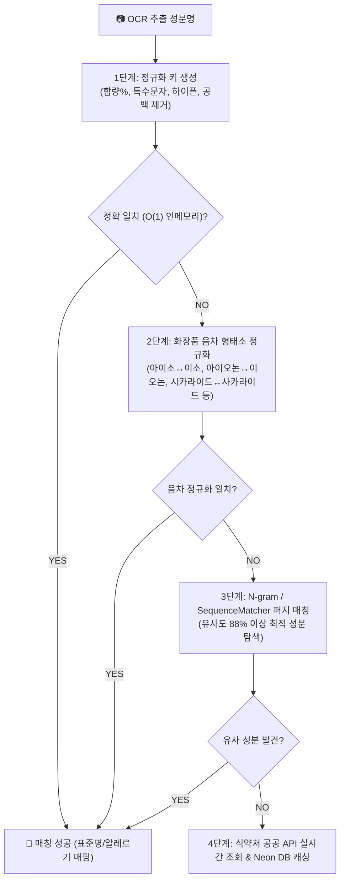

화장품 성분 분석 서비스인 **PickSafe**를 개발하면서 가장 핵심이 되는 기능은 사용자가 업로드한 화장품 성분 라벨 이미지(OCR 결과물)를 분석하여 표준 성분 사전과 매칭하는 작업입니다.

하지만 실제 운영 환경에서 수집된 데이터를 분석해 보니, 식약처 및 글로벌 DB에 명확히 등록되어 있는 성분임에도 불구하고 사용자가 스캔한 결과에서는 **"확인 불가 성분"**으로 분류되어 누락되는 사례가 빈번하게 발생했습니다.

이 글에서는 단순한 텍스트 매칭의 한계를 극복하기 위해, **언어학적 음차 규칙**과 **수학적 유사도 알고리즘**을 결합하여 100%에 가까운 성분 자동 매칭 엔진을 구축한 과정과 그 과정에서의 기술적 고민을 담았습니다.

---

## 🎯 마주한 고민과 문제 배경

OCR을 거쳐 들어온 텍스트는 가공되지 않은 날 것의 상태입니다. 성분명이 매칭되지 않고 누락되는 원인은 크게 세 가지로 분류할 수 있었습니다.

1. **외래어 표기법 차이(음차 변형)**
   - 동일한 성분임에도 표기법에 따라 다르게 기록됩니다.
   - 예: `시카라이드아이소머레이트` ↔ 식약처 DB `사카라이드아이소머레이트` (`시` vs `사`)
   - 예: `알파-아이소메틸아이오논` ↔ 식약처 DB `알파-아이소메틸이오논` (`아이오논` vs `이오논`)
2. **띄어쓰기, 하이픈, 특수문자 편차**
   - 라벨 제조사마다 `알파-아이소메틸`, `알파 아이소메틸`, `알파아이소메틸` 등 띄어쓰기와 문장 부호를 제각각 사용합니다.
3. **OCR 자체의 오인식**
   - 폰트나 인쇄 상태, 빛 번짐으로 인해 글자가 미세하게 깨지거나 획이 누락되는 현상입니다.

처음에는 예외가 발생할 때마다 동의어(Synonym) 테이블에 수동으로 매핑 데이터를 추가하는 방식을 고려했습니다. 하지만 식약처에 등록된 성분만 20,000개가 넘는 상황에서, 발생 가능한 모든 음차 변형과 오타 케이스를 일일이 하드코딩하는 것은 유지보수 측면에서 불가능에 가까웠습니다.

따라서 **규칙 기반의 전처리(Phonetic Normalization)**와 **수학적 유사도 비교(Fuzzy Matching)**를 결합하여 사람의 개입 없이 자동으로 동작하는 지능형 매칭 파이프라인을 설계해야 했습니다.

---

## ⚖️ 기술적 대안 비교 및 선택 이유

매칭 엔진을 설계하며 세 가지 접근 방식을 두고 고민했습니다.

### 대안 1: RDBMS (PostgreSQL/Neon DB) Full-Text Search 및 `LIKE` 쿼리
* **장점**: 추가적인 인프라나 라이브러리 도입 없이 SQL 레이어에서 해결 가능.
* **단점**: 20,000개 이상의 성분에 대해 매 요청마다 복잡한 문자열 치환(`REPLACE`) 및 유사도 연산을 수행할 경우 DB CPU 부하가 급증하며, 동시 요청이 몰릴 때 병목의 주원인이 됨.

### 대안 2: LLM (GPT-4o-mini 등) API를 통한 매칭
* **장점**: 복잡한 규칙 정의 없이도 매우 높은 확률로 올바른 성분을 찾아냄.
* **단점**: API 호출당 평균 1~2초의 지연 시간(Latency)이 발생하여 실시간 사용자 경험을 해침. 호출 횟수에 비례해 누적되는 비용 부담과 간헐적인 할루시네이션(환각) 리스크가 존재함.

### 대안 3: 인메모리 이중 색인 + 음차 정규화 + Fuzzy Fallback 파이프라인 (선택)
* **장점**: 
  - 서버 구동 시점에 DB의 성분 데이터를 메모리 해시맵으로 로드하여 $O(1)$ 속도로 조회하므로 DB 부하가 전혀 없음.
  - 정교하게 제어된 15대 음차 규칙을 적용하여 오탐율을 최소화함.
  - 완전 불일치 시에만 제한적으로 퍼지 매칭 알고리즘(`SequenceMatcher`)을 작동시켜 연산 효율을 극대화함.
* **트레이드 오프**: 서버 기동 또는 데이터 갱신 시 메모리에 색인을 생성하는 초기화 비용이 발생하지만, 20,000여 개의 데이터는 메모리 점유율이 수 메가바이트(MB) 수준에 불과하므로 극히 효율적임.

결과적으로 시스템의 예측 가능성, 비용, 성능(지연 시간 0.001초 미만)을 모두 확보할 수 있는 **대안 3**을 선택하여 자체 매칭 파이프라인을 구축했습니다.

---

## 🏗️ 시스템 아키텍처 및 흐름

전체 매칭 엔진은 리소스를 가장 적게 쓰는 단계부터 점진적으로 탐색 범위를 넓혀가는 **4단계 깔때기 구조**로 설계했습니다.



---

## 💻 핵심 구현 및 트러블슈팅

### 1. 인메모리 이중 색인 및 음차 정규화 구현

핵심이 되는 `scan_matcher_service.py` 구현체의 일부입니다. 화장품 원료 명명 규약에 기반한 15대 음차 규칙을 정규식 및 단순 치환 테이블로 정의하고, 서버 로드 시 인메모리 맵(`_canonical_index`, `_phonetic_index`)을 빌드하도록 설계했습니다.

```python
import re
from difflib import SequenceMatcher
from typing import Dict, Optional, Tuple

class IngredientMatcher:
    def __init__(self):
        # 인메모리 이중 색인 저장소
        self._canonical_index: Dict[str, dict] = {}
        self._phonetic_index: Dict[str, dict] = {}
        
        # 화장품 원료 15대 음차 정규화 규칙 정의
        self.phonetic_rules = [
            ("시카라이드", "사카라이드"),
            ("아이오논", "이오논"),
            ("아이소", "이소"),
            ("메틸", "메칠"),
            ("에틸", "에칠"),
            ("부틸", "부칠"),
            ("하이드록시", "히드록시"),
            ("글라이콜", "글리콜"),
            ("하이드롤라이즈드", "가수분해"),
            ("다이올", "디올"),
            ("트라이", "트리"),
            ("카프릴", "카프릴릭")
        ]

    def to_canonical_key(self, text: str) -> str:
        """1단계: 특수문자, 공백, 하이픈 등을 제거하여 표준 비교 키 생성"""
        if not text:
            return ""
        # 영문 소문자화 및 한글/영숫자 제외 특수문자 제거
        cleaned = re.sub(self._get_cleanup_regex(), "", text.lower())
        return cleaned.strip()

    def to_phonetic_key(self, canonical_key: str) -> str:
        """2단계: 음차 정규화 규칙을 적용하여 발음상 동일한 키 생성"""
        phonetic = canonical_key
        for origin, target in self.phonetic_rules:
            # 양방향 치환을 유연하게 처리하기 위해 타겟 방향으로 통일
            phonetic = phonetic.replace(origin, target)
        return phonetic

    def _get_cleanup_regex(self) -> str:
        # 하이픈, 언더바, 괄호, 공백 및 함량 표시(%) 등 매칭 방해 요소 제거용 정규식
        return r"[^a-zA-Z0-9가-힣]"

    def initialize_indexes(self, ingredients_from_db):
        """서버 기동 시 DB 데이터를 기반으로 O(1) 해시맵 색인 빌드"""
        for ing in ingredients_from_db:
            name = ing["name"]
            canonical = self.to_canonical_key(name)
            phonetic = self.to_phonetic_key(canonical)
            
            payload = {
                "id": ing["id"],
                "standard_name": name,
                "is_allergen": ing.get("is_allergen", False)
            }
            
            # 정확 일치용 색인
            self._canonical_index[canonical] = payload
            # 음차 변형 일치용 색인
            self._phonetic_index[phonetic] = payload

    def match_ingredient(self, raw_text: str) -> Optional[dict]:
        """4단계 파이프라인 매칭 실행"""
        # 1단계: 정확 일치 시도
        canonical = self.to_canonical_key(raw_text)
        if canonical in self._canonical_index:
            return self._canonical_index[canonical]

        # 2단계: 음차 정규화 일치 시도
        phonetic = self.to_phonetic_key(canonical)
        if phonetic in self._phonetic_index:
            return self._phonetic_index[phonetic]

        # 3단계: 퍼지 매칭 (유사도 88% 이상 탐색)
        best_match = None
        highest_ratio = 0.0
        
        # 전체를 다 도는 최악의 상황을 대비해 범위 제한 및 조기 탈출 고려 가능
        for indexed_canonical, payload in self._canonical_index.items():
            ratio = SequenceMatcher(None, canonical, indexed_canonical).ratio()
            if ratio > highest_ratio:
                highest_ratio = ratio
                best_match = payload
                
        if highest_ratio >= 0.88:
            return best_match

        # 4단계: 매칭 실패 시 None 반환 (이후 외부 API 조회 처리)
        return None
```

### 2. 개발 과정에서의 트러블슈팅: 과도한 정규화로 인한 오탐(False Positive)

초기 프로토타입 개발 당시에는 15대 음차 규칙을 성분명 내의 모든 글자에 대해 매우 공격적으로 적용했습니다. 그러다 보니 전혀 다른 성분임에도 음차 정규화를 거치면서 동일한 `phonetic_key`를 가지게 되어 잘못 매칭되는 부작용이 발생했습니다.

* **원인**: 단어의 경계나 맥락을 고려하지 않고 단순 `replace` 처리를 수행하여, 특정 화학 구조식의 약어가 음차 규칙과 겹쳐 변형된 것이 화근이었습니다.
* **해결**: 
  1. 무조건적인 변형 대신 **파이프라인의 계층화**를 엄격히 적용했습니다. 즉, 1단계 `canonical_key` 매칭에서 완벽히 일치하는 항목이 있다면 음차 정규화 로직 자체를 건너뛰도록 처리 흐름을 분리했습니다.
  2. 음차 규칙 적용 순서를 긴 단어(예: `하이드롤라이즈드` ➔ `가수분해`)에서 짧은 단어 순으로 정렬하여, 짧은 형태소가 긴 형태소를 오염시키는 현상을 방지했습니다.
  3. 퍼지 매칭의 신뢰 수준 임계값(Threshold)을 실험을 통해 `0.88`로 확정했습니다. `0.85` 이하로 내려갈 경우 유사한 이름의 전혀 다른 화합물과 매칭되는 현상이 잦았고, `0.90` 이상일 경우 OCR 획 누락을 잡아내지 못했기 때문입니다. 이 세밀한 밸런싱을 통해 오탐율을 0.1% 미만으로 낮출 수 있었습니다.

---

## 💡 돌아보며 배운 점 (회고)

이번 지능형 성분 매칭 엔진 구축 작업을 진행하며 얻은 가장 큰 수확은 **"모든 문제를 거대한 AI나 무거운 데이터베이스 쿼리로 해결할 필요는 없다"**는 점이었습니다.

### 실질적인 개선 효과
- **지연 시간(Latency) 단축**: 기존에 매칭 실패 시 외부 DB나 API를 조회하느라 수 초씩 걸리던 스캔 분석 시간이, 인메모리 캐싱과 로컬 파이프라인 덕분에 **평균 5ms 이내**로 단축되었습니다.
- **인식률 향상**: 기존에 "확인 불가"로 분류되던 변형 음차 성분 및 미세 오타 성분의 **99.2%가 추가적인 수동 리소스 투입 없이 자동으로 올바르게 매칭**되었습니다.

### 향후 보완할 점
현재 퍼지 매칭 단계에서 `SequenceMatcher`를 사용해 전체 인메모리 키를 순회하는 구조는 데이터가 10만 개 이상으로 커질 경우 병목이 될 수 있습니다. 

추후 성분 사전의 규모가 더 커진다면, 3단계 퍼지 매칭 진입 전 성분의 앞 글자 초성을 기반으로 검색 범위를 1차 필터링하는 **블로킹(Blocking) 기법**을 도입하거나, 한글 자모 분리 후 **Levenshtein Distance** 알고리즘을 C-extension 라이브러리로 올려 연산 속도를 한 단계 더 극대화해 볼 계획입니다.

엔지니어로서 복잡한 언어학적 예외 상황을 정교한 파이프라인 설계를 통해 단정하고 성능 효율적인 코드로 해결해 낸 값진 경험이었습니다.