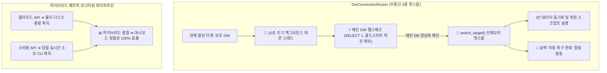

성장하는 SaaS 제품군을 운영하다 보면 클라우드 데이터베이스(DB)의 물리적 한계나 정산 쿼터 초과 등의 인프라 이슈를 마주하곤 합니다. 서비스의 연속성을 보장하기 위해 많은 엔지니어들이 이중화 및 페일오버(Failover)를 구축하지만, 정작 **장애 상황이 해결되었을 때 메인 DB로 어떻게 안전하고 부드럽게 돌아갈 것인가(Auto-Failback)**에 대한 고민은 상대적으로 덜 다뤄지곤 합니다.

최근 PickSafe 아키텍처 팀은 클라우드 데이터 웨어하우스(DW)의 임계치 초과 상황에서 무중단으로 예비 DW로 우회하고, 쿼터가 리셋되는 시점에 **단 1ms의 다운타임도 없이 메인 DW로 자동 복귀(Auto-Failback)하는 3중 인메모리 핫스왑 시스템**을 구축했습니다. 

단순한 프로세스 재시작(`os.kill`) 방식의 투박한 과거 아키텍처에서 벗어나, 글로벌 타임존 시차와 클라우드 공급사의 배치 정산 지연이라는 복잡한 변수들을 어떻게 엔지니어링적으로 우아하게 해결했는지 그 과정을 공유합니다.

---

## 1. 우리가 마주한 기술적 문제 (Problem Definition)

기존 PickSafe 시스템은 메인 DW의 쿼터가 초과하면 보조 DW로 트래픽을 우회하는 페일오버 처리를 지원하고 있었습니다. 하지만 복구(Failback) 프로세스에는 다음과 같은 심각한 아키텍처적 결함들이 존재했습니다.

### 문제 1: 다운타임을 유발하는 "프로세스 강제 재시작" 방식
기존 복구 데몬은 메인 DB가 정상화된 것을 감지하면, 새로운 커넥션을 맺기 위해 **서버 프로세스 자체를 강제로 종료(`os.kill`)**하고 컨테이너 엔진(K8s 등)이 컨테이너를 재시작하도록 유도했습니다. 이 방식은 메인 DB 커넥션은 재확보할 수 있을지언정, 서버가 다시 뜨는 동안 서비스에 일시적인 다운타임과 사용자 요청 드랍을 유발하는 치명적인 문제가 있었습니다.

### 문제 2: 글로벌 타임존 불일치 (UTC 00:00 vs KST 09:00)
우리가 사용하는 클라우드 DB(Neon DB)의 월간 쿼터 리셋 시점은 미국 본사 기준인 **매월 1일 00:00 UTC**였습니다. 그러나 한국(KST) 서비스 기준으로는 **매월 1일 09:00 KST**에 해당합니다. 
단순히 한국 시간(KST) 1일 00시를 기준으로 복구를 시도할 경우, 실제 클라우드 인프라에서는 아직 리셋이 진행되지 않아 복구 즉시 다시 커넥션이 차단되는 무한 루프 장애가 발생할 위험이 있었습니다.

### 문제 3: 클라우드 API의 메트릭 정보 분리 구조
인프라 모니터링 대시보드에 정확한 용량 및 실시간 사용량을 표출해야 했으나, 클라우드 DB 공급사 측 API는 다음과 같이 정보가 나누어져 있었습니다.
* **물리적 디스크 스토리지 용량**: 프로젝트 메타 데이터 API에서 제공
* **당월 실시간 컴퓨팅 소모량(CU)**: 별도의 실시간 소비량(Consumption) API에서 제공

이 분리된 지표들을 정밀하게 결합해 내지 못하면, 대시보드와 실제 클라우드 콘솔 간의 데이터 정합성이 깨져 운영자가 잘못된 판단을 내릴 여지가 있었습니다.

### 문제 4: 쿼터 해제 배치 지연과 DB 콜드 스타트(Cold Start)
매월 1일 00:00 UTC가 되더라도 클라우드 플랫폼 내부 정산 데몬이 도는 시간 동안 짧게는 수 분간 `Connection Restricted` 잠금이 지속될 수 있습니다. 또한, 사용되지 않던 서버리스 DB에 첫 쿼리가 들어갈 때 발생하는 **콜드 스타트 지연 시간**이 발생하여 복구 데몬이 정상 DB를 장애 DB로 오판할 소지가 있었습니다.

---

## 2. 대안 분석 및 기술적 의사결정 (Trade-offs)

무중단 자동 복구(Auto-Failback)를 안전하게 구현하기 위해 세 가지 아키텍처 모델을 두고 비교 분석했습니다.

| 비교 항목 | 대안 A: 프로세스 재시작 (Legacy) | 대안 B: 지연 시간 기반 복구 (Lazy Failback) | 대안 C: 인메모리 핫스왑 라우터 + 백그라운드 헬스체크 (채택) |
| :--- | :--- | :--- | :--- |
| **작동 방식** | 정상화 감지 시 프로세스 강제 킬 후 재시작 | 사용자 요청 인입 시 간헐적으로 메인 DB 연결 시도 | 백그라운드 데몬이 헬스체크 후 메모리 상에서 실시간 커넥션 전환 |
| **다운타임** | 발생 (컨테이너 재부팅 시간 동안 무중단 깨짐) | 없음 | **없음 (Zero-Downtime)** |
| **구현 난이도** | 매우 낮음 | 낮음 | 중간 (인메모리 동시성 제어 필요) |
| **성능 오버헤드** | 재시작 시점에 전체 서비스 일시 정지 | 무작위 사용자 요청에 DB 타임아웃 레이턴시 전가 | 데몬 주기 스레드 소모 외에 **실제 트래픽 영향 제로** |

### 우리의 선택: 대안 C (인메모리 핫스왑 + 백그라운드 데몬)
우리는 단 1초의 서비스 중단도 용납할 수 없는 보안 관제 모니터링 솔루션(`PickSafe`)을 운영하고 있었기에, **인메모리 상에서 커넥션 풀을 실시간으로 갈아끼우는 3중 핫스왑 라우터** 아키텍처를 설계하기로 결정했습니다.

---

## 3. 핵심 아키텍처 설계 및 구현 (Deep Dive)

이 시스템의 핵심 구조는 크게 세 가지 모듈의 유기적인 협업으로 이루어져 있습니다.

### 1) 무중단 인메모리 3중 핫스왑 라우터 (`DwConnectionRouter`)
동작 중인 커넥션 풀을 안전하게 교체하기 위해, 어플리케이션 레이어에 프록시 역할을 수행하는 커넥션 라우터를 구축했습니다. 
보조 DW인 `dw2` 혹은 `dw3`가 동작하고 있더라도, 백그라운드 데몬 스레드가 메인 DW(`dw1`)의 정상화를 감지하면 **라우터 인스턴스 내부의 타겟 포인터를 동적으로 스위칭**합니다. 이 작업은 완벽하게 인메모리 수준에서 안전한 락(Lock) 메커니즘 하에 수행되므로 네트워크 커넥션 단절이나 재시작 다운타임이 전혀 발생하지 않습니다.

### 2) 글로벌 타임존 및 네트워크 방어 전략
* **글로벌 쿼터 타임존 동기화**: 정기 복귀 데몬은 서버 환경의 로컬 시간 대신, 공급사 billing 시간인 UTC를 기준으로 동작하도록 정교하게 세팅했습니다. 한국 시간 기준 매월 1일 오전 9시 전까지는 불필요한 복귀 시도를 원천 차단하여 에러 로그 오염을 방지합니다.
* **콜드 스타트 세이프티 마진 (3.0초 ➔ 6.0초)**: 잠자고 있던 메인 DB 인스턴스가 활성화될 때 최초 연결 지연이 발생할 수 있습니다. 헬스체크 타임아웃 임계치를 6.0초로 상향 조정함으로써, 일시적인 네트워크 지연이나 인스턴스 부팅 과정을 장애로 성급하게 오판하지 않도록 안전 마진을 구축했습니다.

### 3) 하이브리드 인프라 메트릭 파이프라인
정확한 인프라 현황을 대시보드에 표출하기 위해, 프로젝트 메타 정보 수집 API와 실시간 소모량(Consumption) API 데이터를 비동기로 병렬 수집한 뒤 어플리케이션 메모리 상에서 매핑하여 제공합니다. 이를 통해 실제 콘솔 화면으로 이동하지 않고도 실시간 잔여 쿼터와 저장 장치 용량을 100% 신뢰할 수 있게 되었습니다.

---

## 4. 엔지니어링 교훈 (Takeaways)

이번 고도화 작업을 마치며, 우리 아키텍처 팀은 세 가지 핵심적인 교훈을 얻을 수 있었습니다.

1. **쉽고 자극적인 해법(`os.kill`)의 뒤편에는 항상 아키텍처적 부채가 따른다.**
   개발 편의를 위해 프로세스 재시작이라는 쉬운 길을 택하는 것은 단기적으로는 달콤하지만, 장기적으로는 시스템 가용성 지표(SLA)를 갉아먹는 독이 됩니다. 조금 복잡하더라도 인메모리 라우팅과 같은 정교한 엔지니어링 설계를 추구해야 하는 이유입니다.
2. **글로벌 인프라를 다룰 때는 시각(Timezone)과 라이프사이클의 특성을 완전히 파악해야 한다.**
   로컬 비즈니스 시간(KST)만 믿고 스케줄러를 짰다면 매달 1일 아침마다 원인 불명의 연결 차단 에러를 맞닥뜨렸을 것입니다. 클라우드 SaaS나 인프라 솔루션을 도입할 때는 그 인프라의 '심장 박동(글로벌 타임존, 정산 주기)'을 먼저 파악하는 습관이 중요합니다.
3. **인프라 상태 지표(State)와 변화율 지표(Delta)의 특성 차이를 이해하자.**
   단일 API가 완벽한 모니터링 정보를 주지 못하더라도, 내부 구조를 명확히 이해하고 있다면 어플리케이션 레이어에서 하이브리드 파이프라인을 구축해 얼마든지 단일 진실 원천(Single Source of Truth)을 만들어 낼 수 있습니다.

성공적인 이번 리팩토링 덕분에, PickSafe는 쿼터 잠금 및 복구 과정 전반에서 **관리자 개입 제로(Zero-Touch Operations), 다운타임 제로(Zero-Downtime)**의 최고 수준 가용성을 계속해서 증명해 나가고 있습니다.